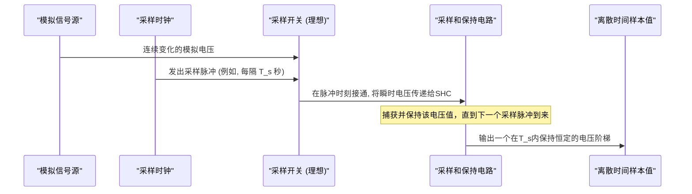
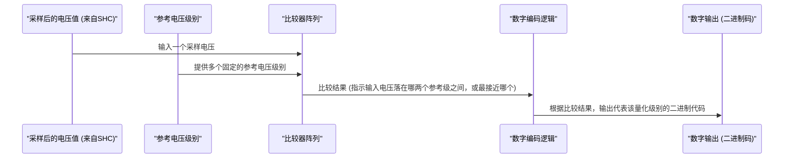

# Chapter 6: 连续信号处理 (采样与量化)


在上一章 [编码定理精髓](05_编码定理精髓_.md) 中，我们探讨了如何通过信源编码来压缩信息以及如何通过信道编码来增强信息在有噪声信道中传输的可靠性。这些讨论主要集中在离散信息，比如文字符号。然而，我们现实世界中充满了各种**连续信号**，例如我们的声音、音乐的旋律、图像的光影变化等等。这些信号在时间上或空间上是连续变化的，而不是像字母那样一个个孤立存在。

那么，香农的信息论如何应用于这些连续的模拟信号呢？我们怎样才能将这些连续的“流”转换成计算机可以处理和传输的离散“点”呢？本章将带你入门连续信号处理的两个核心概念：**采样 (Sampling)** 和 **量化 (Quantization)**。

## 为什么需要处理连续信号？

想象一下，你想用你的电脑录制一段吉他演奏。吉他弦的振动产生声波，这是一种连续的模拟信号——声波的振幅（响度）和频率（音高）在时间上是平滑变化的。但电脑是数字设备，它只能理解和处理由0和1组成的离散数据。

我们面临的问题是：如何把这段连续的吉他声音，转换成一串数字，让电脑能够存储、编辑、并通过互联网发送给你的朋友，而你的朋友又能把这串数字还原成声音，尽可能真实地听到你的演奏？

这就是采样和量化要解决的问题。它们是连接模拟世界和数字世界的桥梁。

```mermaid
graph LR
    A[模拟世界 (声音, 图像等)] -- 连续信号 --> B{如何处理?};
    B --> C[数字世界 (计算机, 0和1)];
    subgraph "我们的目标"
        direction LR
        A
        B
        C
    end
```

## 什么是连续信号？

在我们深入采样和量化之前，让我们先明确一下什么是连续信号。

**连续信号 (Continuous Signal)**，也常被称为模拟信号 (Analog Signal)，是指在某个变量（通常是时间或空间）上其幅值可以取无限多个可能值的信号。它的特点是“不间断”和“平滑变化”。

*   **声音**：麦克风拾取到的声波振动，其振幅随时间连续变化。
*   **图像中的光线**：一张照片上，每个点的亮度可以从纯黑到纯白之间取任意一个值。
*   **温度**：温度计测量的温度，理论上可以有无限精细的变化。

下面的图表简单展示了一个连续信号（比如随时间变化的电压）的样子：

```mermaid
xychart-beta
    title "一个简单的连续信号示例"
    x-axis "时间 (t)"
    y-axis "幅值 (Amplitude)"
    line [{label: "信号", data: [[0, 0], [1, 0.5], [2, 0.8], [3, 0.6], [4, 0.1], [5, -0.3], [6, -0.7], [7, -0.4], [8, 0.2]]}]
```
你可以看到，这条曲线是光滑且没有断点的。在任意两个时间点之间，都存在无数个信号值。

## 采样：把“连续”变成“离散时间”

要让计算机处理连续信号，第一步就是**采样 (Sampling)**。采样的核心思想是在时间上对连续信号进行离散化，即以固定的时间间隔去“观察”或“测量”连续信号的瞬时值。

**类比：拍摄动画片**
想象一下制作定格动画。动画师会摆好一个模型，拍一张照片；然后稍微移动一下模型，再拍一张照片……如此重复。当这些照片（采样点）以足够快的速度连续播放时，我们就会看到一个流畅的动作。采样就类似这个过程，我们用一系列在时间上不连续的“快照”（采样值）来代表原始的连续动作（信号）。

```mermaid
graph TD
    A[连续信号 (如流动的河水)] --> B(采样过程);
    B -- 以固定时间间隔测量 --> C[离散时间样本序列 (如每隔一秒记录一次河水的水位)];

    subgraph "采样过程"
        A
        B
        C
    end
```

### 奈奎斯特-香农采样定理

那么，我们应该以多快的频率进行采样，才能保证这些离散的采样点能够无失真地恢复出原始的连续信号呢？这里就引出了信息论中一个非常重要的定理——**奈奎斯特-香农采样定理 (Nyquist-Shannon Sampling Theorem)**。

该定理指出：
> 如果一个连续信号的最高频率（带宽上限）为 W 赫兹 (Hz)，那么只要采样频率 f<sub>s</sub> 大于 2W (即 f<sub>s</sub> > 2W)，就可以从采样得到的离散值序列中完整地恢复出原始信号。

这个 2W 的频率通常被称为**奈奎斯特频率 (Nyquist Frequency)**。

*   **带宽有限 (Band-limited)**：这个定理的前提是信号的频率不是无限高的。幸运的是，大多数我们关心的物理信号（如声音、无线电信号）在超出某个频率后，其能量会变得非常小，可以近似认为是带宽有限的。例如，人耳能听到的声音频率大约在 20 Hz 到 20,000 Hz (20 kHz) 之间。所以，对音频信号来说，W 约为 20 kHz。
*   **采样频率 (Sampling Rate, f<sub>s</sub>)**：指每秒钟采样的次数，单位是赫兹 (Hz) 或样本每秒 (samples/second)。
*   **为什么是两倍？** 直观上理解，一个频率为 W 的正弦波在一个周期内至少需要两个采样点（一个捕捉波峰附近，一个捕捉波谷附近）才能确定其形状和频率。

**例子：CD音质采样**
CD 音质的音频信号，其采样频率通常是 44.1 kHz (即 44100 次/秒)。这是因为人耳能听到的最高频率约为 20 kHz，根据采样定理，采样频率至少需要大于 2 * 20 kHz = 40 kHz。44.1 kHz 这个值提供了一些额外的余量。

### 采样过程图示

下图展示了对一个连续信号进行采样的过程：

```mermaid
xychart-beta
    title "连续信号及其采样点"
    x-axis "时间 (t)" 0 --> 8
    y-axis "幅值" -1 --> 1
    line [{label: "原始连续信号", data: [[0, 0], [0.5, 0.48], [1, 0.84], [1.5, 0.99], [2, 0.91], [2.5, 0.6], [3, 0.14], [3.5, -0.35], [4, -0.75], [4.5, -0.96], [5, -0.95], [5.5, -0.72], [6, -0.31], [6.5, 0.18], [7, 0.62], [7.5, 0.89], [8, 0.96]], type: "line"}]
    scatter [{
        label: "采样点",
        data: [[0, 0], [1, 0.84], [2, 0.91], [3, 0.14], [4, -0.75], [5, -0.95], [6, -0.31], [7, 0.62], [8, 0.96]],
        color: "red"
    }]
    line [{data: [[1, -1], [1, 0.84]], type: "dashed", color: "grey"}]
    line [{data: [[2, -1], [2, 0.91]], type: "dashed", color: "grey"}]
    line [{data: [[3, -1], [3, 0.14]], type: "dashed", color: "grey"}]
    line [{data: [[4, -1], [4, -0.75]], type: "dashed", color: "grey"}]
    line [{data: [[5, -1], [5, -0.95]], type: "dashed", color: "grey"}]
    line [{data: [[6, -1], [6, -0.31]], type: "dashed", color: "grey"}]
    line [{data: [[7, -1], [7, 0.62]], type: "dashed", color: "grey"}]
    line [{data: [[8, -1], [8, 0.96]], type: "dashed", color: "grey"}]
```
蓝线代表原始的连续信号，红点就是在特定时间间隔（如每隔1个时间单位）测得的信号幅值。我们得到了一串离散的数值：[0, 0.84, 0.91, 0.14, -0.75, -0.95, -0.31, 0.62, 0.96]。

### 欠采样与混叠

如果采样频率 f<sub>s</sub> 低于 2W，会发生什么呢？这会导致一种称为**混叠 (Aliasing)** 的现象。高频信号在采样后会被“伪装”成低频信号，导致信息失真，无法恢复原始信号。

**类比：车轮的“倒转”**
在看电影或视频时，你可能见过快速旋转的车轮看起来像是静止甚至倒转的现象。这是因为摄像机的帧率（采样率）不够高，无法捕捉车轮辐条的真实快速运动。车轮的高速旋转“混叠”成了低速旋转或反向旋转。

为了避免混叠，实际应用中通常会在采样前使用一个**抗混叠滤波器 (Anti-aliasing Filter)**，它是一个低通滤波器，用于滤除信号中高于 W 的频率成分，确保信号满足采样定理的带宽有限条件。

香农的论文（`Shannon_Weaver_1949_Mathematical.pdf`，第86页，PDF文档第92页，定理13）中数学化地表述了采样定理：一个频带限制在 W 赫兹的函数 f(t)，可以通过其在时间间隔为 1/(2W) 秒的采样点上的值完全确定。

## 量化：把“连续幅值”变成“离散等级”

经过采样后，我们在时间上得到了离散的样本序列。但是，每个样本的幅值本身仍然可能是连续的，可以取无限多个值。例如，一个采样点的电压可能是 0.84伏，也可能是 0.840001伏，或者介于两者之间的任意值。计算机无法精确表示无限多种幅值。

因此，我们需要第二步：**量化 (Quantization)**。量化的目标是将每个采样点的连续幅值映射到一个预先定义的有限个离散等级中的一个。

**类比：评分**
想象一下给电影打分。电影的“好看程度”本来是一个连续的感受，但评分系统（比如1到5星，或者1到10分）把它量化成了有限的几个等级。一部你觉得“还不错，比3星好一点，但不到4星”的电影，可能最终会被量化为3星或4星。

```mermaid
graph TD
    A[采样后的样本 (幅值连续)] --> B(量化过程);
    B -- 将每个样本幅值映射到预定义的离散级别 --> C[量化后的样本 (幅值离散)];

    subgraph "量化过程"
        A
        B
        C
    end
```

### 量化级别和量化误差

*   **量化级别 (Quantization Levels)**：预先设定的用来代表一定幅值范围的离散值。级别的数量决定了表示信号的精度。
*   **量化步长 (Quantization Step Size)**：相邻两个量化级别之间的差值。
*   **量化位数 (Bits per Sample)**：如果用 N 比特来表示一个采样点的量化值，那么总共可以有 2<sup>N</sup> 个不同的量化级别。例如，CD音质使用16比特量化，所以有 2<sup>16</sup> = 65536 个量化级别。
*   **量化误差 (Quantization Error/Noise)**：原始采样值与其被量化后的离散值之间的差。这是量化过程中不可避免的误差来源，它会引入一种噪声，称为量化噪声。量化级别越多（即量化位数越多），量化步长越小，量化误差就越小，信号的保真度就越高。

### 量化过程图示

假设我们对前面采样得到的某个值为 0.84 的样本进行量化。如果我们设定量化级别为 {-1.0, -0.5, 0.0, 0.5, 1.0}。0.84 最接近 1.0，所以它可能被量化为 1.0。量化误差就是 0.84 - 1.0 = -0.16。

```mermaid
xychart-beta
    title "量化示例"
    x-axis "原始采样值" -1.2 --> 1.2
    y-axis "量化级别" -1.2 --> 1.2
    line [{label: "量化函数 (阶梯状)", data: [
        [-1.2, -1.0], [-0.75, -1.0],  // < -0.75 maps to -1.0
        [-0.75, -0.5], [-0.25, -0.5], // -0.75 to -0.25 maps to -0.5
        [-0.25, 0.0], [0.25, 0.0],   // -0.25 to 0.25 maps to 0.0
        [0.25, 0.5], [0.75, 0.5],    // 0.25 to 0.75 maps to 0.5
        [0.75, 1.0], [1.2, 1.0]      // > 0.75 maps to 1.0
    ], color: "blue"}]
    scatter [{label: "原始采样点 (0.84)", data: [[0.84, 0.84]], color: "red"}]
    scatter [{label: "量化后的值 (1.0)", data: [[0.84, 1.0]], color: "green", shape: "cross"}]
    line [{data: [[0.84, 0.84], [0.84, 1.0]], type: "dashed", color: "grey", label: "量化误差"}]
    note "原始值 0.84 被量化为 1.0" @ (0, -1.1)
```
在这个简化的例子中，蓝色的阶梯线代表量化函数。红点是原始采样值 (0.84, 0.84)，它落在映射到绿色叉叉 (0.84, 1.0) 的区域。虚线表示量化误差。

在香农的论文 `Shannon_Weaver_1949_Mathematical.pdf` 中，第40页（PDF文档第46页）的第2点提到了“通过某种量化过程将连续信息源离散化。例如，PCM发射机的量化语音，或量化的电视信号。”这指出了量化是将连续源适配到离散系统处理的关键步骤。

## 数字化过程：从模拟到数字

现在我们把采样和量化结合起来，看看如何将一个连续的模拟信号（比如我们的吉他声）转换成数字信号（一串0和1）：

1.  **模拟信号输入**：原始的连续声音信号。
2.  **抗混叠滤波** (可选但推荐)：滤除高于奈奎斯特频率一半的频率成分，防止混叠。
3.  **采样 (Sampling)**：以足够高的采样频率 (f<sub>s</sub> > 2W) 对信号进行“快照”，得到一系列在时间上离散但在幅值上仍然连续的样本值。这一步由采样器 (Sampler) 或采样保持电路 (Sample-and-Hold Circuit) 完成。
4.  **量化 (Quantization)**：将每个样本的连续幅值映射到有限个离散级别中的一个。这一步通常和采样一起在模数转换器 (Analog-to-Digital Converter, ADC) 中完成。
5.  **编码 (Encoding)**：将量化后的离散级别值转换成二进制码字（0和1的序列）。例如，如果用了8比特量化，就有2<sup>8</sup>=256个级别，每个级别对应一个8位的二进制码。这一步之后，我们就得到了原始模拟信号的数字表示。这部分可以应用我们在 [编码定理精髓](05_编码定理精髓_.md) 中学到的信源编码技术来进一步压缩数据，或者应用信道编码技术来增加传输的可靠性。

这个过程通常被称为**模数转换 (Analog-to-Digital Conversion, ADC)**。

```mermaid
flowchart TD
    subgraph "模拟域"
        A[连续模拟信号]
    end
    subgraph "ADC "模数转换器""
        direction LR
        F(抗混叠滤波器)
        S(采样器)
        Q(量化器)
        E(编码器)
    end
    D[数字信号 (0和1)]

    A --> F;
    F --> S;
    S --> Q;
    Q --> E;
    E --> D;
```

### 从数字到模拟：信号的重建

当数字信号传输到接收端（比如你朋友的电脑）后，需要进行相反的过程——**数模转换 (Digital-to-Analog Conversion, DAC)**——来恢复出原始的模拟信号：

1.  **解码 (Decoding)**：将二进制码字转换回量化后的离散级别值。
2.  **数模转换核心**：将这些离散的数字量值转换成一系列对应幅度的电压脉冲。
3.  **重建滤波器 (Reconstruction Filter) / 平滑滤波器**：这是一个低通滤波器，用于平滑这些脉冲，滤除因采样产生的高频复制成分（频谱搬移），尽可能地恢复出原始的连续模拟信号。理论上，如果采样和重建都理想，并且满足采样定理，我们可以精确恢复原始信号（除了量化误差）。

## 内部实现初探 (概念性)

虽然我们不必深入复杂的电子电路，但了解采样和量化在概念上是如何工作的会很有帮助。

### 采样如何工作 (概念)

采样器可以被想象成一个由精确时钟控制的高速开关。


*   **模拟信号源 (AS)**：提供连续的输入信号。
*   **采样时钟 (CLK)**：以固定的采样频率产生非常短的脉冲。
*   **采样开关 (SW)**：当接收到时钟脉冲时，开关“闭合”一小段时间，允许当前的模拟信号值通过。
*   **采样和保持电路 (SHC)**：它“捕获”开关传递过来的瞬时电压值，并在下一个采样脉冲到来之前“保持”这个电压值不变。这样，输出的就是一系列在采样间隔内幅值恒定的“台阶状”信号，每个台阶的幅值代表了该采样时刻的原始信号值。这些值随后被送往量化器。

香农在其论文 `Shannon_Weaver_1949_Mathematical.pdf` 的第86页（PDF文档第92页，定理13）中，给出了采样定理的数学基础。他指出，一个带宽限制在 `W` 的函数 `f(t)`，可以用一系列 `sin(x)/x` 函数（也称为sinc函数）的加权和来表示，这些 `sin(x)/x` 函数的中心位于采样点 `n/(2W)` 上，权重就是对应采样点的幅值 `Xn`。这构成了从采样点完美重建原始信号的理论依据（在没有量化误差的情况下）。

### 量化如何工作 (概念)

量化器将采样和保持电路输出的每个（在一定时间内）恒定的电压值与一组预设的参考电压进行比较，并确定哪个参考电压与输入最接近。


*   **采样后的电压值 (SV)**：来自采样和保持电路的稳定电压。
*   **参考电压级别 (REF)**：一系列精确的、代表不同量化等级的电压。
*   **比较器阵列 (CMP)**：一组比较器，每个比较器将输入电压与一个参考电压进行比较。
*   **数字编码逻辑 (LOGIC)**：根据所有比较器的输出，确定输入电压最接近哪个量化级别，并输出该级别对应的二进制代码。

例如，一个3位量化器可以将输入电压映射到2<sup>3</sup>=8个级别。如果输入电压是3.1V，而最接近的量化级别代表值是3.0V，其二进制代码是“011”，那么量化器就会输出“011”。

实际上，模数转换器 (ADC) 是一个集成了采样、保持和量化（有时还包括编码）功能的复杂集成电路。

## 示例代码 (概念演示)

下面的Python风格伪代码演示了采样和量化的基本思想。请注意，这只是一个概念上的模拟，实际的硬件实现要复杂得多。

```python
# 假设我们有一个模拟信号，用一系列密集的点来近似表示
# 例如，这可能是一小段声音的振幅随时间的变化
continuous_signal_approx = [0.0, 0.2, 0.4, 0.6, 0.8, 1.0, 0.8, 0.6, 0.4, 0.2, 0.0, -0.2, -0.4, -0.6, -0.8, -1.0, -0.8]
print(f"近似的连续信号点: {continuous_signal_approx}")

# 1. 采样
sampling_step = 3  # 每隔 'sampling_step-1' 个点，取第 'sampling_step' 个点作为样本
sampled_values = []
for i in range(0, len(continuous_signal_approx), sampling_step):
    sampled_values.append(continuous_signal_approx[i])
print(f"采样后的值: {sampled_values}")
# 对于上面的例子，sampled_values 会是: [0.0, 0.6, 0.8, 0.2, -0.4, -1.0]

# 2. 量化
# 假设我们使用 3 个量化级别，它们由以下边界定义 (这只是一个非常简化的例子)
# 级别 -1: 值 < -0.5
# 级别  0: -0.5 <= 值 <= 0.5
# 级别  1: 值 > 0.5
# 这些级别可以被编码 (例如，用2比特)

quantized_values = []
quantization_map = {} # 用于存储量化后的值到数字码的映射 (如果需要)
code_counter = 0

for value in sampled_values:
    quantized_level = 0 # 初始化
    if value < -0.5:
        quantized_level = -1.0 # 代表级别的值
    elif value <= 0.5:
        quantized_level = 0.0
    else: # value > 0.5
        quantized_level = 1.0
    
    quantized_values.append(quantized_level)
    
    # (可选) 为每个唯一的量化级别分配一个数字码
    if quantized_level not in quantization_map:
        quantization_map[quantized_level] = bin(code_counter) # 例如，转换为二进制字符串
        code_counter += 1

print(f"量化后的值: {quantized_values}")
# 对于上面的采样值，quantized_values 可能是: [0.0, 1.0, 1.0, 0.0, 0.0, -1.0]

# 如果进行了编码：
# print(f"量化级别到编码的映射: {quantization_map}")
# 最终的数字信号可以是这些编码的序列
# 例如，如果映射是 {-1.0: '0b0', 0.0: '0b1', 1.0: '0b10'} (简单示例)
# 则数字序列可能是 ['0b1', '0b10', '0b10', '0b1', '0b1', '0b0']
```

**代码解释：**
*   `continuous_signal_approx`: 我们用一个列表来模拟一个随时间变化的连续信号的幅值。在现实中，这是一个连续的函数。
*   **采样**: 我们通过设置 `sampling_step` 来模拟采样过程。程序每隔 `sampling_step` 个索引取一个值，就像在时间轴上以固定间隔取样一样。
*   **量化**: 我们定义了几个简单的量化区间和对应的代表值。对于每个采样值，我们判断它属于哪个区间，并将其替换为该区间的代表值。
*   输出的 `sampled_values` 是时间离散、幅值连续的序列。
*   输出的 `quantized_values` 是时间离散、幅值也离散的序列。这些离散的幅值可以直接映射到数字代码（如二进制数），从而完成到数字信号的转换。

这个例子非常简化。真实的ADC需要精确的电压参考、高速比较器和复杂的逻辑电路。

## 总结

在本章中，我们学习了将连续模拟信号转换为数字信号的两个关键步骤：

*   **连续信号** 是指在时间或空间上幅值可以取无限多个值的信号，如声音和图像。
*   **采样** 是在时间（或空间）上对连续信号进行离散化的过程，即以固定的间隔测量信号的瞬时值。
    *   **奈奎斯特-香农采样定理** 指出，如果采样频率至少是信号最高频率的两倍，就可以从采样样本中无失真地恢复原始信号（忽略量化影响）。
*   **量化** 是将采样得到的连续幅值映射到有限个预定义的离散等级中的一个的过程。
    *   量化会引入**量化误差**或**量化噪声**，其大小取决于量化级别数（量化位数）。
*   采样和量化使得连续的模拟信号可以被转换成离散的数字信号，从而可以被计算机处理、存储和传输。

采样和量化是数字时代处理音频、视频、传感器数据等各种现实世界信号的基础。没有它们，我们今天享受的许多数字技术，如数字音乐、数码相机、网络通话等都将无法实现。

然而，量化过程引入了失真。我们如何在有限的比特数（数据率）下，尽可能好地表示原始信号，即如何在“率”（数据量）和“失真”（信息损失）之间取得平衡呢？这正是我们下一章要探讨的主题：[率失真理论](07_率失真理论_.md)。

---

Generated by [AI Codebase Knowledge Builder](https://github.com/The-Pocket/Tutorial-Codebase-Knowledge)