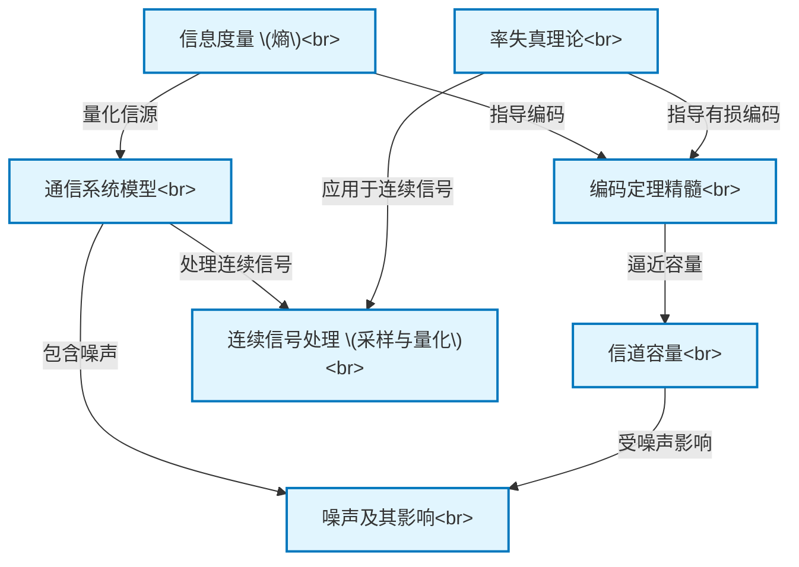

# Tutorial: Shannon_Weaver_1949_Mathematical

本项目 `Shannon_Weaver_1949_Mathematical` 阐释了香农和韦弗的 **通信的数学理论**。
它深入探讨了多个核心概念，包括：*信息如何被量化*（**信息度量/熵**），一个普适的 **通信系统模型**（包含信源、发送器、信道、接收器、信宿及噪声），信道在理论上可靠传输信息的 *最大速率*（**信道容量**），以及如何通过 **编码定理** 设计高效的编码来逼近这一容量同时对抗 **噪声** 的影响。此外，它还将理论扩展到 **连续信号的处理**（如采样与量化），并探讨了在有损压缩中信息速率与恢复质量之间的权衡（**率失真理论**）。

**Source Repository:** [None](None)

## Chapters

1. [信息度量 (熵)
](01_信息度量__熵__.md)
2. [通信系统模型
](02_通信系统模型_.md)
3. [噪声及其影响
](03_噪声及其影响_.md)
4. [信道容量
](04_信道容量_.md)
5. [编码定理精髓
](05_编码定理精髓_.md)
6. [连续信号处理 (采样与量化)
](06_连续信号处理__采样与量化__.md)
7. [率失真理论
](07_率失真理论_.md)

---

Generated by [AI Codebase Knowledge Builder](https://github.com/The-Pocket/Tutorial-Codebase-Knowledge)