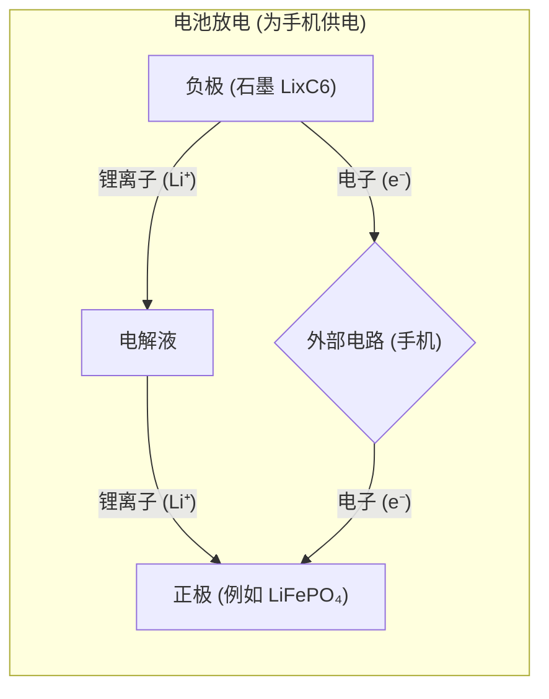
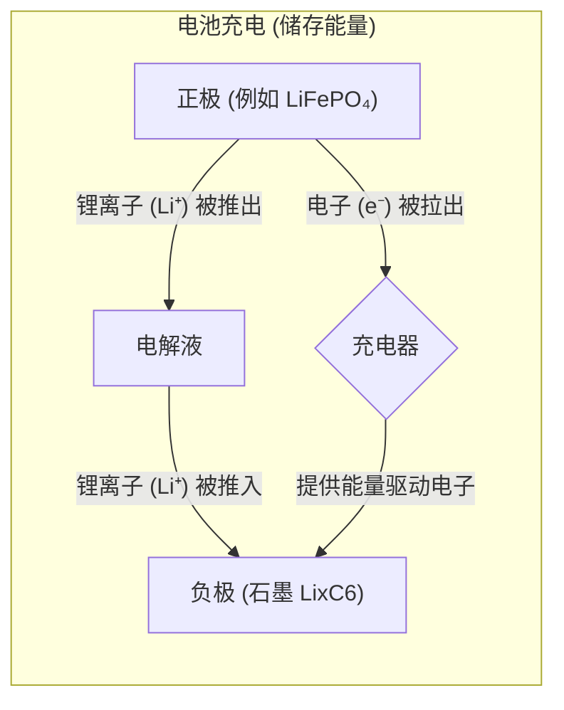

# Chapter 1: 锂离子电池

欢迎来到 `Switching_Based_State_of_Charge_Estimati` 项目的入门教程！在本系列教程中，我们将一步步探索如何估算锂离子电池的荷电状态（State of Charge, SOC）。作为第一章，我们将首先认识今天的主角——锂离子电池。

想象一下你的智能手机、笔记本电脑，或者更大型的电动汽车。它们能够不插电工作很长时间，并且可以反复充电使用，这背后最大的功臣之一就是锂离子电池。它们就像是微型的高效“能量胶囊”，为我们的便携设备和绿色出行提供了动力。

本项目的目标是研究一种基于切换的策略来估算锂离子电池中还剩下多少“能量”（也就是荷电状态）。要做到这一点，我们首先需要了解锂离子电池本身是什么，它们是如何工作的。

## 什么是锂离子电池？

锂离子电池（Lithium-ion battery），通常被简称为“锂电池”（尽管严格来说锂电池也包括一次性不可充电的锂金属电池，但在这里我们主要讨论可充电的锂离子电池），是一类可充电电池。它们之所以被称为“锂离子”电池，是因为它们的工作核心在于锂离子（Li⁺）在电池内部正负两极之间的来回“奔跑”。

**核心组成部分：**

一个典型的锂离子电池主要由以下几个部分组成：

1.  **正极 (Cathode):** 通常是含锂的金属氧化物或磷酸盐，比如本论文后续会重点研究的磷酸铁锂（LiFePO₄）。在放电时，锂离子会从负极跑到这里“休息”。
2.  **负极 (Anode):** 通常是石墨等碳材料。在充电时，锂离子会从正极迁移并储存在这里。
3.  **电解液 (Electrolyte):** 一种特殊的液体或凝胶，充斥在正负极之间，它扮演着“高速公路”的角色，允许锂离子在其中自由通行，但阻止电子直接穿过。
4.  **隔膜 (Separator):** 一层多孔的薄膜，位于正负极之间，物理上将两者隔开以防止短路，同时允许锂离子通过。

**工作原理：神奇的“摇椅”**

锂离子电池的工作原理常常被比作一把“摇椅”。锂离子就像坐在摇椅上的人，在电池的正负两极之间来回摇摆。

*   **放电过程（使用电池时）：**
    *   储存在负极（比如石墨）中的锂离子“离开座位”，穿过电解液这条“走廊”，嵌入到正极（比如磷酸铁锂）的结构中。
    *   与此同时，电子（e⁻）则从负极通过外部电路（比如你的手机内部线路）流向正极，这个过程中电子的流动就产生了电流，为你的设备供电。
    *   你可以把负极想象成一个“能量释放站”，正极是“能量接收站”。

    上图展示了放电时锂离子和电子的流向。负极的化学式 `LixC6` 表示锂嵌入碳中，放电时x减小；正极的化学式如 `LiFePO₄`，放电时锂离子嵌入，变成 `Li(1-y)FePO₄`（这里简化了表示，具体看材料）。
    在 `Switching_Based_State_of_Charge_Estimati.pdf` 的图1.1 (第8页) 中，也清晰地展示了这一过程。其中 "Anode" 代表负极，"Cathode" 代表正极。方程式 (1.2) `LixAN + CA discharge¡ ¡ ¡ ¡ ¡ ! AN + LixCA` (第8页) 概括了这个化学变化。

*   **充电过程（给电池充电时）：**
    *   外部充电器会提供能量，迫使锂离子从正极“不情愿地”脱出，再次穿过电解液，重新嵌入到负极的石墨层中储存起来。
    *   电子也同时被外部电源从正极“拉”出来，通过充电器线路“推”回到负极。
    *   这个过程就像把“能量胶囊”重新填满。

    充电时，正极材料（如 `LiFePO₄`）失去锂离子，负极材料（如石墨 `C6`）得到锂离子。例如，`LiFePO₄` 充电时可以简化理解为 `FePO₄ + Li⁺ + e⁻ → LiFePO₄` (这是放电反应的逆过程，具体反应取决于材料)。PDF中的图2.2 (第14页) 给出了 `LiFePO₄` 的具体反应：`LiFePO₄ <=> FePO₄ + Li⁺ + e⁻`。向右是放电，向左是充电。

## 锂离子电池的“过人之处”

与我们可能接触过的其他类型的充电电池（比如以前老式手机的镍镉电池或镍氢电池）相比，锂离子电池有许多显著的优点，这也是它们得以广泛应用的原因：

1.  **能量密度高 (High Energy Density):**
    这是锂离子电池最突出的优点之一。想象一下，同样大小或同样重量的“能量胶囊”，锂离子电池能储存更多的能量。这意味着你的手机可以做得更轻薄，或者电动汽车可以跑得更远。
    `Switching_Based_State_of_Charge_Estimati.pdf` 的图1.2 (第9页) 直观地比较了不同电池技术的能量密度，锂离子电池在体积能量密度 (Volumetric Energy Density) 和重量能量密度 (Gravimetric Energy Density) 方面都表现优异。

2.  **工作电压高 (High Working Voltage):**
    单节锂离子电池的电压通常在3.2V到3.7V左右，高于镍氢电池（约1.2V）和铅酸电池（约2V）。更高的电压意味着在某些应用中可以用更少的电池串联来达到所需的总电压。

3.  **循环寿命长 (Long Cycle Life):**
    锂离子电池可以经历数百次甚至数千次的完整充放电循环后，仍然保持其大部分容量。这意味着它们更耐用。

4.  **自放电率低 (Low Self-Discharge Rate):**
    即使电池没有在使用，它内部储存的电量也会随着时间慢慢流失，这就是自放电。锂离子电池的自放电率非常低，意味着即使你把充满电的设备放一段时间不用，电量也不会损失太多。

5.  **无记忆效应 (No Memory Effect):**
    一些老式充电电池（如镍镉电池）存在“记忆效应”，即如果在电池未完全放电时就充电，电池会“记住”这个未完全放电的点，并把它当作新的零电量点，导致电池容量下降。锂离子电池基本没有这种烦恼，你可以随时充电，无需担心记忆效应。

6.  **更环保：**
    相比含有镉、铅等重金属的电池，锂离子电池通常被认为更环保，尽管其生产和回收过程仍需关注环境影响。

## 本项目关注的特定类型：磷酸铁锂 (LiFePO₄) 电池

锂离子电池是一个大家族，根据正极材料的不同，可以细分为很多种类，比如钴酸锂 (LiCoO₂，常用于消费电子产品)、锰酸锂 (LiMn₂O₄) 和磷酸铁锂 (LiFePO₄，常用于电动汽车和储能)等。

本论文 (`Switching_Based_State_of_Charge_Estimati.pdf`, 第10页和第12-14页) 主要研究的是特定类型的锂离子电池，例如**磷酸铁锂 (LiFePO₄)** 电池和**磷酸铁锰锂 (LiFeMgPO₄)** 电池。
磷酸铁锂电池因其良好的热稳定性（更安全）、较长的循环寿命和相对较低的成本而受到青睐，尤其是在对安全性和寿命要求较高的领域。

例如，`Switching_Based_State_of_Charge_Estimati.pdf` 的第13页，图2.1展示了一些铁基正极材料的能量图，而第14页的图2.2则给出了 `LiFePO₄` 的化学反应式：
`LiFePO₄ <=> FePO₄ + Li⁺ + e⁻`
这个方程式告诉我们，在充放电过程中，`LiFePO₄` 和 `FePO₄` 之间通过锂离子和电子的得失进行转换。

## 总结

在本章中，我们初步认识了锂离子电池这位现代科技的“幕后英雄”。我们了解了：

*   锂离子电池是一种依靠锂离子在正负极之间移动来工作的可充电电池。
*   它的主要组成部分包括正极、负极、电解液和隔膜。
*   锂离子电池具有能量密度高、工作电压高、循环寿命长、自放电率低和无记忆效应等显著优点。
*   本教程和相关研究将特别关注像磷酸铁锂 (LiFePO₄) 这样的具体类型。

理解锂离子电池的基本原理和特性，是我们后续学习如何估算其剩余电量（即荷电状态）的重要基础。

在下一章中，我们将深入探讨什么是“[荷电状态 (SOC) 估算](02_荷电状态__soc__估算_.md)”，以及为什么准确估算SOC如此重要。

---

Generated by [AI Codebase Knowledge Builder](https://github.com/The-Pocket/Tutorial-Codebase-Knowledge)