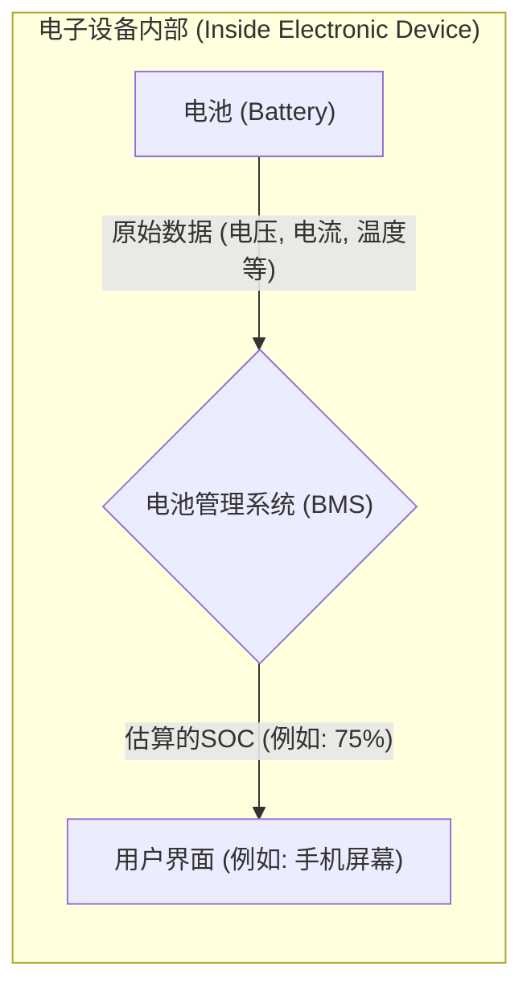

# Chapter 2: 荷电状态 (SOC) 估算

在上一章 [锂离子电池](01_锂离子电池_.md) 中，我们认识了现代电子设备和电动汽车的能量核心——锂离子电池，并了解了它的基本构成和工作原理。现在，我们将深入探讨一个与电池使用体验息息相关的重要概念：荷电状态（State of Charge, SOC）估算。

## 什么是荷电状态 (SOC)？它为什么重要？

想象一下你正在驾驶一辆燃油汽车。你会时常关注仪表盘上的油量表，对吗？这个油量表告诉你油箱里还剩下多少油，让你能够判断还能开多远，以及何时需要去加油。

**荷电状态（SOC）** 对于电池而言，就扮演着类似汽车油量表的角色。

> **荷电状态（SOC）估算指的是确定电池当前剩余电量的过程，通常以百分比表示。**

简单来说：
*   **SOC 为 100%** 意味着电池是满电状态。
*   **SOC 为 50%** 意味着电池还剩下一半的电量。
*   **SOC 为 0%** 意味着电池电量已耗尽 (或者达到了设定的最低安全电量，不建议完全耗尽)。

**为什么准确估算 SOC 如此重要呢？**

1.  **避免“ неожиданное отключение”（意外关机）**: 就像你不想汽车在半路没油抛锚一样，你肯定也不希望手机在关键通话时突然没电关机，或者电动汽车在离家还有一段距离时就“趴窝”。准确的 SOC 估算能提前预警，让你及时充电。
2.  **延长电池寿命**: 锂离子电池不喜欢被“过度充电”（充得太满）或“过度放电”（用得太空）。这两种极端情况都会对电池造成不可逆的损害，缩短其使用寿命。准确的 SOC 估算配合电池管理系统（BMS），可以有效防止这些情况的发生。参考 `Switching_Based_State_of_Charge_Estimati.pdf` (第14页) 中的论述："If the battery is overcharged, thermal runaway and a potential fire hazard can occur... If the battery is overdischarged, an irreversible new chemical reaction can occur in the battery... Therefore, for safety and battery protection, the ability to monitor the state of charge of batteries... becomes critical."
3.  **优化电池性能**: 了解电池的剩余电量，可以帮助系统更智能地管理能源消耗，从而在特定应用中（如混合动力汽车）优化整体性能和效率。如 `Switching_Based_State_of_Charge_Estimati.pdf` (第1页) 摘要中提到："The knowledge of SOC can be utilized to significantly enhance battery performance and longevity."
4.  **确保使用安全**: 特别是对于大功率应用的锂离子电池（如电动汽车电池组），不准确的 SOC 估算可能导致过充，从而引发热失控等安全风险。

在 `Switching_Based_State_of_Charge_Estimati.pdf` 文档的第14页，SOC 被定义为：

`SOC = (Q_available / Q_rated) * 100%`

其中：
*   `Q_available` 是电池当前可用的电荷量。
*   `Q_rated` 是电池额定的总电荷量（即全新满充状态下的总电荷量）。

这个公式清晰地表明了 SOC 是一个相对值，表示当前可用电量占总容量的百分比。

## 为什么是“估算”而不是“测量”？

你可能会问，既然 SOC 这么重要，为什么我们说的是“估算”而不是直接“测量”呢？就像我们可以用尺子直接测量长度，用温度计直接测量温度一样。

这是因为电池的剩余电量不像电压或电流那样，有一个可以直接、简单、且在所有工况下都精确的传感器来读取。电池内部的化学状态非常复杂，会受到多种因素的影响，例如：

*   **温度**：低温会显著降低电池的有效容量和放电能力。
*   **电流大小和方向**：大电流放电和充电对电池内部状态的影响与小电流不同。
*   **电池老化程度**：随着使用时间的增加和循环次数的增多，电池的总容量会衰减，其内部特性也会发生变化。
*   **电池的化学特性**：不同类型的锂离子电池（如我们之前提到的磷酸铁锂电池）其电压特性等也不同。

`Switching_Based_State_of_Charge_Estimati.pdf` (第15页) 也提到: "It is difficult to directly measure SOC without precise laboratory equipment; therefore, various techniques have been developed for SOC estimation." 这意味着，我们无法像看水杯里的水一样直观地“看到”电池里还剩多少电。因此，我们需要通过间接测量一些电池参数（如电压、电流、温度等），并结合电池的模型或特性，来“推算”出当前的 SOC 值。这个推算的过程，就是 **估算**。

## 我们在哪里看到 SOC？

其实，SOC 的概念已经融入了我们日常使用的许多电子设备中：

*   **智能手机/平板电脑**: 屏幕右上角通常会显示一个电池图标和百分比，例如 “87%”。这个百分比就是估算出的 SOC。
*   **笔记本电脑**: 任务栏通常也会显示电池剩余电量百分比，有时还会附带估计的剩余使用时间。
*   **电动汽车**: 仪表盘上会清晰地显示电池的 SOC 百分比，以及根据当前 SOC 估算出的剩余续航里程。
*   **便携式充电宝**: 一些充电宝也会有指示灯或小屏幕显示剩余电量。

这些设备内部都有一个叫做 **电池管理系统 (Battery Management System, BMS)** 的部件，它的核心功能之一就是进行 SOC 估算，并将结果呈现给用户。

上图简单展示了 BMS 如何从电池获取数据，并估算出 SOC 显示给用户。

## 准确估算 SOC 的挑战

既然 SOC 估算如此重要，那么估算的准确性自然也至关重要。一个不准确的 SOC 估算可能会带来麻烦：

*   **过于乐观的估计**：手机显示还有20%的电，但实际上可能只有5%，结果在你最需要它的时候突然关机。
*   **过于悲观的估计**：系统显示电量已低，提示你充电，但实际上电池还有不少电。频繁不必要的充电不仅麻烦，长期看也可能对某些类型的电池（尽管锂离子电池无记忆效应）不是最优选择，或者用户没有充分利用电池的全部容量。

因此，开发高精度的 SOC 估算方法一直是电池技术领域研究的重点和难点。`Switching_Based_State_of_Charge_Estimati.pdf` 这篇论文本身，就是为了探索一种新的、可能更优的 SOC 估算方法——基于切换的策略。

在接下来的章节中，我们将开始学习一些具体的 SOC 估算方法。例如，[开路电压 (OCV) 法](03_开路电压__ocv__法_.md) 就是一种基础且重要的方法，它利用了电池在静置（开路）一段时间后的电压与其 SOC 之间的特定关系。而本项目的核心，[切换式SOC估算方法](06_切换式soc估算方法_.md)，也是基于对 OCV 的巧妙利用。

## 总结

在本章中，我们了解了什么是荷电状态 (SOC) 及其估算的重要性：

*   **SOC** 是衡量电池剩余电量的指标，通常以百分比表示，就像汽车的油量表。
*   准确的 **SOC 估算** 对于避免意外关机、延长电池寿命、优化性能和保障安全至关重要。
*   由于电池内部状态的复杂性，SOC 通常需要通过间接参数进行“估算”，而不是直接“测量”。
*   电池管理系统 (BMS) 负责执行 SOC 估算，并将结果呈现给用户。
*   提高 SOC 估算的准确性是一个持续的挑战和研究方向。

理解了 SOC 的概念和意义后，我们就可以更好地理解为什么需要研究各种估算技术。

在下一章 [开路电压 (OCV) 法](03_开路电压__ocv__法_.md) 中，我们将学习第一种具体的 SOC 估算方法，它是许多更复杂估算技术的基础。

---

Generated by [AI Codebase Knowledge Builder](https://github.com/The-Pocket/Tutorial-Codebase-Knowledge)