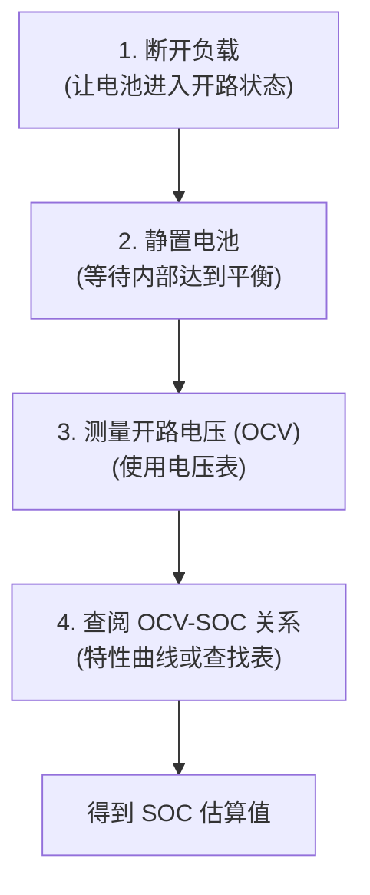

# Chapter 3: 开路电压 (OCV) 法


在上一章 [荷电状态 (SOC) 估算](02_荷电状态__soc__估算_.md) 中，我们了解了什么是电池的荷电状态 (SOC) 以及准确估算它的重要性。现在，你可能会问：“我们具体有哪些方法来估算 SOC 呢？” 这一章，我们将一起探索一种最基础也最直观的 SOC 估算方法——开路电压 (Open Circuit Voltage, OCV) 法。

想象一下，你想知道一个水桶里还剩多少水。一个简单的方法是，让水桶静静地放一会儿，等水面完全平静下来，然后观察水面的高度。水面越高，表示水越多。开路电压法和这个原理非常相似！

## 什么是开路电压 (OCV) 法？

**开路电压（OCV）法** 是一种通过测量电池在**没有连接外部负载**（即电池没有对外供电，处于“开路”状态）时的端电压来估算其荷电状态（SOC）的技术。

这里的几个关键词很重要：

1.  **开路 (Open Circuit):** 指的是电池的正负极之间没有形成通路，没有电流流过。就像水龙头关紧了，水管里的水不流动一样。
2.  **端电压 (Terminal Voltage):** 就是电池正负两极之间的电压。
3.  **静置 (Resting):** 这是 OCV 法的一个关键步骤。电池在停止工作（充电或放电）后，需要一段时间让其内部的化学状态和电势达到平衡。

> **核心思想：** 当电池静置足够长时间后，其端电压会达到一个相对稳定的值，这个电压被称为**开路电压 (OCV)**。这个稳定的 OCV 与电池当前的 SOC 之间存在一种特定的、可以预先通过实验标定的对应关系。

这就像我们前面说的水桶：静置后，水面高度（OCV）就能够反映桶里的储水量（SOC）。

在 `Switching_Based_State_of_Charge_Estimati.pdf` 文档的第17页 (Section 2.3 "SOC Estimation based on Direct OCV Measurement") 也提到了这种直接测量 OCV 的方法。它指出，真实的 OCV 只有在电池断开负载并静置（弛豫）了足够长（理论上是无限长）的时间后才能获得。如果静置时间不足，测量的电压只是一个近似的 OCV，会导致 SOC 估算产生误差。

## OCV 法的“魔法”：静置的重要性

你可能会问，为什么一定要让电池“静置”呢？

当电池在工作（充电或放电）时，其内部的化学反应非常活跃，各种电化学过程（比如锂离子的迁移、电极材料的相变等）会导致电池的端电压不断变化，并且这个电压还会受到电流大小、内部电阻等多种因素的影响。此时测量的电压并不能准确反映电池真实的“能量水平”。

当电池断开负载，停止工作后，这些内部的骚动会逐渐平息下来。锂离子会重新分布，电极表面的浓度差会减小，整个电池系统会趋向一个更稳定的**电化学平衡状态**。在这个平衡状态下测得的电压，才是我们所说的开路电压 (OCV)，它更能真实地反映电池内部储存的能量。

`Switching_Based_State_of_Charge_Estimati.pdf` 的第17页也强调了这一点："The basic principle of the OCV method relies on the thermodynamic equilibrium of lithium ion cells." (OCV 法的基本原理依赖于锂离子电池的热力学平衡。) 并且在同一页的描述中，更详细地说明："As the lithium ion cell reaches its thermodynamic equilibrium, the lithium chemical potential (ionic and electronic) difference between the anode and the cathode is commonly known as the open-circuit voltage (OCV)." (当锂离子电池达到其热力学平衡时，正负极之间的锂化学势（离子和电子）差通常被称为开路电压（OCV）。)

静置时间的长短直接影响 OCV 测量的准确性，进而影响 SOC 估算的精度。静置时间越长，电压读数越接近真实的 OCV，SOC 估算也就越准。但在实际应用中，我们往往不希望等待太长时间。`Switching_Based_State_of_Charge_Estimati.pdf` 的摘要 (第1页) 中提到："For smaller switch-off durations, the accuracy of SOC estimation reduces." (对于较短的关断（静置）时间，SOC 估算的准确性会降低。) 这正是本论文后续研究如何优化短时静置下 OCV 法准确性的动机之一。

## 如何使用 OCV 法估算 SOC？

使用 OCV 法估算 SOC 的步骤非常简单直观：



让我们一步步来看：

1.  **断开负载 (进入开路状态):** 确保电池没有连接到任何用电器（如手机电路、马达等），也没有连接到充电器。
2.  **静置电池:** 这是非常重要的一步。需要让电池“休息”一段时间。这个时间通常从几分钟到几小时不等，取决于电池类型和所需的精度。对于锂离子电池，其电压响应相对较快，但为了高精度测量，也需要充分的静置。
3.  **测量开路电压 (OCV):** 使用一个精确的电压表，测量电池正负极之间的电压。这个读数就是近似的 OCV。
4.  **查找 OCV-SOC 关系:** 这是核心步骤。我们需要一个预先制作好的“密码本”，这个密码本记录了不同 OCV 值对应的 SOC 百分比。这个“密码本”通常是一条曲线，称为 [OCV-SOC 特性曲线](04_ocv_soc_特性曲线_.md)，或者是一个数据查找表。我们将在下一章详细讨论如何获取和使用这个曲线。

## 一个简单的例子

假设我们有一块磷酸铁锂 (LiFePO₄) 电池，并且我们已经通过实验得到了它的 OCV-SOC 关系（简化如下表）：

| OCV (伏特) | SOC (%) |
| :--------- | :------ |
| 3.00       | 10      |
| 3.10       | 20      |
| 3.20       | 40      |
| **3.28**   | **65**  |
| 3.30       | 70      |
| 3.35       | 90      |
| 3.40       | 100     |

现在，我们按照 OCV 法的步骤操作：
1.  将这块电池从设备中取出，确保它不工作。
2.  让它静置了1小时。
3.  用电压表测得其两端电压为 **3.28 伏特**。
4.  查阅上面的 OCV-SOC 关系表，我们发现 3.28 伏特大约对应 **65%** 的 SOC。

于是，我们估算出这块电池大约还剩下 65% 的电量。很简单，对吧？

## OCV 法的优点与局限性

每种方法都有其长处和短处，OCV 法也不例外。

**优点：**

*   **简单直观：** 原理容易理解，操作步骤简单。正如 `Switching_Based_State_of_Charge_Estimati.pdf` 摘要 (第1页) 所说："The advantage of the OCV method lies in its simplicity." (OCV 法的优点在于其简单性。)
*   **计算量小：** 不需要复杂的数学模型或大量的实时计算。(参考 `Switching_Based_State_of_Charge_Estimati.pdf` 摘要 (第1页): "It obviates the need for modeling and lowers computational burden compared to model-based approaches." (它避免了建模的需求，并降低了与基于模型的方法相比的计算负担。))
*   **相对准确 (在理想条件下)：** 如果电池静置时间足够长，并且 OCV-SOC 关系标定准确，OCV 法可以给出比较可靠的 SOC 估算结果。

**局限性：**

*   **需要静置和开路：** 这是 OCV 法最大的局限性。电池必须断开负载并静置一段时间才能进行测量。这使得它不适用于那些需要连续工作的设备（比如你正在使用的手机，或者行驶中的电动汽车）。`Switching_Based_State_of_Charge_Estimati.pdf` (第15页) 也指出："the method does not provide continuous indication of the SOC since the battery needs to rest for some period of time." (该方法无法提供 SOC 的连续指示，因为电池需要静置一段时间。)
*   **静置时间影响精度：** 如前所述，静置时间不足会引入误差。
*   **温度敏感性：** 电池的 OCV-SOC 关系会随温度变化而变化。在不同温度下使用同一条 OCV-SOC 曲线会导致估算不准。因此，精确的 OCV 法通常需要考虑温度补偿。
*   **曲线平坦区域的挑战：** 对于某些类型的锂离子电池，比如我们项目中重点关注的磷酸铁锂 (LiFePO₄) 电池，其 OCV-SOC 曲线在中间的某个 SOC 区间（例如 20% 到 80% SOC）可能非常平坦。这意味着即使 OCV 有微小的变化，对应的 SOC 也可能有较大的跳动，这会降低在该区间的估算精度。`Switching_Based_State_of_Charge_Estimati.pdf` (第18页) 提到了这个问题："for Li-ion batteries, the battery’s OCV vs. SOC curve is quite flat (low slope) in the 20-80% SOC range. This may lead to higher estimation error even with small errors in OCV measurement." (对于锂离子电池，其 OCV-SOC 曲线在 20-80% SOC 范围内相当平坦（斜率低）。这可能导致即使 OCV 测量有小错误，也会产生较大的估算误差。)
*   **迟滞效应：** 电池在充电过程和放电过程中的 OCV-SOC 曲线可能不完全重合，这种现象称为 [电池迟滞效应](05_电池迟滞效应_.md)。这也会给 OCV 法带来一定的复杂性。

## 代码视角：如何通过查找表估算 SOC？

虽然 OCV 法主要依赖于物理测量，但在软件层面，我们可以用一个简单的查找表（或者更复杂的函数拟合）来实现从测量到的 OCV 到 SOC 的转换。

下面是一个非常简化的 Python 风格伪代码示例，展示了如何使用一个预定义的 OCV-SOC 查找表来估算 SOC：

```python
# 伪代码：OCV-SOC 查找表示例
# 警告：这只是一个非常简化的示例。
# 实际的 OCV-SOC 关系曲线更为复杂，并且应该通过精确的实验来标定。
# 这个表也应该更密集，或者使用插值函数来提高精度。

# OCV_SOC_TABLE 是一个预先标定的列表，每个元素是一个 (电压, SOC) 对。
# 列表中的数据点应根据实际电池的特性实验获得。
# 例如：[(3.0伏, 10%), (3.15伏, 30%), ...]
OCV_SOC_TABLE = [
    (3.00, 10),  # (电压 V, SOC %)  - 代表当OCV为3.00V时，SOC为10%
    (3.15, 30),
    (3.25, 50),
    (3.30, 70),
    (3.35, 90),
    (3.40, 100)  # 代表当OCV为3.40V时，SOC为100%
]

def get_soc_from_ocv(measured_ocv, table):
    """
    根据测量的开路电压和OCV-SOC查找表估算SOC。
    这是一个简化的查找逻辑，实际应用中可能需要更复杂的插值算法。
    假设OCV_SOC_TABLE是按电压升序排列的。
    """
    # 检查是否超出表格的下限
    if measured_ocv <= table[0][0]:
        return table[0][1]  # 低于最低电压，返回最低SOC

    # 检查是否超出表格的上限
    if measured_ocv >= table[-1][0]:
        return table[-1][1] # 高于最高电压，返回最高SOC

    # 在表格中查找合适的区间并进行线性插值
    for i in range(len(table) - 1):
        v_low, soc_low = table[i]      # 当前区间的下限电压和SOC
        v_high, soc_high = table[i+1]  # 当前区间的上限电压和SOC

        if v_low <= measured_ocv < v_high:
            # 在 v_low 和 v_high 之间进行线性插值
            # 插值公式: y = y1 + (x - x1) * (y2 - y1) / (x2 - x1)
            # 这里 x 是 measured_ocv, y 是要计算的 soc
            # (x1, y1) 是 (v_low, soc_low)
            # (x2, y2) 是 (v_high, soc_high)
            soc_estimated = soc_low + (measured_ocv - v_low) * (soc_high - soc_low) / (v_high - v_low)
            return round(soc_estimated) # 返回四舍五入的SOC值

    return table[-1][1] # 如果出现意外情况，默认返回最大SOC（或可返回错误提示）

# --- 演示如何使用 ---
# 1. 假设我们已经让电池静置，并测量了其开路电压
measured_battery_ocv = 3.28 # 单位：伏特

# 2. 使用上面的函数和查找表来估算SOC
estimated_soc = get_soc_from_ocv(measured_battery_ocv, OCV_SOC_TABLE)

# 3. 打印结果
print(f"当测量到的开路电压为: {measured_battery_ocv} V 时,")
print(f"估算得到的电池荷电状态 (SOC) 为: {estimated_soc}%")

# 根据上面的简化表格和线性插值逻辑，我们来手动计算一下：
# measured_ocv = 3.28V 落在 (3.25V, 50%) 和 (3.30V, 70%) 之间。
# v_low = 3.25, soc_low = 50
# v_high = 3.30, soc_high = 70
# soc_estimated = 50 + (3.28 - 3.25) * (70 - 50) / (3.30 - 3.25)
#               = 50 + (0.03) * (20) / (0.05)
#               = 50 + 0.03 * 400
#               = 50 + 12
#               = 62
# 预期输出:
# 当测量到的开路电压为: 3.28 V 时,
# 估算得到的电池荷电状态 (SOC) 为: 62%
```

这段伪代码展示了：
1.  我们预先定义了一个 `OCV_SOC_TABLE`，它存储了一系列 (电压, SOC) 的对应点。
2.  `get_soc_from_ocv` 函数接收测量的 OCV 值和这个查找表。
3.  函数首先处理边界情况（电压低于最小值或高于最大值）。
4.  然后，它遍历表格，找到测量电压所在的区间。
5.  最后，它使用简单的**线性插值**法来估算该电压对应的 SOC 值。线性插值是一种在两个已知数据点之间估算未知数据点的方法。

在实际应用中，这个查找表会包含更多的数据点以提高精度，或者直接用一个数学函数（通过拟合实验数据得到）来表示 OCV 和 SOC 之间的关系。

## 总结

在本章中，我们学习了开路电压 (OCV) 法，这是一种基础的 SOC 估算技术。

*   **核心原理：** 电池在充分静置（开路状态）后，其端电压 (OCV) 与其荷电状态 (SOC) 之间存在一种稳定的、可标定的关系。
*   **操作步骤：** 断开负载 -> 静置电池 -> 测量 OCV -> 查阅 OCV-SOC 关系。
*   **优点：** 简单、直观、计算量小。
*   **局限性：** 需要静置和开路，受静置时间、温度影响，对于 OCV-SOC 曲线平坦区域精度较低，且存在迟滞效应。

尽管 OCV 法有其局限性，但它为我们理解电池行为和 SOC 估算提供了一个重要的起点。很多更高级的 SOC 估算方法，也会借鉴或结合 OCV 的信息。

理解 OCV 与 SOC 之间的这种特定关系至关重要。在下一章中，我们将更深入地探讨这个关系本身，也就是 [OCV-SOC 特性曲线](04_ocv_soc_特性曲线_.md)，了解它是如何得到的，以及它有哪些特性。

---

Generated by [AI Codebase Knowledge Builder](https://github.com/The-Pocket/Tutorial-Codebase-Knowledge)