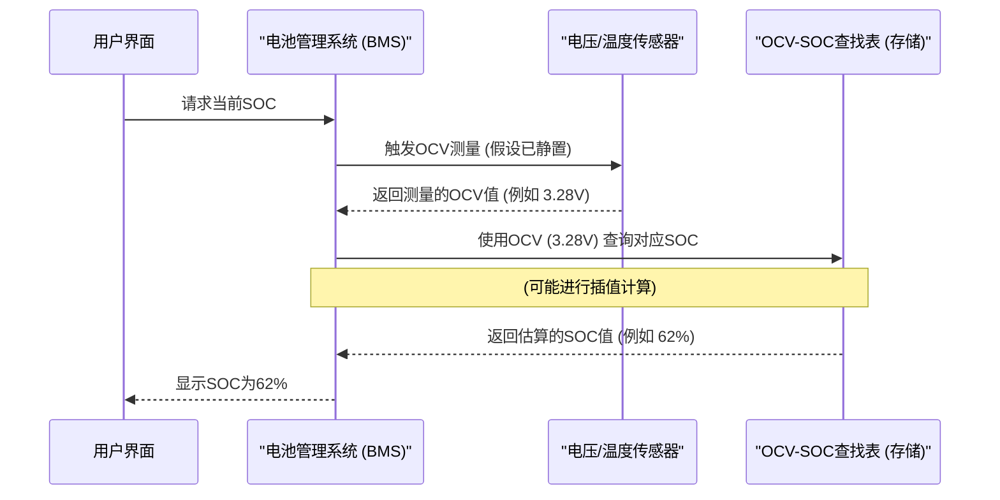

# Chapter 4: OCV-SOC 特性曲线


在上一章 [开路电压 (OCV) 法](03_开路电压__ocv__法_.md) 中，我们学习了一种通过测量电池静置时的开路电压 (OCV) 来估算其荷电状态 (SOC) 的基本方法。你可能已经明白了，要用 OCV 来估算 SOC，我们似乎需要一个“翻译器”或者一本“密码本”，它能告诉我们某个 OCV 值对应着多少 SOC。这一章，我们就来详细认识这个关键的“密码本”——OCV-SOC 特性曲线。

## 什么是 OCV-SOC 特性曲线？它为什么如此重要？

想象一下，你有一个形状不规则的瓶子，你想知道倒入不同高度的水时，瓶子里分别有多少水量。一个办法是，你一点点地往瓶子里加水，每次加水后，记录下当前水的高度和对应的总水量。最后，你把这些数据画成一张图表，横轴是水的高度，纵轴是水量。有了这张图表，以后只要测量出水的高度，就能快速查出瓶子里的水量了。

**OCV-SOC 特性曲线（Open Circuit Voltage - State of Charge Characteristic Curve）** 就扮演着类似的角色。

> **OCV-SOC 特性曲线** 是描述电池在特定条件下（通常是恒定温度）其开路电压 (OCV) 与其荷电状态 (SOC) 之间内在函数关系的图表或数据集。

简单来说，这条曲线就像一把“钥匙”或一张“密码表”。一旦我们准确测量得到电池的 OCV 值，就可以通过查阅这条曲线来“解锁”或“解码”出电池当前的 SOC 值。

**为什么它如此重要？**

*   **OCV 法的核心：** 没有 OCV-SOC 特性曲线，OCV 法就无法进行。它是将可测量的 OCV 转换为我们关心的 SOC 的唯一桥梁。
*   **电池的“指纹”：** 每种不同化学体系（例如磷酸铁锂、钴酸锂等）和结构的电池都拥有其独特的 OCV-SOC 曲线。这条曲线在某种程度上可以看作是特定类型电池的一个“电化学指纹”。

正如 `Switching_Based_State_of_Charge_Estimati.pdf` (第17页) 所述，OCV 法依赖于锂离子电池的热力学平衡，而 OCV 本身是正负极之间锂化学势差的体现。这条曲线正是这种内在关系的量化表达。

## 如何获得 OCV-SOC 特性曲线？（标定过程）

OCV-SOC 特性曲线并不是理论推导出来的，而是需要通过精密的**实验测试**来**标定（calibrate）**获得的。这个过程通常在恒定温度等受控条件下进行，以确保数据的准确性和可重复性。

标定过程大致如下：

1.  **准备阶段：**
    *   选择一个待标定的电池单体或电池模组。
    *   将其连接到专业的电池测试设备上，该设备可以精确控制充放电电流、测量电压和累计电荷。
    *   将电池放置在恒温箱中，以消除温度变化对测试结果的影响。

2.  **完全充电：** 将电池按照制造商推荐的规范完全充满至 100% SOC。

3.  **分步放电 (或充电) 并记录数据：**
    *   **小步长放电：** 以一个较小的恒定电流对电池进行短时间放电，例如放出其总容量的 5% 或 10%。
    *   **静置：** 停止放电，让电池断开负载（开路），并静置一段时间（例如1小时或更长，具体时间取决于电池类型和所需精度），使其内部达到电化学平衡。`Switching_Based_State_of_Charge_Estimati.pdf` (第26页，关于图3.10的描述) 中提到，观察到电压在最初的100秒内缓慢收敛到平衡点，并假设静置五分钟后开路电压读数变化很小。
    *   **测量 OCV：** 在静置期结束后，精确测量此时电池的端电压，即为该 SOC 点的 OCV。
    *   **记录 SOC：** 根据放出的电荷量计算当前的 SOC 值。
    *   **重复：** 重复上述小步长放电、静置、测量 OCV、记录 SOC 的过程，直到电池放电至接近 0% SOC。

4.  **（可选）充电过程标定：** 类似地，也可以从完全放空的状态开始，分步充电，记录每个 SOC 点对应的 OCV 值。由于 [电池迟滞效应](05_电池迟滞效应_.md) 的存在，充电曲线和放电曲线通常不完全重合。

5.  **数据处理与绘图：** 将所有记录的 (SOC, OCV) 数据点整理好，绘制成曲线图，横轴通常是 SOC (0%-100%)，纵轴是 OCV (伏特)。

`Switching_Based_State_of_Charge_Estimati.pdf` 在第3章详细描述了实验设置和OCV-SOC特性标定过程。例如，第26页的图3.10展示了充放电过程中的电压变化，而第27页的图3.11和第28页的图3.12则直接给出了磷酸铁镁锂电池模组和磷酸铁锂单体电池的OCV-SOC曲线。

```mermaid
graph TD
    A[1. 电池完全充电至100% SOC] --> B(2. 以小电流放电<br>例如减少5% SOC);
    B --> C(3. 断开负载, 静置电池<br>等待内部平衡);
    C --> D(4. 测量开路电压 OCV);
    D --> E{5. 当前SOC是否<br>接近0%?};
    E -- 否 --> B;
    E -- 是 --> F[6. 收集所有 (SOC, OCV) 数据点];
    F --> G[7. 绘制 OCV-SOC 曲线];
```
上图简要展示了通过分步放电法标定 OCV-SOC 曲线的流程。

## OCV-SOC 曲线的形态和特征

不同类型电池的 OCV-SOC 曲线形状各异，但通常都具有一些共同特征：

1.  **非线性：** OCV 和 SOC 之间的关系通常不是简单的直线关系，而是一条曲线。
2.  **平台区 (Plateau Region)：** 许多锂离子电池，特别是磷酸铁锂 (LiFePO₄) 电池，其 OCV-SOC 曲线在中间的 SOC 区间（例如 20% 到 80%）会表现出一段相对平坦的区域，即“平台区”。
    *   `Switching_Based_State_of_Charge_Estimati.pdf` (第18页) 明确指出：“对于锂离子电池，其 OCV-SOC 曲线在 20-80% SOC 范围内相当平坦（斜率低）。”
    *   `Switching_Based_State_of_Charge_Estimati.pdf` (第27页，图3.11) 展示的磷酸铁镁锂电池模组的 OCV-SOC 曲线，以及 (第28页，图3.12) 展示的磷酸铁锂单体电池的 OCV-SOC 曲线，都清晰地显示了这个平坦的平台区。
    *   **挑战：** 在这个平坦区域，OCV 对 SOC 的变化不敏感。这意味着，即使 OCV 测量有微小的误差，或者电池电压有微小的波动，都可能导致 SOC 估算结果产生较大的偏差。
```mermaid
    graph LR
        subgraph "OCV-SOC 曲线 (以LiFePO₄为例)"
            A(低SOC区<br>斜率较大) --- B(平台区<br>SOC 20%-80%<br>斜率很小)
            B --- C(高SOC区<br>斜率较大)
        end
        note right of B: 电压变化很小，<br>但SOC变化可能很大
```

3.  **陡峭区：** 在 SOC 较低（接近 0%）和较高（接近 100%）的区域，OCV-SOC 曲线通常比较陡峭。在这些区域，OCV 对 SOC 的变化相对敏感，因此 OCV 法的估算精度会更高。

4.  **迟滞现象 (Hysteresis)：** 对于许多电池，充电过程的 OCV-SOC 曲线和放电过程的 OCV-SOC 曲线并不完全重合，两者之间存在一定的差异。这种现象称为电池的 [电池迟滞效应](05_电池迟滞效应_.md)。
    *   `Switching_Based_State_of_Charge_Estimati.pdf` (第27页，图3.11) 中，明确标示了 "charging" (充电) 和 "discharging" (放电) 两条不同的曲线，以及一条 "nominal" (标称/平均) 曲线。充电曲线通常在放电曲线之上。
    *   该文档的第3.3.3节 "Battery Hysteresis Effect" (第28-29页) 专门讨论了这一现象，并引用了文献解释其热力学起源。图3.13 (第29页) 也展示了 LiFePO₄ 电池的平衡行为和迟滞。
    *   这意味着，在进行精确的 SOC 估算时，理想情况下应根据电池当前是处于充电后的静置状态还是放电后的静置状态，来选择相应的 OCV-SOC 曲线。

## 影响 OCV-SOC 曲线的因素

OCV-SOC 特性曲线并非一成不变，它会受到一些因素的影响：

1.  **电池的化学体系和材料：** 这是最主要的因素。不同正负极材料的电池（如磷酸铁锂 LiFePO₄、钴酸锂 LiCoO₂、锰酸锂 LiMn₂O₄ 等）其 OCV-SOC 曲线差异显著。即使是同一种化学体系，不同的制造商、不同的配方和制造工艺也可能导致曲线有所不同。

2.  **温度：** 温度对电池的电化学行为有显著影响，因此 OCV-SOC 曲线也具有温度依赖性。
    *   `Switching_Based_State_of_Charge_Estimati.pdf` (第18页) 提到：“OCV 随温度变化而变化，因为锂电池的容量随温度变化。”
    *   通常，OCV-SOC 曲线是在一个标准参考温度下（例如 25°C）标定的。如果在其他温度下使用这条曲线，会引入估算误差。精确的BMS系统通常会存储不同温度下的OCV-SOC曲线，或者使用温度补偿算法。

3.  **电池老化 (State of Health, SOH)：** 随着电池的使用和老化，其总容量会衰减，内阻会增加。对于 OCV-SOC 曲线本身，`Switching_Based_State_of_Charge_Estimati.pdf` (第19页) 引用文献 [47] 指出：“OCV 对 SOC 的曲线与锂离子电池的使用年限无关。” 这意味着曲线的*基本形状*可能变化不大。然而，值得注意的是，电池的老化确实会影响总容量 `Q_rated`，因此在实际计算绝对剩余电量时仍需考虑SOH。此外，老化也可能影响电池达到平衡状态所需的时间。该PDF的后续章节 (例如第5.3节，第47页起) 也研究了老化对电池瞬态响应时间常数的影响。对于初学者，我们可以理解为，相对于温度，老化对OCV-SOC曲线形状的直接影响较小，但它仍然是电池管理中需要考虑的重要因素。

4.  **（前面提到的）充放电历史：** 即迟滞效应。

## 如何使用 OCV-SOC 曲线？

一旦我们拥有了一条准确标定的 OCV-SOC 曲线（通常以查找表或数学函数的形式存储在电池管理系统 BMS 中），使用它就非常直接了：

1.  **测量 OCV：** 按照 [开路电压 (OCV) 法](03_开路电压__ocv__法_.md) 的要求，让电池静置足够长时间后，测量其开路电压。
2.  **查表/计算：**
    *   **如果曲线是查找表 (Lookup Table, LUT)：** 将测量到的 OCV 值在查找表中进行匹配。如果 OCV 值正好在表中的某个点上，直接读取对应的 SOC。如果 OCV 值在表中的两个点之间，则通常使用线性插值或其他插值方法来估算 SOC。
    *   **如果曲线是数学函数：** 将测量到的 OCV 值代入该函数，计算出对应的 SOC。

**举个例子（回顾第三章的查找表示例）：**

假设我们有以下简化的 LiFePO₄ 电池的 OCV-SOC 查找表 (在 25°C 下标定)：

| OCV (伏特) | SOC (%) |
| :--------- | :------ |
| 3.00       | 10      |
| 3.15       | 30      |
| **3.25**   | **50**  |
| **3.30**   | **70**  |
| 3.35       | 90      |
| 3.40       | 100     |

如果我们测量得到电池静置后的 OCV 是 **3.28 伏特**。

*   我们观察到 3.28V 介于 3.25V (对应 SOC 50%) 和 3.30V (对应 SOC 70%) 之间。
*   我们可以进行线性插值：
    `SOC = SOC_low + (OCV_measured - OCV_low) * (SOC_high - SOC_low) / (OCV_high - OCV_low)`
    `SOC = 50% + (3.28V - 3.25V) * (70% - 50%) / (3.30V - 3.25V)`
    `SOC = 50% + (0.03V) * (20%) / (0.05V)`
    `SOC = 50% + 0.6 * 20%`
    `SOC = 50% + 12% = 62%`

所以，我们估算出电池的 SOC 大约是 62%。

## OCV-SOC 曲线在系统中的表示与使用

在实际的电池管理系统 (BMS) 中，OCV-SOC 特性曲线通常以下面两种方式之一来存储和使用：

1.  **查找表 (Lookup Table, LUT)：**
    *   这是最常见和实用的方法，尤其适用于计算资源有限的嵌入式系统。
    *   查找表包含一系列离散的 (OCV, SOC) 数据对，这些数据点来自实验标定。
    *   当需要查询时，BMS 会根据测量的 OCV 值在表中找到最接近的一个或两个点，然后可能通过线性插值（如上例所示）或更高级的插值方法（如样条插值）来计算出更精确的 SOC。
    *   `Switching_Based_State_of_Charge_Estimati.pdf` 中的图3.11和3.12实际上就是查找表的可视化形式。

2.  **数学函数 (Mathematical Function)：**
    *   另一种方法是用一个数学方程式（例如多项式函数、指数函数或其他经验公式）来拟合实验标定得到的 OCV-SOC 数据点。
    *   例如，一个 N 阶多项式可以表示为：`SOC = a_0 + a_1*OCV + a_2*OCV^2 + ... + a_n*OCV^n`
    *   其中 `a_0, a_1, ..., a_n` 是通过拟合实验数据得到的系数。
    *   优点是如果函数拟合得好，可以提供连续平滑的 SOC 输出，并且可能占用更少的存储空间（只需存储系数）。
    *   缺点是找到一个能在整个 SOC 范围内都精确拟合非线性 OCV-SOC 曲线的简单函数可能比较困难，且计算量可能比查表略大。

下面是一个简化的时序图，展示了 BMS 如何利用 OCV-SOC 曲线（此处假设为查找表）进行 SOC 估算：



## 总结

在本章中，我们深入了解了 OCV-SOC 特性曲线，它是开路电压法估算电池荷电状态的核心。

*   **OCV-SOC 特性曲线** 是描述电池 OCV 和 SOC 之间关系的图表或数据集，是电池的一种“电化学指纹”。
*   它通常需要通过精密的**实验标定**获得，并在恒温等受控条件下进行。
*   典型的 OCV-SOC 曲线是**非线性**的，对于像磷酸铁锂这样的电池，在中间 SOC 区间会有一个**平坦的平台区**，这给精确估算带来挑战。而在高低 SOC 区间则较为陡峭。
*   曲线会受到**电池类型、温度**等因素的显著影响。对于老化，曲线的基本形状相对稳定。
*   充电和放电过程中的曲线可能不一致，存在**迟滞现象**。
*   在 BMS 中，OCV-SOC 关系通常以**查找表**或**数学函数**的形式存储和使用，通过查表和插值（或函数计算）将测量的 OCV 转换为 SOC。

理解 OCV-SOC 特性曲线的来源、特性及其影响因素，对于准确实现基于 OCV 的 SOC 估算至关重要。这条曲线是我们解码电池剩余能量的“密码本”。

在下一章中，我们将更详细地探讨 OCV-SOC 曲线中观察到的一个重要现象——[电池迟滞效应](05_电池迟滞效应_.md)，了解它是什么，为什么会发生，以及它对 SOC 估算有何影响。

---

Generated by [AI Codebase Knowledge Builder](https://github.com/The-Pocket/Tutorial-Codebase-Knowledge)