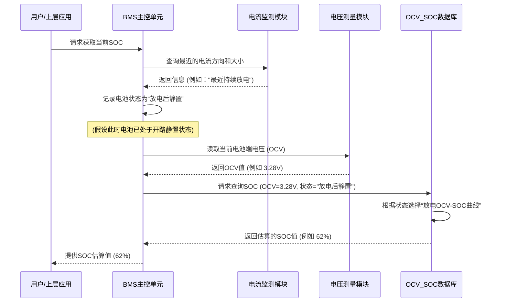

# Chapter 5: 电池迟滞效应


在上一章 [OCV-SOC 特性曲线](04_ocv_soc_特性曲线_.md) 中，我们学习了如何通过实验标定来获得电池的开路电压 (OCV) 和荷电状态 (SOC) 之间的关系曲线。这条曲线是我们利用 OCV 法估算 SOC 的“密码本”。然而，事情并不总是那么简单。细心的你可能会发现，这个“密码本”似乎不止一个版本。今天，我们就来探讨一个非常有趣的现象——电池的迟滞效应。

## 什么是电池迟滞效应？

想象一下，你正在使用一个弹簧。你用力把它压缩到某个长度，然后松开手，它会恢复到原来的长度。现在，你再用力把它拉伸到相同的长度变化量，然后松开手。虽然两次形变的“幅度”相同，但你可能会感觉到压缩和拉伸过程中的受力情况，或者弹簧内部的能量状态变化过程，可能存在细微的差别。

**电池迟滞效应 (Hysteresis Effect)** 指的是这样一个现象：
> **在相同的荷电状态 (SOC) 水平下，电池在充电过程和放电过程中所表现出的开路电压 (OCV) 并不完全相同。通常情况下，充电结束并静置后的 OCV 会略高于放电结束并静置后的 OCV。**

这有点像我们之前提到的“上坡路和下坡路”的类比：即使起点和终点的高度差相同（代表相同的 SOC 变化量），但上坡（充电）和下坡（放电）的“路径”或者说“过程体验”（OCV 的表现）可能会有所不同。

这意味着，我们上一章学习的 OCV-SOC 关系，并不是一条在任何情况下都绝对唯一的曲线。实际上，我们至少需要考虑两条主要的曲线：一条是**充电 OCV-SOC 曲线**，另一条是**放电 OCV-SOC 曲线**。

在 `Switching_Based_State_of_Charge_Estimati.pdf` 文档的第28-29页，第3.3.3节 "Battery Hysteresis Effect" 专门讨论了电池的迟滞效应。文档中提到，这种现象与电池内部的电化学过程有关。例如，图3.11 (第27页) 和图3.12 (第28页) 都清晰地展示了磷酸铁锂类电池在充电和放电时的 OCV-SOC 曲线是分离的，充电曲线通常位于放电曲线之上。图3.13 (第29页) 也引用文献[9]的图示，说明了 LiFePO₄ 电池的平衡行为和迟滞现象。

我们可以用一个简化的图示来理解这个概念：

```mermaid
graph LR
    subgraph "OCV-SOC 曲线与迟滞"
        direction TB
        SOC_Axis[SOC (%)] --> OCV_Axis(OCV (V))

        subgraph "相同SOC点 (例如 50% SOC)"
            direction LR
            SOC_Point(50% SOC) -.-> OCV_Charge(充电 OCV<br>例如 3.30V)
            SOC_Point -.-> OCV_Discharge(放电 OCV<br>例如 3.25V)
        end

        充电曲线((充电曲线)):::chargeStyle
        放电曲线((放电曲线)):::dischargeStyle

        OCV_Charge -- 位于上方 --> 充电曲线
        OCV_Discharge -- 位于下方 --> 放电曲线

        classDef chargeStyle fill:#f9d,stroke:#333,stroke-width:2px;
        classDef dischargeStyle fill:#dfd,stroke:#333,stroke-width:2px;
        classDef commonStyle fill:#eef,stroke:#333,stroke-width:1px;

        note right of OCV_Charge: 充电时的OCV通常更高
        note right of OCV_Discharge: 放电时的OCV通常更低
    end
```
上图示意了在同一个SOC点（例如50%），充电后静置的OCV（如3.30V）会高于放电后静置的OCV（如3.25V）。因此，完整的OCV-SOC特性实际上是由两条略有差异的曲线（充电曲线和放电曲线）所描述。

## 为什么会产生迟滞效应？

电池迟滞效应的产生根源在于电池内部复杂的电化学过程。对于初学者而言，我们可以将其理解为：

1.  **能量转换的“路径”差异**：电池在充电（能量存入）和放电（能量取出）时，内部锂离子、电子的迁移，以及电极材料发生的化学反应，其微观路径和活化能（可以理解为反应的“门槛”）可能不完全相同。这就像开车走盘山公路，上山和下山虽然海拔变化一样，但发动机的做功方式、能量消耗的细节会有所不同。
2.  **内部状态的“记忆”**：电池内部的某些物理或化学状态在充放电循环中可能不会立即完全可逆地恢复。例如，电极材料的微小形变、界面状态的改变等，都可能导致充电和放电过程呈现出不同的电压特性。
3.  **热力学与动力学因素**：`Switching_Based_State_of_Charge_Estimati.pdf` (第29页) 引用文献[9]的解释，指出迟滞现象与热力学有关，充电电极颗粒比放电电极颗粒携带更高的电压，并且与充放电过程中的电荷转移时间常数不同有关。简单来说，就是电池内部达到真正化学平衡的“方式”和“速率”在充电和放电后有所区别。

对于初学者，我们不需要深究其非常复杂的微观机理，关键是要理解迟滞效应的存在及其对 OCV-SOC 关系的影响。

## 迟滞效应对 SOC 估算的影响

迟滞效应的存在，使得 OCV 与 SOC 之间的关系不再是简单的“一一对应”。如果我们在估算 SOC 时，不考虑电池最近是经历了充电还是放电，而仅仅使用一条“平均”的 OCV-SOC 曲线，那么估算结果就必然会产生误差。

让我们看一个例子：
假设对于某款磷酸铁锂电池，在 50% SOC 时：
*   充电过程结束并静置后，测得的 OCV 可能是 **3.30 V**。
*   放电过程结束并静置后，测得的 OCV 可能是 **3.25 V**。

如果我们只有一条“平均”的 OCV-SOC 曲线，它可能显示 50% SOC 对应 3.275 V。
*   **情况1：** 电池刚充完电，实际 SOC 是 50%，测得 OCV 是 3.30 V。如果我们用平均曲线去查，3.30 V 可能对应的是比 50% 更高的 SOC（例如 55%）。这样就高估了 SOC。
*   **情况2：** 电池刚放完电，实际 SOC 是 50%，测得 OCV 是 3.25 V。如果我们用平均曲线去查，3.25 V 可能对应的是比 50% 更低的 SOC（例如 45%）。这样就低估了 SOC。

`Switching_Based_State_of_Charge_Estimati.pdf` 文档中的实验结果也证实了这一点。在第4章 (第31页起)，作者对比了使用充电 OCV-SOC 曲线、放电 OCV-SOC 曲线以及标称 (平均) OCV-SOC 曲线（如图3.11中的三条曲线）来进行 SOC 估算的效果 (如图4.2和图4.4)。结果清晰地显示：
*   当电池处于充电过程中并间歇性静置时，使用**充电 OCV-SOC 曲线**得到的 SOC 估算结果与电池管理系统软件（采用库仑计数法并结合精确模型）给出的参考 SOC 更吻合 (参考图4.2(a) vs 图4.2(b))。
*   当电池处于放电过程中并间歇性静置时，使用**放电 OCV-SOC 曲线**得到的 SOC 估算结果更为准确 (参考图4.4(a) vs 图4.4(b))。

这充分说明，为了提高基于 OCV 法的 SOC 估算精度，我们必须考虑迟滞效应，并根据电池的近期历史（充电或放电）来选择合适的 OCV-SOC 曲线。

## 如何在 SOC 估算中应对迟滞效应？

既然迟滞效应会影响精度，我们应该如何处理呢？

1.  **区分充放电状态**：最核心的策略是判断电池在进行 OCV 测量之前，是处于充电末期还是放电末期。这个信息通常可以从电池管理系统 (BMS) 的电流监测模块获取。
2.  **使用两条 OCV-SOC 曲线**：
    *   在标定 OCV-SOC 特性时，分别进行充电过程的标定和放电过程的标定，得到两条独立的曲线：一条是**充电 OCV-SOC 曲线**，另一条是**放电 OCV-SOC 曲线**。
    *   当需要估算 SOC 时：
        *   如果电池最近在**充电**，则使用充电 OCV-SOC 曲线。
        *   如果电池最近在**放电**，则使用放电 OCV-SOC 曲线。
3.  **使用平均曲线（作为妥协）**：如果无法准确判断电池的充放电历史，或者为了简化系统（例如在 `Switching_Based_State_of_Charge_Estimati.pdf` 中的 "nominal OCV vs. SOC curve"），可以使用充电和放电曲线的平均值作为一条标称曲线。但这会牺牲一定的估算精度，引入由迟滞效应引起的系统误差。
4.  **更复杂的模型**：一些高级的 SOC 估算算法会尝试建立更复杂的电池模型，这些模型内部就包含了对迟滞现象的数学描述，从而能更动态地补偿迟滞效应。但这超出了本入门教程的范围。

### 代码视角：根据状态选择曲线

让我们通过一个简单的 Python 风格伪代码来看看，如何在程序中根据电池状态选择不同的 OCV-SOC 查找表：

```python
# 伪代码：根据充放电状态选择 OCV-SOC 查找表

# 假设我们有两套通过实验标定的 OCV-SOC 数据
# OCV_SOC_TABLE_CHARGING: 充电过程的 (电压, SOC) 数据对列表
# 例如：[(3.05, 10), (3.20, 30), (3.30, 50), ...]
OCV_SOC_TABLE_CHARGING = [
    (3.05, 10), # (充电时OCV 单位V, SOC 单位%)
    (3.20, 30),
    (3.30, 50), # 示例：充电时，50% SOC 对应 3.30V
    (3.35, 70),
    (3.40, 90),
    (3.42, 100)
]

# OCV_SOC_TABLE_DISCHARGING: 放电过程的 (电压, SOC) 数据对列表
# 例如：[(2.95, 10), (3.10, 30), (3.25, 50), ...]
OCV_SOC_TABLE_DISCHARGING = [
    (2.95, 10), # (放电时OCV 单位V, SOC 单位%)
    (3.10, 30),
    (3.25, 50), # 示例：放电时，50% SOC 对应 3.25V
    (3.30, 70),
    (3.36, 90),
    (3.38, 100)
]

# 这是我们在上一章中可能定义的函数，用于从OCV和查找表估算SOC
# (这里我们复用并简化了上一章的插值逻辑)
def get_soc_from_ocv_table(measured_ocv, ocv_soc_table):
    """
    根据测量的开路电压和指定的OCV-SOC查找表估算SOC。
    使用线性插值法。
    """
    if not ocv_soc_table: # 检查表格是否为空
        return -1 # 表示错误或未定义

    # 处理边界情况
    if measured_ocv <= ocv_soc_table[0][0]:
        return ocv_soc_table[0][1]
    if measured_ocv >= ocv_soc_table[-1][0]:
        return ocv_soc_table[-1][1]

    # 查找区间并插值
    for i in range(len(ocv_soc_table) - 1):
        v_low, soc_low = ocv_soc_table[i]
        v_high, soc_high = ocv_soc_table[i+1]
        if v_low <= measured_ocv < v_high:
            # 线性插值公式: soc = soc_low + (ocv - v_low) * (soc_high - soc_low) / (v_high - v_low)
            # 确保 v_high - v_low 不为零以避免除零错误
            if (v_high - v_low) == 0: return soc_low # 或者返回一个错误/平均值
            soc_estimated = soc_low + (measured_ocv - v_low) * (soc_high - soc_low) / (v_high - v_low)
            return round(soc_estimated)
    
    return ocv_soc_table[-1][1] # 默认情况或超出所有已知区间上限（理论上不应发生如果边界已处理）

# --- 演示如何根据电池状态使用不同的查找表 ---
# 假设BMS能够告诉我们电池最近的操作状态
# battery_last_operation = "charging"  # 可能的值: "charging", "discharging", "unknown"
battery_last_operation = "discharging" # 我们换一个状态试试

# 假设这是测量得到的静置后OCV
measured_ocv_value = 3.28 # 单位：伏特

estimated_soc_value = -1 # 初始化

if battery_last_operation == "charging":
    print(f"电池最近的操作是充电。使用充电 OCV-SOC 曲线进行估算。")
    selected_table = OCV_SOC_TABLE_CHARGING
    estimated_soc_value = get_soc_from_ocv_table(measured_ocv_value, selected_table)
elif battery_last_operation == "discharging":
    print(f"电池最近的操作是放电。使用放电 OCV-SOC 曲线进行估算。")
    selected_table = OCV_SOC_TABLE_DISCHARGING
    estimated_soc_value = get_soc_from_ocv_table(measured_ocv_value, selected_table)
else: # battery_last_operation == "unknown" 或其他情况
    print(f"无法确定电池最近的操作状态。可能需要使用平均曲线或提示用户。")
    # 在这种情况下，你可能会选择一个平均表，或者返回一个表示不确定的值
    # estimated_soc_value = get_soc_from_ocv_table(measured_ocv_value, OCV_SOC_TABLE_NOMINAL) # 假设存在一个平均表

print(f"测量得到的开路电压 (OCV) 为: {measured_ocv_value} V")
if estimated_soc_value != -1:
    print(f"估算得到的电池荷电状态 (SOC) 为: {estimated_soc_value}%")
else:
    print("无法估算 SOC。")

# 当 battery_last_operation = "charging", measured_ocv_value = 3.28 V:
# 查找 OCV_SOC_TABLE_CHARGING: 3.28V 介于 (3.20V, 30%) 和 (3.30V, 50%) 之间
# SOC = 30 + (3.28 - 3.20) * (50 - 30) / (3.30 - 3.20)
#     = 30 + (0.08) * (20) / (0.10)
#     = 30 + 0.08 * 200 = 30 + 16 = 46%
# 预期输出：估算得到的电池荷电状态 (SOC) 为: 46%

# 当 battery_last_operation = "discharging", measured_ocv_value = 3.28 V (如当前代码设置):
# 查找 OCV_SOC_TABLE_DISCHARGING: 3.28V 介于 (3.25V, 50%) 和 (3.30V, 70%) 之间
# SOC = 50 + (3.28 - 3.25) * (70 - 50) / (3.30 - 3.25)
#     = 50 + (0.03) * (20) / (0.05)
#     = 50 + 0.03 * 400 = 50 + 12 = 62%
# 预期输出：电池最近的操作是放电。使用放电 OCV-SOC 曲线进行估算。
#         测量得到的开路电压 (OCV) 为: 3.28 V
#         估算得到的电池荷电状态 (SOC) 为: 62%
```
这段伪代码清晰地展示了：
1.  我们为充电和放电过程分别维护了不同的 `OCV_SOC_TABLE`。
2.  根据 `battery_last_operation`（电池最近的操作状态，这需要由 BMS 的其他部分如电流传感器来判断和记录），选择相应的查找表。
3.  然后调用 `get_soc_from_ocv_table` 函数（其内部插值逻辑与之前章节类似）来获得 SOC 估算值。
重要的是，同一个测量得到的 `measured_ocv_value` (例如3.28V)，如果电池刚充过电，会用 `OCV_SOC_TABLE_CHARGING` 查表得到一个 SOC 值（例如46%）；而如果电池刚放过电，则会用 `OCV_SOC_TABLE_DISCHARGING` 查表得到另一个不同的 SOC 值（例如62%）。这样就考虑了迟滞效应，提高了估算精度。

### BMS 内部的简化流程

在电池管理系统 (BMS) 内部，处理迟滞效应并估算 SOC 的简化流程可能如下：


这个时序图描绘了BMS如何结合电池的近期操作历史（充电或放电）和当前测量的OCV，从OCV-SOC数据库（其中可能包含多条曲线）中查询得到更准确的SOC。

## 总结

在本章中，我们深入探讨了电池的迟滞效应，这是一个在进行精确 SOC 估算时不可忽视的现象。

*   **电池迟滞效应**指的是在相同 SOC 水平下，充电 OCV 和放电 OCV 不一致的现象，通常充电 OCV 略高。
*   这种效应源于电池内部复杂的电化学过程在充放电时的路径和平衡状态差异。
*   迟滞效应使得 OCV-SOC 关系不再是单一曲线，而是至少包括一条充电曲线和一条放电曲线。
*   为了提高 SOC 估算的精度，应根据电池最近的充放电历史，选择对应的 OCV-SOC 曲线。使用平均曲线会引入额外误差。
*   实际的 BMS 系统会通过监测电流来判断电池状态，并选用合适的 OCV-SOC 数据进行查表和插值。

理解了迟滞效应后，我们对 OCV 法的认识更加全面了。它提醒我们，电池的行为比我们最初想象的要复杂一些，但也为我们指明了提高估算精度的方向。

在接下来的章节中，我们将学习本项目 `Switching_Based_State_of_Charge_Estimati` 的核心内容——[切换式SOC估算方法](06_切换式soc估算方法_.md)。我们将看到，前面几章学习的关于锂离子电池、SOC、OCV法、OCV-SOC曲线以及迟滞效应的知识，都是理解这种切换式估算方法的重要基础。

---

Generated by [AI Codebase Knowledge Builder](https://github.com/The-Pocket/Tutorial-Codebase-Knowledge)