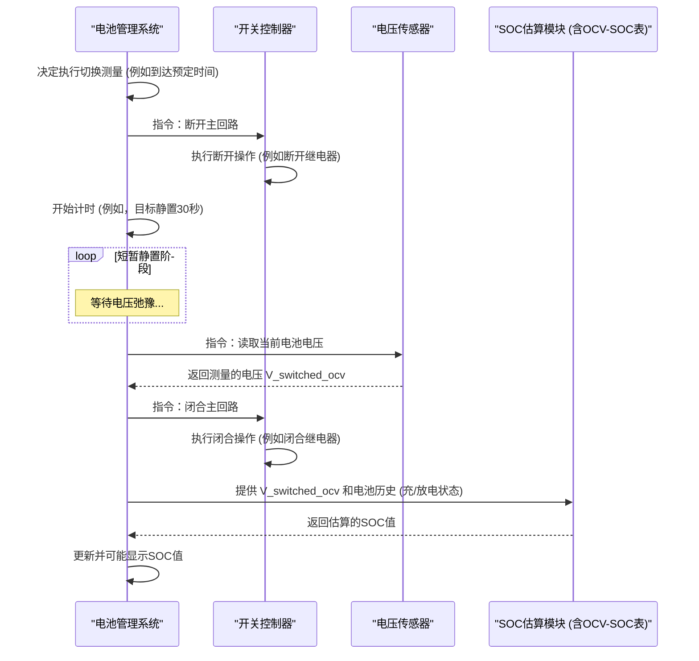

# Chapter 6: 切换式SOC估算方法


在上一章 [电池迟滞效应](05_电池迟滞效应_.md) 中，我们了解到电池在充放电后，即使在相同的SOC下，其开路电压也可能不同。这强调了准确测量或估算开路电压（OCV）对于SOC估算的重要性。然而，传统的OCV法需要电池长时间静置，这对于许多需要连续工作的应用场景（比如你正在使用的手机，或行驶中的电动汽车）来说是不太现实的。那么，有没有一种方法可以在电池工作过程中，相对快速地获得一个近似的OCV值，从而估算SOC呢？本章将介绍的“切换式SOC估算方法”就是为了解决这个问题而提出的。

## 什么是切换式SOC估算方法？

**切换式SOC估算方法**是本论文 (`Switching_Based_State_of_Charge_Estimati.pdf`) 研究的核心技术。它的核心思想非常巧妙：在电池正常工作（比如为设备供电或正在充电）的过程中，周期性地、非常短暂地将电池从主回路中断开，即“切换”到开路状态。然后，在这段短暂的开路期间，测量电池的端电压。

你可以把它想象成一场F1赛车比赛。赛车在赛道上飞驰（相当于电池在工作），但它会时不时地利用短暂的进站（Pit Stop）机会，让技师快速检查油量、更换轮胎等（相当于我们短暂断开电池测量电压）。赛车并不需要在维修站停很久，检查完毕后就立刻回到赛道继续比赛。

切换式SOC估算方法就是借鉴了类似思路。我们不期望在这短暂的“进站”时间里让电池电压完全达到理想的平衡状态（即真实的OCV），但我们期望它能比电池正在大电流工作时的端电压更接近真实OCV。一旦我们获得了这个近似的OCV值（我们称之为“伪OCV”或“切换OCV”），就可以结合我们在前面章节学到的 [OCV-SOC 特性曲线](04_ocv_soc_特性曲线_.md) 来估算当前的荷电状态 (SOC)。

正如 `Switching_Based_State_of_Charge_Estimati.pdf` 的摘要 (第v页) 中提到：“本文旨在探索一种基于切换的方法来估算锂离子电池的荷电状态（SOC）……该方法仅依赖于锂离子电池的电压特性，并使用一个关断（switch-off）持续时间来直接测量OCV。” 论文的第4章 (第31页) 也详细阐述了这种“基于切换的SOC估算”方法，指出“该方法通过提供一个关断间隔，在此期间测量端电压。”

## 切换式SOC估算的工作流程

切换式SOC估算方法的具体工作流程可以分解为以下几个步骤：

1.  **正常工作**: 电池正在为负载（如手机、电动马达）供电，或者正在被充电器充电。此时，电池的端电压会受到电流、内阻等多种因素影响。
2.  **触发切换**: 电池管理系统（BMS）根据预设的条件（例如，固定的时间间隔，或者当负载变化较小时）决定执行一次切换测量。
3.  **断开负载 (切换)**: BMS 控制一个电子开关（例如继电器或MOSFET开关）将电池与主回路（即负载或充电器）暂时断开。此时，电池进入开路状态，不再有大电流流过。

```mermaid
    graph TD
        subgraph "电池正常工作"
            B1[电池] -- 电流流过 --> S1{开关 (闭合)}
            S1 --> L1[负载/充电器]
        end
        subgraph "切换到开路状态 (测量OCV前)"
            B2[电池] -- 电流中断 --> S2{开关 (断开)}
            S2 -. 无电流 .-> L2[负载/充电器]
        end
```
    上图分别展示了电池正常工作时开关闭合，以及切换后开关断开，电池与主回路隔离的状态。

4.  **短暂静置 (弛豫)**: 电池在断开后的开路状态下静置一段预先设定的较短时间。这个时间非常关键，例如在论文中，作者们研究了30秒到几分钟不等的静置时间（参考PDF第v页摘要，以及第4章和第5章的实验）。在这段时间里，电池内部的电化学状态会开始向平衡态转变，其端电压也会逐渐从工作电压向真实的开路电压 (OCV) “放松”或“弛豫”。
5.  **电压测量**: 在这段短暂的静置期结束时（通常是选择在静置期快结束时，电压相对更稳定一点的时刻），精确测量电池两端的电压。这个测量到的电压值就是我们所说的“伪OCV”或“切换OCV”。
6.  **恢复连接**: BMS 控制开关闭合，电池重新连接到主回路，恢复正常的供电或充电状态。整个“进站”过程结束。
7.  **SOC估算**: 利用测量得到的“伪OCV”值，参照预先标定好的 [OCV-SOC 特性曲线](04_ocv_soc_特性曲线_.md)。同时，考虑到 [电池迟滞效应](05_电池迟滞效应_.md)，BMS会根据电池在切换前是处于充电还是放电状态，来选择使用充电OCV-SOC曲线还是放电OCV-SOC曲线进行查表和插值计算，最终得到SOC的估算值。

## 一个简单的例子

让我们想象一个具体场景：
1.  一块磷酸铁锂电池正在为你的电动滑板车供电（放电状态）。
2.  滑板车的BMS系统设定为每隔5分钟执行一次切换式SOC估算。
3.  当时间到达，BMS控制电路，暂时断开电池与电机控制器的连接。
4.  电池进入开路状态，并静置30秒。
5.  在30秒结束时，BMS测量到电池的端电压为 **3.28伏特**。
6.  BMS随即控制电路，将电池重新连接到电机控制器，滑板车恢复正常行驶。
7.  BMS的SOC估算模块接收到这个3.28V的电压值。因为它知道电池之前在放电，所以它会选择**放电OCV-SOC特性曲线**（假设我们有前面章节例子中的那个简化的查找表）。
    *   根据该表，3.28V介于 (3.25V, 50% SOC) 和 (3.30V, 70% SOC) 之间。
    *   通过线性插值计算：`SOC = 50% + (3.28V - 3.25V) * (70% - 50%) / (3.30V - 3.25V) = 62%`。
8.  BMS将估算出的SOC（62%）更新并显示给用户。

这样，滑板车就能在运行过程中，周期性地“偷偷”更新对剩余电量的估计了。

## 切换式方法的优势

相比于传统的SOC估算方法，切换式SOC估算方法有其独特的优势：

*   **实现相对简单**: 它的基本原理仍然是基于OCV法，这使得其概念和实现都比那些依赖复杂数学模型的算法（如卡尔曼滤波）要简单。`Switching_Based_State_of_Charge_Estimati.pdf` 摘要 (第v页) 指出：“OCV方法的优点在于其简单性。与基于模型的方法相比，它避免了建模的需求，并降低了计算负担。” 这一优点也延续到了切换式方法中。
*   **可用于运行中的系统**: 这是它最大的亮点。传统的OCV法要求电池完全停止工作并长时间静置，而切换法则允许在电池主要处于工作状态的间隙进行测量，从而实现对SOC的动态更新。
*   **计算负担较低**: 由于主要依赖查表和简单的插值计算，它对处理器计算能力的要求不高，适合用于资源受限的嵌入式BMS系统。

## 挑战与考量

虽然切换式SOC估算方法听起来很棒，但在实际应用中也面临一些挑战和需要仔细考虑的问题：

*   **切换时长 (Switch-off Duration)**:
    *   这是整个方法中最关键的参数。静置时间太短，电池电压可能还远未接近其真实OCV，导致测量到的“伪OCV”误差很大，进而SOC估算不准。`Switching_Based_State_of_Charge_Estimati.pdf` 的摘要 (第v页) 就明确指出：“对于较短的关断（静置）持续时间，SOC估算的准确性会降低。”
    *   静置时间太长，虽然能让电压更接近真实OCV，从而提高精度，但这又会更频繁或更长时间地中断设备的正常工作，用户体验可能会变差。
    *   因此，需要在估算精度和对系统影响之间做出权衡。论文的第4章和第5章通过大量实验数据，研究了不同的切换时长对估算精度的具体影响。

*   **测量误差**:
    *   由于静置时间通常不足以让电池达到完美的热力学平衡，所以测量到的“伪OCV”与真实的OCV之间总是会存在一定的差异。这个差异最终会转化为SOC的估算误差。
    *   `Switching_Based_State_of_Charge_Estimati.pdf` 中的图4.2和图4.4 (分别在第32页和第33页) 就清晰地展示了使用切换法估算出的SOC与通过精确模型和库仑计数法得到的参考SOC之间的对比和误差。

*   **对系统的影响**:
    *   频繁地断开和接通电池回路，可能会对某些对电源稳定性要求极高的敏感负载造成干扰。同样，在充电过程中进行切换，也可能影响充电控制策略的稳定性。
    *   `Switching_Based_State_of_Charge_Estimati.pdf` 的摘要 (第v页) 提到，在具有多个储能元件的分布式电源系统中（例如，一个系统里既有主电池又有备用电池或超级电容），当一个储能元件被短暂切换断开时，其他元件可以继续供电，这样切换带来的影响就小得多。

*   **硬件需求**:
    *   实现切换操作，需要在电池回路中加入一个由BMS控制的开关元件，比如继电器 (Relay) 或功率MOSFET。这会增加系统的硬件成本和一定的复杂性，开关本身也可能带来微小的能量损耗。论文中的图3.5 (第23页) 展示了实验中使用的一个继电器。

## 系统如何执行切换式SOC估算？ (简化流程)

下面我们用一个序列图来展示BMS内部执行一次切换式SOC估算的大致流程：



这个图示描述了：
1.  BMS发起一次切换测量。
2.  开关控制器负责断开和重新连接电池与主回路。
3.  在断开期间，BMS等待一段预设的静置时间。
4.  静置结束后，电压传感器测量电压。
5.  SOC估算模块利用这个电压和电池的充放电历史（用于选择正确的OCV-SOC曲线），查表计算出SOC。

## 代码视角：使用切换获得的电压估算SOC

请注意，实际的电路切换是由硬件（如继电器、MOSFET）和BMS的底层固件代码控制的。这里的Python风格伪代码主要关注的是：**当BMS通过切换操作获得了一个“伪OCV”读数后，它如何利用这个读数来估算SOC**。我们将复用在前几章中讨论过的根据OCV和查找表估算SOC的逻辑。

```python
# 伪代码：处理切换后获得的电压并估算SOC

# 假设这些查找表和函数已在前几章定义好:
# OCV_SOC_TABLE_CHARGING = [(3.05, 10), (3.20, 30), (3.30, 50), ...] # 充电OCV-SOC查找表
# OCV_SOC_TABLE_DISCHARGING = [(2.95, 10), (3.10, 30), (3.25, 50), ...] # 放电OCV-SOC查找表

# def get_soc_from_ocv_table(measured_ocv, ocv_soc_table):
#     """
#     根据测量的OCV和指定的OCV-SOC查找表估算SOC。
#     内部通过查表和线性插值返回SOC百分比。
#     (具体实现参考前面章节，此处假设函数已存在并能正常工作)
#     """
#     # 伪代码模拟:
#     if ocv_soc_table == OCV_SOC_TABLE_DISCHARGING and 3.25 <= measured_ocv <= 3.30:
#         # 简化插值，假设 measured_ocv = 3.28V 时，SOC = 62%
#         if abs(measured_ocv - 3.28) < 0.01 : return 62 
#     # ... 其他情况的模拟 ...
#     return 50 # 默认一个值或更复杂的插值


def estimate_soc_after_switching(switched_ocv_measurement, last_known_operation):
    """
    在切换式测量获得电压后，估算SOC。

    :param switched_ocv_measurement: 电池短暂静置后测量到的电压值 (单位: 伏特)
    :param last_known_operation: 电池在切换前最近的操作状态 ("charging" 或 "discharging")
    :return: 估算的SOC百分比 (整数), 或者 -1 表示错误
    """
    print(f"接收到切换后测量的电压: {switched_ocv_measurement} V")
    print(f"电池上次操作为: {last_known_operation}")

    selected_table = None # 用来存放选择的 OCV-SOC 表

    if last_known_operation == "charging":
        # selected_table = OCV_SOC_TABLE_CHARGING # 实际应使用已定义的表
        print("信息：选用充电OCV-SOC曲线进行估算。")
        # 为简化示例，我们直接模拟查表结果
        if 3.25 <= switched_ocv_measurement <= 3.30: # 假设充电时电压略高
             estimated_soc = 55 # 示例值
        else:
             estimated_soc = 50 # 默认
    elif last_known_operation == "discharging":
        # selected_table = OCV_SOC_TABLE_DISCHARGING # 实际应使用已定义的表
        print("信息：选用放电OCV-SOC曲线进行估算。")
        # 为简化示例，我们直接模拟查表结果
        if 3.25 <= switched_ocv_measurement <= 3.30: 
             # 根据之前章节的例子，如果放电时OCV=3.28V，插值结果约为62%
             if abs(switched_ocv_measurement - 3.28) < 0.01 : estimated_soc = 62
             else: estimated_soc = 60 # 其他情况的示例值
        else:
             estimated_soc = 50 # 默认
    else:
        print("错误：未知的电池操作历史，无法选择OCV-SOC曲线。")
        return -1 # 返回错误码

    # 假设 get_soc_from_ocv_table(switched_ocv_measurement, selected_table) 调用成功
    # estimated_soc = get_soc_from_ocv_table(switched_ocv_measurement, selected_table)
    
    print(f"估算得到的 SOC 为: {estimated_soc}%")
    return round(estimated_soc) # 返回四舍五入的整数SOC

# --- 模拟BMS在一次成功的切换操作后，调用此函数进行SOC估算 ---
# 场景：电池之前正在放电。
# BMS执行了切换：断开电路 -> 静置30秒 -> 测量电压。
# 假设BMS测量到的电压读数为 3.28 伏特。
voltage_from_switching_measurement = 3.28 
battery_operation_before_switch = "discharging"

print(f"\n--- 开始一次切换式SOC估算演示 ---")
# BMS调用估算函数
soc_estimation_result = estimate_soc_after_switching(
    voltage_from_switching_measurement, 
    battery_operation_before_switch
)

if soc_estimation_result != -1:
    print(f"最终的SOC估算结果已更新: {soc_estimation_result}%")
else:
    print("SOC估算失败，请检查输入或电池状态。")
```

代码解释：
1.  `estimate_soc_after_switching` 函数接收两个重要参数：`switched_ocv_measurement` (切换后测得的电压) 和 `last_known_operation` (电池在切换前的状态，是充电还是放电)。
2.  根据 `last_known_operation`，函数会“选择”使用充电 OCV-SOC 曲线还是放电 OCV-SOC 曲线（这里用 `print` 语句和条件判断模拟了这个选择和后续的查表过程）。
3.  然后，它会（概念上）调用类似前几章的 `get_soc_from_ocv_table` 函数，传入测量电压和选定的表，来得到SOC估算值。为保持本示例简短，我们直接给出了一个基于输入电压的模拟SOC输出。
4.  在主程序部分，我们模拟了一次切换操作后的场景：电池之前在放电，切换并短暂静置后测得电压为3.28V。然后调用 `estimate_soc_after_switching` 函数得到估算的SOC。

这个伪代码的核心在于展示了如何根据电池的**近期历史**和**切换后测量的电压**来利用OCV-SOC关系。

## 总结与展望

在本章中，我们详细学习了切换式SOC估算方法。这是一种巧妙的技术，它试图在不严重影响电池正常工作的前提下，获取一个近似的开路电压值，进而估算电池的荷电状态。

*   **核心思想**: 周期性、短暂地将电池从主回路断开，测量其在短暂静置后的端电压。
*   **工作流程**: 正常工作 -> 触发切换 -> 断开负载 -> 短暂静置 -> 电压测量 -> 恢复连接 -> SOC估算。
*   **优势**: 实现相对简单，可用于运行中的系统，计算负担较低。
*   **挑战**: 切换时长的选择是关键，会引入测量误差，可能对系统造成影响，且需要额外硬件。

切换式SOC估算方法为在动态条件下估算SOC提供了一种实用途径，平衡了传统OCV法对长时间静置的需求与实际应用中电池持续工作的矛盾。

然而，正如我们所见，由于静置时间较短，测量到的“伪OCV”与真实OCV之间仍然存在误差，这直接影响了SOC估算的精度。那么，我们能否有办法进一步减小这个误差，或者说，从这个短暂静置期间的电压变化中提取更多信息，来更准确地推断出电池真正的OCV呢？

这正是我们下一章 [电池瞬态响应与时间常数](07_电池瞬态响应与时间常数_.md) 将要探讨的内容。我们将学习电池在负载移除（切换断开）后，其电压是如何随时间变化的（即瞬态响应），以及如何利用其特征参数（如时间常数）来预测电压完全稳定后的值。这与 `Switching_Based_State_of_Charge_Estimati.pdf` 论文的第5章 (从第39页开始) “SOC Estimation using Battery Transient Characteristics”（使用电池瞬态特性进行SOC估算）中提出的改进方法密切相关，其目标是“减少关断时间至30秒，并提高SOC估算的准确性，提出一种使用时间常数从测量的OCV外推至无限时间OCV的方法。” (参考摘要，第v页)。

---

Generated by [AI Codebase Knowledge Builder](https://github.com/The-Pocket/Tutorial-Codebase-Knowledge)