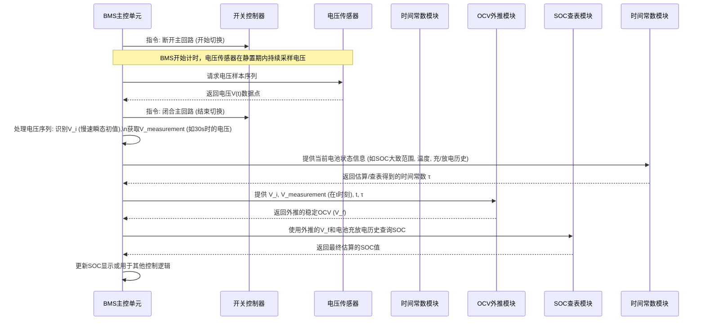

# Chapter 7: 电池瞬态响应与时间常数


欢迎来到本教程的第七章！在上一章 [切换式SOC估算方法](06_切换式soc估算方法_.md) 中，我们学习了一种非常实用的SOC估算技术，它允许我们在电池工作过程中，通过短暂地断开负载来测量一个近似的开路电压（OCV），进而估算SOC。这种方法避免了传统OCV法需要长时间静置的问题。

然而，你可能也注意到了，由于切换后的静置时间非常短（例如论文中讨论的30秒），电池的端电压可能还没有完全达到其真正稳定的开路电压。这意味着我们测量到的“伪OCV”与真实的稳定OCV之间仍然存在一定的偏差，这个偏差会直接影响SOC估算的精度。

那么，我们能不能找到一种方法，即使在短暂的静置期内，也能更准确地“预测”出电池如果继续静置下去最终会达到的那个稳定OCV呢？答案是肯定的！这就需要我们理解电池在负载切换后的“瞬态响应”特性，以及一个关键的参数——“时间常数”。本章将带你深入了解这些概念，看看它们是如何帮助我们提高切换式SOC估算精度的。

## 电池的“深呼吸”：瞬态响应

想象一下，你刚刚跑完一场剧烈的百米赛跑，你的心跳和呼吸都非常急促。当你停下来休息时，你的心跳和呼吸不会瞬间恢复到平静状态，而是会经历一个逐渐平缓下来的过程。电池在经历工作状态（大电流放电或充电）到开路状态（无电流）的切换时，其端电压的变化也与此类似。

**电池瞬态响应 (Battery Transient Response)** 描述的就是当电池从工作状态（例如放电）突然切换到开路状态后，其端电压并不是立即稳定在最终的开路电压 (OCV)，而是会经历一个动态的恢复过程，逐渐趋向于那个稳定的OCV值。

这个恢复过程通常可以被观察为两个主要阶段：

1.  **快速电压跳变 (Fast Voltage Jump):**
    当负载被移除的瞬间，由于电池内部的欧姆内阻（可以想象成电流流过时遇到的一种“阻力”）上不再有电流流过，之前由欧姆内阻引起的电压降会立刻消失。这会导致电池端电压出现一个几乎瞬时的、快速的上升（如果是从放电切换到开路）或下降（如果是从充电切换到开路）。这个跳变非常快，通常在毫秒级别。

2.  **缓慢指数级恢复 (Slow Exponential Recovery):**
    在快速跳变之后，电池电压并不会停在那里，而是会继续缓慢地变化。这个阶段的电压恢复是由于电池内部更复杂的电化学过程，比如电极表面锂离子浓度的重新分布、电荷在双电层界面的积累与消散等，这些过程需要一定的时间才能达到新的平衡。这个缓慢的恢复过程通常呈现出类似指数函数变化的趋势，可能持续数十秒到数分钟，甚至更长时间，最终才趋近于电池的真实稳定开路电压。

`Switching_Based_State_of_Charge_Estimati.pdf` 论文的图5.1 (第39页) 就很好地展示了这种电压瞬态响应的特性。图中 `V_i` 指的是慢速瞬态开始时的电压，而电压会逐渐向 `V_f` (最终稳定OCV) 恢复。

```mermaid
graph LR
    subgraph "电池电压瞬态响应 (从放电切换到开路)"
        A[工作电压<br>(负载连接时)] -- 负载移除 --> B(快速电压跳变<br>欧姆效应消失);
        B --> C(缓慢指数级恢复<br>电化学过程平衡);
        C --> D[稳定开路电压 (OCV)<br>(长时间静置后)];
    end
    style A fill:#f9d,stroke:#333,stroke-width:2px
    style B fill:#fcc,stroke:#333,stroke-width:2px
    style C fill:#cfc,stroke:#333,stroke-width:2px
    style D fill:#9cf,stroke:#333,stroke-width:2px
```

我们主要关注的是这个“缓慢指数级恢复”阶段。因为在 [切换式SOC估算方法](06_切换式soc估算方法_.md) 中，我们短暂的静置期（比如30秒）通常就落在这个缓慢恢复的过程中。如果我们能理解这个过程的规律，就能从中提取有用的信息。

## 恢复快慢的标尺：时间常数 (τ)

既然电池电压在缓慢恢复，那么这个恢复过程是快还是慢呢？不同的电池，或者同一块电池在不同的状态下（比如不同的SOC、温度或老化程度），恢复的速度可能会不一样。为了量化描述这个恢复过程的快慢，我们引入了一个非常重要的参数——**时间常数 (Time Constant, τ)**。

> **时间常数 (τ)** 是一个表征物理系统（在这里是电池电压）响应变化快慢的参数。对于电池电压的指数级恢复过程，时间常数可以被理解为电压从初始不平衡状态恢复到接近其最终稳定状态所需特征时间的一个度量。

打个比方：
*   你往一个漏水的桶里注水，然后停止注水。桶里的水位会因为漏水而下降。如果漏得快，水位下降得就快，对应的时间常数就小。如果漏得慢，水位下降得也慢，对应的时间常数就大。
*   或者像给一个电容器充电，RC电路的时间常数（R乘以C）决定了电容器电压上升到接近电源电压的速度。

对于电池电压的缓慢指数级恢复阶段，其电压 `V(t)` 随时间 `t` 的变化，通常可以近似地用下面这样的一阶指数模型来描述（参考 `Switching_Based_State_of_Charge_Estimati.pdf` 第40页的公式5.1）：

`V(t) = V_i * e^(-t/τ) + V_f * (1 - e^(-t/τ))`

其中：
*   `V(t)` 是在静置时间 `t` 时刻的电池电压。
*   `V_i` 是这个缓慢恢复阶段开始时的初始电压（即快速电压跳变结束后的电压）。
*   `V_f` 是电池电压最终将稳定到的值，也就是我们希望得到的真实稳定开路电压 (OCV at infinite time)。
*   `τ` (tau) 就是我们所说的**时间常数**。它具有时间的单位（例如秒）。
*   `e` 是自然对数的底数 (约等于 2.718)。

这个公式告诉我们：
*   当 `t` 很小（远小于 `τ`）时，`e^(-t/τ)` 约等于 `1 - t/τ`，电压变化相对较快。
*   当 `t = τ` 时，`e^(-τ/τ) = e^(-1) ≈ 0.368`。这意味着电压已经完成了从 `V_i` 到 `V_f` 总变化量的约 `(1 - 0.368) = 63.2%`。
*   当 `t` 很大（例如 `t = 3τ` 到 `5τ`）时，`e^(-t/τ)` 变得非常小，`V(t)` 就非常接近 `V_f` 了。理论上，需要无限长的时间才能完全达到 `V_f`。

**关键在于，如果我们能够通过在短暂静置期内测量的电压数据来估算出这个时间常数 `τ`，再结合 `V_i` 和某个时刻 `t` 的测量电压 `V(t)`，我们就有可能反过来推算出 `V_f` —— 那个我们真正关心的、能够准确反映SOC的稳定OCV！**

`Switching_Based_State_of_Charge_Estimati.pdf` 的第5.1节 (第39页起) 详细讨论了如何从电池的瞬态响应中获取时间常数。论文中的图5.2 (第41页) 和图5.3 (第42页) 也展示了不同电池在不同SOC下估算出的时间常数。

## 利用时间常数“预测未来”：外推稳定OCV

现在，我们知道了电池电压在切换到开路后会经历一个瞬态恢复过程，并且这个过程的快慢可以用时间常数 `τ` 来描述。那么，我们如何利用这些知识来改进 [切换式SOC估算方法](06_切换式soc估算方法_.md) 的精度呢？

核心思想是：在短暂的静置期（例如30秒）内，我们不仅测量静置期结束时的电压，还尝试去分析电压在这30秒内的变化情况，从中估算出时间常数 `τ`。然后，利用上面提到的指数恢复模型，**外推 (extrapolate)** 预测出如果电池继续静置下去，最终会达到的稳定开路电压 `V_f`。

**步骤如下：**

1.  **执行切换并采样电压：** 按照 [切换式SOC估算方法](06_切换式soc估算方法_.md) 的步骤，将电池从主回路断开。在短暂的静置期内（比如30秒），以一定的频率多次采样电池的端电压，得到一系列 `(时间, 电压)` 数据点。
2.  **确定慢速瞬态参数：** 从采样到的电压数据中，识别出快速电压跳变结束、慢速指数级恢复开始的那个点。该点的电压即为 `V_i`（慢速瞬态的初始电压），对应的时间可以设为相对零点。同时，记录下静置期结束时（例如 `t = 30` 秒）的测量电压 `V(t)`。
3.  **估算时间常数 `τ`：** 这是最关键的一步。有多种方法可以估算 `τ`：
    *   **基于两点法（如论文中思路）：** 如果我们在慢速恢复阶段取两个不同时间点 `t1` 和 `t2` (相对于慢速恢复开始的时刻) 及其对应的电压 `V(t1)` 和 `V(t2)`，再结合 `V_i`，可以通过求解一个方程（如论文中公式5.3背后的原理，它通过令两个时间点计算出的 `V_f` 相等来求解 `τ`）来得到 `τ`。这个求解过程可能需要数值方法。
    *   **查表或预 caractérisation：** 更简单的方法是，假设时间常数 `τ` 已经在实验室里针对不同SOC、温度、充放电历史等条件预先标定好了，并存储在一个查找表里。BMS可以根据当前电池的大致状态去查找一个合适的 `τ` 值。`Switching_Based_State_of_Charge_Estimati.pdf` 的第5.1.1节和5.1.2节（第41-42页）就展示了实验测得的时间常数在不同SOC下的变化。论文后续也使用了平均时间常数或优化选取的时间常数进行计算（第43页起）。
    *   **模型拟合：** 如果采样点足够多，可以用指数函数去拟合这些电压数据点，直接得到 `τ` 和 `V_f`。
4.  **外推计算稳定OCV (`V_f`)：** 一旦我们有了 `V_i`、某个时刻 `t` 的电压 `V(t)` 以及估算出的时间常数 `τ`，我们就可以利用公式 (5.1) 的变形来计算 `V_f` (即论文中的 `V_OCV_infinite` 或 `V_f`)。
    从 `V(t) = V_i * e^(-t/τ) + V_f * (1 - e^(-t/τ))`，我们可以解出 `V_f`：
    `V_f = (V(t) - V_i * e^(-t/τ)) / (1 - e^(-t/τ))`
    这个计算出的 `V_f` 就是我们外推得到的、预测的稳定开路电压。
5.  **估算SOC：** 使用这个外推得到的 `V_f`（它应该比直接在30秒结束时测量的 `V(t)` 更接近真实的稳定OCV），参照 [OCV-SOC 特性曲线](04_ocv_soc_特性曲线_.md)（同样要考虑 [电池迟滞效应](05_电池迟滞效应_.md) 选择合适的曲线），来估算SOC。

**这样做的好处是什么呢？**
通过外推，我们得到的 `V_f` 理论上消除了由于静置时间不足而引入的部分电压偏差，使得它更接近电池的“真实内心”（即真正的稳定OCV）。因此，用这个 `V_f` 去估算SOC，其准确性会比直接用短暂静置后的电压更高。这正是 `Switching_Based_State_of_Charge_Estimati.pdf` 论文第5章 (第39页起) 提出“使用电池瞬态特性进行SOC估算”的核心目的：“将关断时间减少到30秒，并提高SOC估算的准确性，提出一种使用时间常数从测量的OCV外推至无限时间OCV的方法。” (参考摘要，第v页)。

### 代码示例：外推稳定OCV

假设我们已经通过某种方式（例如查表或简化的估算）得到了时间常数 `τ`。下面的Python风格伪代码展示了如何根据慢速瞬态的初始电压 `V_i`、短暂静置 `t` 时间后的测量电压 `V(t)`，以及时间常数 `τ`，来外推计算稳定的开路电压 `V_f`。

```python
# 伪代码: 假设时间常数 tau 已知，根据短期测量电压外推稳定OCV
import math # 导入数学库以使用指数函数 exp

def extrapolate_stable_ocv(v_initial_slow, v_measured_at_t, t_elapsed, tau):
    """
    根据慢速瞬态初始电压、t时刻测量电压、流逝时间和时间常数外推稳定OCV (V_f)。
    基于公式: V_f = (V(t) - V_i * exp(-t/τ)) / (1 - exp(-t/τ))

    参数:
    v_initial_slow (float): 慢速瞬态响应开始时的电压 (即 V_i)
    v_measured_at_t (float): 在静置时间 t_elapsed 结束时测量的电压 (即 V(t_elapsed))
    t_elapsed (float): 短暂静置的持续时间 (单位：秒)
    tau (float): 电池的慢速恢复时间常数 (单位：秒)

    返回:
    float: 外推得到的稳定开路电压 (V_f)，如果计算出错则可能返回原始测量电压
    """
    # 安全检查：时间常数必须为正
    if tau <= 0:
        print("错误：时间常数 tau 必须大于零。")
        return v_measured_at_t # 返回原始测量值作为一种容错处理

    # 计算指数项 exp(-t/τ)
    try:
        exp_term = math.exp(-t_elapsed / tau)
    except OverflowError:
        print("错误：计算exp(-t/τ)时发生溢出，t/tau 可能过大。")
        return v_measured_at_t # 返回原始测量值

    # 计算分母 (1 - exp(-t/τ))
    denominator = 1 - exp_term
    
    # 安全检查：避免除以零或非常接近零的数
    if abs(denominator) < 1e-9: # 1e-9 是一个很小的阈值
        print("警告：分母 (1 - exp(-t/τ)) 过小，可能导致计算不稳定。")
        # 这种情况通常发生在 t_elapsed 相对于 tau 非常小的时候，意味着电压几乎没怎么恢复
        # 此时外推可能不准确，直接返回测量值可能更稳妥，或者提示错误
        return v_measured_at_t 

    # 计算分子 (V(t) - V_i * exp(-t/τ))
    numerator = v_measured_at_t - v_initial_slow * exp_term

    # 计算外推的稳定OCV
    v_final_extrapolated = numerator / denominator
    
    return v_final_extrapolated

# --- 示例使用 ---
# 假设以下参数来自一次切换式测量：
# 1. 电池从负载切换到开路后，经过快速电压跳变，慢速瞬态开始时的电压值
v_i_for_slow_transient = 3.20  # 单位：伏特 (V_i)

# 2. 设定的短暂静置时间
switch_off_duration = 30.0  # 单位：秒 (t)

# 3. 在静置30秒结束时，测量得到的电池电压
voltage_measured_at_30s = 3.25    # 单位：伏特 (V(t=30s))

# 4. 假设BMS通过查表或某种估算方法，确定当前条件下电池的慢速恢复时间常数
estimated_time_constant_tau = 60.0  # 单位：秒 (τ)

print(f"--- OCV 外推计算开始 ---")
print(f"慢速瞬态初始电压 (V_i): {v_i_for_slow_transient:.4f} V")
print(f"静置时间 (t): {switch_off_duration} s")
print(f"在 t 时刻测量的电压 (V(t)): {voltage_measured_at_30s:.4f} V")
print(f"估算的时间常数 (τ): {estimated_time_constant_tau} s")

# 调用函数进行外推计算
predicted_stable_ocv_vf = extrapolate_stable_ocv(
    v_i_for_slow_transient, 
    voltage_measured_at_30s, 
    switch_off_duration, 
    estimated_time_constant_tau
)

print(f"\n--- OCV 外推计算结果 ---")
print(f"直接测量的电压 (在 {switch_off_duration}s 时): {voltage_measured_at_30s:.4f} V")
print(f"通过外推预测的稳定OCV (V_f): {predicted_stable_ocv_vf:.4f} V")

# 预期结果分析：
# 如果没有外推，BMS会使用 3.25V 去查OCV-SOC表。
# 通过外推，我们期望得到一个更接近真实稳定OCV的值。
# 在这个例子中，由于 V(t=30s) = 3.25V 大于 V_i = 3.20V，且 τ = 60s (恢复较慢)，
# 我们可以预期外推的 V_f 会比 3.25V 更高。
# 手动计算验证：
# exp_term = exp(-30/60) = exp(-0.5) ≈ 0.60653
# numerator = 3.25 - 3.20 * 0.60653 ≈ 3.25 - 1.940896 ≈ 1.309104
# denominator = 1 - 0.60653 ≈ 0.39347
# V_f ≈ 1.309104 / 0.39347 ≈ 3.3270 V
# 所以，外推得到的 V_f 约为 3.3270 V，这个值将用于后续的SOC估算。
```

代码解释：
1.  `extrapolate_stable_ocv` 函数接收慢速瞬态的初始电压 `v_initial_slow` (`V_i`)，在静置时间 `t_elapsed` 时测得的电压 `v_measured_at_t` (`V(t)`)，静置时间 `t_elapsed`，以及估算得到的时间常数 `tau` (`τ`)。
2.  函数内部首先进行了一些安全检查，例如确保 `tau` 是正数，以及避免分母为零。
3.  它根据前面推导的公式 `V_f = (V(t) - V_i * e^(-t/τ)) / (1 - e^(-t/τ))` 来计算外推的稳定开路电压 `v_final_extrapolated`。
4.  在示例使用部分，我们设定了一组参数，模拟了BMS在一次切换测量后得到的数据。
5.  调用外推函数后，可以看到预测的稳定OCV (例如约3.327V) 比直接测量的30秒电压 (3.25V) 要高。这意味着电池电压在30秒时还没有完全恢复，通过外推，我们得到了一个更接近其最终平衡态的电压估计值。这个估计值随后可以被用来更准确地查询 [OCV-SOC 特性曲线](04_ocv_soc_特性曲线_.md) 以得到SOC。

`Switching_Based_State_of_Charge_Estimati.pdf` 论文中的第5.2节（第43页起）展示了大量使用这种结合时间常数的外推方法进行SOC估算的实验结果。例如，图5.4至5.7，以及后续的图5.9至5.12等，都对比了使用外推OCV估算的SOC与实际SOC。结果表明，与不使用外推相比，这种方法确实能在较短的关断时间内（如30秒或60秒）显著提高SOC的估算精度，误差可以从原来的15%左右降低到5%甚至更低（具体数值取决于电池类型和测试条件，参见论文中的表5.1, 5.2, 5.3）。

## 深入探究：BMS如何实现这一切？

让我们通过一个简化的序列图来看看电池管理系统 (BMS) 内部可能是如何执行这个基于瞬态响应和时间常数的外推OCV及SOC估算流程的。



**流程解释：**

1.  **切换与采样：** BMS 控制开关断开负载，并在短暂的静置期内，通过电压传感器采集一系列电压读数。
2.  **数据预处理：** BMS 从采集到的电压数据中，提取出慢速瞬态开始时的电压 `V_i`，以及静置期结束（比如 `t`=30秒）时的电压 `V(t)`。
3.  **获取时间常数 `τ`：**
    *   这一步比较复杂。BMS 可能内置了一个“时间常数模块”。
    *   这个模块可能含有一个预先标定好的查找表，根据电池当前的粗略SOC（可能来自上一次估算）、温度、以及是在充电还是放电后静置等信息，来查找一个合适的 `τ` 值。`Switching_Based_State_of_Charge_Estimati.pdf` 中的图5.2和图5.3（第41-42页）就显示了 `τ` 会随SOC和充放电状态变化。
    *   或者，如论文第43页所述，可以使用一个平均的 `τ` 值（例如，对LiFeMgPO4电池模块，充电时平均 `τ`=35s，放电时平均 `τ`=18s）。
    *   更高级的系统可能会尝试从静置期内的多个电压采样点实时拟合估算出 `τ`，但这计算量较大。
4.  **外推OCV (`V_f`)：** BMS 将 `V_i`, `V(t)`, `t` 和获取到的 `τ` 交给“OCV外推模块”（通常是一个数学计算单元），该模块使用我们前面讨论的公式计算出预测的稳定OCV `V_f`。
5.  **SOC查表：** 最后，BMS 使用这个更精确的 `V_f`，结合电池的充放电历史（以应对 [电池迟滞效应](05_电池迟滞效应_.md)），去查询 [OCV-SOC 特性曲线](04_ocv_soc_特性曲线_.md) 数据库，得到最终的SOC估算值。

值得注意的是，`Switching_Based_State_of_Charge_Estimati.pdf` 的第5.3节 (第47页起) 还探讨了电池老化对时间常数 `τ` 的影响。研究发现，随着电池循环次数的增加（老化），时间常数本身也会发生变化（例如，图5.18和5.19，第53-54页）。这意味着，一个非常精密的BMS系统，在估算 `τ` 时，可能还需要考虑电池的健康状态 (SOH)。不过对于入门理解，我们可以先关注 `τ` 的基本作用。

## 总结

在本章中，我们一起探索了电池瞬态响应和时间常数这两个非常重要的概念，以及它们如何帮助我们改进基于短时切换的SOC估算方法：

*   **电池瞬态响应**描述了电池从工作状态切换到开路后，其端电压随时间逐渐恢复至稳定开路电压的动态过程，通常包括一个快速跳变和一个缓慢的指数级恢复。
*   **时间常数 (τ)** 是表征这个慢速指数级恢复阶段快慢的关键参数。
*   通过在短暂的静置期内分析电压变化，估算出时间常数 `τ`，我们可以利用电池的指数恢复模型，**外推预测**出电池如果无限长时间静置后才能达到的**稳定开路电压 (V_f)**。
*   使用这个外推得到的 `V_f`（而不是直接测量的短期静置电压）去查阅OCV-SOC特性曲线，可以显著**提高SOC估算的精度**，尤其是在静置时间受限的情况下。

这种基于瞬态特性和时间常数的外推方法，是 `Switching_Based_State_of_Charge_Estimati` 项目中提出的一项核心改进。它使得我们能够在不牺牲太多系统可用性（即保持较短的切换关断时间）的同时，获得更可靠的SOC信息。

至此，我们已经学习了本项目中涉及到的关于SOC估算的主要理论概念和方法。理解了这些基础，你就能更好地 apreciar 论文中的实验设计、结果分析以及其结论的意义了。在实际的电池管理系统开发中，这些原理和方法都可能被借鉴和应用。

---

Generated by [AI Codebase Knowledge Builder](https://github.com/The-Pocket/Tutorial-Codebase-Knowledge)