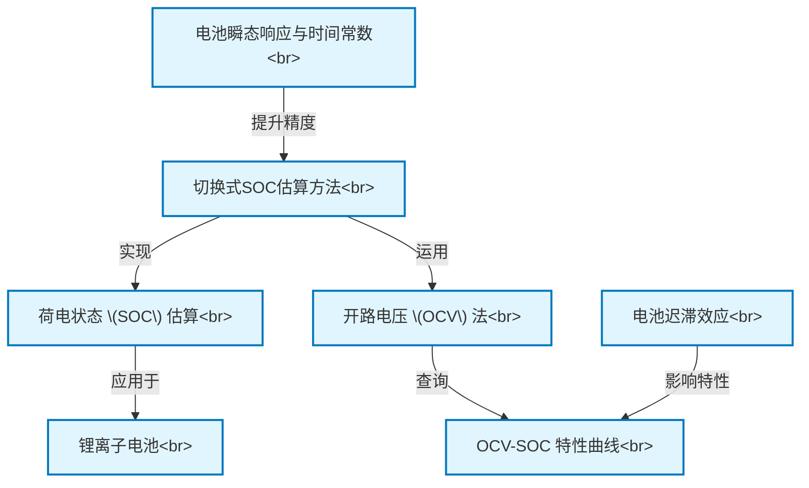

# Tutorial: Switching_Based_State_of_Charge_Estimati

本项目旨在研究一种新颖的 **电池电量 (SOC)** 估算方法，专门针对 *锂离子电池*。
该方法的核心是一种 *切换式技术*：在电池工作时，周期性地短暂断开电池，测量其 *开路电压 (OCV)*。
然后，通过查询预先标定的 *OCV-SOC特性曲线*，就可以从OCV推算出当前的电量百分比。
为了提高估算精度，研究中还考虑了 *电池的瞬态响应特性*（利用时间常数预测稳定OCV）以及 *电池的迟滞效应* 等因素。

**Source Repository:** [None](None)

## Chapters

1. [锂离子电池
](01_锂离子电池_.md)
2. [荷电状态 (SOC) 估算
](02_荷电状态__soc__估算_.md)
3. [开路电压 (OCV) 法
](03_开路电压__ocv__法_.md)
4. [OCV-SOC 特性曲线
](04_ocv_soc_特性曲线_.md)
5. [电池迟滞效应
](05_电池迟滞效应_.md)
6. [切换式SOC估算方法
](06_切换式soc估算方法_.md)
7. [电池瞬态响应与时间常数
](07_电池瞬态响应与时间常数_.md)

---

Generated by [AI Codebase Knowledge Builder](https://github.com/The-Pocket/Tutorial-Codebase-Knowledge)