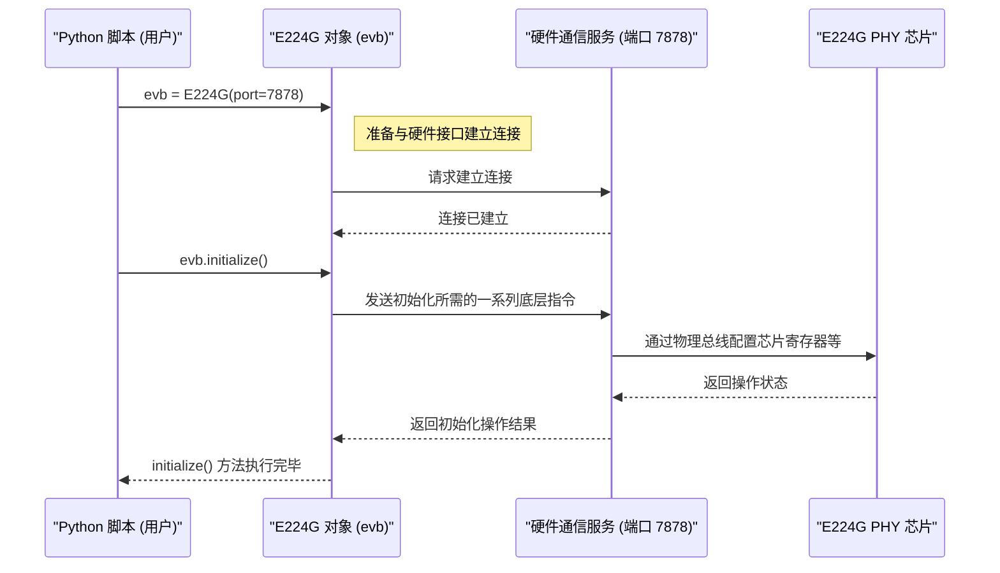

# Chapter 1: E224G 设备控制器


欢迎来到 T4 项目教程！在本系列教程中，我们将学习如何使用 Python 来与 Synopsys E224G 物理层 (PHY) 芯片进行交互。

本章是我们的起点。想象一下，你面前有一个非常复杂的高科技设备——E224G 芯片。你想让它完成特定的任务，比如运行测试、调整设置或者读取数据。但是，你不能直接和芯片对话，你需要一个中间人，一个懂得如何与芯片沟通的工具。

这就是 `E224G` 设备控制器的作用所在。

## 什么是 E224G 设备控制器？

`E224G` 设备控制器是一个 Python 对象，它是我们与 E224G 芯片沟通的主要桥梁。你可以把它想象成一个**专门为 E224G 芯片设计的“通用遥控器”**。

-   **为什么需要它？** 直接与硬件芯片打交道非常复杂，需要了解很多底层细节（比如寄存器地址、通信协议等）。`E224G` 对象将这些复杂性封装起来，提供了一套简单易用的 Python 方法（函数）。
-   **它能做什么？** 通过这个“遥控器”，我们可以执行各种操作，例如：
    -   初始化和配置芯片的基本参数。
    -   命令芯片开始进行测量，比如误码率测试。
    -   从芯片中读取测试结果或状态信息。
    -   更底层地，直接读写芯片内部的寄存器。

基本上，所有与 E224G 硬件交互的操作，都是通过这个 `E224G` 对象来完成的。

## 如何获取并使用这个“遥控器”？

使用 `E224G` 控制器非常简单。首先，你需要从我们的 Python 库 (`serdes_python_api`) 中导入 `E224G` 类，然后创建一个该类的实例（也就是一个具体的“遥控器”对象）。

```python
# 从库中导入 E224G 类
from serdes_python_api.e224g.e224g import E224G

# 创建一个 E224G 对象实例
# 我们需要告诉它如何连接到硬件，通常是通过一个网络端口号
# 假设硬件接口服务运行在本地的 7878 端口
evb = E224G(port=7878)

print("成功创建 E224G 控制器对象！现在可以通过 'evb' 来控制芯片了。")
```

**代码解释:**

1.  `from serdes_python_api.e224g.e224g import E224G`: 这行代码告诉 Python：“嘿，我要使用 `serdes_python_api` 这个库里面 `e224g` 模块下的 `E224G` 这个工具（类）。”
2.  `evb = E224G(port=7878)`: 这行代码是关键。它创建了一个 `E224G` 类的实例，并将其命名为 `evb` (通常代表 Evaluation Board，评估板)。
    *   `port=7878` 这个参数非常重要。它指定了我们的 Python 脚本需要通过哪个网络端口来与实际控制 E224G 芯片的硬件接口服务进行通信。你可以把它想象成遥控器需要对准的接收器频道。**请确保这个端口号与你的硬件设置相匹配。**
3.  `print(...)`: 打印一条消息，确认对象已创建。

现在，变量 `evb` 就代表了我们的 E224G 芯片控制器。我们可以使用 `evb` 这个“遥控器”上的各种“按钮”（即对象的方法）来操作芯片了。

## 一个简单的例子：初始化芯片

拥有了控制器对象 `evb` 之后，我们能做的最基本的事情之一就是初始化芯片。这就像打开电视机并进行基本设置，让它准备好接收信号一样。

```python
# (接上文代码)

# 使用控制器对象来初始化芯片
# 这会执行一系列预定义的操作来配置芯片，使其进入一个已知的基础工作状态
print("正在初始化 E224G 芯片...")
evb.initialize()
print("芯片初始化完成！可以进行下一步操作了。")
```

**代码解释:**

1.  `evb.initialize()`: 这就是调用 `evb` 对象的一个方法（一个“按钮”）。这个 `initialize` 方法封装了初始化 E224G 芯片所需的一系列复杂步骤。我们不需要关心具体的细节，只需要调用这个方法，控制器就会帮我们完成所有事情。
2.  执行完 `evb.initialize()` 后，E224G 芯片就被设置为一个预定义的、可以开始工作的状态。

这个简单的例子展示了 `E224G` 控制器的核心价值：**隐藏复杂性，提供简单的接口**。我们只用了两行 Python 代码（导入和创建对象）加上一行方法调用 (`evb.initialize()`)，就完成了与硬件芯片的连接和基础配置。

## 幕后发生了什么？

当我们创建 `E224G` 对象并调用像 `initialize()` 这样的方法时，背后实际发生了什么呢？

1.  **建立连接:** `evb = E224G(port=7878)` 创建对象时，它会尝试根据提供的 `port` 号，与运行在后台的、能够直接与硬件通信的“硬件接口服务”建立网络连接。
2.  **发送指令:** 当我们调用 `evb.initialize()` 时，`E224G` 对象会将“初始化”这个高级指令，转换成一系列具体的、底层的硬件操作指令（比如设置特定的寄存器值）。
3.  **指令传输:** 这些底层指令通过之前建立的网络连接，发送给“硬件接口服务”。
4.  **硬件操作:** “硬件接口服务”接收到指令后，通过物理连接（比如 USB 或 PCIe）将这些指令发送给 E224G 芯片，让芯片执行相应的操作（比如修改内部寄存器的值）。
5.  **状态反馈 (可选):** 芯片执行操作后可能会返回状态信息，这些信息会沿着原路返回：“硬件接口服务” -> `E224G` 对象 -> 可能最终返回给我们的 Python 脚本。

下面是一个简化的流程图，展示了这个过程：



这个 `E224G` 对象就像一个翻译官和指挥官，将我们用 Python 表达的意图（比如 `initialize()`）翻译成硬件能懂的语言，并指挥硬件接口服务去执行。

在后续的章节中，我们将学习更多可以通过 `evb` 这个“遥控器”来使用的功能：

*   如何详细配置芯片参数 ([设备参数配置](02_设备参数配置_.md))
*   如何执行误码率测量 ([误码率 (BER) 测量](03_误码率__ber__测量_.md))
*   如何捕捉和读取芯片内部的 SRAM 数据 ([SRAM 数据捕获](04_sram_数据捕获_.md))
*   如何直接读写芯片的寄存器 ([寄存器访问 (ASR/AGR)](05_寄存器访问__asr_agr__.md))
*   如何执行更灵活的远程命令 ([远程命令执行 (Talk/Eval)](06_远程命令执行__talk_eval__.md))

## 总结

在本章中，我们认识了 `E224G` 设备控制器对象。它是我们与 E224G 芯片交互的核心工具，像一个专用遥控器，将复杂的硬件操作封装成简单的 Python 方法。我们学习了如何导入 `E224G` 类、如何创建一个控制器实例 (`evb`) 并指定连接端口，以及如何使用 `initialize()` 方法来对芯片进行基本设置。我们还了解了其背后大致的工作流程。

现在我们有了控制芯片的“遥控器”，下一步自然是学习如何使用遥控器上的各种按钮来调整设备的具体设置。

**下一章预告:** 在 [第 2 章：设备参数配置](02_设备参数配置_.md) 中，我们将深入探讨如何使用 `E224G` 控制器来读取和修改 E224G 芯片的各种配置参数。

---

Generated by [AI Codebase Knowledge Builder](https://github.com/The-Pocket/Tutorial-Codebase-Knowledge)