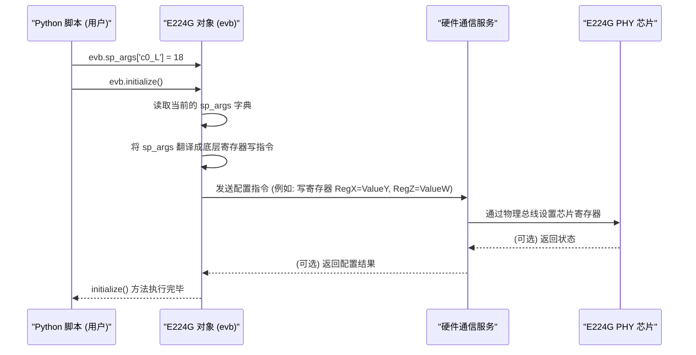

# Chapter 2: 设备参数配置


你好！欢迎来到 T4 教程的第二章。

在上一章 [E224G 设备控制器](01_e224g_设备控制器_.md) 中，我们学习了如何获取与 E224G 芯片沟通的“遥控器”——`E224G` 控制器对象 (`evb`)，并用 `evb.initialize()` 对芯片进行了基本初始化。这就像我们拿到了电视遥控器，并按下了电源键让电视进入了默认状态。

但是，如果我们想看特定的频道（比如体育频道），或者调整电视的亮度、对比度呢？默认设置往往不能满足我们所有的需求。同样地，在使用 E224G 芯片进行具体任务（如特定标准的通信测试）之前，我们也需要对其进行更详细的配置。

本章，我们就来学习如何像调整电视参数一样，精确地配置 E224G 芯片的各种工作参数。

## 为什么要配置设备参数？

想象一下，你要用一个高级的科学仪器（比如 E224G 芯片）做一项精确的测量实验。为了确保实验结果准确可靠，你必须：

1.  **设定实验条件:** 比如，你是在测试高速公路上的汽车（高速通信标准），还是在测试城市街道上的自行车（低速标准）？你需要选择正确的“场景”或“模式”。
2.  **微调仪器设置:** 就像调整显微镜的焦距或示波器的电压范围一样，芯片内部有很多精密的电路（如均衡器、放大器），需要根据具体情况进行微调，以达到最佳性能。

**设备参数配置** 就是完成这两项工作的过程。我们需要告诉 E224G 芯片：
*   它应该按照哪种**通信标准**（工作模式）来运行。
*   它内部的各种**电路参数**应该设置成什么值。

只有正确配置了这些参数，芯片才能在我们期望的条件下稳定工作，并为后续的测试（比如 [误码率 (BER) 测量](03_误码率__ber__测量_.md)）做好准备。

## 核心概念：工作模式与参数清单

配置 E224G 芯片主要涉及两个核心概念：设置工作模式（通信标准）和调整详细参数（通过 `sp_args`）。

### 1. 工作模式 (通信标准 `standard_L`)

E224G 芯片支持多种通信标准，比如 `50GBASE-KR`, `100GBASE-KR`, `200GBASE-KR` 等。这些标准定义了数据传输的速率、编码方式等关键特性。选择哪个标准，就决定了芯片的基本工作方式。

这就像选择收音机的频道，不同的频道（标准）对应不同的广播内容和信号特性。

### 2. 参数清单 (`evb.sp_args`)

除了选择大的工作模式外，芯片内部还有很多可以微调的参数。例如：

*   **均衡器 (Equalizer) 设置:** 补偿信号在传输过程中的损失和变形。
*   **增益 (Gain) 控制:** 调整信号的放大强度。
*   **其他高级设置:** 如预编码器 (`precoder`)、时钟数据恢复 (`cdr`) 相关参数等。

这些参数非常多，为了方便管理，`E224G` 控制器将它们集合在一个叫做 `sp_args` 的特殊“清单”里。`sp_args` 是 `evb` 对象的一个属性，它本身是一个 Python **字典 (dictionary)**。

你可以把 `sp_args` 想象成一个非常详细的**设备设置菜单或参数配置表**。字典中的每一项都是一个“设置项”，包含一个参数名（键 Key）和一个参数值（值 Value）。

例如，`sp_args` 可能包含如下项目：
*   `'standard_L'`: `'200GBASE-KR'` (设置工作模式为 200GBASE-KR)
*   `'c0_L'`: `16` (设置某个均衡器参数)
*   `'ctle_boost_L'`: `0` (设置另一个电路参数)
*   ... 还有很多很多其他参数

我们通过修改这个 `sp_args` 字典中的值，来告诉 `evb` 控制器我们想要的具体配置。

### 3. 应用配置 (`evb.initialize()`)

设置好工作模式和 `sp_args` 里的参数后，这些还只是我们写在“清单”上的计划。为了让这些设置真正在芯片上生效，我们需要执行一个动作——调用 `evb.initialize()` 方法。

这个 `initialize` 方法在第一章已经见过，但现在我们理解更深了：它不仅仅是“打开电源”，更重要的是**读取当前的 `sp_args` 配置，并将这些设置应用到 E224G 芯片硬件上**。

所以，配置的基本流程是：
1.  获取 `evb` 控制器。
2.  修改 `evb.sp_args` 字典，设定所需的工作模式和详细参数。
3.  调用 `evb.initialize()`，将配置写入芯片。

## 如何进行参数配置？

下面我们通过一个具体的例子，来看看如何配置 E224G 芯片以 `200GBASE-KR` 标准运行，并进行一些微调。

**1. 获取控制器并查看默认参数**

首先，像第一章那样，我们创建 `E224G` 对象。然后，我们可以直接打印 `evb.sp_args` 来看看当前的默认配置是什么。

```python
# 导入 E224G 类
from serdes_python_api.e224g.e224g import E224G

# 创建控制器实例
evb = E224G(port=7878)
print("成功创建 E224G 控制器对象。")

# 查看当前的 sp_args (参数清单)
# 注意：输出会很长，这里只显示部分内容
print("当前的 sp_args 配置 (部分):")
# 为了简洁，我们只打印部分感兴趣的参数
print(f"  standard_L: {evb.sp_args.get('standard_L', '未设置')}")
print(f"  c0_L: {evb.sp_args.get('c0_L', '未设置')}")
print(f"  ctle_boost_L: {evb.sp_args.get('ctle_boost_L', '未设置')}")
# 实际 evb.sp_args 包含非常多的参数
# print(evb.sp_args) # 如果想看全部，可以取消这行注释，但输出会很长
```

**代码解释:**
*   我们首先创建了 `evb` 对象。
*   `evb.sp_args` 是一个字典，存储了所有的配置参数。
*   我们使用 `.get()` 方法来安全地获取字典中的值，如果某个键不存在，它会返回 '未设置'，避免出错。
*   刚创建 `evb` 对象时，`sp_args` 会有一些库预设的默认值。

**预期输出 (示例):**
```
成功创建 E224G 控制器对象。
当前的 sp_args 配置 (部分):
  standard_L: 200GBASE-KR  # 假设默认是 200G
  c0_L: 16                # 假设默认是 16
  ctle_boost_L: 0           # 假设默认是 0
```
*(注意：实际的默认值可能根据库的版本和内部设置有所不同)*

**2. 修改参数**

假设我们想确保工作模式是 `200GBASE-KR`，并且想尝试将 `c0_L` 参数从默认值（比如 16）修改为 `18`，同时将 `ctle_boost_L` 修改为 `2`。

我们可以像操作普通 Python 字典一样修改 `evb.sp_args`：

```python
# (接上文代码)

print("\n准备修改 sp_args...")

# 方法一：直接修改字典中的键值对
evb.sp_args['standard_L'] = '200GBASE-KR' # 明确设置为 200G 标准
evb.sp_args['c0_L'] = 18                  # 修改均衡器参数 c0
evb.sp_args['ctle_boost_L'] = 2           # 修改 CTLE boost 参数

# 再次查看修改后的值
print("修改后的 sp_args 配置 (部分):")
print(f"  standard_L: {evb.sp_args.get('standard_L', '未设置')}")
print(f"  c0_L: {evb.sp_args.get('c0_L', '未设置')}")
print(f"  ctle_boost_L: {evb.sp_args.get('ctle_boost_L', '未设置')}")
```

**代码解释:**
*   `evb.sp_args['参数名'] = 新的值`：这就是修改字典中特定项的标准 Python 语法。我们直接给 `'standard_L'`, `'c0_L'` 和 `'ctle_boost_L'` 赋予了新的值。
*   我们再次打印这些值，确认它们已经被更新在 `sp_args` 字典中了。

**预期输出 (示例):**
```
准备修改 sp_args...
修改后的 sp_args 配置 (部分):
  standard_L: 200GBASE-KR
  c0_L: 18
  ctle_boost_L: 2
```

**方法二 (更简洁): 使用字典更新**

如果你需要一次性更新多个参数，可以使用字典的 `update` 方法或者 `|` (合并) 操作符（Python 3.9+），这通常更简洁。代码示例 `ber_measurement.py` 中就使用了 `|` 操作符。

```python
# (假设 evb 和 默认 sp_args 已存在)

print("\n使用字典合并方式修改 sp_args...")

# 定义一个包含我们要修改的参数的字典
updates = {
    "standard_L": "200GBASE-KR",
    "c0_L": 18,
    "ctle_boost_L": 2
    # 可以添加更多需要修改的参数...
}

# 使用 | 操作符合并更新 (会创建一个新的字典，推荐)
# 或者使用 evb.sp_args.update(updates) (会原地修改)
evb.sp_args = evb.sp_args | updates

# 再次查看修改后的值
print("合并更新后的 sp_args 配置 (部分):")
print(f"  standard_L: {evb.sp_args.get('standard_L', '未设置')}")
print(f"  c0_L: {evb.sp_args.get('c0_L', '未设置')}")
print(f"  ctle_boost_L: {evb.sp_args.get('ctle_boost_L', '未设置')}")
```

**代码解释:**
*   我们先创建了一个小的 `updates` 字典，里面只包含我们想要改变的参数和它们的新值。
*   `evb.sp_args = evb.sp_args | updates` (或 `evb.sp_args.update(updates)`) 将 `updates` 字典中的内容合并到 `evb.sp_args` 中。如果 `updates` 中的键已经存在于 `evb.sp_args`，它的值会被更新；如果不存在，则会被添加进去。

这种方法特别适合当你有多个参数需要设置或覆盖默认值时。

**3. 应用配置到芯片**

现在 `sp_args` 字典已经包含了我们想要的配置。最后一步，调用 `evb.initialize()` 将这些配置应用到 E224G 芯片。

```python
# (接上文代码，假设 sp_args 已按需修改)

print("\n正在将配置应用到 E224G 芯片...")
# 调用 initialize，此时它会读取更新后的 sp_args 并配置硬件
evb.initialize()
print("芯片配置完成！现在它已按照 standard_L='200GBASE-KR', c0_L=18, ctle_boost_L=2 等设置运行。")
```

**代码解释:**
*   `evb.initialize()` 是关键。它触发了配置过程。控制器会读取 `evb.sp_args` 中的所有设置，并将它们转换成对芯片硬件的底层操作指令。
*   执行完毕后，芯片就进入了我们指定的配置状态。

**会发生什么？**
调用 `evb.initialize()` 后，你不会直接在 Python 中看到数值输出。但是，后台会发生一系列动作：`evb` 对象通过网络端口与硬件接口服务通信，后者再通过物理连接向 E224G 芯片发送一系列指令，设置芯片内部的寄存器，使其符合 `sp_args` 中定义的参数。芯片现在已经准备好按照这个新配置进行工作了。

## 幕后发生了什么？

当我们修改 `sp_args` 并调用 `initialize` 时，背后发生了什么？让我们简化一下这个过程：

1.  **用户修改 `sp_args`:** 你的 Python 脚本更新了 `evb` 对象内部的 `sp_args` 字典。这只是在 Python 内存中修改数据。
2.  **调用 `initialize()`:** 这是触发信号。
3.  **`evb` 读取 `sp_args`:** `initialize` 方法首先会查看当前的 `sp_args` 字典。
4.  **翻译配置:** 控制器内部逻辑会将 `sp_args` 中的高级参数（如 `'standard_L': '200GBASE-KR'`, `'c0_L': 18`）翻译成一系列具体的、低级的硬件寄存器地址和要写入的值。例如，`'standard_L': '200GBASE-KR'` 可能对应着需要设置芯片内部好几个不同的寄存器。
5.  **发送指令:** 这些翻译好的底层指令通过网络连接（我们在创建 `evb` 时指定的端口）发送给后台运行的“硬件接口服务”。
6.  **硬件操作:** 硬件接口服务接收指令，并通过物理总线（如 USB, PCIe 等）将这些指令发送给 E224G 芯片，写入相应的寄存器。
7.  **芯片生效:** E224G 芯片接收到这些寄存器写操作后，其内部电路状态发生改变，进入由 `sp_args` 定义的新工作状态。

下面是一个简化的流程图：



这个过程展示了 `E224G` 控制器如何将我们方便易懂的 Python 字典配置 (`sp_args`) 转化为实际的硬件操作。

**代码参考:**
在 `ber_measurement.py` 示例脚本中，你可以看到实际使用 `sp_args` 的例子：

```python
# --- 参考自 ber_measurement.py (简化) ---

# ... (创建 evb 对象) ...

# 设置一系列默认/基础参数，使用字典合并
evb.sp_args = evb.sp_args | {
    "cm4_L": 0,
    "cm3_L": 0,
    # ... (省略了许多参数) ...
    "c0_L": 16, # 设置 c0_L
    # ...
    "adapt_mode_L": "pr",
    "dfe_thres_distort_L": 1
}

# 循环测试不同的标准
standard_list = ['200GBASE-KR'] # 假设只测试这一个
for standard_to_test in standard_list:
    lane = 1 # 假设使用通道 1
    # 设置当前循环要测试的标准
    evb.sp_args['standard_L'] = standard_to_test

    # 应用所有配置 (包括 standard_L 和上面合并的参数)
    evb.initialize()
    print('芯片初始化完成，配置已应用。')

    # ... (后续可以进行 BER 测量等操作) ...
# --- 文件结束 ---
```

这个例子清晰地展示了先定义/修改 `sp_args`，然后调用 `initialize` 来应用配置的模式。`initialize` 方法内部会负责处理所有必要的底层通信和寄存器设置。

## 总结

在本章中，我们深入了解了如何配置 E224G 芯片的参数。我们学习了：

*   配置参数的重要性：确保芯片按预期工作，为后续测试做准备。
*   两个核心概念：
    *   **工作模式 (标准):** 通过 `sp_args['standard_L']` 设置。
    *   **参数清单 (`sp_args`):** 一个 Python 字典，包含所有详细的内部电路参数。
*   配置流程：修改 `evb.sp_args` 字典，然后调用 `evb.initialize()` 将配置应用到硬件。
*   如何查看和修改 `sp_args` 中的参数。
*   `initialize()` 的作用：读取 `sp_args` 并执行硬件配置。
*   配置过程的幕后步骤：翻译、通信、硬件写入。

现在，我们不仅拥有了控制芯片的“遥控器” (`evb`)，还学会了如何使用这个遥控器上的“设置菜单” (`sp_args`) 和“应用按钮” (`initialize`) 来精确调整芯片的状态。

我们的芯片已经按照要求配置好了，接下来该做什么呢？当然是让它干活了！

**下一章预告:** 在 [第 3 章：误码率 (BER) 测量](03_误码率__ber__测量_.md) 中，我们将学习如何利用配置好的 E224G 芯片，来进行一项非常重要的性能测试——误码率测量。

---

Generated by [AI Codebase Knowledge Builder](https://github.com/The-Pocket/Tutorial-Codebase-Knowledge)