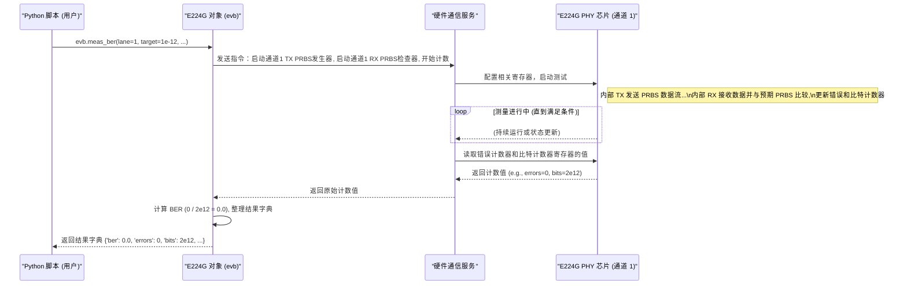

# Chapter 3: 误码率 (BER) 测量


你好！欢迎回到 T4 教程。

在上一章 [第 2 章：设备参数配置](02_设备参数配置_.md) 中，我们学习了如何像配置高级仪器一样，通过 `evb.sp_args` 和 `evb.initialize()` 来精确设置 E224G 芯片的工作模式和内部参数。我们的芯片现在已经按照我们的要求准备就绪了。

那么，配置好了之后，我们最想知道的事情之一就是：在这个配置下，芯片的通信质量到底怎么样？数据传输的可靠性高不高？这就好比我们调试好了一台收音机，现在想听听它的接收效果是否清晰，有没有很多噪音。

本章，我们将学习如何进行一项关键的性能测试——**误码率 (Bit Error Rate, BER) 测量**，来量化评估 E224G 芯片的通信质量。

## 什么是误码率 (BER)？为什么需要测量它？

想象一下你在用电话线和朋友聊天。如果线路质量很好，你说的每一句话（每一个比特），朋友都能清晰地听到。但如果线路质量不好，中间可能会有干扰，导致朋友听到的内容和你说的有些不一样（有些比特出错了）。

**误码率 (BER)** 就是衡量这种“出错程度”的指标。它表示在传输的总数据比特中，有多少比特在传输过程中发生了错误。

**BER = (出错的比特数) / (传输的总比特数)**

*   **BER 很低** (例如 1e-12，表示每传输 1 万亿个比特才出错 1 个)，意味着通信质量非常好，数据传输非常可靠。
*   **BER 很高** (例如 1e-3，表示每传输 1000 个比特就出错 1 个)，意味着通信质量很差，数据传输不可靠。

在高速数字通信（比如 E224G 芯片所做的）中，BER 是一个至关重要的性能指标。我们需要测量它来：
1.  **验证配置效果:** 确认我们在上一章所做的 [设备参数配置](02_设备参数配置_.md) 是否达到了预期的性能目标。
2.  **评估链路质量:** 判断当前的物理连接（比如芯片之间的电缆或电路板走线）是否足够好。
3.  **诊断问题:** 如果 BER 过高，提示我们需要检查配置、连接或者硬件本身是否存在问题。

幸运的是，`E224G` 控制器提供了一个非常方便的方法来执行这项测量：`evb.meas_ber`。

## 如何使用 `evb.meas_ber` 进行测量？

使用 `evb.meas_ber` 非常直接。在我们通过 `evb = E224G(...)` 获取了 [E224G 设备控制器](01_e224g_设备控制器_.md) 对象 `evb`，并且使用 `evb.initialize()` 应用了所需的 [设备参数配置](02_设备参数配置_.md) 之后，我们就可以调用 `meas_ber` 方法了。

这个方法就像是按下遥控器上的“通话质量测试”按钮。

**基本用法:**

```python
# --- 假设之前的代码已经执行 ---
# from serdes_python_api.e224g.e224g import E224G
# evb = E224G(port=7878)
# # 配置 sp_args... (例如设置 standard_L 等)
# evb.sp_args['standard_L'] = '200GBASE-KR' # 举例
# evb.initialize() # 应用配置
# print("芯片已配置完成，准备开始 BER 测量...")
# --- 接上文 ---

# 指定要测试的通道 (lane)
lane_to_test = 1 # 假设我们测试通道 1

# 调用 meas_ber 方法开始测量
print(f"正在对通道 {lane_to_test} 进行 BER 测量...")
# target=1e-12 表示我们希望测量到 BER 低于 1e-12 为止，或者达到一定的测量时间/比特数
# num_reads=2 表示进行两次独立的测量读数，以提高结果稳定性
# block='pr' (通常由 evb.sp_args['pg_source'] 提供) 指定使用内部的 PRBS 码型发生器/检查器
ber_results = evb.meas_ber(lane=lane_to_test, num_reads=2, target=1e-12, block=evb.sp_args.get('pg_source', 'pr'))

# 打印测量结果
print("\nBER 测量完成！结果如下：")
print(ber_results)
```

**代码解释:**

1.  `lane_to_test = 1`: 我们需要告诉 `meas_ber` 我们想测试 E224G 芯片上的哪个通信通道（lane）。芯片通常有多个独立的通道。
2.  `evb.meas_ber(...)`: 这是执行 BER 测量的核心调用。
    *   `lane=lane_to_test`: 指定要测量的通道号。
    *   `num_reads=2`: 进行多次测量读数可以获得更可靠的平均结果。这里设置为 2 次。
    *   `target=1e-12`: 设定一个目标 BER 值。测量会持续进行，直到收集到足够的数据来判断 BER 是否低于这个目标值，或者达到了内部设定的最大测量时间/比特数。设置一个较低的 `target`（如 1e-12 或更低）通常需要更长的测量时间。如果设为 0，可能会测量更长时间以达到极低的 BER 水平。
    *   `block=evb.sp_args.get('pg_source', 'pr')`: 这个参数指定了进行 BER 测试时使用的数据源和检查器。通常，我们会使用芯片内部自带的 **伪随机二进制序列 (Pseudo-Random Binary Sequence, PRBS)** 发生器 (`pg_source`) 和对应的检查器 (`pr`)。PRBS 是一种看起来随机但实际上是确定性重复的比特序列，非常适合用来测试通信链路。我们从 `evb.sp_args` 中获取之前可能配置好的 `pg_source` 值，如果没设置，则默认为 `'pr'`。
3.  `ber_results = ...`: `meas_ber` 方法会返回一个 Python 字典，包含了详细的测量结果。
4.  `print(ber_results)`: 我们将这个结果字典打印出来查看。

**预期输出 (示例):**

```
芯片已配置完成，准备开始 BER 测量...
正在对通道 1 进行 BER 测量...

BER 测量完成！结果如下：
{'ber_list': [0.0], 'errors_list': [0.0], 'bits_list': [2000000000000.0], 'ber': 0.0, 'errors': 0.0, 'bits': 2000000000000.0, 'time': 10.5, 'target_met': True}
```

**(注意：实际输出的数值会根据你的硬件、配置和测量时间而变化)**

**输出结果字典解释:**

*   `'ber_list'`: 一个列表，包含每次读数（`num_reads`次）计算得到的 BER 值。
*   `'errors_list'`: 包含每次读数检测到的错误比特数。
*   `'bits_list'`: 包含每次读数传输的总比特数。
*   `'ber'`: 最终（通常是最后一次或综合的）计算出的 BER 值。在这个例子中是 0.0，表示在测量的比特范围内没有发现错误。
*   `'errors'`: 最终的总错误比特数。
*   `'bits'`: 最终的总传输比特数。
*   `'time'`: 测量所花费的大约时间（秒）。
*   `'target_met'`: 一个布尔值，表示最终的 BER 是否达到了我们设定的 `target` 值 (True 表示达到或优于目标)。

这个结果告诉我们，在这次测试中，通道 1 在传输了大约 2 万亿比特后，没有发现任何错误，达到了低于 1e-12 的目标 BER，通信质量非常好。

## 幕后发生了什么？

当我们调用 `evb.meas_ber(lane=1, ...)` 时，背后发生了一系列协调动作：

1.  **指令生成:** 你的 Python 脚本调用 `evb.meas_ber` 方法。`E224G` 控制器对象 (`evb`) 将这个高级请求（“测量通道 1 的 BER”）翻译成具体的底层硬件指令。
2.  **指令发送:** 这些指令通过网络端口发送给后台的硬件接口服务。
3.  **硬件配置与执行:** 硬件接口服务通过物理连接（如 USB/PCIe）向 E224G 芯片发送指令，让芯片执行以下操作：
    *   在指定通道 (`lane=1`) 的**发送端 (TX)** 启动内部的 PRBS 码型发生器，开始发送测试数据流。
    *   在同一通道的**接收端 (RX)** 启动内部的 PRBS 码型检查器。这个检查器知道预期的 PRBS 码型应该是什么样的。
    *   接收端将接收到的数据与预期的 PRBS 码型进行实时比较。
    *   芯片内部的计数器开始记录传输的总比特数和检测到的错误比特数。
    *   这个过程会持续运行一段时间，时间长短取决于 `target` BER、实际链路质量以及内部超时设置。
4.  **结果读取:** 测量达到条件（如时间、比特数或错误数阈值）后，硬件接口服务从芯片的相应寄存器中读取最终的错误计数器值和总比特计数器值。
5.  **结果返回:** 这些原始计数值被发送回 `E224G` 控制器对象 (`evb`)。
6.  **结果处理与打包:** `evb` 对象根据读取到的错误数和比特数计算出 BER 值 (BER = errors / bits)，并将所有相关信息（BER、错误数、比特数、时间、是否达标等）整理成一个字典。
7.  **返回给用户:** 这个包含结果的字典最终被 `meas_ber` 方法返回给你的 Python 脚本。

下面是一个简化的流程图，展示了这个过程：



这个流程展示了 `evb.meas_ber` 如何协调芯片内部的测试功能，并最终将易于理解的测量结果呈现给我们。

## 代码中的体现

在 `ber_measurement.py` 示例脚本中，你可以看到 `meas_ber` 的实际应用：

```python
# --- 参考自 ber_measurement.py (简化) ---

# ... (导入 E224G, 创建 evb 对象) ...
# ... (设置 evb.sp_args, 包括 'standard_L', 'pg_source' 等) ...

standard_list = ['200GBASE-KR'] # 假设只测试这个标准
target_ber = 1e-12              # 设定目标 BER

for standard_to_test in standard_list:
    lane = 1 # 测试通道 1
    evb.sp_args['standard_L'] = standard_to_test # 设置标准
    evb.initialize() # 应用配置
    print('芯片初始化完成，配置已应用。')
    
    # 进行 BER 测量
    # 使用之前 sp_args 中配置的 pg_source 作为 block 参数
    ber_results = evb.meas_ber(lane, num_reads=2, target=target_ber, block=evb.sp_args['pg_source']) 
    
    # 打印结果
    print(f"标准 {standard_to_test}, 通道 {lane} 的 BER 结果:")
    print(ber_results)
    
    # ... (后续可能还有 SRAM 捕获等操作) ...

print('所有测试完成。')
# --- 文件结束 ---
```

这段代码清晰地展示了典型的流程：
1.  设置参数 (`sp_args`)。
2.  应用配置 (`initialize`)。
3.  **执行测量 (`meas_ber`)**。
4.  处理结果。

`evb.meas_ber` 方法本身封装了与硬件通信的所有细节，我们只需要调用它并提供必要的参数即可。

## 总结

在本章中，我们学习了：

*   **什么是误码率 (BER):** 衡量数字通信可靠性的关键指标，表示错误比特的比例。
*   **为什么测量 BER:** 验证配置、评估链路质量、诊断问题。
*   **如何测量 BER:** 使用 `evb.meas_ber(lane, num_reads, target, block)` 方法。
*   **`meas_ber` 的参数:** `lane` (通道), `num_reads` (读数次数), `target` (目标 BER), `block` (测试码型源)。
*   **结果解读:** `meas_ber` 返回一个包含详细测量结果（BER 值、错误数、比特数、时间等）的字典。
*   **幕后过程:** `meas_ber` 会协调芯片内部的 PRBS 发生器和检查器，进行数据收发、比较和计数，最后计算并返回结果。

现在，我们不仅能配置 E224G 芯片 ([设备参数配置](02_设备参数配置_.md))，还能定量地测量它在特定配置下的通信性能了！这是评估和调试高速链路非常重要的一步。

测量完 BER，有时我们可能还想更深入地了解信号内部的情况，比如看看信号波形或者判决器采样到的数据是什么样的。这就需要用到芯片内部的存储器（SRAM）来捕获这些数据了。

**下一章预告:** 在 [第 4 章：SRAM 数据捕获](04_sram_数据捕获_.md) 中，我们将学习如何从 E224G 芯片内部的 SRAM 中捕获和读取数据，以进行更深入的分析。

---

Generated by [AI Codebase Knowledge Builder](https://github.com/The-Pocket/Tutorial-Codebase-Knowledge)