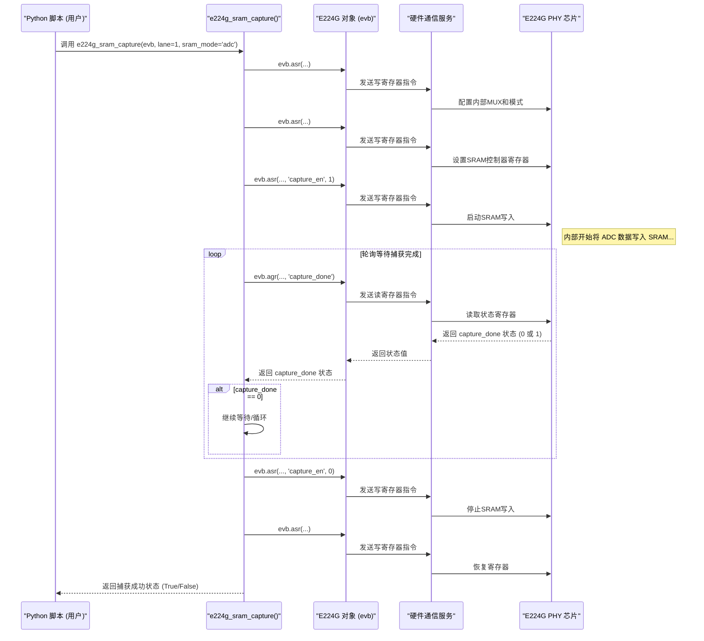

# Chapter 4: SRAM 数据捕获


你好！欢迎来到 T4 教程的第四章。

在上一章 [第 3 章：误码率 (BER) 测量](03_误码率__ber__测量_.md) 中，我们学习了如何使用 `evb.meas_ber` 方法来评估 E224G 芯片在特定配置下的通信性能。我们得到了一个量化的指标 (BER) 来判断数据传输的可靠性。

但是，有时仅仅知道 BER 的数值是不够的。比如，当 BER 结果不理想时，我们可能想知道：“究竟是哪里出了问题？” 或者，即使 BER 很好，我们也可能想更深入地了解芯片内部信号的具体形态，比如看看模数转换器 (ADC) 看到的原始信号是什么样子的，或者判决反馈均衡器 (DFE) 是如何处理数据的。

这时，我们就需要一种方法来“窥视”芯片内部的高速世界。想象一下，芯片内部的信号就像高速飞驰的赛车，肉眼很难看清细节。我们需要一台“高速摄像机”，能够在极短的时间内拍下一张“照片”，然后我们就可以慢慢分析这张照片了。

本章将介绍的 **SRAM 数据捕获** 就是这台“高速摄像机”。我们将学习如何利用芯片内部的 SRAM（静态随机存取存储器）来捕获这些高速信号的快照，以便进行后续的调试和分析。

## 什么是 SRAM 数据捕获？

**SRAM (Static Random-Access Memory)** 是一种高速的存储器，通常集成在芯片内部。由于它的速度非常快，可以用来临时存储芯片在高速运行时产生的内部信号数据。

**SRAM 数据捕获** 就是利用这块内部 SRAM，抓取某一时刻芯片内部特定节点的信号数据快照的过程。这些信号可以是：

*   **ADC (模数转换器) 输出:** 模拟信号经过转换后得到的原始数字样本。
*   **DFE (判决反馈均衡器) 数据:** 均衡器处理过程中的内部数据。
*   **其他调试信号:** 芯片设计者预留的其他可观测的内部信号。

**为什么需要 SRAM 捕获？**

*   **深入调试:** 当 BER 测试失败或性能不佳时，查看 ADC 或 DFE 的数据可以帮助我们诊断问题是出在信号接收端的前端（如信号完整性问题）还是后端的处理环节（如均衡器参数设置不当）。
*   **信号分析:** 即使 BER 良好，捕获的数据也可以用来分析信号质量、眼图张开度、均衡器的收敛情况等，帮助我们优化芯片配置。
*   **算法验证:** 可以用来验证芯片内部运行的信号处理算法（如 DFE 算法）是否符合预期。

在我们的 `T4` 项目和配套的 Python 库中，`ber_measurement.py` 脚本里提供了一个名为 `e224g_sram_capture` 的辅助函数，它封装了配置和触发 SRAM 捕获的底层操作。

**高速摄像机类比:**

*   **芯片内部高速信号:** 正在高速运动的物体（比如飞行中的子弹）。
*   **SRAM:** 高速摄像机的感光元件（可以瞬间记录图像）。
*   **SRAM 数据捕获过程:** 按下快门，拍摄一张照片。
*   **捕获到的数据:** 定格的照片。
*   **后续分析:** 慢慢回放、放大照片，研究子弹的姿态、速度等细节。

## 如何进行 SRAM 数据捕获？

进行 SRAM 数据捕获通常涉及三个主要步骤：

1.  **触发捕获:** 配置芯片，选择要捕获的信号源，然后启动捕获过程，将数据写入 SRAM。
2.  **读取数据:** 将存储在芯片内部 SRAM 中的数据读出到我们的 Python 环境中。
3.  **转换与解析:** 原始的 SRAM 数据通常是二进制格式，需要根据捕获的信号类型（如 ADC、DFE）进行转换和解析，才能变成我们容易理解和分析的形式（比如数值列表或波形图）。

`ber_measurement.py` 示例脚本中演示了这三个步骤。我们先重点关注第一步：**触发捕获**，这是由 `e224g_sram_capture` 函数完成的。

**使用 `e224g_sram_capture` 触发捕获**

假设我们已经按照 [第 1 章：E224G 设备控制器](01_e224g_设备控制器_.md) 创建了 `evb` 对象，并按照 [第 2 章：设备参数配置](02_设备参数配置_.md) 对芯片进行了初始化。现在，我们想捕获通道 1 的 ADC 输出数据。

```python
# --- 假设之前的代码已经执行 ---
# from serdes_python_api.e224g.e224g import E224G
# from ber_measurement import e224g_sram_capture # 假设函数在这个文件里

# evb = E224G(port=7878)
# # 配置 sp_args...
# evb.sp_args['standard_L'] = '200GBASE-KR'
# evb.initialize()
# print("芯片已配置完成。")
# # 可能还进行了 BER 测量...
# # ber_results = evb.meas_ber(1, target=1e-12, block='pr')
# # print(ber_results)
# --- 接上文 ---

# 指定要捕获的通道和模式
lane_to_capture = 1
sram_mode_str = 'adc'  # 指定捕获 ADC 数据 (其他选项如 'edfe_pack', 'cdr_ffe.ffe')

print(f"准备在通道 {lane_to_capture} 捕获 SRAM 数据，模式: {sram_mode_str}...")

# 调用函数触发 SRAM 捕获
# 这个函数来自 ber_measurement.py 脚本
capture_success = e224g_sram_capture(evb=evb, lane=lane_to_capture, sram_mode=sram_mode_str)

# 检查捕获是否成功启动并完成
if capture_success:
    print("SRAM 数据捕获触发成功并完成！数据已在芯片内部 SRAM 中。")
else:
    print("SRAM 数据捕获失败！")

# --- 后续步骤：读取和转换数据 ---
# (这部分代码也在 ber_measurement.py 中，这里为了聚焦捕获，暂时简化)
if capture_success:
    print("正在从 SRAM 读取数据...")
    # 读取原始数据 (通常返回一个包含内存内容的列表或类似结构)
    mem_in = evb.eval("e224g_sram_read()") # 调用底层函数读取

    print("正在转换 SRAM 数据...")
    # 将原始数据发送给后端进行转换
    request = {
        'operation': 'function',
        'function_name': 'e224g_sram_convert', # 后端转换函数
        'param_names': ['mem_in', 'capture_string'],
        'params': [mem_in, sram_mode_str]
    }
    sram_out = evb.talk(request) # 使用 talk 发送请求

    print("SRAM 数据读取和转换完成。")
    # sram_out 现在包含了可分析的数据 (例如一个数值列表)
    # print(sram_out) # 可以取消注释查看转换后的数据结构
```

**代码解释:**

1.  `lane_to_capture = 1`: 指定我们关心的是哪个通道的数据。
2.  `sram_mode_str = 'adc'`: 这个字符串是关键参数，它告诉 `e224g_sram_capture` 函数我们想要捕获哪种类型的内部信号。
    *   `'adc'`: 捕获 ADC（模数转换器）的输出样本。
    *   `'edfe_pack'`: 捕获 DFE（判决反馈均衡器）处理过程中的打包数据。
    *   `'cdr_ffe.ffe'`: 捕获与时钟数据恢复 (CDR) 或前馈均衡 (FFE) 相关的数据。
    *   这个模式会决定函数内部如何配置芯片的调试信号路由。
3.  `capture_success = e224g_sram_capture(...)`: 调用这个函数来执行捕获操作。它需要 `evb` 控制器对象、通道号和捕获模式作为输入。
4.  **函数内部做了什么？** `e224g_sram_capture` 函数会执行一系列底层的寄存器写操作（我们将在 [第 5 章：寄存器访问 (ASR/AGR)](05_寄存器访问__asr_agr__.md) 学习这些操作），来配置芯片：
    *   选择正确的内部信号源（基于 `sram_mode`）。
    *   将选定的信号路由到 SRAM 写入端口。
    *   配置 SRAM 控制器（比如从哪个地址开始写，写多少数据）。
    *   发出一个“开始捕获”的命令。
    *   等待芯片内部状态表明捕获已完成。
    *   做一些清理工作（比如关闭捕获使能）。
5.  **返回值 `capture_success`:** 这个函数通常返回一个布尔值 (`True` 或 `False`)，表示捕获过程是否成功完成。`True` 意味着数据已经成功写入 SRAM。
6.  **后续步骤 (读取与转换):**
    *   `evb.eval("e224g_sram_read()")`: 捕获完成后，数据还在芯片的 SRAM 里。我们需要调用另一个底层函数（通过 `evb.eval`，我们将在 [第 6 章：远程命令执行 (Talk/Eval)](06_远程命令执行__talk_eval__.md) 学习 `eval`）来把这些数据读出来。`mem_in` 会包含原始的、未处理的内存数据。
    *   `evb.talk(...)`: 读出的原始数据 `mem_in` 通常不易直接理解。我们需要调用另一个在后端（硬件接口服务侧）定义的函数 `e224g_sram_convert`，将原始数据根据 `sram_mode_str` 转换成更有意义的格式（比如一个 Python 列表，里面的数值代表 ADC 样本值）。我们使用 `evb.talk`（也将在 [第 6 章](06_远程命令执行__talk_eval__.md) 学习）来调用这个远程函数。
    *   `sram_out`: 包含了最终转换好的数据，可以用于绘图、计算或其他分析。

这个例子展示了从触发捕获到获取可分析数据的完整流程，而 `e224g_sram_capture` 函数负责其中最关键的第一步——让芯片把数据存入 SRAM。

## 幕后发生了什么？(`e224g_sram_capture` 内部)

当我们调用 `e224g_sram_capture(evb, lane=1, sram_mode='adc')` 时，这个 Python 函数内部会与 `evb` 对象交互，执行一系列底层操作。让我们看看简化版的步骤：

1.  **模式转换:** 函数首先将输入的 `sram_mode` 字符串 (如 `'adc'`) 转换成芯片能理解的内部代码（一个整数值，比如 `sram_mode_int = 0`）。
2.  **配置数据源:** 通过调用 `evb.asr` (将在 [第 5 章](05_寄存器访问__asr_agr__.md) 学习，意为“写寄存器”)，函数设置芯片内部的“开关”（寄存器），将指定通道 (`lane=1`) 的 ADC 输出信号连接到 SRAM 的输入路径上。它还会设置 `DEBUG_MODE` 寄存器，使用上一步得到的 `sram_mode_int`。
3.  **配置 SRAM 控制器:** 再次使用 `evb.asr`，配置芯片上一个专门负责 SRAM 读写的控制器 (TC - Test Controller)。设置捕获的起始地址 (`SRAM_START_ADDR`) 和结束地址 (`END_OF_CAP_ADDR`)，这决定了要捕获多少数据。
4.  **选择通道和源:** 告诉 SRAM 控制器，数据来自哪个通道 (`DBG_DATA_LN_SEL_I`) 和哪个内部源 (`DBG_DATA_SRC_SEL_I`)。
5.  **触发捕获:** 通过 `evb.asr` 设置 `capture_en` 寄存器位为 1，启动捕获过程。芯片硬件开始将选定的信号数据写入 SRAM。
6.  **等待完成:** 芯片需要一些时间来写满指定的 SRAM 空间。函数会进入一个循环，反复读取 (`evb.agr` - 将在 [第 5 章](05_寄存器访问__asr_agr__.md) 学习，意为“读寄存器”) 一个状态寄存器 (`capture_done`)，看捕获是否完成。这个过程称为“轮询 (Polling)”。
7.  **结束与清理:** 一旦检测到 `capture_done` 变为 1，函数就通过 `evb.asr` 将 `capture_en` 重新设置为 0，停止捕获。然后，它可能会恢复一些之前修改过的寄存器设置，以确保芯片回到正常工作状态。
8.  **返回状态:** 函数最后返回一个值（比如 `capture_done` 的最终状态），告诉调用者捕获是否成功。

下面是一个简化的序列图，展示了这个交互过程：



这个图展示了 `e224g_sram_capture` 函数如何通过一系列与 `evb` 对象的交互（主要是 `asr` 写寄存器和 `agr` 读寄存器），来指挥芯片完成数据捕获任务。

**深入代码 (`ber_measurement.py` 中的 `e224g_sram_capture`)**

让我们看一下 `ber_measurement.py` 中 `e224g_sram_capture` 函数的简化片段，看看上面描述的步骤是如何在代码中实现的：

```python
# --- 来自 ber_measurement.py (简化版) ---
def e224g_sram_capture(evb: E224G, lane: int, sram_mode: str) -> bool:
    
    lane_str = str(lane) # 通道号转字符串，用于构建寄存器名

    # 1. 模式转换: 将字符串模式映射到整数值
    sram_settings = {'adc': 0, 'edfe_pack': 10, 'cdr_ffe.ffe': 6}
    sram_mode_int = sram_settings[sram_mode]

    # 2. 配置数据源: 设置与 IP 相关的寄存器
    #    使用 evb.asr 来写入寄存器 (我们将在第 5 章详细学习 asr)
    #    这里设置了调试模式，选择了捕获模式对应的整数值
    evb.asr(pid=evb.ipid, reg_name= 'RX' + lane_str + '.DFT_10.DEBUG_MODE', value=sram_mode_int)
    #    (省略了其他一些相关的寄存器设置)

    # 3. 配置 SRAM 控制器 (TC - Test Controller):
    total_rows = 2048 # 假设 SRAM 有 2048 行
    evb.asr(pid=evb.tpid, reg_name= 'TC.SRAM_START_ADDR.SRAM_START_ADDR', value=0) # 起始地址
    evb.asr(pid=evb.tpid, reg_name= 'TC.END_OF_CAP_ADDR.END_OF_CAP_ADDR', value=total_rows-1) # 结束地址

    # 4. 选择通道和源 (也是 TC 的一部分)
    evb.asr(pid=evb.tpid, reg_name= 'TC.DBG_DATA.DBG_DATA_LN_SEL_I', value=lane) # 选择通道
    #    (省略了源选择，可能默认或由其他设置决定)

    # 5. 触发捕获: 使能 TC 的捕获功能
    evb.asr(pid=evb.tpid, reg_name= 'TC.CAPTURE_CFG_0.capture_en', value=1) # 启动！

    # 6. 等待完成: 轮询 capture_done 状态寄存器
    done = 0
    read_iter = 0
    while done == 0 and read_iter < 100: # 轮询最多 100 次
        # 使用 evb.agr 读取寄存器 (我们将在第 5 章详细学习 agr)
        done = evb.agr(pid=evb.tpid, reg_name= 'TC.CAPTURE_STATUS.capture_done', num_reads=1)
        read_iter += 1
        # (实际应用中可能需要加入短暂延时)

    # 7. 结束与清理: 捕获完成或超时后，关闭捕获使能
    evb.asr(pid=evb.tpid, reg_name= 'TC.CAPTURE_CFG_0.capture_en', value=0) # 停止

    #    恢复一些之前修改的寄存器设置 (例如 DEBUG_MODE)
    evb.asr(pid=evb.ipid, reg_name = 'RX' + lane_str + '.DFT_10.DEBUG_MODE', value=15) # 恢复到某个默认值
    #    (省略了其他恢复步骤)
        
    print('TC Capture Status = ', done) # 打印最终的完成状态

    # 8. 返回状态: 如果 done 为 1，表示成功
    return (done == 1)

# --- 函数结束 ---
```

**代码解释:**

*   这个函数大量使用了 `evb.asr` (写寄存器) 和 `evb.agr` (读寄存器)。这些是与芯片硬件交互的底层方法，我们将在下一章 [第 5 章：寄存器访问 (ASR/AGR)](05_寄存器访问__asr_agr__.md) 中详细学习它们。现在，你只需要知道它们是用来读写芯片内部设置的工具。
*   `pid=evb.ipid` 或 `pid=evb.tpid`: 这些参数指定了要访问的芯片内部模块（IP block 或 Test Controller）。
*   `reg_name=...`: 指定了要读写的具体寄存器的名称。这些名称通常由芯片设计者定义。
*   `value=...`: 在写入 (`asr`) 时，指定要写入的值。
*   代码的结构清晰地对应了我们之前描述的步骤：设置模式、配置源、配置控制器、触发、轮询、清理。
*   这个函数很好地封装了复杂的底层细节，提供了一个相对简单的接口来执行 SRAM 捕获。

通过这个函数，我们就可以像按动高速摄像机快门一样，轻松地抓取芯片内部的信号快照了。

## 总结

在本章中，我们探讨了 SRAM 数据捕获的概念及其重要性：

*   **是什么:** 利用芯片内部的高速 SRAM 存储器，捕获特定内部信号（如 ADC, DFE 数据）的瞬时快照。
*   **为什么:** 用于深入调试、信号分析和算法验证，帮助我们理解芯片内部工作状态。
*   **如何做 (三步):**
    1.  **触发捕获:** 使用 `e224g_sram_capture(evb, lane, sram_mode)` 函数配置并启动捕获。
    2.  **读取数据:** 使用类似 `evb.eval("e224g_sram_read()")` 的命令将数据从 SRAM 读出。
    3.  **转换解析:** 使用类似 `evb.talk(...)` 调用后端函数 `e224g_sram_convert` 将原始数据转换为可用格式。
*   **`e224g_sram_capture` 的作用:** 封装了配置信号路由、设置 SRAM 控制器、触发捕获、等待完成等一系列底层寄存器操作。
*   **底层依赖:** SRAM 捕获功能严重依赖于底层的寄存器读写操作 (`asr` 和 `agr`)。

现在，我们不仅能够配置芯片 ([第 2 章](02_设备参数配置_.md))、测量其性能 ([第 3 章](03_误码率__ber__测量_.md))，还能“拍照”记录其内部信号状态了！

SRAM 捕获功能本身是通过直接读写芯片的寄存器来实现的。如果你想更精细地控制芯片，或者访问 SRAM 捕获功能未覆盖的内部状态，就需要了解如何直接进行寄存器访问。

**下一章预告:** 在 [第 5 章：寄存器访问 (ASR/AGR)](05_寄存器访问__asr_agr__.md) 中，我们将揭开 `evb.asr` 和 `evb.agr` 的神秘面纱，学习如何直接读取和写入 E224G 芯片的寄存器，实现对芯片最底层的控制。

---

Generated by [AI Codebase Knowledge Builder](https://github.com/The-Pocket/Tutorial-Codebase-Knowledge)