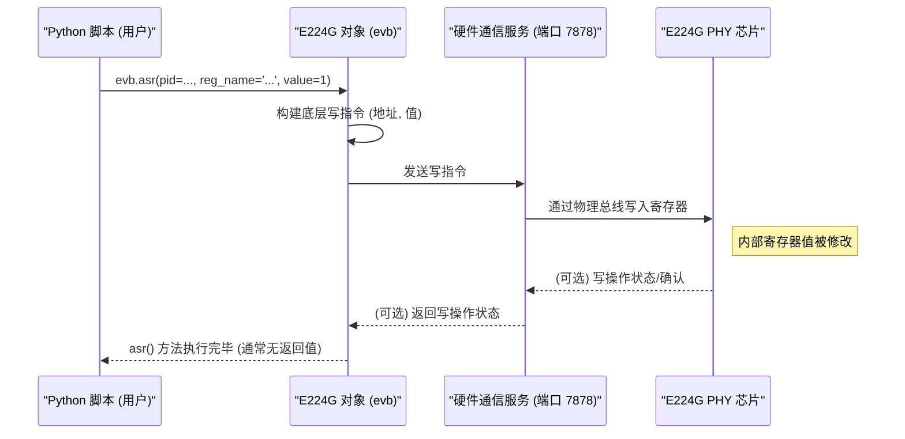
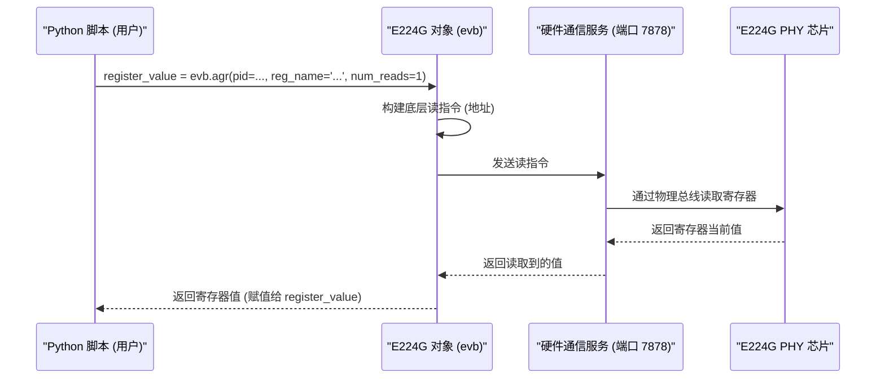

# Chapter 5: 寄存器访问 (ASR/AGR)


你好！在上一章 [第 4 章：SRAM 数据捕获](04_sram_数据捕获_.md) 中，我们学习了如何像使用高速摄像机一样，通过 `e224g_sram_capture` 函数抓取 E224G 芯片内部信号的快照。我们还提到，这个捕获功能在底层实际上依赖于直接读写芯片的“寄存器”。

那么，如果我们想进行比 SRAM 捕获更精细的操作，或者想要读取/修改芯片的某个非常具体的状态或设置，而这个设置并没有被封装在像 `evb.initialize()` 或 `evb.meas_ber` 这样高级的函数里，该怎么办呢？

这就好比我们不仅想用电视遥控器的预设按钮（如“频道+”、“音量-”），还想打开电视机的后盖，直接调整内部电路板上的某个微调电位器或者读取某个指示灯的状态。

本章，我们将学习如何进行这种最底层的硬件交互：**寄存器访问**。我们将了解 `evb.asr` 和 `evb.agr` 这两个核心方法，它们允许我们直接写入（设置）和读取（获取）E224G 芯片内部的寄存器。

## 什么是寄存器？为什么需要直接访问它们？

想象一下 E224G 芯片是一台极其复杂的机器，比如一架飞机的驾驶舱。驾驶舱里布满了各种各样的**开关 (Switches)**、**按钮 (Buttons)**、**旋钮 (Knobs)** 和**仪表盘 (Dials/Gauges)**。

*   **开关/按钮/旋钮** 用来控制飞机的各种功能（比如打开引擎、放下起落架、调整油门）。
*   **仪表盘** 用来显示飞机的当前状态（比如速度、高度、油量）。

**寄存器 (Register)** 就好比是 E224G 芯片内部的这些开关和仪表盘。它们是芯片硬件电路中的一小块存储区域，每个寄存器都有一个特定的地址（就像每个开关和仪表盘在驾驶舱里都有一个固定的位置和标签）。

*   **写寄存器 (Write Register):** 就像去**拨动一个开关**或**旋转一个旋钮**。我们通过写入一个特定的值到寄存器地址，来改变芯片的某个内部设置或触发某个动作。
*   **读寄存器 (Read Register):** 就像去**查看一个仪表盘上的读数**。我们通过读取一个寄存器的地址，来获取芯片当前的某个内部状态或配置值。

**为什么需要直接访问寄存器？**

虽然像 [设备参数配置](02_设备参数配置_.md) 中介绍的 `sp_args` 和 `initialize()` 方法，以及 [误码率 (BER) 测量](03_误码率__ber__测量_.md) 中的 `meas_ber` 方法，已经封装了很多常用的操作，但它们不可能覆盖芯片所有的功能和状态。有时候，我们可能需要：

1.  **精细调整:** 修改某个非常底层的参数（比如某个内部电路的偏置电压），这个参数可能没有包含在 `sp_args` 里。
2.  **读取特定状态:** 查看某个硬件模块的实时状态（例如，某个锁相环 PLL 是否锁定，某个内部 FIFO 是否溢出），这些状态可能没有通过高级函数暴露出来。
3.  **调试:** 在开发或调试过程中，直接读写寄存器是诊断硬件问题的最直接方式。
4.  **实现自定义功能:** 基于寄存器访问，构建自己特定的测试序列或控制逻辑。

`E224G` 控制器对象 `evb` 提供了两个核心方法来实现这种直接访问：
*   `evb.asr` (ASR = **A**ddress **S**et **R**egister)：写入（设置）一个寄存器。
*   `evb.agr` (AGR = **A**ddress **G**et **R**egister)：读取（获取）一个寄存器。

## 如何使用 `evb.asr` 和 `evb.agr`？

使用这两个方法非常直接，但需要我们对目标寄存器有一定的了解，比如它的名字（或地址）以及它所属的芯片内部模块。

### 1. `evb.asr`: 写入寄存器（拨动开关）

`asr` 方法用于向指定的寄存器写入一个值。它的基本用法如下：

```python
# --- 假设之前的代码已经执行 ---
# from serdes_python_api.e224g.e224g import E224G
# evb = E224G(port=7878) # 获取控制器对象 (来自第 1 章)
# print("控制器已创建。")
# --- 接上文 ---

# 假设我们要写入芯片内部模块 'tpid' (测试控制器) 的
# 一个名为 'TC.CAPTURE_CFG_0.capture_en' 的寄存器 (字段)，
# 将它的值设置为 1 (表示 '使能捕获')

module_id = evb.tpid  # 获取测试控制器模块的 ID (由 evb 对象提供)
register_name = 'TC.CAPTURE_CFG_0.capture_en' # 目标寄存器的名字
value_to_write = 1  # 要写入的值

print(f"准备向寄存器 {register_name} (在模块 {module_id} 中) 写入值 {value_to_write}...")

# 调用 asr 方法执行写入操作
evb.asr(pid=module_id, reg_name=register_name, value=value_to_write)

print("写入操作已发送。")
# 注意：asr 通常没有返回值，它只是将写命令发送出去。
```

**代码解释:**

1.  `module_id = evb.tpid`: E224G 芯片内部有很多功能模块（比如处理接收信号的 RX 模块、处理发送信号的 TX 模块、负责测试控制的 TC 模块等）。`pid` (Port ID 或 Process ID) 参数用来指定我们要访问哪个模块。`evb` 对象通常会存储这些模块的 ID，比如 `evb.tpid` 代表测试控制器模块。
2.  `register_name = 'TC.CAPTURE_CFG_0.capture_en'`: 这是目标寄存器的名称。这个名称通常由芯片设计文档提供，它精确地指向了我们要操作的那个“开关”。这里的名称看起来像一个路径，表示 TC 模块下的 CAPTURE\_CFG\_0 寄存器组里的 capture\_en 位或字段。
3.  `value_to_write = 1`: 我们要设置到寄存器里的值。这个值的含义取决于寄存器的具体定义（比如 1 代表使能，0 代表禁止）。
4.  `evb.asr(pid=module_id, reg_name=register_name, value=value_to_write)`: 调用 `asr` 方法，传入模块 ID、寄存器名和要写入的值。这个调用会触发 [E224G 设备控制器](01_e224g_设备控制器_.md) `evb` 将一个写命令发送给硬件。
5.  这个操作就像是我们找到了驾驶舱里标着 `TC.CAPTURE_CFG_0.capture_en` 的开关，然后把它拨到了 `1` 的位置。

**重要提示:** `asr` 通常用于改变芯片的状态或配置。随意写入未知的寄存器可能会导致芯片工作不正常，所以请确保你知道你要写的寄存器是什么，以及写入的值代表什么意义。这通常需要参考芯片的技术文档。

### 2. `evb.agr`: 读取寄存器（查看仪表盘）

`agr` 方法用于读取指定寄存器的当前值。它的基本用法如下：

```python
# --- 假设 evb 控制器已创建 ---
# evb = E224G(port=7878)
# --- 接上文 ---

# 假设我们要读取上面写入的那个寄存器 'TC.CAPTURE_CFG_0.capture_en' 的当前值
# 或者读取另一个状态寄存器，比如 'TC.CAPTURE_STATUS.capture_done' (表示捕获是否完成)

module_id = evb.tpid # 同样是测试控制器模块
register_to_read = 'TC.CAPTURE_STATUS.capture_done' # 目标寄存器名字

print(f"准备读取寄存器 {register_to_read} (在模块 {module_id} 中) 的值...")

# 调用 agr 方法执行读取操作
# num_reads=1 表示只读取一次
register_value = evb.agr(pid=module_id, reg_name=register_to_read, num_reads=1)

print(f"读取成功！寄存器 {register_to_read} 的当前值是: {register_value}")
```

**代码解释:**

1.  `module_id = evb.tpid` 和 `register_to_read = 'TC.CAPTURE_STATUS.capture_done'`: 与 `asr` 类似，我们需要指定要读取哪个模块的哪个寄存器。
2.  `num_reads=1`: 这个参数告诉 `agr` 我们需要读取多少次。对于大多数状态寄存器，读取一次就够了。在某些需要稳定读数的场景下（比如读取模拟传感器的值），可能会设置大于 1 的值，`agr` 会返回多次读取的平均值或最后一次读数（具体行为可能取决于库的实现）。
3.  `register_value = evb.agr(...)`: 调用 `agr` 方法。这个调用会触发 `evb` 向硬件发送一个读命令。
4.  **返回值:** `agr` 方法会**返回**从硬件读取到的寄存器值。我们将这个值存储在 `register_value` 变量中。
5.  这个操作就像是我们找到了驾驶舱里标着 `TC.CAPTURE_STATUS.capture_done` 的仪表盘，然后读取了它上面显示的数字。

**我们刚刚看到的代码眼熟吗？**

没错！在 [第 4 章：SRAM 数据捕获](04_sram_数据捕获_.md) 中，我们分析 `e224g_sram_capture` 函数的内部实现时，就看到了完全相同的 `evb.asr` 和 `evb.agr` 调用！

```python
# --- 回顾第 4 章的代码片段 (简化) ---
# 在 e224g_sram_capture 函数内部:

# 写入 capture_en 来启动捕获 (使用 ASR)
evb.asr(pid=evb.tpid, reg_name= 'TC.CAPTURE_CFG_0.capture_en', value=1)

# 循环读取 capture_done 状态 (使用 AGR)
done = 0
while done == 0:
    done = evb.agr(pid=evb.tpid, reg_name= 'TC.CAPTURE_STATUS.capture_done', num_reads=1)
    # ... 可能有延时或次数限制 ...

# 写入 capture_en 来停止捕获 (使用 ASR)
evb.asr(pid=evb.tpid, reg_name= 'TC.CAPTURE_CFG_0.capture_en', value=0)
# --- 代码片段结束 ---
```

这完美地展示了 `asr` 和 `agr` 是如何作为底层工具，被用来构建更高级的功能（如 SRAM 捕获）的。

## 幕后发生了什么？

当我们调用 `evb.asr(...)` 或 `evb.agr(...)` 时，背后发生了一系列精确的步骤，将我们的 Python 命令转化为对芯片硬件的实际操作：

1.  **Python 调用:** 你的脚本调用 `evb.asr(...)` 或 `evb.agr(...)`。
2.  **指令构建:** `E224G` 控制器对象 (`evb`) 接收到这个调用。它会将你提供的参数（模块 ID `pid`，寄存器名 `reg_name`，写入值 `value` (仅asr)）转换成一个底层硬件能理解的读或写指令。这可能涉及到将寄存器名翻译成具体的物理地址和要操作的位。
3.  **网络传输:** 这个构建好的底层指令通过网络连接（我们在 [第 1 章](01_e224g_设备控制器_.md) 创建 `evb` 时指定的端口，如 7878）发送给在后台运行的“硬件接口服务”。
4.  **硬件接口服务处理:** 这个服务程序接收到指令。它知道如何通过计算机与 E224G 芯片评估板之间的物理连接（例如 USB、PCIe 或专用的 JTAG/MDIO 接口）与芯片通信。
5.  **物理总线操作:** 硬件接口服务将指令通过物理总线发送给 E224G 芯片。
    *   对于 `asr` (写)：芯片内部的控制逻辑会找到对应 `pid` 和 `reg_name` 的寄存器，并将 `value` 写入其中。
    *   对于 `agr` (读)：芯片内部的控制逻辑会找到对应 `pid` 和 `reg_name` 的寄存器，读取其当前值。
6.  **响应 (仅 agr):** 对于 `agr` 操作，芯片会将读取到的值通过物理总线返回给硬件接口服务。
7.  **结果返回 (仅 agr):** 硬件接口服务将收到的值通过网络连接发送回给 `E224G` 控制器对象 (`evb`)。
8.  **返回给脚本 (仅 agr):** `evb` 对象接收到值，并将其作为 `agr` 方法的返回值，返回给你的 Python 脚本。

下面是用 Mermaid 序列图展示这个流程：

**ASR (写入寄存器) 流程:**



**AGR (读取寄存器) 流程:**



这些图清晰地展示了 `asr` 和 `agr` 是如何作为我们 Python 脚本与 E224G 芯片硬件之间进行底层数据交换的桥梁。

## 总结

在本章中，我们深入了解了 E224G 芯片的寄存器以及如何直接访问它们：

*   **寄存器是什么:** 芯片内部的“开关”和“仪表盘”，用于控制功能和反映状态。
*   **为什么直接访问:** 实现精细调整、读取特定状态、底层调试或构建自定义功能。
*   **核心方法:**
    *   `evb.asr(pid, reg_name, value)`: **写入**寄存器（设置值）。
    *   `evb.agr(pid, reg_name, num_reads)`: **读取**寄存器（获取值），并返回该值。
*   **参数:** `pid` (模块 ID), `reg_name` (寄存器名称), `value` (写入的值), `num_reads` (读取次数)。
*   **底层机制:** `asr` 和 `agr` 通过 `evb` 对象、网络通信、硬件接口服务和物理总线，最终实现对芯片寄存器的读写操作。
*   **应用:** 这些底层方法是构建更高级功能（如 [SRAM 数据捕获](04_sram_数据捕获_.md)）的基础。

掌握了 `asr` 和 `agr`，你就拥有了与 E224G 芯片进行最直接、最精细交互的能力。这就像是不仅会用遥控器，还能拿起螺丝刀和万用表，直接操作和测量设备内部的元器件了。

虽然 `asr` 和 `agr` 非常强大，但它们的操作粒度非常低（一次只读/写一个寄存器）。如果我们想执行一系列更复杂的、需要多步寄存器操作或者包含一些计算逻辑的任务，有没有更方便的方式呢？

**下一章预告:** 在 [第 6 章：远程命令执行 (Talk/Eval)](06_远程命令执行__talk_eval__.md) 中，我们将学习 `evb.talk` 和 `evb.eval` 这两个方法。它们允许我们在硬件接口服务那一侧执行更复杂的 Python 代码片段或预定义的函数，从而实现更灵活的远程控制和数据处理。

---

Generated by [AI Codebase Knowledge Builder](https://github.com/The-Pocket/Tutorial-Codebase-Knowledge)