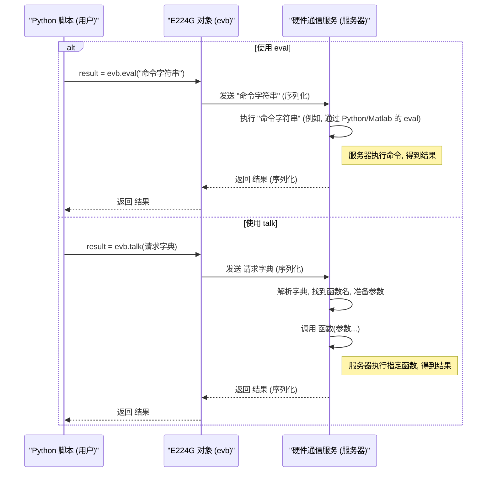

# Chapter 6: 远程命令执行 (Talk/Eval)


欢迎来到 T4 教程的最后一章！在上一章 [第 5 章：寄存器访问 (ASR/AGR)](05_寄存器访问__asr_agr__.md) 中，我们学习了如何使用 `evb.asr` 和 `evb.agr` 这两个底层方法来直接读写 E224G 芯片的寄存器，实现了对硬件最精细的控制。

我们了解到，`asr` 和 `agr` 就像是直接操作机器内部的开关和仪表盘，非常强大但也非常基础。每次调用只能执行一个简单的读或写操作。想象一下，如果我们需要执行一个稍微复杂点的任务，比如：读取三个不同的寄存器，然后根据这三个值计算出一个新的结果，再根据这个结果去设置第四个寄存器。如果只用 `asr` 和 `agr`，我们就需要在我们的 Python 脚本（客户端）和硬件接口服务（服务器）之间来回发送好几次命令和数据：读寄存器A -> 返回值 -> 读寄存器B -> 返回值 -> 读寄存器C -> 返回值 -> Python脚本计算 -> 写寄存器D -> 完成。这样不仅效率低，网络通信开销也大。

有没有一种方法，可以让我们把稍微复杂一点的指令或者一个预先定义好的操作流程，直接发送给“服务器”（硬件接口服务）去执行，然后只把最终结果返回给我们呢？这就好比我们不是一步步教厨师怎么切菜、怎么放调料，而是直接告诉他：“请做一份宫保鸡丁（一个预定义好的菜谱）”，或者给他一个简单的计算公式让他帮忙算一下。

本章，我们将学习 `E224G` 控制器提供的另外两种与硬件接口服务交互的方式：`evb.eval` 和 `evb.talk`。它们允许我们在“服务器”端执行命令或调用函数，从而实现更高效、更灵活的远程控制。

## 核心概念：Eval vs. Talk

`evb.eval` 和 `evb.talk` 都允许我们的 Python 脚本（客户端）请求远端的硬件接口服务（服务器）执行某些操作，但它们的侧重点和使用场景不同。

### 1. `evb.eval`: 执行简单的远程命令字符串

你可以把 `evb.eval` 想象成给服务器发送一条**简单的文本指令或表达式**，让服务器执行它，然后把执行结果（通常是一个简单的值）返回给你。

*   **类比:** 就像你在一个远程终端上输入一行简单的命令，比如 `print(2 + 2)` 或者 `get_status_flag()`，然后系统直接返回 `4` 或 `True`。
*   **用途:** `eval` 主要用于执行那些可以用**单个字符串**表示的简单操作，比如：
    *   执行一个服务器端已经定义好的、不需要复杂参数的简单函数（函数调用本身就是一个字符串）。
    *   读取服务器端某个全局变量的值。
    *   执行一个简单的计算表达式（如果服务器支持）。
*   **特点:** 输入是**命令字符串**，输出通常是**单个结果**。

### 2. `evb.talk`: 调用复杂的远程函数

`evb.talk` 则更像是调用一个在服务器端**预先定义好的、功能更完整的函数**。你可以向这个函数传递更复杂的参数（比如列表、字典），函数执行后也可以返回更复杂的结构化数据（比如字典或列表）。

*   **类比:** 就像你在餐厅点菜。菜单上有定义好的菜品（服务器端定义的函数），比如“鱼香肉丝”。你点这道菜（指定 `function_name`），还可以提要求，比如“少放点辣”（传递 `params`）。厨师（服务器）按照菜谱（函数实现）做好后，给你端上来一盘完整的菜（返回结构化的结果）。
*   **用途:** `talk` 主要用于执行那些逻辑比较复杂、需要传递多个参数、或者返回结构化数据的操作，这些操作通常被封装成了服务器端的一个特定函数。
*   **特点:** 输入是一个包含**函数名、参数名、参数值**等信息的**结构化请求（通常是字典）**，输出可以是**任意复杂的 Python 对象**（只要能被序列化传输）。

总结一下：

| 特性         | `evb.eval`                                  | `evb.talk`                                            |
| :----------- | :------------------------------------------ | :---------------------------------------------------- |
| **输入**     | 简单的命令**字符串**                        | 结构化的**字典**（包含函数名、参数等）                |
| **用途**     | 执行简单命令、调用无参数或简单参数的函数      | 调用复杂函数、传递复杂参数、获取结构化结果          |
| **服务器端** | 执行字符串（可能通过 `eval` 或类似机制实现） | 查找并执行预定义的函数                                |
| **类比**     | 远程计算器 / 简单命令行                     | 远程 API 调用 / 点菜                                  |

## 如何使用 `evb.eval` 和 `evb.talk`？

让我们通过具体的例子来看看如何使用这两个方法。

### 1. 使用 `evb.eval` 执行简单命令

假设硬件接口服务那边（可能是 Matlab 或 Python 环境）有一个预定义的函数 `e224g_sram_read()`，这个函数不需要参数，它的作用是从 E224G 芯片的 SRAM 中读取数据，并返回原始的内存内容。

在 [第 4 章：SRAM 数据捕获](04_sram_数据捕获_.md) 中，我们其实已经见过 `eval` 的应用：

```python
# --- 假设 evb 控制器已创建并完成 SRAM 捕获 ---
# evb = E224G(port=7878)
# ... (执行了 e224g_sram_capture) ...
# print("SRAM 数据已捕获到芯片内部。")
# --- 接上文 ---

# 我们想让服务器执行 "e224g_sram_read()" 这个函数调用
command_string = "e224g_sram_read()" 

print(f"准备通过 eval 让服务器执行: {command_string}")

# 使用 eval 发送命令字符串
# 服务器会执行这个函数调用，并将函数的返回值传回来
mem_in = evb.eval(command_string)

print("eval 执行完成！服务器返回了结果。")
# mem_in 现在包含了从 SRAM 读取的原始数据
# (数据格式取决于 e224g_sram_read() 函数的实现，可能是一个列表或其他)
# print(mem_in) # 可以取消注释看看大致内容
```

**代码解释:**

1.  `command_string = "e224g_sram_read()"`: 我们把想要在服务器端执行的操作写成一个字符串。这里是一个简单的函数调用。
2.  `mem_in = evb.eval(command_string)`: 调用 `evb.eval`，把这个字符串发送给服务器。
3.  服务器接收到字符串 `"e224g_sram_read()"` 后，会尝试执行它。如果服务器环境（比如 Matlab 或 Python）认识 `e224g_sram_read` 这个函数，就会调用它。
4.  `e224g_sram_read` 函数执行后会有一个返回值（这里是 SRAM 的原始数据），服务器将这个返回值通过网络传回给我们的 `evb` 对象。
5.  `eval` 方法将接收到的返回值赋给 `mem_in` 变量。

这个例子展示了 `eval` 如何简单直接地执行远程命令字符串并获取结果。

### 2. 使用 `evb.talk` 调用复杂函数

现在，我们拿到了 `mem_in`（SRAM 原始数据），但它可能是一堆不容易理解的二进制数字。假设服务器端还有一个预定义的函数 `e224g_sram_convert`，它需要两个参数：原始数据 (`mem_in`) 和捕获时的模式字符串 (比如 `'adc'`)，然后它会把原始数据转换成我们更容易分析的格式（比如一个包含实际 ADC 采样值的列表）。

这个场景就非常适合使用 `evb.talk` 了，因为我们需要传递参数，并且可能期望一个结构化的返回结果。同样地，我们在 [第 4 章：SRAM 数据捕获](04_sram_数据捕获_.md) 中也见过它的应用：

```python
# --- 假设 evb 控制器已创建，并且已经通过 eval 获取了 mem_in ---
# evb = E224G(port=7878)
# sram_mode_str = 'adc' # 捕获时使用的模式
# mem_in = evb.eval("e224g_sram_read()") 
# print("已获取 SRAM 原始数据 mem_in。")
# --- 接上文 ---

# 我们想调用服务器上的 'e224g_sram_convert' 函数
# 需要传递 mem_in 和 sram_mode_str 这两个参数

# 构建 talk 请求字典
request_dict = {
    'operation': 'function',                     # 表明我们要调用一个函数
    'function_name': 'e224g_sram_convert',       # 要调用的函数名
    'param_names': ['mem_in', 'capture_string'], # 函数需要的参数名列表 (顺序很重要)
    'params': [mem_in, sram_mode_str]            # 对应的参数值列表 (顺序要和名字对应)
}

print("准备通过 talk 调用服务器函数 e224g_sram_convert 并传递参数...")

# 使用 talk 发送请求字典
sram_out = evb.talk(request_dict)

print("talk 执行完成！服务器返回了处理后的结果。")
# sram_out 现在包含了转换后的、可供分析的 SRAM 数据
# (其结构取决于 e224g_sram_convert 的实现，比如可能是一个数值列表)
# print(sram_out) # 可以取消注释查看转换后的数据
```

**代码解释:**

1.  `request_dict = {...}`: 我们创建了一个 Python 字典来描述我们的请求。
    *   `'operation': 'function'`: 固定值，告诉服务器我们要执行一个函数调用操作。
    *   `'function_name': 'e224g_sram_convert'`: 指定服务器上哪个函数应该被调用。
    *   `'param_names': ['mem_in', 'capture_string']`: 一个列表，包含了目标函数所期望的参数名称。**服务器端的函数签名需要能匹配这些名称（或者至少按顺序对应）**。
    *   `'params': [mem_in, sram_mode_str]`: 一个列表，包含了要传递给函数的实际参数值。**这个列表中的值的顺序必须与 `param_names` 列表中的名称顺序严格对应！** 第一个值 (`mem_in`) 对应第一个名字 (`'mem_in'`)，第二个值 (`sram_mode_str`) 对应第二个名字 (`'capture_string'`)。
2.  `sram_out = evb.talk(request_dict)`: 调用 `evb.talk`，将这个结构化的请求字典发送给服务器。
3.  服务器接收到字典后，解析它：找到名为 `e224g_sram_convert` 的函数，然后将 `params` 列表中的值按顺序传递给这个函数（可能通过类似 `e224g_sram_convert(mem_in=mem_in, capture_string=sram_mode_str)` 或者 `e224g_sram_convert(params[0], params[1])` 的方式调用）。
4.  服务器上的 `e224g_sram_convert` 函数执行完毕，返回一个结果（这里是转换后的 SRAM 数据）。
5.  服务器将这个结果通过网络发送回 `evb` 对象。
6.  `talk` 方法将接收到的结果赋给 `sram_out` 变量。

这个例子展示了 `talk` 如何让我们能够调用远程服务器上更复杂的、带参数的函数，并获得可能很复杂的返回结果。

## 幕后发生了什么？

无论是 `eval` 还是 `talk`，其背后的基本流程都涉及到客户端（我们的 Python 脚本）与服务器（硬件接口服务）之间的网络通信。

1.  **Python 调用:** 你的脚本调用 `evb.eval("...")` 或 `evb.talk({...})`。
2.  **请求打包:** `E224G` 控制器对象 (`evb`) 将你的请求（命令字符串或请求字典）打包成可以通过网络传输的格式（通常是某种序列化的格式，如 JSON 或 Pickle）。
3.  **网络传输:** 打包好的请求通过网络连接（端口 7878）发送给硬件接口服务。
4.  **服务器接收与解析:** 硬件接口服务接收到网络数据，并将其反序列化，还原成命令字符串或请求字典。
5.  **服务器端执行:** 这是 `eval` 和 `talk` 的核心区别：
    *   **对于 `eval`:** 服务器尝试执行接收到的**字符串**。如果服务器是 Python 环境，可能直接使用内置的 `eval()` 函数；如果是 Matlab 环境，可能使用 Matlab 的 `eval()`。执行环境需要能够识别字符串中的函数或变量。
    *   **对于 `talk`:** 服务器解析请求**字典**。它查找 `function_name` 对应的函数，并使用 `params` 列表中的值作为参数来调用该函数。这通常涉及到服务器端的一个调度机制，将函数名映射到实际的函数对象。
6.  **获取结果:** 服务器执行完命令或函数后，得到一个结果。
7.  **结果打包与返回:** 服务器将结果打包（序列化）并通过网络连接发送回 `E224G` 控制器对象。
8.  **结果解析与返回:** `evb` 对象接收到网络数据，反序列化得到结果，并将其作为 `eval` 或 `talk` 方法的返回值，交给你的 Python 脚本。

下面是用 Mermaid 序列图展示这个流程：



这个图清晰地展示了 `eval` 和 `talk` 都依赖于客户端和服务器之间的请求-响应模式，主要区别在于请求的内容（字符串 vs 字典）以及服务器端如何处理这个请求（直接执行字符串 vs 查找并调用函数）。

## 代码中的体现

再次回顾 `ber_measurement.py` 脚本中 SRAM 处理的部分：

```python
# --- 参考自 ber_measurement.py (相关部分) ---

# ... (创建 evb, 设置参数, 初始化, 可能还有 BER 测量) ...

sram_mode_str = 'adc'; # 假设我们捕获 ADC 数据

# 步骤 1: 触发 SRAM 捕获 (内部使用 asr/agr)
e224g_sram_capture(evb=evb, lane=lane, sram_mode=sram_mode_str);

# 步骤 2: 使用 eval 读取原始数据
# 让服务器执行 e224g_sram_read() 函数
mem_in = evb.eval("e224g_sram_read()"); 

# 步骤 3: 使用 talk 转换数据
# 让服务器执行 e224g_sram_convert(mem_in, sram_mode_str)
request = {'operation': 'function',
            'function_name': 'e224g_sram_convert',
            'param_names': ['mem_in', 'capture_string'],
            'params': [mem_in, sram_mode_str]};
sram_out = evb.talk(request); # 调用 talk 发送请求

# sram_out 现在包含了可用的数据
print('SRAM 数据读取和转换完成。')
# --- 文件结束 ---
```

这个实际的代码片段完美地展示了 `eval` 和 `talk` 的典型应用场景：
*   `eval` 用于调用一个远程的、无参数或简单参数（可以包含在字符串里）的函数，并获取其返回值。
*   `talk` 用于调用一个远程的、需要传递更复杂参数（如 `mem_in` 这个可能很大的数据结构）的函数，并获取其处理后的结果。

通过结合使用 `eval` 和 `talk`，我们可以将一些计算密集型或需要访问服务器端特定资源的操作（如数据转换、调用 Matlab 特定函数等）放在服务器端执行，从而简化客户端代码，并可能减少网络传输的数据量。

## 总结

在本章中，我们学习了两种与硬件接口服务（服务器）进行更高级别交互的方法：

*   **`evb.eval(command_string)`:** 向服务器发送一个简单的命令**字符串**让其执行，并返回结果。适用于执行简单表达式或调用无参数/简单参数的远程函数。
*   **`evb.talk(request_dict)`:** 向服务器发送一个结构化的**字典**，请求调用服务器上预定义的函数，可以传递复杂的参数，并返回结构化的结果。适用于执行更复杂的、封装好的远程操作。
*   **为什么使用它们:** 可以将部分计算或处理逻辑移到服务器端执行，减少客户端与服务器之间的来回通信次数，提高效率，并能利用服务器端的特定能力（如调用 Matlab 函数）。
*   **与 `asr`/`agr` 的关系:** `asr`/`agr` ([寄存器访问 (ASR/AGR)](05_寄存器访问__asr_agr__.md)) 是非常底层的单步操作，而 `eval`/`talk` 允许我们在服务器端执行可能包含多步操作（甚至内部可能调用 `asr`/`agr`）的更复杂逻辑。

到此，我们已经完成了 T4 教程的所有章节。回顾一下我们的学习历程：
1.  我们认识了核心的 [E224G 设备控制器](01_e224g_设备控制器_.md) (`evb`)。
2.  学会了如何进行 [设备参数配置](02_设备参数配置_.md) (`sp_args`, `initialize`)。
3.  掌握了如何进行关键的 [误码率 (BER) 测量](03_误码率__ber__测量_.md) (`meas_ber`)。
4.  了解了如何进行 [SRAM 数据捕获](04_sram_数据捕获_.md) 来窥探芯片内部。
5.  深入学习了底层的 [寄存器访问 (ASR/AGR)](05_寄存器访问__asr_agr__.md)。
6.  最后，我们探索了更灵活的 [远程命令执行 (Talk/Eval)](06_远程命令执行__talk_eval__.md)。

你现在已经具备了使用 T4 项目提供的 Python API 与 E224G PHY 芯片进行交互的基础知识和技能。希望这个教程能帮助你开始你的项目！接下来，你可以尝试修改示例代码，探索不同的配置参数，或者查阅 API 文档来了解更多可用的功能。祝你在使用 T4 进行硬件测试和开发的旅程中一切顺利！

---

Generated by [AI Codebase Knowledge Builder](https://github.com/The-Pocket/Tutorial-Codebase-Knowledge)