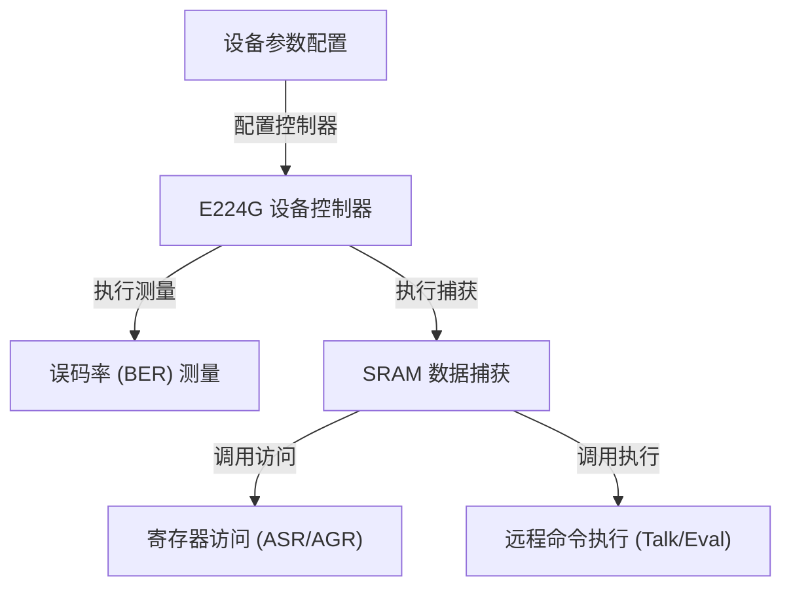

# Tutorial: T4

这个项目提供了一个 **Python 脚本**，用于控制和测试 *Synopsys E224G* 物理层 (PHY) 芯片。
脚本的核心是一个 **设备控制器 (`E224G` 对象)**，它封装了所有与硬件交互的操作。
用户可以通过这个控制器来 **配置设备参数**、**执行误码率 (BER) 测量**、**从芯片内部 SRAM 捕获数据**，以及进行底层的 **寄存器读写**。
它还支持通过网络与后端服务进行 **远程命令执行**，以实现更复杂的控制。

**Source Repository:** [None](None)

## Chapters

1. [E224G 设备控制器
](01_e224g_设备控制器_.md)
2. [设备参数配置
](02_设备参数配置_.md)
3. [误码率 (BER) 测量
](03_误码率__ber__测量_.md)
4. [SRAM 数据捕获
](04_sram_数据捕获_.md)
5. [寄存器访问 (ASR/AGR)
](05_寄存器访问__asr_agr__.md)
6. [远程命令执行 (Talk/Eval)
](06_远程命令执行__talk_eval__.md)

---

Generated by [AI Codebase Knowledge Builder](https://github.com/The-Pocket/Tutorial-Codebase-Knowledge)