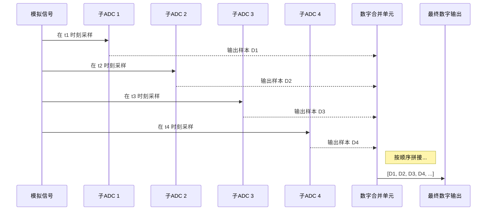

# Chapter 1: 时间交错 (Time-Interleaving)

欢迎来到V22高速模数转换器（ADC）项目的学习之旅！在本系列教程中，我们将一步步揭开尖端ADC设计的神秘面纱。这是我们的第一站，我们将从一个核心概念开始，它也是实现惊人速度的关键：**时间交错 (Time-Interleaving)**。

## 为什么我们需要时间交错？

想象一下未来的自动驾驶汽车，它需要通过雷达系统瞬间感知周围的一切；或者下一代无线通信（如6G），需要在眨眼间传输海量数据。这些应用都需要一个“超级英雄”——一个能够以极高速度捕捉现实世界模拟信号并将其转换为数字信号的设备。这个超级英雄就是**高速模数转换器 (ADC)**。

然而，单个ADC的转换速度总有其物理极限，就像一位短跑运动员的速度有上限一样。那么，我们如何才能突破这个极限，实现比如每秒采样上百亿次（GS/s, Giga-Samples per Second）的惊人速度呢？

答案并非是制造一个无限快的“超级运动员”，而是组建一个高效的“接力团队”。这，就是时间交错技术的精髓。

## 核心思想：超市收银台的比喻

为了理解这个概念，我们先来看一个生活中的例子：超市结账。

- **单个ADC**：想象一个只有一个收银台的超市。即使收银员手速再快，当顾客排起长队时，结账效率依然有限。这就是单个ADC，它的采样速度（结账速度）是固定的。
- **时间交错ADC**：现在，想象超市开设了4个收银台。收银员们（子ADC）不需要成为世界冠军，他们只需以正常速度工作。但他们通过一种巧妙的协调方式，轮流为顾客结账。第一个顾客去1号台，第二个去2号台，以此类推。虽然每个收银台的速度没变，但整个超市处理顾客（信号采样）的总效率却提升了4倍！

时间交错技术正是采用了这种“分而治之”的策略。它**通过并行使用多个速度较慢的ADC（我们称之为“子ADC”），让它们在不同的时间点交替对输入信号进行采样，然后将它们的输出结果组合起来，从而实现远超单个ADC能力的整体采样率**。

## 时间交错ADC如何工作？

让我们深入一点，看看这个“接力团队”是如何运作的。假设我们的目标是构建一个总采样率为 `Fs` 的ADC，而我们手头只有4个采样率为 `Fs/4` 的子ADC。

工作流程如下：

1.  **信号输入**：一个连续变化的模拟信号（比如一段音乐的声波）进入ADC系统。
2.  **交错采样**：时钟系统会精确地发出指令，让4个子ADC在不同的时刻进行采样。
    - 在 `t1` 时刻，子ADC 1进行第一次采样。
    - 在 `t2` 时刻，子ADC 2进行第一次采样。
    - 在 `t3` 时刻，子ADC 3进行第一次采样。
    - 在 `t4` 时刻，子ADC 4进行第一次采样。
    - 在 `t5` 时刻，轮到子ADC 1进行第二次采样，以此类推。
3.  **结果合并**：最后，一个数字逻辑单元（就像一个“总调度员”）会将所有子ADC的采样结果按照正确的时间顺序（1, 2, 3, 4, 1, 2, ...）拼接起来，形成一个单一、高速的数字数据流。

我们可以用下面的图来直观地理解这个过程：

通过这种方式，4个速度为 `Fs/4` 的ADC成功地构建了一个速度为 `Fs` 的高速ADC系统。

## 在V22项目中的实践

现在，让我们看看这个概念是如何应用在我们的 `V22` 项目中的。这个项目旨在设计一个**12GS/s、12位、4路时间交错的流水线ADC**。

请看下面这张来自项目文档的顶层架构图：

---
*文件: V22 High Speed Analog-to-Digital Converters.pdf, 第6页*

---

这张图完美地诠释了我们刚刚讨论的内容：

- **4x-Time Interleaved (4路时间交错)**：这明确告诉我们，系统由4个子ADC并行工作组成。
- **Channel #A, #B, #C, #D (通道A, B, C, D)**：这四个通道就是我们的4个“收银台”，也就是4个子ADC。
- **3GS/s per Channel (每个通道3吉咖采样每秒)**：每个子ADC的采样速度是3GS/s。
- **Target: 12b 12GS/s (目标：12位 12吉咖采样每秒)**：通过将4个3GS/s的子ADC进行时间交错，我们最终实现了 `4 * 3GS/s = 12GS/s` 的总采样率！
- **VIN (输入电压)**：这是所有子ADC共同处理的模拟输入信号，就像排队等待结账的所有顾客。
- **DoutMUX (输出多路复用器)**：图中未明确画出，但最终来自四个通道的数据会被一个合并单元（MUX）组合，形成最终的12GS/s数字输出。

在后续章节中，我们会深入探讨每个通道内部的具体结构，例如它可能是一个[逐次逼近型ADC (SAR ADC)](03_逐次逼近型adc__sar_adc__.md)或者[流水线ADC (Pipelined ADC)](04_流水线adc__pipelined_adc__.md)。但目前，你只需要理解时间交错这个宏观层面的架构。

## 时间交错的挑战：“完美”团队的难题

回到我们的超市比喻。如果4个收银台组成的团队想完美协作，他们需要满足一些苛刻的条件：

1.  **时间必须精准**：如果2号收银员总是在轮到他时慢了半拍，那么顾客队伍的顺序就会被打乱。
2.  **标准必须统一**：如果1号收银台的秤称一公斤苹果是1.01公斤，而2号台的秤是0.99公斤，最终的销售记录就会不准确。
3.  **起点必须一致**：如果3号收银员的收银机在开始时就自带了1元的底金，那么他计算的所有账单都会多出1元。

在ADC世界里，这些问题同样存在，并且是时间交错技术面临的最大挑战，我们称之为**“不匹配误差” (Mismatch Errors)**。

- **时间偏斜 (Timing Skew)**：对应“时间不精准”。这是指子ADC的采样时钟没有严格等间隔地到达。即使是皮秒（万亿分之一秒）级别的偏差，在处理高频信号时也会导致严重的失真。如何修正这种微小的时钟差异，是[时间偏斜校准 (Timing-Skew Calibration)](06_时间偏斜校准__timing_skew_calibration__.md)的核心任务。

- **增益不匹配 (Gain Mismatch)**：对应“标准不统一”。它指的是不同的子ADC对同一个输入电压产生的数字输出值略有不同。

- **失调不匹配 (Offset Mismatch)**：对应“起点不一致”。它指的是即使输入电压为零，某些子ADC的输出也不是零，而有一个固定的偏差值。

下图展示了为了解决这些不匹配问题，工程师们所做的努力。例如，通过注入一个微弱的、随机的“抖动”信号（Dither），系统可以感知并校准这些误差。

---
*文件: V22 High Speed Analog-to-Digital Converters.pdf, 第7页*

---

我们不会在本章深入探讨校准的细节，但重要的是要认识到，虽然时间交错是一个强大的理念，但它的成功实现离不开一套复杂而精密的**校准技术**来确保所有“团队成员”的步调完全一致。

## 总结与展望

在本章中，我们学习了：

- **时间交错 (Time-Interleaving)** 是一种通过并行使用多个慢速子ADC来实现超高速采样的核心技术。
- 它就像开设多个超市收银台，通过轮流工作来提高整体效率。
- V22项目利用4个3GS/s的子ADC，交错实现了12GS/s的总采样率。
- 时间交错的主要挑战是子ADC之间的不匹配误差，如时间偏斜、增益不匹配和失调不匹配，这些都需要通过复杂的校准技术来解决。

时间交错技术解决了“如何并行采样”的问题。但在信号到达这些并行的子ADC之前，它首先需要经过一个重要的门户——输入缓冲器。这个缓冲器负责接收外部信号，并以稳定、纯净的方式将其分发给后面的所有子ADC。它就像是超市的入口，引导顾客平稳地进入各个收银通道。

在下一章，我们将探讨这个关键的前端模块：[输入缓冲器 (Input Buffer)](02_输入缓冲器__input_buffer__.md)。

---

Generated by [AI Codebase Knowledge Builder](https://github.com/The-Pocket/Tutorial-Codebase-Knowledge)