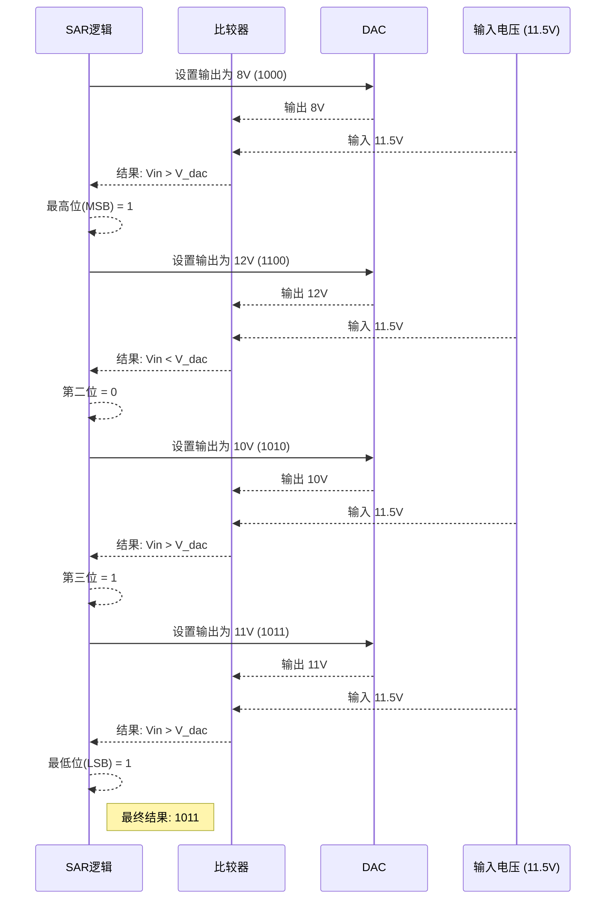
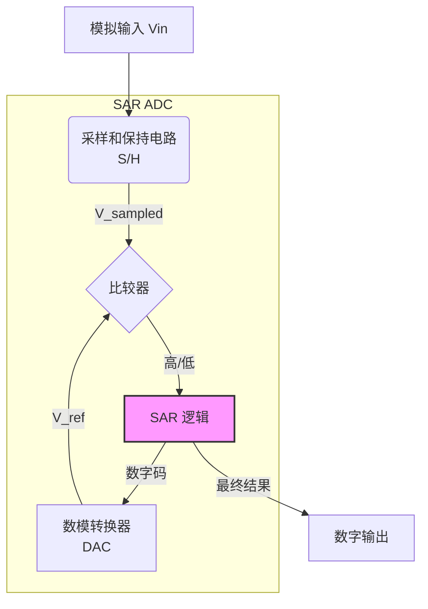

# Chapter 3: 逐次逼近型ADC (SAR ADC)

在[第2章：输入缓冲器](02_输入缓冲器__input_buffer__.md)中，我们成功地将一个纯净、强劲的模拟信号送到了每个子ADC通道的门口。现在，信号已经准备就绪，等待被“数字化”。

那么，在每个ADC通道内部，这个连续变化的模拟电压（比如 0.751V）究竟是如何被精确地转换成一个离散的数字码（比如 `1100`）的呢？实现这一魔法的架构有很多种，本章我们将学习其中一种最流行、最高效的架构：**逐次逼近型ADC (SAR ADC)**。

## “猜数字”的智慧

想象一下，你正在和一个朋友玩一个“猜数字”的游戏。朋友心里想了一个 1 到 16 之间的整数，而你的任务是猜出这个数字，并且希望用的次数越少越好。

一种笨办法是从 1 开始一个一个地问：“是1吗？是2吗？是3吗？”。这种方法虽然简单，但如果数字是16，你就得问16次，效率太低了。

一个更聪明的方法是**二分法**：
-   你问：“这个数比 8 大吗？”（16的一半）
-   朋友回答：“大。”
-   现在范围缩小到了 9 到 16。你继续在剩下范围的中间提问：“那比 12 大吗？”
-   朋友回答：“不大。”
-   范围又缩小到了 9 到 12。你再问：“比 10 大吗？”
-   朋友回答：“大。”
-   ...

通过这种方式，你每次提问都能将可能性排除一半，只需 4 次就能锁定任何 1 到 16 之间的数字。

**逐次逼近型ADC (SAR ADC) 的核心思想正是这个高效的“二分法猜数字游戏”**。它不会一点点地去试，而是通过一系列由粗到精的比较，逐位（bit by bit）地“猜出”输入电压最接近的数字码。

## 核心思想：天平称重的比喻

为了更具体地理解这个过程，我们来使用一个更经典的“天平称重”比喻。假设我们有一台精密的天平，一堆标准砝码（比如8g, 4g, 2g, 1g），以及一个未知重量的物体。我们的目标是精确测量出物体的重量。

SAR ADC 的工作流程就和这个称重过程一模一样：

| **天平称重** | **SAR ADC 组件** | **作用** |
| --- | --- | --- |
| 未知重量的物体 | **采样后的模拟电压 (Vin)** | 我们需要测量的“重量”。 |
| 一套从重到轻的砝码 | **数模转换器 (DAC)** | 它能根据数字指令，产生精确的参考电压“砝码”。 |
| 天平本身 | **比较器 (Comparator)** | 它只做一件事：判断哪一边更重，即 `Vin > V_dac` 还是 `Vin < V_dac`。 |
| 称重的人（你） | **SAR 逻辑控制器** | 整个过程的大脑，根据天平的结果决定下一步放哪个砝码。 |

现在，让我们用一个 4 位（能表示 0-15 的范围）的 SAR ADC 为例，看看它是如何将一个 `11.5V` 的模拟电压（假设参考电压 `Vref` 为 16V）转换成数字的。

**称重过程（转换过程）：**

1.  **第一次比较 (MSB - 最高有效位)**
    -   **称重**：SAR逻辑首先拿出最重的砝码，也就是 `Vref/2 = 8V` 的电压。它问比较器：“输入电压（11.5V）比 8V 大吗？”
    -   **结果**：比较器回答：“大”。
    -   **决策**：好，既然比 8V 大，那最高位（MSB）就是 **`1`**。这个 8V 的砝码我们就**保留**在天平上。

2.  **第二次比较**
    -   **称重**：SAR逻辑拿出第二重的砝码 `Vref/4 = 4V`，把它**加上**去。现在天平的一边是 `8V + 4V = 12V`。它再次问比较器：“输入电压（11.5V）比 12V 大吗？”
    -   **结果**：比较器回答：“不大”。
    -   **决策**：哦，太重了。那这一位就是 **`0`**。我们必须把这个 4V 的砝码**移走**。

3.  **第三次比较**
    -   **称重**：SAR逻辑拿出第三重的砝码 `Vref/8 = 2V`，把它加到当前保留的砝码上。现在天平的一边是 `8V + 2V = 10V`。它问：“输入电压（11.5V）比 10V 大吗？”
    -   **结果**：比较器回答：“大”。
    -   **决策**：好的，这一位是 **`1`**。我们**保留**这个 2V 的砝码。

4.  **第四次比较 (LSB - 最低有效位)**
    -   **称重**：SAR逻辑拿出最轻的砝码 `Vref/16 = 1V`，加上去。现在天平的一边是 `8V + 2V + 1V = 11V`。它问：“输入电压（11.5V）比 11V 大吗？”
    -   **结果**：比较器回答：“大”。
    -   **决策**：好的，最后一位是 **`1`**。我们**保留**这个 1V 的砝码。

**最终结果**：经过 4 次比较，我们得到的数字码是 **`1011`**，它对应十进制的 `8+0+2+1 = 11`。这非常接近我们的输入 `11.5V`，是这个 4 位系统能表示的最接近的值。

下面的时序图直观地展示了这个逐步逼近的过程：

## SAR ADC 的核心组件

现在我们已经理解了工作原理，让我们正式认识一下 SAR ADC 的四个核心组件。

1.  **采样和保持电路 (Sample and Hold, S/H)**：在称重之前，我们必须确保要测量的物体不会乱动。S/H 电路的作用就是在转换开始的一瞬间“冻结”模拟输入电压，提供一个稳定的 `V_sampled` 值，供后续的多次比较使用。
2.  **比较器 (Comparator)**：这是最简单的决策者。它不关心电压具体差多少，只输出一个二进制信号（“1”或“0”）来告诉 SAR 逻辑 `V_sampled` 是大于还是小于 DAC 提供的参考电压。
3.  **数模转换器 (DAC)**：这是产生标准“砝码”的地方。它接收来自 SAR 逻辑的数字码，并输出一个与之精确对应的模拟电压。在现代 SAR ADC 中，通常使用**电容型DAC (CDAC)**，因为它功耗低且易于在芯片上实现。
4.  **逐次逼近寄存器 (SAR Logic)**：这是指挥中心。它是一个状态机，负责产生用于 DAC 的测试码，读取比较器的结果，并根据结果更新测试码，最终逐位确定输出的数字。

## 在V22项目中的实践

SAR ADC 如此高效且紧凑，它在我们的 V22 项目中扮演了什么角色呢？

虽然 V22 项目的子 ADC 通道主体采用的是[流水线ADC (Pipelined ADC)](04_流水线adc__pipelined_adc__.md)架构（我们将在下一章详细介绍），但 SAR ADC 仍然在其中发挥了关键作用。

请看项目文档中关于单个 3GS/s 通道内部结构的图示：

---
*文件: V22 High Speed Analog-to-Digital Converters.pdf, 第38页*

---

在这张图中，我们可以清晰地看到，整个转换过程被分成了多个“级联”的阶段（STG1, STG2, ...）。请注意最右边的 **STG 5 (第5级)**，它被明确标注为 **`4b SAR`**。

这意味着，在经过前几级流水线处理后，剩下的“残余”电压信号被送到了一个 4 位的 SAR ADC 中进行最终的精细量化。

**为什么这么设计？**

这是一个典型的“混合架构”设计，旨在取长补短：
-   **流水线ADC**：速度快，能并行处理多个位，非常适合处理信号的“高位”（MSBs）。
-   **SAR ADC**：功耗低、面积小，非常适合处理信号的“低位”（LSBs），进行最后的精加工。

通过这种方式，V22 项目在实现 3GS/s 的通道速度的同时，也优化了功耗和芯片面积。

## SAR ADC 的优势与挑战

### 优势
*   **高能效**：SAR ADC 没有一直处于工作状态的放大器，主要功耗发生在比较器和DAC的开关瞬间。这使得它在能效方面表现非常出色。
*   **结构简单紧凑**：相比于需要大量比较器的闪存型（Flash）ADC，SAR ADC 的结构要简单得多，特别适合在先进的、寸土寸金的CMOS工艺下制造。
*   **无流水线延迟**：一旦 N 次比较完成，数字结果立刻可用，没有内部处理延迟。

### 挑战
*   **速度受限**：转换过程是串行的，一个 N 位的 ADC 至少需要 N 个时钟周期来完成一次转换。这是其速度的主要瓶颈。要达到 V22 项目所需的 Giga-Samples/s 级别，单纯的 SAR ADC 难以胜任，因此需要采用[时间交错](01_时间交错__time_interleaving__.md)或与其他架构（如流水线）结合的方式。
*   **对组件要求高**：ADC 的整体精度直接取决于 DAC 的线性度和比较器的速度与精度。任何一点偏差都会影响最终结果的准确性。

## 总结与展望

在本章中，我们学习了：

-   **SAR ADC** 的工作原理就像一个高效的“猜数字”游戏或“天平称重”过程，它使用**二分法**逐位确定输入电压对应的数字码。
-   它的核心组件包括**采样保持电路**、**比较器**、**DAC** 和 **SAR 逻辑控制器**。
-   SAR ADC 具有**高能效**和**结构紧凑**的优点，但其**速度受限于串行转换过程**。
-   在 V22 项目中，一个 4 位的 SAR ADC 被用作流水线 ADC 的最后阶段，负责进行精细量化，这是一种常见的混合设计策略。

我们已经了解了 SAR ADC 如何通过串行比较来实现高效转换。但是，当对速度的要求变得更高时，逐位比较就显得太慢了。我们需要一种能够像工厂流水线一样，同时处理多个步骤的架构。

在下一章，我们将深入探讨 V22 项目子 ADC 的主体架构，它正是为了解决速度问题而生的：[第4章: 流水线ADC (Pipelined ADC)](04_流水线adc__pipelined_adc__.md)。

---

Generated by [AI Codebase Knowledge Builder](https://github.com/The-Pocket/Tutorial-Codebase-Knowledge)