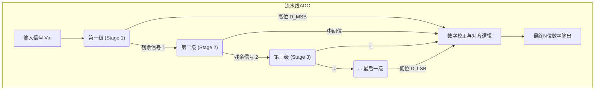

# Chapter 4: 流水线ADC (Pipelined ADC)


在[第3章：逐次逼近型ADC (SAR ADC)](03_逐次逼近型adc__sar_adc__.md)中，我们学习了SAR ADC如何像天平称重一样，通过串行的逐位比较来完成转换。这种方法能效很高，但它的速度受到了“一次只做一件事”的串行过程的限制。对于一个N位的转换，它至少需要N个步骤才能完成。当我们需要达到像V22项目所要求的每秒数十亿次采样（GS/s）的惊人速度时，这种方法就显得力不从心了。

如果说SAR ADC是一位精雕细琢的工匠，那么本章的主角——**流水线ADC (Pipelined ADC)**——就是一条高效的现代化生产线。

## 为什么需要流水线？

想象一条汽车装配线。
-   **工匠模式 (SAR ADC)**：一位全能工匠独立制造一辆汽车。他需要先安装底盘，再安装引擎，然后是车身、车门，最后喷漆。整个过程必须按部就班，造完一辆才能开始下一辆。
-   **流水线模式 (Pipelined ADC)**：一个庞大的工厂，分为多个工位。
    -   工位1：专门安装底盘。
    -   工位2：专门安装引擎。
    -   工位3：专门安装车身。
    -   ...

当第一辆车的底盘装好后，它立刻被送到工位2去装引擎。与此同时，工位1并没有闲着，它马上开始为第二辆车安装底盘。同理，当第一辆车在工位3装车身时，第二辆车在工位2装引擎，第三辆车则在工位1装底盘。

虽然制造一辆完整的汽车所需总时间（延迟）可能没变，甚至更长，但由于所有工位**同时**在为*不同*的汽车工作，**每隔很短的时间，就有一辆崭新的汽车从生产线的末端下线**。这个“下线速度”，即**吞吐率 (Throughput)**，得到了极大的提升。

流水线ADC正是借鉴了这种思想，通过将复杂的转换任务分解到多个协同工作的“工位”上，来实现无与伦比的转换速度。

## 核心思想：分工合作的转换流程

流水线ADC将一个N位的转换任务，分解成一系列连续的**阶段 (Stage)**。每个阶段只负责解析其中几位（比如2或3位），然后将剩下的“未完成的工作”打包，传递给下一个阶段。



这个流程的关键在于**并行处理**：
-   当**第一级**在处理第 `N` 个采样点时...
-   **第二级**可以同时在处理第 `N-1` 个采样点的“残余信号”。
-   **第三级**则在处理第 `N-2` 个采样点的“残余信号”，以此类推。

所有阶段都在满负荷工作，使得ADC的整体吞吐率只取决于最慢的那个阶段完成任务所需的时间，而不是所有阶段时间的总和。

### 单个阶段内部探秘

那么，每个“工位”（阶段）具体做了些什么呢？一个典型的流水线阶段包含以下几个部分，我们称之为**乘法DAC (Multiplying DAC, MDAC)** 结构：

```mermaid
graph TD
    subgraph 单个流水线阶段 (MDAC)
        Vin[输入 V_in] --> SH["采样保持<br>(S/H)"];
        SH --> SubADC["子ADC<br>(粗略估计)"];
        SH --> Subtractor["减法器 (-)"];
        SubADC -- "数字码 D_i" --> SubDAC["子DAC"];
        SubDAC -- "模拟电压 V_dac" --> Subtractor;
        Subtractor -- "残余电压 V_res" --> Gain["放大器<br>(增益 G)"];
        Gain -- "G * V_res" --> Vout["输出到下一级"];
        SubADC --> D_out_stage[本级数字输出 D_i];
    end

    style SubADC fill:#f9f,stroke:#333,stroke-width:2px
```

我们来逐步分解它的工作流程，假设这是一个解析2位的阶段，满量程电压为4V，放大器增益为4：
1.  **采样与保持 (Sample & Hold)**：首先，“冻结”当前时刻的输入电压。假设输入 `V_in` 为 **2.7V**。
2.  **粗略估计 (子ADC)**：一个低精度的**子ADC**（通常是速度极快的闪存型Flash ADC）对`2.7V`进行量化。在这个2位例子中，它会判断`2.7V`在哪一个区间，输出数字码 `10`（二进制的2）。这是本阶段产出的数字位。
3.  **模拟重建 (子DAC)**：一个**子DAC**将刚刚得到的数字码 `10` 转换回模拟电压，得到 `V_dac = 2.0V`。
4.  **计算残余 (减法器)**：用原始输入减去重建的电压，得到一个微小的“误差”或“残余”信号：`V_res = V_in - V_dac = 2.7V - 2.0V = 0.7V`。这个残余信号包含了当前阶段没能精确表示的所有信息。
5.  **放大残余 (放大器)**：为了让下一级能精确处理这个微小的残余信号，我们需要将其放大。放大器的增益 `G` 通常等于本阶段的解析位数所代表的基数（例如，2位就是`2^2=4`）。放大后的信号为：`V_out = V_res * G = 0.7V * 4 = 2.8V`。
6.  **传递 (Pass to Next Stage)**：将这个放大后的 `2.8V` 作为下一级的输入，同时将本阶段得到的数字码 `10` 送到最终的数字逻辑单元。

下一级会重复这个过程，对 `2.8V` 进行转换，得到另外几位数字码，并产生新的、更小的残余信号。最后，数字逻辑单元会将所有阶段产生的数字码（`10`，`...`）像拼图一样拼接并校正，形成最终的高精度输出。

## V22项目中的流水线ADC

现在，让我们看看这个强大的架构是如何在V22项目中大显身手的。V22的每个3GS/s子通道，其核心就是一个高性能的流水线ADC。

请看项目文档中关于单个通道内部结构的图示：

---
*文件: V22 High Speed Analog-to-Digital Converters.pdf, 第38页*
```
3GS/s 12b Channel

 S1  C1  A1  R1  S1 C1
 C2  A2  R2  A2  S2  R2
 C3  A3  R3  S3  S3  C3
 S4  C4  A4  R4  A4  R4
 S5 R5  C5 S5  C5         Sampling
Conversion                                   S
 C
 RAmplification
Reset                                    A

3b      Data Alignment     3b STG3
Pipe.
3b STG 4
Pipe.
4b STG 5
SAR         Vin CDAC ×4
ΦC1 ΦA1 STG1
3b CDAC
Flash×4
ΦC2ΦA2 STG2
Flash                 ΦR1 ΦR2
ΦS1,A ΦS2
DOUT
~100ps
```
---

这张图完美地展示了一个现代高速流水线ADC的设计精髓：
-   **级联结构**：整个12位的转换被分成了5个阶段（`STG1` 到 `STG5`）。
-   **每级解析位数**：
    -   前四级（`STG1`到`STG4`）都是`3b Pipe.`，即解析3位的流水线阶段。它们内部包含了一个3位的Flash子ADC和一个3位的子DAC。
    -   最后一级（`STG5`）是一个`4b SAR`。这是一个典型的**混合架构**，我们已经在[第3章：SAR ADC](03_逐次逼近型adc__sar_adc__.md)中提到过。使用SAR ADC作为流水线的收尾，可以有效降低功耗和面积，因为它不需要高增益的放大器。
-   **时钟相位**：图中的时序 `S(采样)`, `C(转换)`, `A(放大)`, `R(复位)` 以及 `ΦS1`, `ΦA1`, `ΦS2`, `ΦA2` 等，展示了各个阶段是如何在不同的时钟相位下工作的。当第一级 (`STG1`) 处于放大阶段 (`ΦA1`) 时，第二级 (`STG2`) 正好处于采样阶段 (`ΦS2`)，完美体现了流水线并行工作的特性。一个阶段的处理时间大约是100皮秒（ps），快得令人难以置信！
-   **数字校正**：来自所有阶段的原始数据位（3b+3b+3b+3b+4b > 12b）被送到`Data Alignment`（数据对齐）逻辑中。这种“超额”的位数（冗余位）是流水线ADC进行**数字错误校正**的关键，用来修正各个阶段可能产生的微小误差，确保最终12位输出的线性度。

## 优势与挑战

### 优势
*   **极高的吞吐率**：这是流水线ADC最核心的优势。它非常适合需要极高采样率的应用，如无线通信、雷达和高速示波器。
*   **分辨率与速度的完美平衡**：相比于Flash ADC（位数增加，复杂度指数增长）和SAR ADC（速度受串行限制），流水线ADC在实现高速度和高分辨率方面提供了一个绝佳的折中方案。

### 挑战
*   **延迟 (Latency)**：就像汽车流水线一样，从一块钢板进入工厂到一辆整车下线需要时间。流水线ADC同样存在延迟。一个采样信号进入ADC后，需要经过所有阶段的处理才能得到最终的数字输出。在V22项目中，这个延迟大约是5个时钟周期。对于大多数通信应用来说，这种延迟是可以接受的，但在需要即时反馈的实时控制系统中，这可能是一个问题。
*   **对模拟电路的高要求**：ADC的整体精度高度依赖于每个阶段中放大器的**增益精度**和子DAC的**线性度**。第一级中的任何微小误差都会被后续所有阶段放大，对最终结果产生严重影响。因此，流水线ADC通常需要复杂的**校准电路**来补偿这些模拟电路的非理想性。

## 总结与展望

在本章中，我们学习了：

-   **流水线ADC (Pipelined ADC)** 像工厂的装配线，通过将转换任务分解到多个并行工作的阶段中，来达到极高的转换吞吐率。
-   每个阶段执行“粗略估计、计算残余、放大残余”三步曲，并将处理后的信号传递给下一级。
-   V22项目中的子通道正是采用了**5级流水线**的混合架构（4级流水线 + 1级SAR），实现了3GS/s的通道速度。
-   流水线ADC的主要优势是**速度快**，但存在**延迟**，并且对**模拟电路精度**有很高的要求，通常需要数字校准技术。

到目前为止，我们已经探讨了两种在现代ADC设计中举足轻重的纯电压域架构：SAR ADC和流水线ADC。它们各有千秋，分别在能效和速度上展现出卓越的性能。然而，工程师们对性能的追求永无止境。为了进一步突破速度、功耗和面积的极限，一种融合了电压处理和时间处理思想的新型架构应运而生。

在下一章，我们将进入一个更前沿的领域，探索一种新颖的混合架构：[第5章: 混合电压/时间域ADC (Hybrid Voltage/Time-Domain ADC)](05_混合电压_时间域adc__hybrid_voltage_time_domain_adc__.md)。

---

Generated by [AI Codebase Knowledge Builder](https://github.com/The-Pocket/Tutorial-Codebase-Knowledge)