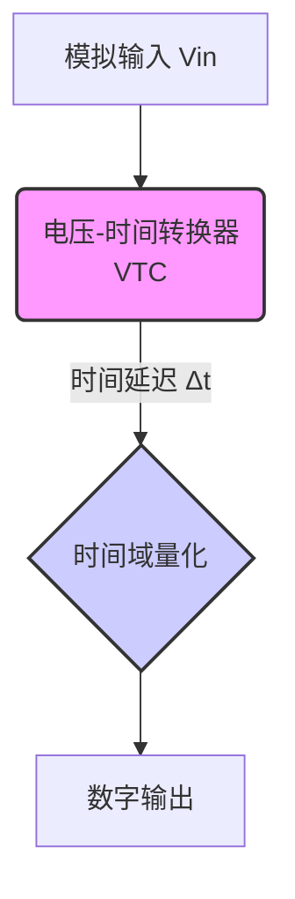
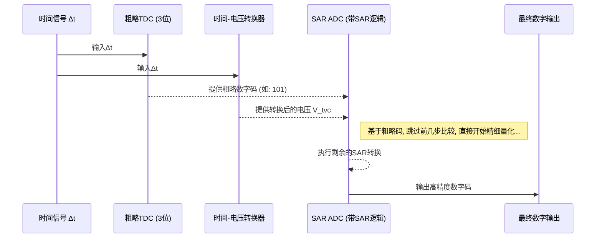

# Chapter 5: 混合电压/时间域ADC (Hybrid Voltage/Time-Domain ADC)


在前几章，我们深入探讨了两种主流的ADC架构：能效极高的[逐次逼近型ADC (SAR ADC)](03_逐次逼近型adc__sar_adc__.md)和速度飞快的[流水线ADC (Pipelined ADC)](04_流水线adc__pipelined_adc__.md)。这两种技术都在电压域内完成所有的核心工作——即通过比较电压来量化信号。

然而，随着芯片制造工艺（如28nm、16nm甚至更先进的工艺）的飞速发展，一个有趣的现象出现了：数字电路（如逻辑门、计数器）变得越来越快、越来越小、越来越省电，而传统的模拟电路（如高精度放大器）的性能提升却步履维艰，设计也愈发困难。

这启发了工程师们一个绝妙的想法：我们能否“扬长避短”，将一部分传统上由模拟电路完成的困难任务，交给更擅长此道的数字电路来处理呢？这便催生了一种创新的架构，我们称之为**混合电压/时间域ADC (Hybrid Voltage/Time-Domain ADC)**。

## 核心思想：从“量身高”到“比脚程”

为了理解这种新思路，让我们回到那个测量两个人身高差的比喻。
*   **传统电压域方法**：就像[SAR ADC](03_逐次逼近型adc__sar_adc__.md)或[流水线ADC](04_流水线adc__pipelined_adc__.md)，我们直接用一把尺子（电压参考）去测量每个人的身高，然后计算差值。整个过程都围绕着“长度”（电压）进行。
*   **混合域方法**：我们换一种玩法。我们不直接量身高，而是让他们俩站在同一起跑线上，然后同时起跑。假设跑得快慢与身高成正比（电压高 -> 跑得快）。我们只需要在终点用一个高精度的秒表，测量他们到达终点的时间差。通过这个**时间差**，我们就能反推出他们最初的身高差距。

这个过程巧妙地将一个“测量长度（电压）”的问题，转换成了一个“测量时间”的问题。这正是混合电压/时间域ADC的精髓。它首先将输入的模拟电压信号，转换成一个时间信号（例如两个脉冲之间的时间延迟），然后在时间域内进行处理和量化。

为什么这么做有优势？因为在先进的CMOS工艺下，制造一个皮秒（一万亿分之一秒）级精度的“数字秒表”远比制造一个微伏（百万分之一伏）级精度的“模拟尺子”要容易得多！

## 混合ADC的工作流程

一个典型的混合电压/时间域ADC主要包含两个核心步骤：
1.  **电压-时间转换 (Voltage-to-Time Conversion, VTC)**：这是整个流程的第一步，也是最关键的一步。它负责将输入的模拟电压 `Vin` 转换成一个时间信息 `Δt`。通常，`Δt` 是两个数字信号边沿之间的时间延迟。输入电压越高，产生的时间延迟就越大。
2.  **时间域量化**：一旦信息被编码到了时间域，我们就可以用高速的数字电路来“读取”它。这一步通常有两种实现方式。



### 方式一：直接用“秒表”测量 (TDC)

最直接的方法是使用一个**时间-数字转换器 (Time-to-Digital Converter, TDC)**。TDC本质上就是一个超高速的数字秒表，它直接测量VTC输出的 `Δt`，并将其转换为一个数字码。这种`VTC -> TDC`的架构非常简洁。

### 方式二：先“换算”再“测量” (TVC + SAR)

还有一种更巧妙、在V22这类项目中更常见的方式。它分为两步：
1.  **时间-电压转换 (Time-to-Voltage Conversion, TVC)**：先将时间信号 `Δt` **再转换回**电压信号 `V_tvc`。你可能会问，这不是多此一举吗？别急，这一步的意义重大。
2.  **传统ADC量化**：然后用一个我们熟悉的、高效的ADC（比如[SAR ADC](03_逐次逼近型adc__sar_adc__.md)）来对这个新的电压 `V_tvc` 进行最终的量化。

整个流程变成了 `VTC -> TVC -> SAR ADC`。

---
*文件: V22 High Speed Analog-to-Digital Converters.pdf, 第120页*

```
High-speed ADC architectures
Hybrid architecture: Time-interleaved voltage/time ADC

M1
VTC 1:N TVC1
N
SAR
TDC

Voltage-to-time conversion
Time-to-voltage conversion

Voltage input
Time domain 
signal
Voltage sample 
to quantize
```
---

虽然看起来绕了一圈，但这种 `VTC -> TVC -> SAR` 的架构在大型[时间交错](01_时间交错__time_interleaving__.md)ADC中具有不可替代的优势。

## V22项目中的实践：大规模并行的奥秘

让我们看看 `VTC -> TVC -> SAR` 架构如何解决大规模时间交错带来的一个巨大挑战。在V22项目中，我们需要将输入信号分发给48个并行的子ADC！

*   **如果直接分发模拟信号**：将一个高频模拟信号（比如20GHz）无失真地、同步地传输给48个分布在芯片不同位置的子ADC，是一场噩梦。这需要极其耗电且复杂的模拟缓冲器和布线网络。
*   **混合域的解决方案**：
    1.  在芯片的最前端，我们用一个（或少数几个）**VTC**将模拟信号转换成时间信号 `Δt`。这个 `Δt` 是由两个**数字脉冲**的边沿承载的。
    2.  接下来，我们需要分发的是这两个数字脉冲！在芯片上长距离、低功耗地传输数字信号，比传输模拟信号要容易得多。我们可以用标准的数字逻辑单元来缓冲和路由。
    3.  每个子ADC的“家门口”都有自己的 **TVC** 和 **SAR ADC**。它们接收到这两个数字脉冲后，在本地完成“时间到电压”的转换和最终的量化。

---
*文件: V22 High Speed Analog-to-Digital Converters.pdf, 第131页*

```
Time-domain routing for TI-ADC
Time-domain signaling allows 
‘digital’ signal routing with 
standard cell buffers

Sub-ADC
Sub-ADC... ...Sub-ADC
Sub-ADCVTC
VTC
...
...
...
Digital outputsVTC
VTC

Logic-level 
signal
```
---

这种设计极大地简化了大规模时间交错ADC的物理实现，降低了功耗和设计复杂度。

### 深入内部：TDC辅助的SAR ADC

V22项目的设计更进了一步，它采用了一种被称为 **“TDC辅助的SAR ADC”** 的技术。

---
*文件: V22 High Speed Analog-to-Digital Converters.pdf, 第123页*

---

还记得[SAR ADC](03_逐次逼近型adc__sar_adc__.md)那个“猜数字”的比喻吗？它需要从最高位开始，一步步进行二分法比较。如果有一个12位的ADC，它就需要12步。

而“TDC辅助”就像是在猜数字游戏里请来了一位“场外指导”（TDC）。
1.  当时间信号 `Δt` 到达子ADC后，除了送往TVC，它也同时被送往一个低精度的**TDC**（比如一个3位的TDC）。
2.  这个TDC非常快，它立刻就能给出一个关于 `Δt` 的“粗略估计值”（例如，`Δt` 大概在第5到第6个区间）。
3.  这个粗略的估计值被送到SAR逻辑控制器。现在，SAR ADC不再需要从头开始猜，它可以直接从这个粗略的范围开始进行更精细的比较。

这大大减少了SAR ADC所需的比较次数，从而显著提高了单个子ADC的转换速度，同时保持了SAR ADC低功耗和高精度的优点。



## V22项目中的关键组件

### 电压-时间转换器 (VTC)

VTC是整个混合域ADC的门户。它的核心原理通常是**“恒流源对电容放电”**。

---
*文件: V22 High Speed Analog-to-Digital Converters.pdf, 第154页*

---

1.  **采样**：一个电容首先被充电到与输入电压 `Vin` 相等的水平。
2.  **转换**：一个恒定的电流源开始对这个电容进行线性放电。
3.  **检测**：一个高速比较器（在V22中是一个带有共模跟踪功能的反相器链）时刻监测着电容上的电压。当电压下降到某个预设的阈值时，比较器翻转。
4.  **输出**：从开始放电到比较器翻转的这段时间 `Δt`，就与初始电压 `Vin` 成正比。

一个重要的挑战是，当输入信号的直流偏置（共模电压）变化时，VTC的性能可能会下降。V22项目采用了一种**共模输入跟踪 (Common-Mode Input Tracking)** 技术，使VTC的比较阈值能够自动跟随输入信号的共模变化，从而在很宽的输入电压范围内都保持高线性度和稳定性。

### 兼具TVC和TDC功能的后端

---
*文件: V22 High Speed Analog-to-Digital Converters.pdf, 第170页*

---
在子ADC的后端，设计者巧妙地将TVC和粗略TDC的功能合并在了一起。
-   **TVC部分**：利用一个恒流源对SAR ADC的采样电容充电，充电时间由VTC产生的 `Δt` 控制。最终电容上的电压就正比于 `Δt`。
-   **TDC部分**：TDC的功能是通过一个延迟链（Delay Line）实现的。输入的两个脉冲信号一个作为“START”，一个作为“STOP”。“START”信号在延迟链上传播，通过一系列的锁存器，可以判断出“STOP”信号到达时，“START”信号已经传播了多远，从而得到一个粗略的时间测量值。

这个合并的设计既节省了面积和功耗，又实现了TDC辅助SAR ADC的功能，体现了工程师的巧思。

## 总结与展望

在本章中，我们学习了一种前沿的ADC架构：

-   **混合电压/时间域ADC** 将传统的电压域转换与现代数字电路擅长的时间域处理相结合。
-   它的核心思想是先通过 **VTC** 将电压转换为时间延迟 `Δt`，再进行量化。
-   V22项目采用了 **`VTC -> TVC -> TDC辅助的SAR ADC`** 的高级架构。这种架构最大的优势是，它允许用鲁棒的**数字信号**在芯片内部进行长距离布线和分发，极大地简化了大规模时间交错的设计。
-   我们还了解了 **共模输入跟踪** 和 **TDC辅助SAR** 等关键技术，它们分别提升了混合ADC的鲁棒性和速度。

通过时间交错和各种先进的ADC架构（如流水线和混合域），我们已经能够构建出采样率高达数十GS/s的系统。然而，我们始终面临着一个[时间交错](01_时间交错__time_interleaving__.md)技术与生俱来的“阿喀琉斯之踵”——不匹配误差，其中最致命的就是**时间偏斜 (Timing Skew)**。即使是皮秒级的采样时刻偏差，也可能毁掉整个ADC的性能。

在下一章，我们将聚焦于如何解决这个核心难题：[第6章: 时间偏斜校准 (Timing-Skew Calibration)](06_时间偏斜校准__timing_skew_calibration__.md)。

---

Generated by [AI Codebase Knowledge Builder](https://github.com/The-Pocket/Tutorial-Codebase-Knowledge)