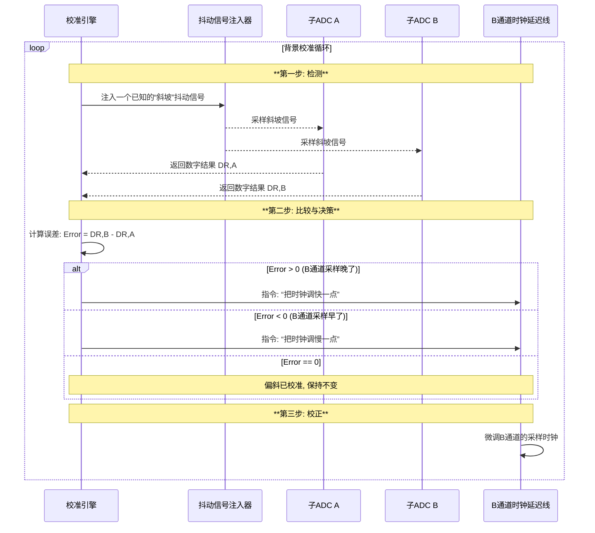

# Chapter 6: 时间偏斜校准 (Timing-Skew Calibration)

在前面的章节中，我们探索了多种先进的ADC架构，从高效的[SAR ADC](03_逐次逼近型adc__sar_adc__.md)到高速的[流水线ADC](04_流水线adc__pipelined_adc__.md)，再到前沿的[混合电压/时间域ADC](05_混合电压_时间域adc__hybrid_voltage_time_domain_adc__.md)。这些技术解决了“如何”将模拟信号高效转换为数字信号的问题。

然而，无论子ADC的内部设计多么精妙，只要我们采用[时间交错](01_时间交错__time_interleaving__.md)架构，就永远无法回避一个根本性的挑战。这个挑战源于时间交错的“团队合作”本质，它也是决定整个系统成败的关键。本章，我们将聚焦于如何解决这个核心难题。

## “失之毫厘，谬以千里”的挑战

让我们再次回到[第1章](01_时间交错__time_interleaving__.md)那个生动的“接力赛”比喻。一个由4名选手组成的接力团队（4个子ADC），要想取得优异成绩，最关键的是什么？是完美无瑕的交接棒。

理想情况下，每位选手（子ADC）应该在前一位选手跑完精确的距离后，立即在精确的时刻（`Ts`）起跑。但现实世界中，由于各种微小的干扰和制造偏差：
*   2号选手可能总是会抢跑 `Δt` 秒。
*   3号选手可能总是会延迟 `Δt` 秒才出发。

这种每个采样时刻相对于理想时刻的微小、不规则的偏移，就是**时间偏斜 (Timing Skew)**。

你可能会想，这 `Δt` 能有多大？在V22这样的高速ADC中，我们讨论的是皮秒（ps, 10⁻¹²秒）甚至飞秒（fs, 10⁻¹⁵秒）级别的误差！这个误差虽然微乎其微，但当ADC处理高频信号时（例如几GHz的信号，其周期也只有几百皮秒），一个微小的时序偏差就会导致巨大的电压采样错误，严重破坏信号的完整性，在频谱上产生强烈的杂散（Spur），如下图所示。

---
*文件: V22 High Speed Analog-to-Digital Converters.pdf, 第44页*

> 图中，左边是校准后的干净频谱，右边是存在时间偏斜时出现的巨大“杂散尖峰 (Spur)”，它严重污染了我们想要的信号。

**时间偏斜校准 (Timing-Skew Calibration)** 就是一套被设计出来，用于实时监测并修正这些微小时间误差的技术。它就像是接力赛场边一位眼光锐利的教练，他不需要亲自上场跑步，但他能精确地发现每位选手的微小步伐差异，并实时发出指令进行调整，确保整个团队的交接棒过程天衣无缝。

## 核心思想：如何看见皮秒级的误差？

校准的第一步是“检测”。但我们如何才能“看见”并测量一个皮秒级的时序误差呢？这比用普通尺子去量一根头发丝的直径还要难上万倍。我们无法直接测量，因此必须采用一种聪明的**间接测量法**。

想象一下，你想知道两支秒针稍微有点不准的手表，到底哪支快哪支慢。一个好办法是：
1.  **引入一个“标准事件”**：在房间里放一个每分钟会精确闪光一次的灯。
2.  **分别观察记录**：你让两个人分别用这两支手表，记录下每次看到灯闪亮时，自己手表上的秒针位置。
3.  **比较差异**：过了一段时间，你比较两个人的记录。如果A的记录总是比B的记录提前0.1秒，你就间接测量出了两支手表之间0.1秒的时间偏斜。

时间偏斜校准正是采用了同样思想。它通过在ADC的输入端注入一个我们已知的、特性明确的**校准信号（也称“抖动信号”，Dither Signal）**，然后让所有子ADC去采样这个信号，最后通过比较不同子ADC的采样结果，来反推出它们之间的时间偏斜。

### V22的解决方案：全局抖动注入 (Global Dither Injection)

在V22项目中，工程师们选择了一种非常可靠的校准方法：**全局抖动注入**。

*   **局部注入 (Local Injection)**：像是有多个小教练，每个人用自己的秒表和方式去指导一位队员。这种方法的问题在于，教练们自己的秒表可能就不准，他们下达指令的方式也可能有细微差别。在ADC中，这意味着将校准信号通过不同的路径注入到每个子ADC，这些路径本身的不匹配会引入新的误差，导致校准不精确。
*   **全局注入 (Global Injection)**：像是只有一个总教练，用一个全场广播系统向所有队员下达指令。所有人都听到完全一样的声音。在ADC中，这意味着校准信号通过**与主信号完全相同的路径**（即[输入缓冲器](02_输入缓冲器__input_buffer__.md)）被分发给所有子ADC。

---
*文件: V22 High Speed Analog-to-Digital Converters.pdf, 第12页*

> 左图的“局部注入”中，Dither信号和VIN信号路径分离，路径本身的不匹配①②会成为校准的盲点。而右图的“全局注入”中，Dither和VIN共享路径，校准过程能自动包含并修正路径本身引入的偏斜③。

V22项目采用全局注入，确保了校准的**全面性**，避免了任何“盲点”。

## 时间偏斜校准是如何工作的？

整个校准过程是一个闭环的“检测-校正”循环，由一个专门的**校准引擎 (Calibration Engine)** 自动完成。我们以校准通道A和通道B之间的时间偏斜为例。

让我们深入了解这个过程中的关键步骤。

### 1. 检测：使用“斜坡信号”

为了检测时间偏斜，校准引擎会注入一个电压随时间线性变化的**斜坡抖动信号 (Ramp Dither)**。

-   假设通道A的采样时刻是理想的。
-   如果通道B存在一个 `+Δt` 的时间偏斜（即采样晚了），那么它在斜坡上采到的电压值 `VR,B` 就会比通道A采到的 `VR,A` 更高。
-   这个电压差 `|VR,B| - |VR,A|` 直接正比于时间差 `Δt`。

通过比较两个通道输出的数字码 `DR,B` 和 `DR,A` 的大小，校准引擎就能立刻知道时间偏斜的方向（谁快了谁慢了）。

### 2. 校正：使用“数字控制延迟线”

检测到误差后，就需要修正。V22项目在每个子ADC的时钟通路上都放置了一个**数字控制延迟线 (Digitally-Controlled Delay Line, DCDL)**。

DCDL就像一个可以精密调节的水龙头，可以根据数字指令，微调（增加或减少）时钟信号到达子ADC的延迟时间。

-   当校准引擎发现通道B“晚了”，它就会向通道B的DCDL发送一个数字码，让它稍微**减少**一点延迟，从而让采样时钟“提前”一点到达。
-   这个过程会一直迭代，直到引擎检测到 `DR,B` 和 `DR,A` 的平均值相等，这意味着 `Δt` 已经被完全补偿，两个通道的采样时刻完美对齐。

---
*文件: V22 High Speed Analog-to-Digital Converters.pdf, 第18页*

---
> 上图展示了V22项目中完整的校准环路。`Correlation`（相关器）负责从ADC输出中提取出抖动信号的数字值 `DR,A` 和 `DR,B`。`Counter`（计数器）比较它们的差值，然后驱动`DCDLs`（数字控制延迟线）来调整时钟。

### 3. 背景校准与全面性

这个校准过程是**在后台 (Background)** 持续进行的，这意味着ADC在正常工作时，校准系统也在悄无声息地运行，不断地抵抗由于温度或电压变化可能引起的新偏斜。

更有趣的是，通过注入不同类型的抖动信号（比如注入一个**脉冲抖动信号 (Pulse Dither)**），同一套校准框架还可以用来检测和校正**增益不匹配 (Gain Mismatch)** 和**失调不匹配 (Offset Mismatch)**。这使得V22的校准系统非常**全面 (Comprehensive)** 和高效。

---
*文件: V22 High Speed Analog-to-Digital Converters.pdf, 第20页*

---
> 该图展示了通过随机选择抖动类型（`PN_T`）和极性（`PN_P`），V22可以同时运行对时间偏斜、增益和失调的校准，且对用户输入的信号类型完全不敏感（Input-Independent）。

## 挑战：如何确保校准信号自身不引入干扰？

向敏感的ADC输入端注入一个额外的校准信号，本身就是一个有风险的操作。如果处理不当，这个抖动信号可能会像在平静的湖面上扔进一颗石子，产生不必要的涟漪（噪声和失真），我们称之为**扰动 (Perturbation)**。

---
*文件: V22 High Speed Analog-to-Digital Converters.pdf, 第25-26页*

---
V22项目的工程师们预见到了这个问题，并设计了一个巧妙的**扰动消除 (Perturbation Cancellation)** 电路。

---
*文件: V22 High Speed Analog-to-Digital Converters.pdf, 第27页*

---
这个电路的工作原理，可以理解为在注入抖动信号的同时，从一个对称的路径注入一个完全相反的“反抖动”信号。这两个信号在关键的输入节点上互相抵消，从而在不影响主信号完整性的前提下，将校准信号成功地送入ADC。

## 总结与展望

在本章中，我们学习了：

-   **时间偏斜 (Timing Skew)** 是[时间交错](01_时间交错__time_interleaving__.md)ADC中的一个核心挑战，指的是子ADC采样时刻的微小不一致。
-   为了解决这个问题，需要一套**时间偏斜校准**技术，它就像一个场边教练，实时调整队员的步伐。
-   校准的核心思想是通过**注入一个已知的抖动信号**（如斜坡信号），并比较各通道的采样结果来**间接测量**时间误差。
-   V22项目采用了一种**全局抖动注入**方案，并通过一个闭环的**“检测-校正”**系统，使用**数字控制延迟线(DCDL)** 在后台持续修正时序误差。
-   这套校准系统是全面的，能够同时处理时间偏斜、增益和失调不匹配，并且通过扰动消除技术保证了自身不会干扰ADC的正常工作。

我们已经看到，注入一个精心设计的“抖动”信号是进行高精度校准的关键。这个“抖动”不仅仅能用来校准时序，它本身就是一种强大的技术。

在下一章，我们将更深入地探讨“抖动”这个概念，看看它还能为我们解决哪些ADC设计中的难题：[第7章: 抖动注入校准 (Dither-Based Calibration)](07_抖动注入校准__dither_based_calibration__.md)。

---

Generated by [AI Codebase Knowledge Builder](https://github.com/The-Pocket/Tutorial-Codebase-Knowledge)