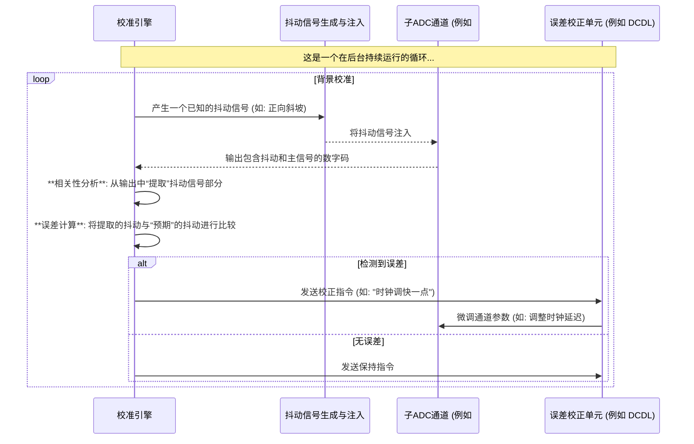
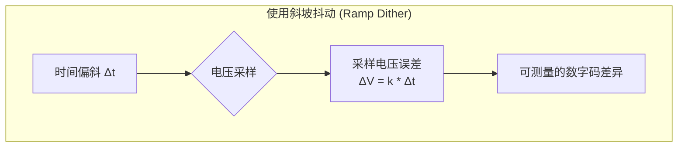

# Chapter 7: 抖动注入校准 (Dither-Based Calibration)

在[第6章：时间偏斜校准](06_时间偏斜校准__timing_skew_calibration__.md)中，我们了解到，通过向ADC注入一个我们已知的“斜坡”信号，就能够像侦探一样，巧妙地发现并修正皮秒级的时序误差。这个“注入已知信号来反推未知误差”的思想非常强大。

在本章，也就是我们V22项目学习之旅的最后一站，我们将深入探讨这个思想的核心，并将其推广为一种极为巧妙和全面的技术——**抖动注入校准 (Dither-Based Calibration)**。

## “体检”的革命：从停车检查到边开边修

想象一下，你有一辆高精密的赛车（我们的时间交错ADC），为了让它保持最佳性能，你需要定期检查和调整它的各个系统，比如悬挂和轮胎定位（对应ADC的增益、失调和时间偏斜）。

*   **传统方法（前景校准）**：你需要把车开回修理厂，停下来，连接各种设备进行测量和调整。这个过程虽然精确，但缺点是赛车必须**停止工作**。
*   **抖动注入校准（背景校准）**：现在，想象一种全新的“智能路面”。在赛车正常行驶时，路面上会随机出现一些特制的小石子（这就是“抖动”或“Dither”）。这些石子的高度、形状和出现时机都是**精确已知**的。车上的高级传感器（校准引擎）会感知赛车压过这些石子时的振动。
    *   如果悬挂系统（ADC通道）完美，那么传感器感受到的振动会和预期完全一样。
    -   如果左侧悬挂比右侧软一点（**增益不匹配**），那么压过同样高度的石子时，左侧的振动就会更大。
    -   如果某个车轮的定位有偏差（**时间偏斜**），那么它压过石子的时机就会有细微的提前或延迟。

通过持续分析这些振动与“标准石子”的差异，车载电脑就能在赛车飞驰的同时，实时微调悬挂系统，让它始终保持在最佳状态。这，就是抖动注入校准的精髓：**在不中断ADC正常工作的情况下，通过注入一个微小的、已知的随机信号（抖动），来持续地检测并修正系统内部的误差。**

## 什么是“抖动” (Dither)？

在我们深入其工作原理之前，必须先澄清一个概念：“抖动”在这里不是指不希望出现的随机噪声。恰恰相反，它是一个被精心设计的**伪随机信号**。

“伪随机”意味着它看起来是随机的，但实际上是根据一个确定的序列（比如一个`PN`序列）产生的。校准系统作为“出题人”，完全知道在任何时刻，它注入的抖动信号是什么样的（比如是斜坡还是脉冲，是正极性还是负极性）。

---
*文件: V22 High Speed Analog-to-Digital Converters.pdf, 第20页*

---
在V22项目中，校准引擎使用两个伪随机序列来控制抖动：
*   `PN_T`：决定了当前注入的抖动是**斜坡信号**（用于校准时间偏斜）还是**脉冲信号**（用于校准增益和失调）。
*   `PN_P`：决定了抖动信号的**极性**（是正向的斜坡/脉冲，还是负向的）。

由于校准引擎对这个抖动信号了如指掌，它就成了我们安插在ADC内部的“卧底”，可以随时向我们汇报各个通道的“工作状态”。

## 抖动校准的通用框架

所有基于抖动的校准技术，都遵循一个相似的闭环反馈逻辑。这个逻辑由一个数字“校准引擎”在后台自动执行。

这个过程的核心是**相关性分析 (Correlation)**。因为抖动信号是伪随机的，它与ADC正常处理的主信号几乎没有关联。通过一个数学上的“过滤器”，校准引擎可以轻易地将ADC输出中由抖动引起的部分分离出来，从而进行精确的误差分析。

## 一种工具，多种用途

抖动注入校准最巧妙的地方在于它的**全面性 (Comprehensive)**。通过改变抖动的“形状”，同一套校准框架可以“体检”出不同种类的“疾病”。

### 1. 用“斜坡抖动”诊断“时间偏斜”

正如我们在[上一章](06_时间偏斜校准__timing_skew_calibration__.md)学到的，一个线性变化的斜坡信号是诊断时间偏斜的完美工具。

---
*文件: V22 High Speed Analog-to-Digital Converters.pdf, 第9页*

由于电压 `V` 和时间 `t` 是线性关系 `V = k*t`，任何时间上的微小偏差 `Δt` 都会直接转化为一个可测量的电压差 `ΔV`。校准引擎通过比较不同通道对同一个斜坡抖动的采样值，就能精确地反推出它们之间的时间偏斜。

### 2. 用“脉冲抖动”诊断“增益和失调不匹配”

当校准引擎将抖动类型切换为**脉冲信号 (Pulse Dither)** 时，它的诊断目标也随之改变。

---
*文件: V22 High Speed Analog-to-Digital Converters.pdf, 第16页*

-   **诊断增益不匹配**：增益，可以理解为ADC对输入电压的“敏感度”或“放大系数”。校准引擎注入一个固定高度的脉冲。如果两个通道的增益不同，它们测量出的脉冲高度（数字输出 `DP,A` 和 `DP,B`）就会不同。通过计算 `DP,A / DP,B` 的比值，就能直接得到它们之间的增益不匹配。

-   **诊断失调不匹配**：失调，是ADC自带的一个固定的“零点偏差”。通过只分析注入**正极性**脉冲时的采样结果，并计算其平均值 `OA`，这个平均值就反映了该通道的失调量。比较不同通道的 `OA` 和 `OB`，即可校准失调不匹配。

## V22项目的独门秘技：全面与无扰动

V22项目将抖动注入校准技术发挥到了极致，体现在两个关键点：

### 1. 全面且输入无关的校准 (Comprehensive & Input-Independent)

V22的校准引擎不会按部就班地先校准A，再校准B。它采用了一种更高效的策略：**随机化**。

---
*文件: V22 High Speed Analog-to-Digital Converters.pdf, 第20页*

---

在每个校准周期，引擎都会随机决定是注入斜坡还是脉冲 (`PN_T`)，以及是正极性还是负极性 (`PN_P`)。然后，它会同时分析所有通道的输出，并将提取出的误差信息分别送往对应的校准环路（时序校准、增益校准、失调校准）。

这种方法的巨大优势在于：
*   **同时进行**：三种主要的失配误差可以被同时、并行地校准，大大提高了校准效率。
*   **输入无关**：由于抖动信号的随机性，校准过程完全不受ADC正在处理的实际信号的影响。无论输入是高频、低频、大信号还是小信号，校准都能在后台稳定可靠地运行。
*   **无额外杂散**：随机化注入避免了在某个固定频率（如抖动注入频率）上产生可预测的杂散噪声，使得ADC的输出频谱非常干净。

### 2. 无扰动注入 (Perturbation Cancellation)

向一个高精度ADC的输入端注入任何额外信号都是有风险的。这个抖动信号可能会干扰到真正需要被测量的信号。V22项目通过一个巧妙的**扰动消除**电路解决了这个问题。

---
*文件: V22 High Speed Analog-to-Digital Converters.pdf, 第27页*

---

这个电路可以理解为：在通过一个电容注入 `+Dither` 信号的同时，在电路的对称点，通过另一个完全匹配的电容注入一个 `-Dither` 信号。这两个信号在主信号通路上完美地互相抵消，它们的**差模**效应被ADC感知用于校准，而它们的**共模**扰动则被消除。这样既完成了校准任务，又保证了主信号的“纯洁性”。

## 总结与展望

在本章，我们学习了抖动注入校准这一强大而优雅的技术：

-   它是一种**背景校准**技术，通过向信号中注入一个已知的**伪随机信号（抖动）**，来实时监测和修正ADC内部的误差，而无需中断其正常工作。
-   这就像在汽车行驶时，通过压过特制的“小石子”来诊断悬挂系统。
-   通过改变抖动的形状（**斜坡**或**脉冲**），同一套校准框架可以全面地诊断并修正**时间偏斜**、**增益不匹配**和**失调不匹配**等多种误差。
-   V22项目通过**随机化**和**扰动消除**等技术，实现了一套非常全面、高效且对主信号无干扰的校准系统。

至此，我们已经完成了V22高速模数转换器项目的核心概念学习之旅。我们从[时间交错](01_时间交错__time_interleaving__.md)的宏大架构开始，探索了[输入缓冲器](02_输入缓冲器__input_buffer__.md)的关键作用，深入了解了[SAR ADC](03_逐次逼近型adc__sar_adc__.md)、[流水线ADC](04_流水线adc__pipelined_adc__.md)和[混合域ADC](05_混合电压_时间域adc__hybrid_voltage_time_domain_adc__.md)等不同的子ADC实现方式，最后，我们学习了如何通过精密的[时间偏斜校准](06_时间偏斜校准__timing_skew_calibration__.md)和全面的**抖动注入校准**来克服时间交错带来的固有挑战。

希望这一系列教程能帮助你理解，一个世界顶级的ADC是如何将这些复杂的概念和巧妙的设计思想融合在一起，最终实现令人惊叹的性能。感谢你的学习，希望你在探索模拟与数字世界的旅程中不断前进！

---

Generated by [AI Codebase Knowledge Builder](https://github.com/The-Pocket/Tutorial-Codebase-Knowledge)