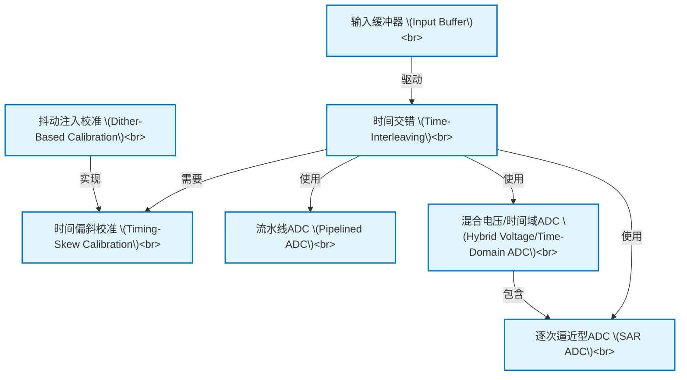

# Tutorial: V22 High Speed Analog-to-Digital Converters

该项目旨在设计用于高速通信的**超高速模数转换器(ADC)**。
项目的核心技术是***时间交错(Time-Interleaving)***，它通过并行运行多个较慢的子ADC（如***逐次逼近型ADC***或***流水线ADC***）来共同实现极高的整体采样率，就像在超市里同时开设多个收银台来为顾客结账一样。
为了保证转换的精确性，系统必须配备一个高性能的**输入缓冲器(Input Buffer)**来稳定地驱动信号，并采用***时间偏斜校准(Timing-Skew Calibration)***技术来精确同步所有并行的ADC通道，确保它们无缝协作。

**Source Repository:** [None](None)

## Chapters

1. [时间交错 (Time-Interleaving)
](01_时间交错__time_interleaving__.md)
2. [输入缓冲器 (Input Buffer)
](02_输入缓冲器__input_buffer__.md)
3. [逐次逼近型ADC (SAR ADC)
](03_逐次逼近型adc__sar_adc__.md)
4. [流水线ADC (Pipelined ADC)
](04_流水线adc__pipelined_adc__.md)
5. [混合电压/时间域ADC (Hybrid Voltage/Time-Domain ADC)
](05_混合电压_时间域adc__hybrid_voltage_time_domain_adc__.md)
6. [时间偏斜校准 (Timing-Skew Calibration)
](06_时间偏斜校准__timing_skew_calibration__.md)
7. [抖动注入校准 (Dither-Based Calibration)
](07_抖动注入校准__dither_based_calibration__.md)

---

Generated by [AI Codebase Knowledge Builder](https://github.com/The-Pocket/Tutorial-Codebase-Knowledge)