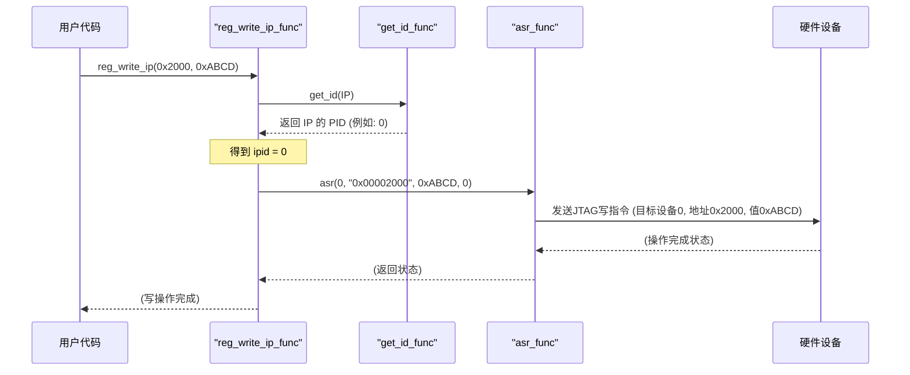

# Chapter 2: 寄存器访问抽象层


欢迎来到 `c_env` 教程的第二章！在上一章 [项目/设备定义与管理](01_项目_设备定义与管理_.md) 中，我们学习了如何定义和管理不同的硬件项目及其组件，以及如何通过 `get_id()` 函数获取特定组件的唯一标识符。这就像我们为每个电子元件都贴上了清晰的标签。现在，我们有了这些“标签”，下一步自然就是如何与这些元件进行“对话”——读取它们的状态或给它们下达指令。这一章，我们将探索“寄存器访问抽象层”，它正是实现这种“对话”的桥梁。

## 为什么要抽象？寄存器访问的“万能遥控器”

想象一下，你的工作台上摆满了各种各样的电子设备：一个 IP 核（比如一个网络处理器）、一个测试控制器 (TC)、一块 FPGA（现场可编程门阵列），甚至还有一个 MAC（媒体访问控制器）。这些设备内部都有许多“寄存器”，它们就像设备的小小控制面板和显示屏，通过读取或写入这些寄存器的值，我们可以控制设备的行为或了解其状态。

问题来了：不同的硬件组件，其寄存器的访问方式可能千差万别。有些可能通过 JTAG 接口，有些可能通过 SPI 总线，还有些可能有更复杂的协议。如果你为每一种组件都编写一套独立的通信代码，那你的上层应用代码（比如测试脚本或控制程序）将会变得非常复杂和混乱。每次你想和 IP 核通信，就得用一套方法；想和 TC 通信，又得换另一套方法。这就像家里每多一个电器，就多一个专属遥控器，很快你的茶几就堆不下了！

“寄存器访问抽象层”就是为了解决这个问题而诞生的。**它提供了一套统一的函数接口，用于读取和写入不同硬件组件的寄存器。** 它隐藏了底层通信（如 JTAG）的复杂细节。

**核心思想：一个“万能遥控器”**

你可以把这个抽象层想象成一个**多功能遥控器**。
*   **遥控器上的按钮**：就是我们提供的一系列标准函数，比如 `reg_read_ip()`（读取IP寄存器）、`reg_write_tc()`（写入TC寄存器）。
*   **你想控制的设备**：就是不同的硬件组件（IP 核、TC、FPGA、MAC）。
*   **告诉遥控器控制哪个设备**：通过在调用函数时隐式或显式地指定设备类型（比如函数名本身就指明了是 `_ip`还是 `_tc`），并结合上一章学到的 `get_id()` 来确定具体是哪个设备实例。
*   **告诉遥控器具体的操作**：通过函数参数传入寄存器地址和要写入的值（如果是写操作）。

使用这个“万能遥控器”，你只需要学会按几个通用的按钮，就能控制各种不同的“电器”，而无需关心每个电器内部复杂的电路和通信方式。这使得上层代码变得简洁、易懂，并且更容易维护。

## 如何使用“万能遥控器”？—— 核心函数与示例

`c_env` 的寄存器访问抽象层主要通过 `comm_bridge.c` 文件中的函数来实现。这些函数通常以 `reg_write_` 或 `reg_read_` 开头，后面跟着组件类型（如 `ip`, `tc`, `fpga`, `mac`）。

让我们来看一个具体的场景：
假设我们正在与一个 `x812` 项目板卡上的 IP 核进行交互。
1.  我们想要读取该 IP 核上地址为 `0x00001000` 的版本寄存器。
2.  然后，我们想向该 IP 核上地址为 `0x00002000` 的配置寄存器写入值 `0xABCD`。

在上一章中，我们已经通过 `x812_jtag_init()` (在 `main.c` 中调用) 初始化了项目，并可能通过 `set_group_id()` 选择了包含我们目标 IP 核的配置组。

### 1. 读取 IP 核寄存器

要读取 IP 核的寄存器，我们可以使用 `reg_read_ip()` 函数。

```c
// 引入必要的头文件
#include "project_defines.h" // 为了 get_id()
#include "comm_bridge.h"     // 为了寄存器读写函数
#include <stdio.h>           // 为了 printf

// 假设 project_defines_init() 和特定项目的 _jtag_init() 已在 main 中调用

int main() {
    // ... 项目初始化代码 ...
    // 假设当前已配置为操作目标 IP 核

    uint32_t register_address = 0x00001000; // IP 核的版本寄存器地址
    uint32_t read_value;

    printf("准备从 IP 核读取寄存器...\n");
    read_value = reg_read_ip(register_address);

    printf("从 IP 核地址 0x%08X 读取到的值为: 0x%08X\n", register_address, read_value);

    // ... 其他操作 ...
    return 0;
}
```
**代码解释**：
*   我们包含了 `comm_bridge.h`，其中定义了 `reg_read_ip`。
*   `reg_read_ip(register_address)`: 这个函数调用会处理所有与 IP 核通信的细节，并返回从指定地址读取到的32位数据。
*   **背后发生了什么？**
    1.  `reg_read_ip` 内部会调用 `get_id(IP)` 来获取当前活动的 IP 核的设备 ID (这个 ID 是在项目初始化时配置的，比如它在 JTAG 链上的位置)。
    2.  然后，它会使用这个设备 ID、寄存器地址，通过底层的通信协议 (比如 JTAG) 向硬件发送读取指令。
    3.  最后，它接收硬件返回的数据并将其作为函数返回值。

**预期输出 (示例)**:
```
准备从 IP 核读取寄存器...
从 IP 核地址 0x00001000 读取到的值为: 0x01020304 // 假设版本号是这个值
```

### 2. 写入 IP 核寄存器

要向 IP 核的寄存器写入数据，我们可以使用 `reg_write_ip()` 函数。

```c
// 接上一个例子
// ... (读取部分代码) ...

    uint32_t config_address = 0x00002000; // IP 核的配置寄存器地址
    uint32_t value_to_write = 0xABCD;      // 要写入的值

    printf("准备向 IP 核写入寄存器...\n");
    reg_write_ip(config_address, value_to_write);

    printf("已向 IP 核地址 0x%08X 写入值: 0x%04X\n", config_address, value_to_write);

    // 为了验证，我们可以再读回来 (可选)
    uint32_t verify_value = reg_read_ip(config_address);
    printf("回读 IP 核地址 0x%08X 的值为: 0x%08X\n", config_address, verify_value);

    return 0;
}
```
**代码解释**:
*   `reg_write_ip(config_address, value_to_write)`: 这个函数会将 `value_to_write` 写入到 IP 核的 `config_address` 指定的寄存器中。
*   **背后发生了什么？**
    1.  与读取类似，`reg_write_ip` 内部也会调用 `get_id(IP)`。
    2.  然后，它使用设备 ID、寄存器地址和要写入的值，通过底层通信协议向硬件发送写入指令。

**预期行为**:
执行后，IP 核中地址为 `0x00002000` 的寄存器的内容会被更新为 `0x0000ABCD`。如果硬件支持回读并且没有其他因素干扰，验证读取应该会得到相同的值。

### 3. 针对不同组件的函数

`comm_bridge.c` 中为不同类型的硬件组件提供了类似的函数：

*   **IP 核 (IP Core)**:
    *   `uint32_t reg_read_ip(uint32_t addr)`
    *   `void reg_write_ip(uint32_t addr, uint32_t value)`
*   **测试控制器 (TC - Test Controller)**:
    *   `uint32_t reg_read_tc(uint32_t addr)`
    *   `void reg_write_tc(uint32_t addr, uint32_t value)`
*   **FPGA**:
    *   `uint32_t reg_read_fpga(uint32_t addr)`
    *   `void reg_write_fpga(uint32_t addr, uint32_t value)`
*   **MAC (Media Access Controller)**:
    *   `uint32_t reg_read_mac(uint32_t addr)`
    *   `void reg_write_mac(uint32_t addr, uint32_t value)`

此外，还有更通用的函数，允许你直接提供在上一章 [项目/设备定义与管理](01_项目_设备定义与管理_.md) 中获得的 `pid`（物理 ID，通常指 JTAG 链中的位置）和寄存器名称（如果 `.dat` 文件支持的话，这超出了本章基础范围，我们这里主要关注地址访问）：
*   `uint32_t reg_read_agr(uint32_t pid, char *reg_name)`
*   `void reg_write_asr(uint32_t pid, char *reg_name, uint32_t value)`

`asr` 代表 "Address Set Register" (设置寄存器值)，`agr` 代表 "Address Get Register" (获取寄存器值)。这些是更底层的函数，上面那些 `reg_read_ip` 等函数内部实际上就是调用了 `asr` 或 `agr`。

## 深入幕后：抽象层是如何工作的？

当我们调用像 `reg_write_ip(address, value)` 这样的函数时，背后发生了一系列步骤，将我们的简单函数调用转换成实际的硬件操作。

### 非代码流程概览

让我们以调用 `reg_write_ip(0x2000, 0xABCD)` 为例，看看大致流程：

1.  **获取设备ID**: 函数 `reg_write_ip` 首先会调用 `get_id(IP)`。这个函数，正如我们在 [项目/设备定义与管理](01_项目_设备定义与管理_.md) 中学到的，会返回当前项目中、当前活动组下被定义为 IP 的那个组件的 PID (比如，它在 JTAG 链上的位置)。假设返回的 `ipid` 是 `0`。
2.  **准备参数**: 函数会将传入的地址 `0x2000` 和值 `0xABCD` 准备好。地址通常需要转换成字符串格式，因为底层的 `asr` 函数可能期望这种格式。
3.  **调用底层通信**: `reg_write_ip` 接着会调用一个更底层的函数，比如 `asr(ipid, "0x00002000", 0xABCD, 0)`。这个 `asr` 函数才是真正负责通过具体的通信协议（如 JTAG）与硬件打交道的“黑魔法”。
4.  **硬件交互**: `asr` 函数将指令（设备ID `0`，地址 `0x2000`，数据 `0xABCD`）发送给硬件。
5.  **状态检查与重连 (可选但重要)**: 底层通信可能会失败。`comm_bridge.c` 中的函数通常包含错误检查和尝试重新连接硬件的逻辑（例如，通过 `init_ftd2xx` 重新初始化 FTDI 通信接口），以增强鲁棒性。
6.  **返回**: 对于写操作，函数通常没有返回值 (void)，或者返回一个状态码。对于读操作 (`reg_read_ip`)，`agr` 函数会从硬件获取数据，并将其返回给 `reg_read_ip`，最终返回给调用者。

下面是一个简化的序列图，展示了这个过程：



### 代码实现细节 (以 `reg_write_ip` 和 `reg_read_ip` 为例)

现在，让我们看看 `comm_bridge.c` 中这些函数的简化版实现，以更好地理解它们。

```c
// 文件: reg_access/src/comm_bridge.c (简化版)
#include "project_defines.h" // 为了 get_id()
#include "comm_bridge.h"     // 函数声明
#include <stdio.h>           // sprintf, printf
#include <stdlib.h>          // exit (用于错误处理)
// 假设 asr 和 agr 函数已在别处定义，它们负责实际的硬件通信
// int64_t asr(uint8_t pid, char* addr_str, uint32_t val, int something);
// int64_t agr(uint8_t pid, char* addr_str);
// int init_ftd2xx(int port, char* desc); // 假设的通信初始化函数

void reg_write_ip(uint32_t addr, uint32_t value) {
    char addr_string[11] = {0}; // 字符串形式的地址 "0xDEADBEEF"
    int8_t ipid = get_id(IP);   // 1. 获取当前IP的ID

    sprintf(addr_string, "0x%08x", addr); // 2. 将地址转为字符串

    // 3. 调用底层 'asr' 函数执行写操作
    int64_t status = asr(ipid, addr_string, value, 0); // '0' 可能是一个额外的参数

    if (status < 0) { // 4. 检查通信状态
        printf("与设备通信失败。尝试重新连接...\n");
        // 尝试重新初始化通信接口 (简化错误处理)
        // status = init_ftd2xx(4, "USB <-> Serial Cable B");
        // status = asr(ipid, addr_string, value, 0); // 再次尝试写入
        if (status < 0) {
            printf("再次通信失败。程序终止。\n");
            exit(1); // 严重错误，退出
        }
    }
}

uint32_t reg_read_ip(uint32_t addr) {
    char addr_string[11] = {0};
    int64_t readback_value;
    uint8_t ipid = get_id(IP); // 1. 获取当前IP的ID

    sprintf(addr_string, "0x%08x", addr); // 2. 将地址转为字符串

    // 3. 调用底层 'agr' 函数执行读操作
    readback_value = agr(ipid, addr_string);

    if (readback_value < 0) { // 4. 检查通信状态 (负数通常表示错误)
        printf("与设备通信失败。尝试重新连接...\n");
        // 尝试重新初始化通信接口 (简化错误处理)
        // readback_value = init_ftd2xx(4, "USB <-> Serial Cable B");
        // readback_value = agr(ipid, addr_string); // 再次尝试读取
        if (readback_value < 0) {
            printf("再次通信失败。程序终止。\n");
            exit(1); // 严重错误，退出
        }
    }
    return (uint32_t)readback_value; // 5. 返回读取到的值
}
```
**代码解释**:
1.  **获取设备 ID**: `int8_t ipid = get_id(IP);`
    *   这一步是关键！它利用了我们在 [项目/设备定义与管理](01_项目_设备定义与管理_.md) 章节中建立的系统，动态地获取当前应该与之通信的 IP 核的标识符 (PID)。这意味着你的上层代码 (`reg_write_ip` 的调用者) 不需要硬编码这个 ID。
2.  **地址格式化**: `sprintf(addr_string, "0x%08x", addr);`
    *   底层的 `asr` 和 `agr` 函数（或它们最终调用的JTAG库函数）可能期望地址是以十六进制字符串的形式传入。
3.  **调用底层通信函数**:
    *   对于写操作: `asr(ipid, addr_string, value, 0);`
    *   对于读操作: `agr(ipid, addr_string);`
    *   这里的 `asr` 和 `agr` 就是我们之前提到的“黑魔法”函数。它们封装了所有与硬件进行实际通信的复杂逻辑，比如构造 JTAG 指令、通过 FTDI 芯片发送这些指令、处理时序等等。**对于本章的理解，你只需要知道它们是实际干活的函数即可。** 它们的具体实现（可能在 `comm_ftdi.c` 或类似的JTAG驱动文件中）超出了本抽象层的范围。
4.  **错误处理和重连**:
    *   代码中检查 `status` 或 `readback_value` 是否小于0，这通常表示通信错误。
    *   在一个健壮的系统中，这里会尝试重新初始化通信链路（例如调用 `init_ftd2xx`，它可能是用来设置和打开与硬件板卡上 FTDI JTAG 调试芯片的连接）并重试操作。如果仍然失败，则程序可能会终止。
    *   对于初学者，理解这里有错误检查和恢复尝试就足够了。
5.  **返回值 (仅读取)**: `return (uint32_t)readback_value;`
    *   `reg_read_ip` 将从 `agr` 获取到的值（经过类型转换）返回给调用者。

`reg_write_tc`, `reg_read_tc`, `reg_write_fpga` 等函数的结构与 `_ip` 版本非常相似，主要区别在于它们调用 `get_id()` 时传入的参数不同（`TC`, `FPGA` 等），从而确保与正确的硬件组件类型通信。

### `init_comm_library()` 的角色

你可能在 `project_defines.c` 的末尾看到一个 `init_comm_library()` 函数。
```c
// 位于: reg_access/src/project_defines.c (片段)
void init_comm_library(){
	int i;
	int64_t status;
	char dev_desc[] = "USB <-> Serial Cable B"; // FTDI设备描述符
	// 1. 初始化FTDI JTAG接口
	status = init_ftd2xx(4, dev_desc);
	printf("\tFTDI JTAG INITIALIZATION STATUS: %d\n", (int) status);

	// 2. 为JTAG链上的每个设备加载其.dat文件并构建寄存器映射
	for(i = 0; i < chain_len; i++){ // chain_len 是JTAG链长度
		clear_map(chain[i].pid); // 清除旧的映射 (如果存在)
		// build_map 加载 .dat 文件，它描述了该设备的寄存器信息
		status = build_map(chain[i].dat_file, chain[i].jtag_lanex, chain[i].pid, chain[i].jtag_data_len, chain[i].jtag_rti_wait, chain[i].jtag_cr_sel, chain[i].jtag_ir_len);
        // ... 调试打印信息 ...
	}
}
```
**作用**:
1.  **初始化物理通信接口**: `init_ftd2xx()` 函数通常负责打开与 JTAG 调试器硬件（如基于 FTDI 芯片的 USB 转 JTAG 适配器）的连接。这是实际数据传输的基础。
2.  **加载寄存器定义文件 (`.dat` 文件)**: 对于 JTAG 链上的每个设备，`build_map()` 函数会加载一个对应的 `.dat` 文件。这个文件非常重要，它包含了该设备所有寄存器的名称、地址、位域（bitfields）等详细信息。加载这些信息后，系统就能够通过寄存器名称（而不仅仅是地址）来访问寄存器，并理解寄存器中每个位的含义。这对于更高级的功能（如 [PHY SDK API](05_phy_sdk_api_.md)）至关重要。

通常，`init_comm_library()` 会在主程序的早期，项目定义和 JTAG 链配置完成之后被调用，以确保在进行任何寄存器访问之前，通信链路已经建立，并且所有必要的寄存器信息都已加载。

## 抽象层的好处

使用寄存器访问抽象层带来了诸多好处：

1.  **简化上层代码**: 用户只需要调用简单的 `reg_read_xx()` 或 `reg_write_xx()` 函数，无需关心底层复杂的 JTAG 命令、FTDI 驱动细节或不同设备的特定通信协议。
2.  **代码一致性**: 无论与 IP、TC 还是 FPGA 通信，函数调用的模式都是相似的，提高了代码的可读性和易用性。
3.  **易于维护和扩展**:
    *   如果底层通信方式发生变化（比如从一个 JTAG 库换到另一个），只需要修改抽象层内部（如 `asr`, `agr` 或 `init_ftd2xx` 的实现），上层应用代码完全不受影响。
    *   如果需要支持一种新的硬件组件类型，只需按照现有模式添加新的 `reg_read_newtype()` 和 `reg_write_newtype()` 函数即可。
4.  **解耦**: 上层逻辑与底层硬件细节分离。上层代码更关注“做什么”（业务逻辑），而抽象层处理“怎么做”（硬件交互）。
5.  **项目可移植性**: 结合 [项目/设备定义与管理](01_项目_设备定义与管理_.md) 模块，这套抽象使得为不同硬件项目编写通用测试和控制软件成为可能。

## 总结与展望

在本章中，我们一起探索了 `c_env` 中的“寄存器访问抽象层”。我们理解了：
*   为什么需要这样一个抽象层：屏蔽底层硬件通信的复杂性，提供统一接口。
*   它的核心思想：像一个“万能遥控器”，用相同的“按钮”（函数）控制不同的“设备”（硬件组件）。
*   如何使用核心函数如 `reg_read_ip()`, `reg_write_ip()`, `reg_read_tc()` 等来与硬件进行交互。
*   这些函数内部如何通过 `get_id()` 确定目标设备，并调用更底层的 `asr` 和 `agr` 函数来完成实际的读写操作。
*   `init_comm_library()` 在初始化通信和加载设备寄存器信息方面的重要作用。

这个抽象层是我们与硬件世界沟通的得力助手。它使得我们可以用一种更高级、更简洁的方式来操作硬件寄存器，而不必深陷于繁琐的底层细节。

在了解了如何定义设备以及如何读写它们的寄存器之后，我们接下来可能会关心硬件设备的一些基础配置，比如它们的工作时钟。在下一章 [时钟源配置](03_时钟源配置_.md) 中，我们将学习如何配置和管理系统中各种组件的时钟源。这是确保硬件正常工作的关键一步。敬请期待！

---

Generated by [AI Codebase Knowledge Builder](https://github.com/The-Pocket/Tutorial-Codebase-Knowledge)