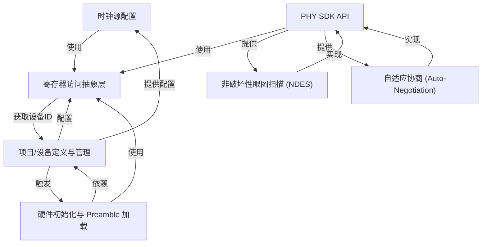

# Tutorial: c_env

这个项目就像一个 **硬件控制中心**，主要负责管理和配置高速网络通信中的 *物理层 (PHY) 芯片*。
它能精确地设置系统时钟，提供统一接口访问硬件寄存器，管理不同项目（如 x585, x812）的配置。
此外，它还包含一套 *PHY SDK*，让开发者可以方便地进行硬件初始化、自动协商通信速率，以及执行像眼图扫描这样的高级诊断。

**Source Repository:** [None](None)

## Chapters

1. [项目/设备定义与管理
](01_项目_设备定义与管理_.md)
2. [寄存器访问抽象层
](02_寄存器访问抽象层_.md)
3. [时钟源配置
](03_时钟源配置_.md)
4. [硬件初始化与 Preamble 加载
](04_硬件初始化与_preamble_加载_.md)
5. [PHY SDK API
](05_phy_sdk_api_.md)
6. [自适应协商 (Auto-Negotiation)
](06_自适应协商__auto_negotiation__.md)
7. [非破坏性眼图扫描 (NDES)
](07_非破坏性眼图扫描__ndes__.md)

---

Generated by [AI Codebase Knowledge Builder](https://github.com/The-Pocket/Tutorial-Codebase-Knowledge)