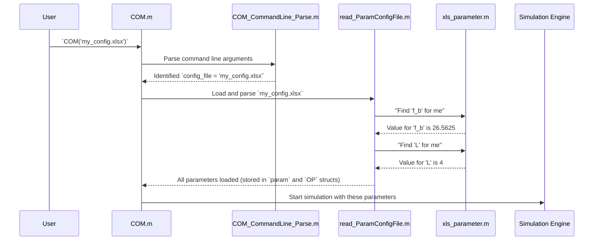

# Chapter 1: COM Configuration and Parameter Management

Welcome to the `com_code` tutorial! We're about to embark on a journey to understand how Channel Operating Margin (COM) simulations work, piece by piece. Think of a COM simulation as baking a very complex cake. Before you can even start mixing ingredients, you need a detailed recipe and a precise list of all your ingredients. This chapter is all about that "recipe book" and "ingredient list" for our COM simulation.

## What's the Big Deal with Configuration?

Imagine you want to simulate how a signal travels through a tiny wire on a computer chip. There are tons of questions you need to answer first:
*   How fast is the signal? (Baud rate)
*   What kind of signal is it? (e.g., NRZ or PAM4)
*   What does the "transmitter" (the thing sending the signal) look like? Does it have any equalizers?
*   What does the "receiver" (the thing catching the signal) look like?
*   What are the characteristics of the "channel" (the wire itself)?
*   How long should the simulation run? What are we trying to measure?

Answering all these questions defines your simulation. The **COM Configuration and Parameter Management** system is how `com_code` gets all these answers. It's the very first step in any simulation. Without it, `com_code` would be like a chef standing in a kitchen with no recipe – completely lost!

Our main goal here is to tell `com_code` exactly what kind of simulation scenario we want to run.

## The Core Idea: Your Simulation's Recipe

The `com_code` project uses a central configuration file to store all these settings. This file is like the master recipe for your simulation.
*   **Configuration File:** This is usually an Excel spreadsheet (`.xlsx` or `.csv`) or sometimes a MATLAB-specific data file (`.mat`). It lists all the parameters and their values.
*   **Parameters:** These are the individual settings – our "ingredients." For example, `f_b` for baud rate, `L` for the number of signal levels (e.g., 2 for NRZ, 4 for PAM4), or settings for the transmitter and receiver equalizers.
*   **Parsing:** This is the process of `com_code` reading the configuration file and understanding what each parameter means and what its value is.
*   **Default Values:** What if you forget to specify an ingredient in your recipe? For some non-critical parameters, `com_code` has sensible default values it can use. For example, if you don't specify whether to show plot windows, it might default to showing them.
*   **Error Handling:** What if you forget a *critical* ingredient, like the baud rate? The simulation can't proceed. `com_code` will flag an error and tell you what's missing.
*   **Command-Line Overrides:** Sometimes, you want to run the same basic recipe but with a small tweak (e.g., "bake for 5 minutes longer"). `com_code` allows some parameters to be set or overridden directly from the command line when you start the simulation, without needing to edit the main configuration file.

## How Do We Use It?

Let's say we want to run a very basic COM simulation. Here's what you'd typically do:

1.  **Prepare your "Recipe" (Configuration File):**
    You'll need a configuration file. This might be an Excel sheet. Let's imagine a tiny part of it looks like this:

    | Parameter Name       | Value     | Description                         |
    | :------------------- | :-------- | :---------------------------------- |
    | `f_b`                | `26.5625` | Baud rate in GigaBaud (GBd)       |
    | `L`                  | `4`       | Number of signal levels (e.g., PAM4)|
    | `N_b`                | `12`      | DFE (equalizer) length            |
    | `DISPLAY_WINDOW`     | `true`    | Show graphical plots?             |
    | `s_param_file`       | `channel.s4p` | Path to your channel data file    |
    | ... (many more parameters) | ...     | ...                               |

    This file tells `com_code` key details for the simulation.

2.  **Run `com_code`:**
    You would then typically run the main `com_code` script (often called `COM.m` or similar) from MATLAB, telling it which configuration file to use. For example:

    ```matlab
    % In MATLAB command window
    COM('my_simulation_setup.xlsx')
    ```

    When you run this, `com_code` springs into action! The first thing it does is read `my_simulation_setup.xlsx` to understand all the settings. If everything is okay (all critical parameters are present and correctly formatted), it will proceed with the simulation using these settings. If `DISPLAY_WINDOW` is `true`, you'll likely see graphs pop up as the simulation progresses.

## Under the Hood: How `com_code` Reads Your Recipe

Let's peek behind the curtain. When you tell `com_code` to run with a specific configuration file, a sequence of events unfolds:



1.  **Starting the Show (`COM_CommandLine_Parse.m`):**
    When you run `com_code`, often with command-line arguments (like the name of your configuration file), the `COM_CommandLine_Parse.m` function is one ofr the first helpers to get involved. Its job is to figure out the basics from what you typed.

    ```matlab
    % Simplified snippet from COM_CommandLine_Parse.m
    function [config_file, num_fext, num_next, ...]=COM_CommandLine_Parse(OP,varargin)
        config_file=''; % Initialize
        % ... (lots of logic for different keywords and modes) ...

        if ~isempty(varargin)
            % This helper function extracts one argument at a time
            [potential_config_file, varargin] = varargin_extractor(varargin{:});
            % In a simple case, potential_config_file might be our 'my_config.xlsx'
            config_file = potential_config_file;
            % ... (extract other args like num_fext, num_next) ...
        end
        % ...
    end
    ```
    This function uses a helper, `varargin_extractor.m`, to pull out arguments one by one from the command line input.

    ```matlab
    % Snippet from varargin_extractor.m
    function [out_var,varg_out]=varargin_extractor(varargin)
        if isempty(varargin)
            out_var=[];     % Nothing left to extract
            varg_out={};
        else
            out_var=varargin{1}; % Take the first item
            varg_out=varargin;
            varg_out(1)=[];      % Remove it from the list for next time
        end
    end
    ```
    The main outcome here is identifying your `config_file`.

2.  **Reading the Main Configuration (`read_ParamConfigFile.m`):**
    Once `com_code` knows *which* configuration file to use (e.g., `my_simulation_setup.xlsx`), the `read_ParamConfigFile.m` function takes over. This is the heart of parameter loading. It opens your Excel or `.mat` file and reads all the settings.

    ```matlab
    % Simplified snippet from read_ParamConfigFile.m
    function [param,OP]= read_ParamConfigFile(paramFile,OP)
        % ... (Code to open Excel/CSV/MAT file and load its content into 'parameter' variable)
        % Example: [~, ~, parameter] = xlsread(paramFile,'COM_Settings','','');

        % Reading parameters one by one using a helper
        param.fb = xls_parameter(parameter, 'f_b')*1e9; % Baud rate
        param.levels = xls_parameter(parameter, 'L');     % Number of levels

        % Reading an operational parameter with a default value
        % 'DISPLAY_WINDOW' is the name in Excel, 'false' means don't evaluate if string,
        % 'true' is the default if not found.
        OP.DISPLAY_WINDOW = xls_parameter(parameter, 'DISPLAY_WINDOW', false, true);

        % ... (many more parameters are read this way) ...
        % Special handling for '.START' / '.END' package blocks might occur here
        % using read_package_parameters.m
        % ...
    end
    ```
    This function populates two important structures: `param` (for physical parameters) and `OP` (for operational/control parameters). It heavily relies on another helper, `xls_parameter.m`.

3.  **The Parameter Detective (`xls_parameter.m`):**
    This little helper function is called repeatedly by `read_ParamConfigFile.m`. Its job is to find a specific parameter by its name in the data read from the Excel sheet.

    ```matlab
    % Simplified snippet from xls_parameter.m
    function p=xls_parameter(param_sheet, param_name, eval_if_string, default_value)
        % param_sheet: data read from Excel
        % param_name: e.g., 'f_b'
        % eval_if_string: if true, and value is '[10 20]', it evaluates to a MATLAB array
        % default_value: used if param_name is not found

        [row, col]=find(strcmpi(param_sheet, param_name)); % Find the parameter name (case-insensitive)

        if isempty(row) % Parameter name not found in the sheet!
            if nargin < 4 % And no default value was provided by the caller
                missingParameter(param_name); % This is a critical missing parameter!
            else
                p = default_value; % Use the default value
            end
        else
            % Parameter found, get its value (usually in the next column)
            p = param_sheet{row(1), col(1)+1};
        end

        if ischar(p) && eval_if_string
            p = eval(p); % e.g., convert string '[0.1 0.2]' to a numeric array
        end
    end
    ```

4.  **Sounding the Alarm (`missingParameter.m`):**
    If `xls_parameter.m` is asked to find a parameter that *must* be there (no default provided) and it's not in the config file, it calls `missingParameter.m`.

    ```matlab
    % Snippet from missingParameter.m
    function missingParameter (parameterName)
        error( 'error:badParameterInformation', ...
        'The data for mandatory parameter %s is missing or incorrect', parameterName);
    end
    ```
    This stops the simulation and tells you what's wrong, which is very helpful for debugging your setup!

5.  **Special Cases - Reading "Package" Parameters (`read_package_parameters.m`):**
    Sometimes, parameters are grouped. For instance, "package" parameters (describing the chip package) can be defined in special blocks within the configuration file, marked by `.START PKG_MyChip` and `.END`. The `read_package_parameters.m` function is designed to read all parameters within such a block.

    ```matlab
    % Simplified snippet from read_package_parameters.m
    function param_struct = read_package_parameters(parameter_block, param_struct)
        % parameter_block contains only the rows for this specific package
        if nargin<2
            param_struct=struct; % Create a new structure if one isn't passed in
        end

        % Example: Reading package capacitance (C_p)
        % 'C_p' is the name in the Excel sheet for this block
        % true means it's mandatory, *1e-9 converts nF to Farads
        param_struct.C_pkg_board = xls_parameter(parameter_block, 'C_p', true)*1e-9;

        % Example: Reading transmitter package trace lengths
        param_struct.z_p_tx_cases = xls_parameter(parameter_block, 'z_p (TX)', true).';
        % ... (many other package-specific parameters are read here) ...
    end
    ```
    `read_ParamConfigFile.m` identifies these blocks and then calls `read_package_parameters.m` to process them. It can even handle multiple package definitions and select the correct ones for the transmitter (Tx) and receiver (Rx) based on `PKG_NAME` settings.

6.  **Making Sure Sizes are Right (`parameter_size_adjustment.m`):**
    Some parameters need to have a specific structure or size. For example, a capacitance value `C_pkg_board` might apply to both the transmitter and receiver, so it needs to be a 1x2 array (e.g., `[C_pkg_tx, C_pkg_rx]`). If you only provide one value in the Excel sheet, `parameter_size_adjustment.m` can often expand it.

    ```matlab
    % Simplified snippet from parameter_size_adjustment.m
    function param=parameter_size_adjustment(param,OP)
        % Defines lists of parameters that need specific sizes
        make_length2={'C_pkg_board', 'C_diepad', 'R_diepad'}; % These should be 1x2 arrays

        % Parameters that should have length 2 (e.g., for Tx and Rx sides)
        for j=1:length(make_length2)
            param_name_to_check = make_length2{j};
            if isfield(param, param_name_to_check) && numel(param.(param_name_to_check))==1
                % If it's a single value, duplicate it to make a pair
                param.(param_name_to_check) = param.(param_name_to_check) * [1 1];
            end
        end
        % ... (similar logic for other specific lengths based on simulation cases, etc.) ...
    end
    ```
    This function ensures that parameters are correctly shaped before they are used by the simulation engine.

And that's it! Once all parameters are read, validated, and formatted, they are neatly stored in the `param` and `OP` MATLAB structures, ready for the next stages of the COM simulation.

## Conclusion

You've now seen how `com_code` sets up its "kitchen" by meticulously reading its "recipe book" – the configuration file. This process of configuration and parameter management is fundamental. It ensures that the simulation knows exactly what scenario to model, what components to use, and how they behave. Without this careful setup, the complex calculations that follow would have no meaningful basis.

Now that we understand how the simulation is configured, we can start looking at the "ingredients" themselves. The very first ingredient we need is the communication channel.

In the next chapter, we'll dive into [Channel Data Acquisition and S-Parameter Processing](02_channel_data_acquisition_and_s_parameter_processing_.md), where we'll learn how `com_code` gets and prepares the data describing the physical path the signal travels.

---

Generated by [AI Codebase Knowledge Builder](https://github.com/The-Pocket/Tutorial-Codebase-Knowledge)