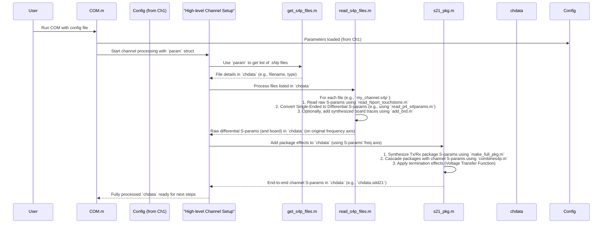

# Chapter 2: Channel Data Acquisition and S-Parameter Processing

Welcome back! In [Chapter 1: COM Configuration and Parameter Management](01_com_configuration_and_parameter_management_.md), we learned how `com_code` gets its "recipe" – all the settings and parameters that define our simulation. We told `com_code` *what* we want to simulate. Now, it's time to start gathering the actual "ingredients."

The most important ingredient for simulating how a signal travels is the "channel" itself – the physical path like wires on a PCB, connectors, and chip packages. This chapter is all about how `com_code` takes in the raw data describing these physical parts and prepares it for the simulation. Think of it as getting the measurements of our race track and making sure they're all in a consistent format.

## What's the Goal Here? From Raw Data to a Usable Channel Model

Imagine you're building a model of a high-speed link. This link might consist of:
1.  The transmitter chip's package.
2.  A trace on the Printed Circuit Board (PCB).
3.  A connector.
4.  Another PCB trace.
5.  The receiver chip's package.

Each of these parts affects the signal. To simulate the whole link, we first need to describe each part electrically. Then, we need to combine these descriptions into one end-to-end model. This "data intake and preparation" is what Channel Data Acquisition and S-Parameter Processing is all about.

Our main goal is to get a complete electrical description of the channel, ready for `com_code` to use in its calculations.

## Key Concepts: The Building Blocks of Our Channel

Let's break down the important ideas:

### 1. S-Parameters: The Channel's "Fingerprint"

*   **What are they?** S-parameters (Scattering parameters) are the most common way to describe how an electrical component behaves at different signal frequencies. Imagine sending a tiny electrical wave towards a component (like a PCB trace).
    *   Some of the wave might bounce back towards the source (this is called **reflection**).
    *   Some of the wave will pass through the component to the other end (this is called **transmission**).
    *   S-parameters measure these reflections and transmissions. They tell us "how much" and "what phase shift" for waves at various frequencies.
*   **Why frequencies?** High-speed signals are made up of many different frequency components. A channel might behave differently for low-frequency parts of the signal versus high-frequency parts. S-parameters capture this.
*   **Analogy:** Think of S-parameters as the component's "fingerprint." Each component has a unique S-parameter profile that tells us how it will interact with electrical signals.

### 2. Touchstone Files: Storing the Fingerprints

*   **What are they?** Touchstone files (with extensions like `.s2p`, `.s4p`, `.sNp`) are a standard text file format for storing S-parameter data.
    *   An `.s2p` file describes a 2-port device (like a simple cable with an input and an output).
    *   An `.s4p` file describes a 4-port device. This is very common for high-speed differential pairs, which use two wires for the signal (positive and negative) at both the input and output. So, input_positive, input_negative, output_positive, output_negative make up 4 ports.
*   **Inside a Touchstone file:** You'll typically find lines starting with `!` (comments), an option line starting with `#` (specifying frequency units, data format, and reference impedance), and then rows of data. Each data row usually contains a frequency value followed by S-parameter values (e.g., magnitude and angle, or real and imaginary parts).

Here's a tiny peek at what a line in an `.s4p` file (MA - Magnitude/Angle format) might look like after the header:
```
! Freq S11(Mag Ang) S12(Mag Ang) S13(Mag Ang) S14(Mag Ang) ...
# GHZ S MA R 50
0.01  0.98 -1.2   0.05 -88.1  0.001 -95.3  0.002 -170.0 ... (and so on for S21, S22... S44)
0.02  0.97 -2.5   0.06 -87.0  0.002 -98.0  0.003 -165.0 ...
...
```
`com_code` needs to read and understand these files.

### 3. Pulse Response: An Alternative View

*   Sometimes, instead of S-parameters (frequency-domain), the channel is described by its **pulse response** (time-domain).
*   This tells us how the channel responds if you send a very short, sharp pulse (an impulse) into it.
*   `com_code` can also read pre-computed pulse responses, often from `.csv` files. If this is the case, some of the S-parameter specific processing steps are different or skipped. For this chapter, we'll primarily focus on S-parameters as they are more common for raw channel data.

### 4. Single-Ended vs. Differential Signals

*   **Single-Ended:** A signal carried on one wire, with its voltage measured relative to a common ground.
*   **Differential:** A signal carried on a pair of wires. One wire carries the signal (e.g., V+) and the other carries its inverse (V-). The receiver looks at the difference (V+ minus V-).
*   Most modern high-speed communication uses differential signals because they are much more resilient to noise.
*   Touchstone files for differential channels (like `.s4p`) often initially describe the behavior of four single-ended ports. `com_code` then mathematically converts these single-ended S-parameters into differential S-parameters (e.g., how a differential signal input on one pair transmits to a differential signal output on another pair).

### 5. Interpolation: Getting Everyone on the Same Page

*   Imagine you have S-parameters for a connector measured at frequencies 1 GHz, 2 GHz, 3 GHz. And S-parameters for a PCB trace measured at 1 GHz, 1.5 GHz, 2 GHz, 2.5 GHz, 3 GHz.
*   To combine (cascade) these, they need to be defined on the **same set of frequency points** (a common frequency grid).
*   **Interpolation** is the process of estimating the S-parameter values at missing frequency points. For example, we'd estimate the connector's S-parameters at 1.5 GHz and 2.5 GHz.
*   `com_code` often uses the frequency grid from the main channel's Touchstone file as this common grid. Any components it generates (like chip packages) will be calculated on this grid. If you were combining multiple measured S-parameter files yourself, you'd need to ensure they are interpolated to a common grid first.

### 6. Cascading: Linking the LEGO Bricks

*   Once we have the S-parameters for individual parts of the channel (e.g., chip package, PCB trace, another package), all on a common frequency grid, we need to combine them to get the S-parameters of the *entire* end-to-end channel.
*   This process is called **cascading**. It's like connecting LEGO bricks. Mathematically, it involves multiplying their S-parameter matrices (or more precisely, T-parameter matrices, which S-parameters can be converted to).
*   `com_code` can model components like chip packages and PCB test fixture traces based on parameters you provide in the configuration file (Chapter 1) and then cascade them with the S-parameters read from your main channel file.

## How `com_code` Handles Channel Data

You, as a user, primarily interact with this stage through the configuration file. For example, you might specify:

| Parameter Name | Value           | Description                                     |
| :------------- | :-------------- | :---------------------------------------------- |
| `s_param_file` | `my_channel.s4p`| Path to the main channel's S-parameter file.    |
| `include_pcb`  | `1`             | Add PCB test fixture traces (defined by other params). |
| `PKG_NAME`     | `MyChipPkg`     | Name of the package model to use (defined elsewhere in config). |

`com_code` then takes these settings and automatically performs the acquisition and processing steps.

## Under the Hood: The Journey of S-Parameters

Let's look at the typical sequence of events when `com_code` processes channel data:



Now, let's peek at some simplified code concepts.

### 1. Identifying Channel Files (`get_s4p_files.m`)

This function figures out which S-parameter files to use based on your configuration. It populates a structure array called `chdata` with information about each file.

```matlab
% Simplified concept from get_s4p_files.m
function [chdata, param] = get_s4p_files(param, OP, num_fext, num_next, file_list_cmd_line)
    % param: structure containing parameters from config file (Chapter 1)
    % OP: operational parameters
    % num_fext, num_next: number of FEXT/NEXT aggressors
    % file_list_cmd_line: files specified on command line, may override config

    nxi = 0; % file index

    % --- Get the THRU (main) channel file ---
    nxi = nxi + 1;
    if ~isempty(file_list_cmd_line) % Command line takes precedence
        main_channel_file = file_list_cmd_line{1};
    elseif isfield(param, 's_param_file') && ~isempty(param.s_param_file)
        main_channel_file = param.s_param_file; % From config file
    else
        error('No THRU channel file specified!');
        % Or, it might open a UI to ask the user for the file
        % [basename, filepath] = uigetfile('*.s4p', 'Select THRU channel .s4p file');
        % main_channel_file = fullfile(filepath, basename);
    end

    chdata(nxi).filename = main_channel_file;
    [~, ~, file_extension] = fileparts(main_channel_file);
    chdata(nxi).ext = file_extension; % e.g., '.s4p'
    chdata(nxi).type = 'THRU';        % Mark as the main signal path

    % --- Similar logic for FEXT (Far-End Crosstalk) files ---
    % for k = 1:num_fext
    %   nxi = nxi + 1;
    %   chdata(nxi).filename = ... (get FEXT file name) ...
    %   chdata(nxi).type = 'FEXT';
    % end

    % --- Similar logic for NEXT (Near-End Crosstalk) files ---
    % ...
end
```
This tells `com_code` which physical files correspond to the main signal path and any crosstalk paths.

### 2. Reading a Touchstone File (e.g., `read_Nport_touchstone.m`)

Once a filename is known, this type of function reads the S-parameter data from it.

```matlab
% Simplified concept from read_Nport_touchstone.m or readdataSnPx.m
function [S_params_matrix, freq_axis] = read_touchstone_simplified(filename)
    fid = fopen(filename, 'r');
    if fid == -1, error('Cannot open file: %s', filename); end

    options_line_found = false;
    freq_multiplier = 1e9; % Default to GHz
    s_param_format = 'MA'; % Default to Magnitude/Angle
    % Z0 = 50; % Default reference impedance

    % --- Read and parse the header and options line ---
    while ~feof(fid)
        line_text = fgetl(fid);
        if startsWith(line_text, '!') % Comment line
            continue;
        elseif startsWith(line_text, '#') % Options line
            options_line_found = true;
            parts = strsplit(lower(line_text)); % e.g., {"#", "ghz", "s", "ma", "r", "50"}
            % Parse frequency unit (parts{2}), format (parts{4}), impedance (parts{6})
            % For example: if strcmp(parts{2}, 'mhz'), freq_multiplier = 1e6; end
            break; % Found options line, data follows
        end
    end
    if ~options_line_found, error('Touchstone options line (#) not found.'); end

    % --- Read the S-parameter data ---
    data_block = fscanf(fid, '%f'); % Read all numbers into a single column
    fclose(fid);

    % Determine number of S-params per frequency point (e.g., 1 (freq) + 4*4*2 (S4p MA) = 33)
    % This depends on the number of ports (from file extension .sNp) and format
    num_ports = str2double(filename(end-2)); % Very simplified way to get N from .sNp
    num_cols_per_line = 1 + (num_ports * num_ports * 2); % If MA or RI format
    if strcmpi(s_param_format, 'db') % DB format also has 2 values per S-param
         num_cols_per_line = 1 + (num_ports * num_ports * 2);
    end
    
    data_reshaped = reshape(data_block, num_cols_per_line, [])'; % Rows are frequencies

    freq_axis = data_reshaped(:, 1) * freq_multiplier;
    
    % S_params_matrix will be (num_freq_points x num_ports x num_ports)
    % ... Logic to fill S_params_matrix from data_reshaped based on format (MA/RI/DB) ...
    % Example for S11 MA: S_params_matrix(:,1,1) = data_reshaped(:,2) .* exp(1j*data_reshaped(:,3)*pi/180);
end
```
This function extracts the frequency points and the complex S-parameter values.

### 3. Converting Single-Ended to Differential S-Parameters (e.g., `read_p4_s4params.m`)

For a 4-port device (common for differential pairs), the `.s4p` file gives single-ended S-parameters. These are converted to mixed-mode S-parameters, which include differential-to-differential (SDD), common-to-differential (SCD), etc.

```matlab
% Conceptual: Converting SE S-matrix to Mixed-Mode S-matrix at one frequency
% S_se is the 4x4 single-ended S-parameter matrix from the Touchstone file.
% Ports are typically ordered: 1(In+), 2(Out+), 3(In-), 4(Out-).
% (Note: com_code uses specific port ordering like [1 3 2 4] to map In+/In- and Out+/Out-)

% Transformation matrix for voltages/currents (depends on port mapping)
% Assuming ports 1&3 are pair 1, ports 2&4 are pair 2.
% This T matrix helps separate differential and common-mode components.
T = [ 1  1  0  0 ;  % Sum for common mode (Pair 1)
      1 -1  0  0 ;  % Difference for differential mode (Pair 1)
      0  0  1  1 ;  % Sum for common mode (Pair 2)
      0  0  1 -1 ]; % Difference for differential mode (Pair 2)
% The actual matrix in com_code's read_p4_s4params.m is T_inv = inv(T) effectively,
% and the conversion is S_mixed_mode = T_inv * S_single_ended * T
% Or, as in com_code: S_mixed_mode = T_prime * S_single_ended / T_prime (where / T_prime is S_single_ended * inv(T_prime))

% S_mixed_mode (let's call it 'D' as in com_code) would then be:
% D = T * S_se_properly_ordered * inv(T); % (This is a conceptual representation)
% For example, com_code's `read_p4_s4params` with ports=[1 3 2 4] effectively re-orders
% S_se so that physical ports 1,3 are input pair and 2,4 are output pair.
% Then it applies the transform.

% The resulting D matrix columns/rows correspond to:
% 1: CommonMode_Pair1, 2: DiffMode_Pair1, 3: CommonMode_Pair2, 4: DiffMode_Pair2
% So, D(2,2) is Sdd11 (Diff In Pair1 to Diff Out Pair1 if Pair1 is input and output)
%     D(4,2) is Sdd21 (Diff In Pair1 to Diff Out Pair2)
%     D(2,4) is Sdd12 (Diff In Pair2 to Diff Out Pair1)
% `com_code` then extracts these:
% SDD(:,1,1) = D(:,2,2); % Differential port 1 to differential port 1
% SDD(:,2,1) = D(:,4,2); % Differential port 1 to differential port 2 (thru path)
```
This gives us the crucial differential S-parameters like SDD21 (differential signal transmission).

### 4. Interpolation (e.g., `interp_Sparam.m`)

If S-parameters from different sources (or the simulation itself) need to be on a specific frequency grid, interpolation is used.

```matlab
% Simplified from interp_Sparam.m
function Sout = interp_Sparam(Sin, fin, fout)
    % Sin: complex S-parameter values at original frequencies fin
    % fout: new frequency grid for interpolation (e.g., simulation's standard grid)

    H_mag = abs(Sin);      % Get magnitude
    H_ph = unwrap(angle(Sin)); % Get unwrapped phase (to avoid 360-degree jumps messing up interpolation)

    % Interpolate magnitude (linear interpolation is common)
    % 'extrap' handles cases where fout goes beyond fin's range.
    H_mag_i = interp1(fin, H_mag, fout, 'linear', 'extrap');

    % Interpolate phase
    H_ph_i = interp1(fin, H_ph, fout, 'linear', 'extrap');

    Sout = H_mag_i .* exp(1j * H_ph_i); % Reconstruct complex S-parameter
end
```
This ensures all S-parameters are defined at the same frequency points before further processing or transformation to the time domain (see [Chapter 3: Frequency/Time Domain Transformation & Causality](03_frequency_time_domain_transformation___causality_.md)).

### 5. Modeling Chip Packages (e.g., `make_full_pkg.m`, `make_pkg.m`, `synth_tline.m`)

`com_code` can build S-parameter models for chip packages based on physical parameters you define (like capacitance, trace length, impedance). A package might be modeled as a series of capacitors, inductors, and transmission line segments.

```matlab
% Simplified concept of synth_tline.m (synthesizing a transmission line)
function [s11, s12, s21, s22] = synth_tline(f_axis, Z_char, Z_ref, gamma_params, tau_delay, length)
    % f_axis: Frequency vector
    % Z_char: Characteristic impedance of the T-line
    % Z_ref: Reference impedance (usually 50 Ohms)
    % gamma_params, tau_delay: Coefficients to calculate propagation constant (loss and phase delay)
    % length: Physical length of the T-line

    % Calculate frequency-dependent propagation constant (gamma = alpha + j*beta)
    % alpha is attenuation, beta is phase constant. Eq 93A-9 in IEEE 802.3 spec.
    gamma_complex = (gamma_params(1) + gamma_params(2)*(1+1i).*sqrt(f_axis/1e9) + ...
                     gamma_params(3)*(1-2i/pi*log(f_axis/1e9)).*(f_axis/1e9) + ...
                     2i*pi*tau_delay.*(f_axis/1e9) );
    gamma_complex(f_axis==0) = gamma_params(1); % Handle DC case

    % Reflection coefficient if Z_char is different from 2*Z_ref (as per Eq 93A-12)
    rho = (Z_char - 2*Z_ref) ./ (Z_char + 2*Z_ref);
    if length == 0, rho = 0; end % No reflection for zero length

    exp_neg_gamma_len = exp(-gamma_complex * length);

    % S-parameter formulas for a T-line (from IEEE 802.3 Eq 93A-13, 93A-14)
    s11 = rho .* (1 - exp_neg_gamma_len.^2) ./ (1 - rho.^2 .* exp_neg_gamma_len.^2);
    s21 = (1 - rho.^2) .* exp_neg_gamma_len ./ (1 - rho.^2 .* exp_neg_gamma_len.^2);
    s12 = s21; % Reciprocal
    s22 = s11; % Symmetric
end
```
The `make_pkg.m` function would then combine such transmission line segments with capacitor models (for pads, bumps, balls) using cascading.

### 6. Cascading S-Parameters (e.g., `combines4p.m`)

This function takes two sets of 2-port S-parameters (Network A and Network B) and calculates the S-parameters of the combined network (A followed by B).

```matlab
% Simplified from combines4p.m (vectorized method for 2-port networks)
function [s11_out, s12_out, s21_out, s22_out] = combines4p(s11A, s12A, s21A, s22A, ...
                                                            s11B, s12B, s21B, s22B)
    % S_A parameters: s11A, s12A, s21A, s22A
    % S_B parameters: s11B, s12B, s21B, s22B
    % All S-parameters are vectors (one value per frequency).

    % Denominator term, common in cascading formulas
    N = (1 - s22A .* s11B);

    s11_out = s11A + (s12A .* s21A .* s11B) ./ N;
    s12_out = (s12A .* s12B) ./ N;
    s21_out = (s21A .* s21B) ./ N; % Note: com_code is s21B .* s21A ./ N
    s22_out = s22B + (s12B .* s21B .* s22A) ./ N;
end
```
`s21_pkg.m` uses these tools (`synth_tline`, `make_pkg`, `combines4p`) to build the complete channel by adding Tx package, then the loaded channel (which might include board traces via `add_brd.m`), then Rx package, and finally applying the effects of transmitter and receiver termination impedances (Voltage Transfer Function). The result (e.g., `chdata(i).sdd21`) is the end-to-end differential S-parameter of the channel.

## What If We Have Pulse Responses Instead?

If your configuration points to time-domain pulse response files (e.g., `.csv`), `com_code` uses functions like `get_TD_files.m` to identify them and `read_PR_files.m` to load them.

```matlab
% Simplified concept from read_PR_files.m
function [chdata, param] = read_PR_files(param, OP, chdata)
    % ... (loop through files in chdata) ...
    % For each file:
    if strcmp(chdata(i).ext, '.csv')
        % Load the CSV file, which typically has two columns: time and voltage
        time_voltage_data = load(chdata(i).filename);
        chdata(i).t = time_voltage_data(:, 1);         % Time vector
        chdata(i).uneq_pulse_response = time_voltage_data(:, 2); % Pulse response
        
        % It might also calculate Vf (final value of step response)
        % and a rough impulse response from the pulse response.
    end
    % ...
end
```
In this case, the channel is already in the time domain, so S-parameter specific steps like SE-to-Differential conversion (if the pulse response is already differential) and frequency-domain cascading are different. Cascading in the time domain involves convolution.

## Conclusion

You've now seen how `com_code` ingests and prepares the description of the physical channel. It starts with raw data – usually S-parameters from Touchstone files – and processes it through several steps:
*   Reading the data.
*   Converting from single-ended to differential representations if needed.
*   Interpolating to a common frequency grid (implicitly or explicitly).
*   Modeling and cascading additional elements like chip packages and PCB traces.

The outcome is a complete, end-to-end model of the channel's electrical behavior, typically as a set of S-parameters (like the crucial SDD21) or a pulse response. This processed channel data is essential for the next steps in the simulation.

With our channel model ready, we next need to understand how it behaves in the time domain, as signals are fundamentally time-varying. This involves transformations between the frequency and time domains, which we'll explore in [Chapter 3: Frequency/Time Domain Transformation & Causality](03_frequency_time_domain_transformation___causality_.md).

---

Generated by [AI Codebase Knowledge Builder](https://github.com/The-Pocket/Tutorial-Codebase-Knowledge)