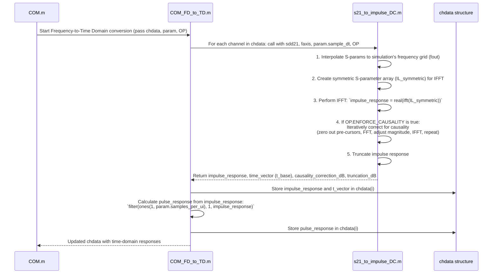

# Chapter 3: Frequency/Time Domain Transformation & Causality

Welcome back! In [Chapter 2: Channel Data Acquisition and S-Parameter Processing](02_channel_data_acquisition_and_s_parameter_processing_.md), we learned how `com_code` gathers and prepares the "fingerprint" of our communication channel, usually in the form of S-parameters. These S-parameters tell us how the channel behaves at different frequencies.

But signals, like the data bits traveling through a wire, happen in *time*. To understand how a pulse of data gets shaped and distorted as it races through the channel, we need to see the channel's behavior in the time domain. This chapter is all about translating the channel's frequency-domain description into a time-domain one and making sure our translation respects a fundamental law of physics: causality.

## What's the Big Idea? From Frequencies to Pulses

Imagine you have the sheet music for a song. The sheet music tells you which notes (frequencies) to play, how loud, and for how long. This is like our S-parameters – a frequency-domain view. But to actually hear the song, you need to perform it, creating sound waves that change over time. This performance is like the time-domain view.

Our main goal in this chapter is to take the S-parameters (the channel's "sheet music" from Chapter 2) and convert them into an **impulse response**. The impulse response tells us what the channel would do if we sent a single, incredibly short electrical "tap" or "ping" (an impulse) into it. From this impulse response, we can then figure out how the channel responds to actual data pulses.

This translation is vital because many of the later simulation steps, like figuring out how much interference there is between pulses, work with time-domain signals.

A critical part of this translation is **causality**. Simply put, a system cannot produce an output *before* it receives an input. You can't hear an echo before you clap your hands! Our translated time-domain response must obey this rule.

## Key Concepts: Understanding the Lingo

Let's break down the important terms:

1.  **Frequency Domain (S-parameters):**
    *   As we saw in Chapter 2, S-parameters (like SDD21) describe how much a signal is attenuated (weakened) or amplified, and how much its phase is shifted, at various specific frequencies.
    *   This is great for characterizing components, but not directly how a digital pulse looks after passing through.

2.  **Time Domain (Impulse Response):**
    *   The impulse response, often written as `h(t)`, describes how a system (our channel) reacts over time to a perfect, infinitesimally short input pulse (an "impulse").
    *   Think of striking a bell with a hammer. The sound you hear evolving over time is like the bell's impulse response. The initial sharp strike is the impulse, and the ringing, fading sound is the response.
    *   If we know the impulse response, we can predict how the channel will affect *any* signal, not just an ideal impulse.

    ```mermaid
    graph LR
        subgraph Channel
            direction LR
            Input[Ideal Short Pulse (Impulse δ(t))] --> System[h(t)]
            System --> Output[Impulse Response]
        end
    ```

3.  **The Magic Translator: Inverse Fast Fourier Transform (IFFT)**
    *   The **Fast Fourier Transform (FFT)** and its counterpart, the **Inverse Fast Fourier Transform (IFFT)**, are powerful mathematical tools that act as translators between the frequency domain and the time domain.
    *   **IFFT:** Takes frequency-domain data (like our S-parameters) and converts it into time-domain data (the impulse response). This is the primary tool we'll use.
    *   **FFT:** Does the reverse, converting time-domain data into the frequency domain.

4.  **Causality: No Time Travel Allowed!**
    *   A physical system is **causal** if its output at any time depends only on past and present inputs, not future inputs. In simpler terms, the effect cannot happen before its cause.
    *   For our channel's impulse response `h(t)`, this means `h(t)` must be zero for all time `t < 0` (assuming the input impulse occurs at `t = 0`).
    *   Why might this be an issue?
        *   Measurement errors in S-parameters.
        *   Mathematical operations like extrapolation (guessing S-parameter values outside their measured range) can sometimes lead to non-causal results when converted to the time domain.
    *   `com_code` needs to check for and correct non-causal behavior to ensure the simulation is physically realistic.

5.  **Impulse Response vs. Pulse Response:**
    *   **Impulse Response:** The channel's reaction to a *theoretical, infinitely short* input spike. This is what we typically get directly from the IFFT of S-parameters.
    *   **Pulse Response:** The channel's reaction to a more realistic input pulse that has a specific width (e.g., the duration of one data bit, known as a Unit Interval or UI). The pulse response is usually derived from the impulse response (often by convolving or filtering the impulse response with a rectangular pulse shape). `com_code` often refers to this as `uneq_pulse_response` (unequalized pulse response).

    ```mermaid
    sequenceDiagram
        participant IR as Impulse Response h(t)
        participant InputPulse as Square Input Pulse (1 UI wide)
        participant PR as Pulse Response p(t)

        Note over IR, InputPulse: Convolution: p(t) = h(t) * InputPulse(t)
        IR ->> PR: Used to calculate
        InputPulse ->> PR: Used to calculate
    ```

## How `com_code` Transforms and Ensures Causality

The overall process in `com_code` is to take the S-parameters acquired in Chapter 2 (stored in the `chdata` structure) and convert them into time-domain impulse and pulse responses, also stored in `chdata`.

1.  **Input:** The `chdata` structure containing `sdd21` (differential S-parameter transmission data) and `faxis` (the frequency points for these S-parameters) for each channel segment.
2.  **Transformation:** For each channel:
    *   The `sdd21` data is prepared for the IFFT. This involves ensuring it's defined from DC (0 Hz) up to a maximum frequency, and creating a symmetric spectrum (because real-valued time signals have conjugate-symmetric Fourier transforms).
    *   The IFFT is applied to get a raw impulse response.
    *   This raw impulse response is checked for causality. If it's non-causal (e.g., shows a response before time t=0), `com_code` attempts to correct it if `OP.ENFORCE_CAUSALITY` is true.
    *   The (potentially corrected) impulse response might be truncated to remove insignificant trailing portions.
3.  **Derive Pulse Response:** The impulse response is then used to calculate the pulse response, typically by simulating the effect of a 1 UI wide pulse passing through a system with that impulse response.
4.  **Output:** The `chdata` structure is updated with:
    *   `uneq_imp_response`: The (causal) unequalized impulse response.
    *   `t`: The time vector corresponding to the impulse response.
    *   `uneq_pulse_response`: The unequalized pulse response.
    *   `causality_correction_dB`: A measure of how much correction was applied for causality.
    *   `truncation_dB`: A measure of how much of the signal was truncated.

## Under the Hood: The Journey from Frequency to Time

Let's visualize the main steps when `com_code` performs this transformation. The primary function responsible is `COM_FD_to_TD.m`, which in turn calls `s21_to_impulse_DC.m` for the core work.



### Diving into the Code (Simplified View)

Let's look at conceptual snippets from the key functions.

**1. Orchestrator: `COM_FD_to_TD.m`**

This function loops through all the channels (e.g., main path, crosstalk paths) defined in `chdata` and calls `s21_to_impulse_DC.m` to convert their S-parameters to an impulse response. Then, it calculates the pulse response.

```matlab
% Simplified concept from COM_FD_to_TD.m
function chdata = COM_FD_to_TD(chdata, param, OP)
    for i = 1:param.number_of_s4p_files % For each channel
        % Call the workhorse function to get impulse response
        [chdata(i).uneq_imp_response, ...
         chdata(i).t, ...
         chdata(i).causality_correction_dB, ...
         chdata(i).truncation_dB] = s21_to_impulse_DC(chdata(i).sdd21, ...
                                                      chdata(i).faxis, ...
                                                      param.sample_dt, OP);
        
        % Adjust amplitude if needed (e.g., for voltage transfer function effects)
        chdata(i).uneq_imp_response = chdata(i).uneq_imp_response * chdata(i).A;

        % Calculate the pulse response from the impulse response
        % This simulates sending a 1 UI wide pulse. 'filter' with ones creates a moving sum.
        chdata(i).uneq_pulse_response = filter(ones(1, param.samples_per_ui), 1, ...
                                               chdata(i).uneq_imp_response);
        
        % Print some info
        fprintf('%s\tCausality correction = %.1f dB\n', chdata(i).base, chdata(i).causality_correction_dB);
    end
end
```
This function essentially manages the conversion for all parts of the channel and then derives the pulse response which is often more directly usable.

**2. The Core: `s21_to_impulse_DC.m`**

This is where the magic of IFFT and causality enforcement happens.

*   **Step 1: Interpolation and Preparation**
    The S-parameters (`IL` which is `sdd21`) are first interpolated onto a standard frequency grid (`fout`) suitable for the simulation's time step (`param.sample_dt`). We learned about `interp_Sparam` in [Chapter 2: Channel Data Acquisition and S-Parameter Processing](02_channel_data_acquisition_and_s_parameter_processing_.md).

    ```matlab
    % Simplified from s21_to_impulse_DC.m
    % ILin is the input sdd21, freq_array is its original frequency axis
    fmax = 1 / time_step / 2; % Max frequency based on desired time resolution
    freq_step_original = freq_array(3) - freq_array(2);
    % Create a new, uniform frequency vector 'fout' from 0 to fmax
    fout = 0 : (freq_step_original) : fmax; % Simplified: actual code ensures good spacing
    
    IL = interp_Sparam(ILin, freq_array, fout, ...
                       OP.interp_sparam_mag, OP.interp_sparam_phase, OP);
    % Handle any NaNs from interpolation (e.g., by copying previous value)
    % ...
    IL = IL(:); % Ensure it's a column vector
    ```
    This ensures the S-parameters are on a consistent frequency grid.

*   **Step 2: Creating a Symmetric Spectrum for IFFT**
    For the IFFT to produce a real-valued time signal (which our impulse response should be), the input frequency spectrum must be "conjugate symmetric." This means we need to define values for negative frequencies. `com_code` constructs this symmetric array.

    ```matlab
    % Simplified from s21_to_impulse_DC.m (after interpolation)
    % IL contains S-parameters for positive frequencies, including DC (fout(1)=0)
    % IL_symmetric makes it suitable for ifft to produce a real signal
    IL_symmetric = [real(IL(1));         % DC component (must be real)
                    IL(2:end-1);         % Positive frequencies (excluding Nyquist)
                    real(IL(end));       % Nyquist frequency component (must be real)
                    flipud(conj(IL(2:end-1)))]; % Negative frequencies (conjugate of positive)
    ```
    The `flipud(conj(IL(2:end-1)))` part creates the negative frequency components by taking the complex conjugate of the positive frequency components and reversing their order.

*   **Step 3: The IFFT**
    Now, the IFFT is performed. The `real()` function is used because slight numerical inaccuracies could produce tiny imaginary parts, which are not physical for an impulse response.

    ```matlab
    % Simplified from s21_to_impulse_DC.m
    impulse_response_raw = real(ifft(IL_symmetric));
    L = length(impulse_response_raw);
    t_base = (0:L-1) / (freq_step * L); % Calculate time vector (freq_step from fout)
    original_impulse_response = impulse_response_raw; % Keep a copy
    ```
    At this point, `impulse_response_raw` might not be perfectly causal.

*   **Step 4: Causality Enforcement (Iterative Method)**
    If `OP.ENFORCE_CAUSALITY` is true, `com_code` tries to fix causality issues. The method in `s21_to_impulse_DC.m` is an iterative one (based on Quatieri and Oppenheim's work):
    1.  Zero out any part of the impulse response that occurs before the expected signal start (and often far into the future to limit processing).
    2.  Transform this modified (now causal in time) response back to the frequency domain using FFT.
    3.  Keep the *phase* from this new frequency spectrum but restore the *magnitude* from the original S-parameters (`abs(IL_symmetric)`). This is because we trust our S-parameter magnitudes more than the phase if causality was violated.
    4.  Transform this new magnitude-corrected spectrum back to the time domain using IFFT.
    5.  Repeat until the changes between iterations are small.

    ```matlab
    % Simplified concept of causality loop in s21_to_impulse_DC.m
    if OP.ENFORCE_CAUSALITY
        impulse_response = original_impulse_response; % Start with the raw IFFT result
        % Determine 'start_ind': first significant point, response before this is non-causal
        % ... (code to find start_ind based on OP.EC_PULSE_TOL) ...
        
        err = inf;
        while ~all(impulse_response == 0) % Loop until converged or max iterations
            impulse_response(1:start_ind) = 0;          % 1. Zero out pre-cursors (non-causal part)
            impulse_response(floor(L/2):end) = 0;     % Zero out far future tail (practical limit)
            
            % 2. FFT to frequency domain
            IL_modified_spectrum = fft(impulse_response);
            
            % 3. Combine original magnitude with new phase
            IL_corrected_spectrum = abs(IL_symmetric) .* exp(1j * angle(IL_modified_spectrum));
            
            % 4. IFFT back to time domain
            ir_modified_iter = real(ifft(IL_corrected_spectrum));
            
            delta = abs(impulse_response - ir_modified_iter);
            err_prev = err;
            err = max(delta) / max(abs(impulse_response)); % Relative error
            
            if err < OP.EC_REL_TOL || abs(err_prev - err) < OP.EC_DIFF_TOL % Convergence checks
                break;
            end
            impulse_response = ir_modified_iter; % Update for next iteration
        end
        % Calculate how much correction was applied
        causality_correction_dB = 20*log10(norm(impulse_response - original_impulse_response) / norm(impulse_response));
    else
        impulse_response = original_impulse_response; % Use raw if not enforcing
        causality_correction_dB = 0;
    end
    ```
    This iterative process nudges the impulse response towards being causal while trying to preserve the original magnitude information from the S-parameters.

    There's another function, `calculate_delay_CausalityEnforcement.m`, which uses a different technique (Hilbert transform) primarily to calculate the *delay* of a channel by first enforcing a minimum-phase (and thus causal) response. It reconstructs a causal phase from the magnitude of the S-parameters.
    ```matlab
    % Conceptual steps from calculate_delay_CausalityEnforcement.m (for understanding minimum phase)
    % sdd21_conj is the symmetric frequency data
    sdd21_mag_log = real(log(abs(sdd21_conj))); % Log of magnitude
    sdd21_mag_time = ifft(sdd21_mag_log);       % IFFT to 'cepstral' domain
    
    % Hilbert transform in cepstral domain (simplified sign multiplication)
    sdd21_mag_time_hilbert = sdd21_mag_time; 
    sdd21_mag_time_hilbert(1:N_positive_freqs) = 1j * sdd21_mag_time_hilbert(1:N_positive_freqs);
    sdd21_mag_time_hilbert(N_positive_freqs+1:end) = -1j * sdd21_mag_time_hilbert(N_positive_freqs+1:end);

    sdd21_phase_min = real(fft(sdd21_mag_time_hilbert)); % FFT to get minimum phase
    sdd21_causal = abs(sdd21_conj) .* exp(-1j * sdd21_phase_min); % Reconstruct with original mag
    ```
    This shows an alternative way to ensure causality by calculating a "minimum phase" response. The iterative method in `s21_to_impulse_DC.m` is what's typically used for the main impulse response generation in COM.


*   **Step 5: Truncation**
    Finally, the impulse response is often very long, with the tail end containing mostly noise or very small values. `com_code` truncates it to keep only the significant part.

    ```matlab
    % Simplified from s21_to_impulse_DC.m
    ir_peak = max(abs(impulse_response));
    % Find the last point where the impulse response is above a threshold
    ir_last_significant_index = find(abs(impulse_response) > ir_peak * OP.impulse_response_truncation_threshold, 1, 'last');
    
    voltage_final = impulse_response(1:ir_last_significant_index);
    t_base_final = t_base(1:ir_last_significant_index);
    
    % Calculate how much was truncated
    truncation_dB = 20*log10(norm(impulse_response(ir_last_significant_index+1:end)) / norm(voltage_final));
    ```
    The `voltage_final` is our desired `uneq_imp_response`, and `t_base_final` is its corresponding time vector.

## What If We Start with Time-Domain Data?

Sometimes, the input to `com_code` might already be a time-domain pulse response (e.g., from a `.csv` file specified via `param.use_TD_files`). In such cases:
*   The `COM_FD_to_TD.m` step is largely bypassed as we already have the time-domain data.
*   Causality might still be a concern if the provided data isn't perfectly causal.
*   If S-parameters *are* needed for some other part of the simulation (though the main signal path is time-domain), a function like `TD_FD_fillin.m` can attempt to estimate S-parameters from the time-domain pulse response by performing an FFT and de-embedding filter effects. This is the reverse of what we've focused on in this chapter.

## Conclusion

You've now seen how `com_code` "translates" the channel's frequency-domain S-parameters into a time-domain impulse response using the IFFT. Crucially, you've learned about causality – the "no time travel" rule – and how `com_code` works to ensure the impulse response is physically realistic by correcting non-causal artifacts. The resulting impulse response, and the pulse response derived from it, are fundamental for understanding how data signals will actually behave when they travel through the channel.

With a time-domain understanding of our channel, we're now ready to see how we can try to *fix* the distortions it introduces. That's the job of equalizers.

In the next chapter, we'll explore the [Signal Equalization Engine](04_signal_equalization_engine_.md), which uses the time-domain channel response to design and apply filters that help clean up the signal.

---

Generated by [AI Codebase Knowledge Builder](https://github.com/The-Pocket/Tutorial-Codebase-Knowledge)