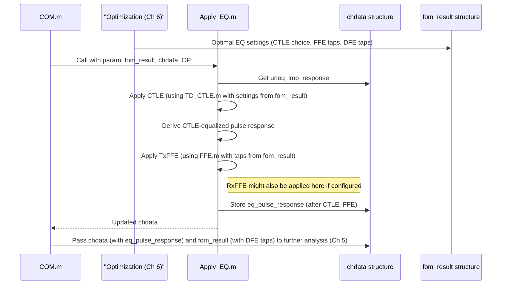

# Chapter 4: Signal Equalization Engine

Welcome back! In [Chapter 3: Frequency/Time Domain Transformation & Causality](03_frequency_time_domain_transformation___causality_.md), we saw how `com_code` takes the channel's S-parameters and converts them into a time-domain impulse response. This impulse response, `uneq_imp_response`, tells us how a short "tap" gets distorted by the channel. Often, this distortion is significant – our nice, clean digital pulses get smeared, weakened, and generally messed up.

Imagine you're trying to send a secret message using flashlight pulses. If the air is foggy (like our channel), your sharp flashes become blurry and might overlap, making it hard for your friend (the receiver) to read the message. This chapter is about the "magic glasses" and techniques your friend might use to make those blurry flashes sharp and clear again. This is what the **Signal Equalization Engine** in `com_code` does for digital signals.

## What's the Big Deal? Restoring Blurry Signals

When a digital signal (a series of '1's and '0's) travels through a channel (like a wire or optical fiber), it encounters various impairments:
*   **Loss:** The signal gets weaker, especially its high-frequency components, which are crucial for sharp edges.
*   **Dispersion:** Different frequency components of the signal travel at slightly different speeds, causing the pulse to spread out.

This spreading is a major problem. If one pulse spreads too much, its "tail" can spill into the time slot of the next pulse, or its "front" can be distorted by the tail of the previous pulse. This is called **Inter-Symbol Interference (ISI)** – literally, symbols interfering with each other.

```mermaid
graph LR
    subgraph Before Channel
        A[Sharp Pulse 1] --> B(Sharp Pulse 0)
    end
    subgraph After Channel (Distorted)
        C[Blurred & Weakened Pulse 1] --> D(Blurred & Weakened Pulse 0 with ISI)
    end
    A --> C
    B --> D
    note right of D : Oh no! Pulse 1's tail <br/> is messing with Pulse 0!
```

If ISI is too severe, the receiver can't tell if a '1' or a '0' was sent, leading to errors. The **Signal Equalization Engine** is a collection of techniques designed to counteract these channel distortions and reduce ISI, helping the receiver make correct decisions. It's like a "signal restorer."

Our goal here is to take the distorted, unequalized pulse response (`uneq_pulse_response`) and "clean it up" using various filters to get an equalized pulse response (`eq_pulse_response`).

## Key Concepts: The Equalizer's Toolkit

The `com_code` Signal Equalization Engine uses several clever tricks. Let's look at the main ones:

### 1. Inter-Symbol Interference (ISI) Revisited

Imagine shouting in a big, empty hall. Your voice echoes. If you shout words quickly, the echo of one word can drown out the beginning of the next. That's ISI!
*   **Post-cursor ISI:** The "echo" or tail of a *previous* pulse interfering with the *current* pulse.
*   **Pre-cursor ISI:** The tail of a *previous* pulse affecting the shape of the *current* pulse even *before* the main peak of the current pulse arrives. This can happen due to how filters shape the signal.

Equalizers try to predict and cancel these "echoes."

### 2. Continuous Time Linear Equalization (CTLE)

*   **What it is:** The CTLE is usually an analog filter (or modeled as one) at the receiver. Think of it as a sophisticated tone control on a stereo.
*   **How it works:** Channels often attenuate (weaken) high frequencies more than low frequencies. This loss of high frequencies makes pulses rounded and slow. The CTLE provides frequency-dependent gain – it boosts those weakened high frequencies back up.
*   **Analogy:** If you're listening to music where the treble is too low, you turn up the treble knob. CTLE does something similar for signals.
*   **Key parts:** CTLEs are often defined by:
    *   **Poles (f_p1, f_p2):** Frequencies where the CTLE's gain starts to roll off (like a bass or midrange control).
    *   **Zero (f_z):** A frequency where the CTLE's gain gets a boost (like a treble control).
    *   **DC Gain (GDC or kacdc_dB):** How much it boosts/cuts very low frequencies.
*   **In `com_code`:** You'll specify ranges for these pole/zero locations and gains in your configuration file (from [Chapter 1: COM Configuration and Parameter Management](01_com_configuration_and_parameter_management_.md)). `com_code` can then select the best CTLE setting.

This is the first line of defense, trying to "re-shape" the signal by fixing broad frequency imbalances.

### 3. Feed-Forward Equalization (FFE)

*   **What it is:** FFE is a digital filter. Imagine a series of "taps." Each tap takes the signal, delays it by a bit, scales it (multiplies by a coefficient), and then all these scaled, delayed versions are summed up.
*   **How it works:** By carefully choosing the coefficients (the tap weights), the FFE can create a sort of "anti-distortion" signal that cancels out ISI.
    *   **Post-cursor taps:** These taps use information from the *current* symbol and *upcoming* parts of the signal (relative to the main cursor of the FFE which aligns with the symbol) to cancel trailing ISI from *previous* symbols that have already affected the current symbol's shape.
    *   **Pre-cursor taps:** These taps use information from *earlier* parts of the signal (relative to the main cursor) to cancel ISI that affects the *beginning* of the current symbol.
*   **Where it's used:**
    *   **Transmitter FFE (TxFFE):** The transmitter pre-distorts the signal before sending it, to counteract the channel's known distortion. Like pre-shaping your shout to make it clearer in the echoy hall.
    *   **Receiver FFE (RxFFE):** The receiver tries to clean up the signal it receives.
*   **Analogy:** Noise-canceling headphones listen to the outside noise and generate an "opposite" sound wave to cancel it. FFE taps work similarly, creating "anti-echoes" based on the signal itself.
*   **In `com_code`:** You define the number of FFE taps. `com_code` (often in the optimization loop described in [Chapter 6: COM/FOM Optimization Loop](06_com_fom_optimization_loop_.md)) finds the best tap values.

### 4. Decision Feedback Equalization (DFE)

*   **What it is:** DFE is another digital filter, but it's a bit smarter. It works at the receiver.
*   **How it works:** After the receiver makes a decision about a bit (e.g., "Okay, that was a '1'!"), the DFE uses this decision. It knows what a '1' (or '0') from that position should look like if it were to cause post-cursor ISI. So, it subtracts that predicted ISI from the incoming signal for *future* bits.
*   **"Decision Feedback":** The *decision* about a past bit is *fed back* to help clean up the current bit.
*   **Limitation:** DFE can only cancel post-cursor ISI (echoes from bits that have already been decided). It can't do much about pre-cursor ISI because it doesn't know what the future bits are yet!
*   **Analogy:** If you're listening to someone in an echoy hall, once you clearly understand a word they said, you can mentally "subtract" its echo while listening for their next word.
*   **In `com_code`:** You specify the number of DFE taps. `com_code` finds the best DFE tap values. These taps represent how much of the "echo" from each previous decided bit needs to be subtracted.

## How `com_code` Applies Equalization

The `Apply_EQ.m` script is central to applying the linear equalizers (CTLE and FFE) in `com_code`. It takes the unequalized impulse response (`uneq_imp_response`) and the chosen equalizer settings (often found during an optimization step and stored in a structure called `fom_result`) and produces an equalized impulse/pulse response.

DFE is conceptually part of the equalization engine. Its tap coefficients are determined (also often in `fom_result`), and its effect is to remove ISI contributions from *already decided* symbols. This "removal" is typically modeled in the statistical analysis part of COM ([Chapter 5: Statistical Noise and Interference Analysis (PDF/CDF)](05_statistical_noise_and_interference_analysis__pdf_cdf_.md)) rather than by directly filtering the `eq_pulse_response` stored in `chdata`.

Let's see a simplified flow:



### Applying CTLE

The CTLE can be defined in the frequency domain (how it affects different frequencies) or applied as a filter in the time domain.

**1. Frequency Domain Definition (`FD_CTLE.m`)**
This function defines the CTLE's transfer function, `hctf`, which tells us how much it amplifies or attenuates each frequency.

```matlab
% Simplified from FD_CTLE.m
function [hctf] = FD_CTLE(freq, fb, f_z, f_p1, f_p2, kacdc_dB)
    % freq: vector of frequencies
    % f_z, f_p1, f_p2: zero and pole frequencies
    % kacdc_dB: DC gain in decibels

    % This formula describes a typical 2-pole, 1-zero CTLE response
    hctf = ( 10.^(kacdc_dB/20) + 1j*freq/f_z ) ./ ...
           ( (1+1j*freq/f_p1) .* (1+1i*freq/f_p2) ) ;
end
```
This `hctf` can then be multiplied by the signal's S-parameters in the frequency domain. Or, it can be converted to a time-domain filter.

**2. Time Domain Application (`TD_CTLE.m`)**
This function applies the CTLE directly to a time-domain impulse response (`ir_in`) using a digital filter. The `poly` and `filter` commands are MATLAB's way of setting up and using such a filter.

```matlab
% Simplified from TD_CTLE.m
function [impulse_response_out] = TD_CTLE(ir_in, fb, f_z, f_p1, f_p2, kacdc_dB, oversampling)
    % ... (calculations for p1_ctle, p2_ctle, z_ctle, k_ctle) ...
    % ... (bilinear transform to get digital filter coefficients p2d, p1d, zd, kd) ...
    
    % B_filt are the "numerator" coefficients (related to zeros)
    % A_filt are the "denominator" coefficients (related to poles)
    % These define the digital filter that mimics the analog CTLE
    B_filt = k_ctle_equivalent_digital_gain * poly([zd_digital, -1]); % Simplified
    A_filt = poly([p1d_digital, p2d_digital]);                     % Simplified

    % Apply the filter to the input impulse response
    impulse_response_out = filter(B_filt, A_filt, ir_in);
end
```
The `filter` command effectively slides this CTLE filter over the input impulse response to produce the CTLE-equalized output. `Apply_EQ.m` uses this function.

### Applying FFE

The `FFE.m` script applies the Feed-Forward Equalizer to a signal `V` (which could be our pulse response).

```matlab
% Simplified from FFE.m
function [ V_out ] = FFE( C , cmx, spui, V_in )
    % C: FFE tap coefficients (e.g., [c_minus_1, c_main, c_plus_1])
    % cmx: number of pre-cursor taps (taps before the main tap)
    % spui: samples per Unit Interval (how many data points make one bit time)
    % V_in: input signal (pulse response)

    V_out = zeros(size(V_in)); % Initialize output signal
    if iscolumn(V_in); V_in=V_in.'; end % Ensure V_in is a row

    for i = 1:length(C) % Loop through each FFE tap
        if C(i) ~= 0 % Only apply if tap weight is not zero
            % Calculate how much to shift the signal for this tap
            % (i-1-cmx) gives tap index relative to main: -1 for pre, 0 for main, +1 for post
            ishift_samples = (i-1-cmx) * spui;
            
            % Shift the input signal and add its scaled version to output
            V_shifted = circshift(V_in, ishift_samples);
            V_out = V_out + V_shifted * C(i);
        end
    end
end
```
`circshift` is like sliding a copy of the signal left or right. The FFE essentially adds up multiple, differently scaled and shifted versions of the input signal to itself to cancel out ISI. `Apply_EQ.m` uses this for TxFFE (and RxFFE if enabled).

### Applying DFE (Conceptually)

DFE is a bit different. It doesn't just filter the incoming waveform in a linear way *before* a decision is made. Instead, it uses *past decisions* to subtract expected ISI. The `applyDFEbk.m` script shows how a DFE bank's contribution might be calculated and subtracted from an ISI profile (`hisi`).

```matlab
% Simplified from applyDFEbk.m
function [hisi_out, tap_coef_out] = applyDFEbk(hisi_in, idx_start, num_taps, ...
                                               cursor_val, bmax_gain, dfe_quant_step)
    % hisi_in: input ISI profile (e.g., post-cursor samples of pulse response)
    % idx_start: starting index in hisi_in for this DFE bank
    % num_taps: number of DFE taps in this bank
    % cursor_val: The amplitude of a decided main bit (e.g., +1 or -1 for NRZ)
    % bmax_gain: Maximum allowed gain for any DFE tap
    % dfe_quant_step: Quantization step for DFE tap values (0 if none)

    tap_indices = idx_start : idx_start + num_taps - 1;
    isi_samples_for_dfe = hisi_in(tap_indices);

    % Determine DFE tap coefficients (simplified: ideal would be isi_sample / cursor_val)
    % Real DFE taps are quantized and limited.
    raw_tap_values = isi_samples_for_dfe / cursor_val;
    if dfe_quant_step ~= 0
        quantized_tap_values = floor(abs(raw_tap_values) / dfe_quant_step) .* ...
                               dfe_quant_step .* sign(raw_tap_values);
    else
        quantized_tap_values = raw_tap_values;
    end
    
    tap_coef_out = min(abs(quantized_tap_values), bmax_gain) .* sign(quantized_tap_values);

    % Subtract the DFE's correction from the ISI profile
    hisi_out = hisi_in; % Start with a copy
    hisi_out(tap_indices) = hisi_in(tap_indices) - cursor_val * tap_coef_out;
end
```
In this snippet:
1.  We look at the ISI samples (`isi_samples_for_dfe`) that the DFE taps are supposed to cancel.
2.  We calculate what the DFE tap coefficients (`tap_coef_out`) would need to be, considering limits (`bmax_gain`) and quantization (`dfe_quant_step`).
3.  We then subtract the DFE's estimated correction (`cursor_val * tap_coef_out`) from those ISI samples. `cursor_val` represents the value of the past decided bit that caused this ISI.

The DFE tap coefficients themselves are typically found during the optimization process (see [Chapter 6: COM/FOM Optimization Loop](06_com_fom_optimization_loop_.md)) and stored in `fom_result`. The statistical analysis in [Chapter 5: Statistical Noise and Interference Analysis (PDF/CDF)](05_statistical_noise_and_interference_analysis__pdf_cdf_.md) will then use these DFE tap values to account for the ISI reduction that DFE provides.

### The Main Application Script: `Apply_EQ.m`

This script orchestrates the application of CTLE and FFE based on settings from `param` and `fom_result`.

```matlab
% Simplified logic from Apply_EQ.m
function chdata = Apply_EQ(param, fom_result, chdata, OP)
    % Get CTLE settings from fom_result (chosen by optimizer)
    FZ = param.CTLE_fz(fom_result.ctle_setting_index);
    FP1 = param.CTLE_fp1(fom_result.ctle_setting_index);
    % ... and other CTLE parameters ...

    for i = 1:param.number_of_s4p_files % Loop through each channel (e.g., main, crosstalk)
        uneq_ir = chdata(i).uneq_imp_response; % Unequalized impulse response from Ch 3

        % 1. Apply CTLE
        if OP.INCLUDE_CTLE == 1
            % Call TD_CTLE to get CTLE-equalized impulse response
            eq_ir_ctle = TD_CTLE(uneq_ir, param.fb, FZ, FP1, ..., param.samples_per_ui);
        else
            eq_ir_ctle = uneq_ir;
        end
        chdata(i).eq_imp_response = eq_ir_ctle; % Store CTLE-only impulse response

        % Convert to pulse response (summing impulse response over 1 UI)
        eq_pulse_ctle = filter(ones(1, param.samples_per_ui), 1, eq_ir_ctle);

        % 2. Apply Transmitter FFE (if it's a THRU or FEXT channel)
        eq_pulse_txffe = eq_pulse_ctle; % Start with CTLE'd pulse
        if isequal(chdata(i).type, 'THRU') % Or FEXT
            txffe_taps = fom_result.txffe_taps;
            cursor_pos = fom_result.cursor_main_tap_index; % For FFE
            eq_pulse_txffe = FFE(txffe_taps, cursor_pos, param.samples_per_ui, eq_pulse_ctle);
        end
        
        % This is often stored for analysis before any Rx FFE
        chdata(i).ctle_pulse = eq_pulse_txffe; 

        % 3. Apply Receiver FFE (if enabled and configured)
        % ... (similar logic using RxFFE taps from fom_result if OP.RxFFE is true) ...
        % eq_pulse_final = FFE(rxffe_taps, ... eq_pulse_txffe);
        
        % Store the finally (linearly) equalized pulse response
        chdata(i).eq_pulse_response = eq_pulse_txffe; % Or eq_pulse_final if RxFFE is applied
    end
end
```
This shows how `Apply_EQ.m` sequentially applies CTLE and then FFE to the channel's impulse/pulse response using the pre-determined optimal settings from `fom_result`. The DFE taps from `fom_result` are used later in the COM calculation to assess their impact.

## Conclusion

You've now learned about the Signal Equalization Engine in `com_code`! You've seen that when signals get distorted by the channel, we can use a toolkit of equalizers to try and clean them up:
*   **CTLE** reshapes the signal in the frequency domain, boosting lost high frequencies.
*   **FFE** (at Tx or Rx) uses a set of taps to cancel out ISI in a linear fashion.
*   **DFE** (at Rx) cleverly uses past decisions about bits to subtract their trailing ISI.

`com_code` models the application of these equalizers to take a distorted pulse response and produce a much cleaner, equalized pulse response. This is crucial for figuring out if the receiver can reliably understand the transmitted data.

Now that we have an equalized pulse response, and we know the DFE will help further, we need to consider another enemy of clean signals: noise and other random interference. How do these affect our chances of getting the bits right? We'll explore this in the next chapter: [Chapter 5: Statistical Noise and Interference Analysis (PDF/CDF)](05_statistical_noise_and_interference_analysis__pdf_cdf__.md).

---

Generated by [AI Codebase Knowledge Builder](https://github.com/The-Pocket/Tutorial-Codebase-Knowledge)