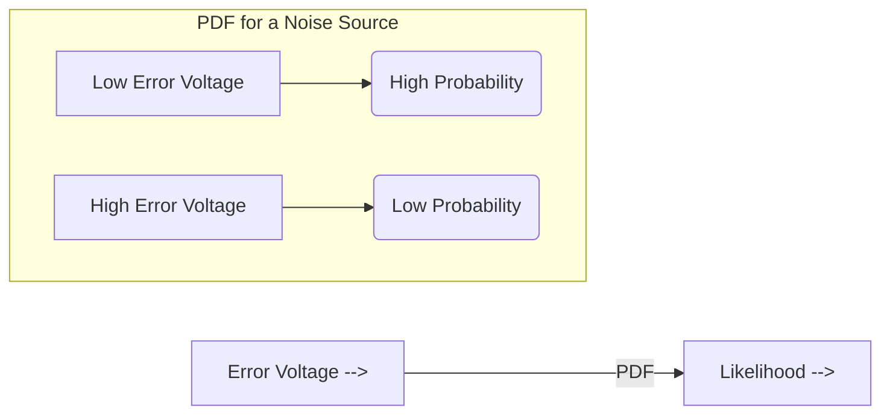
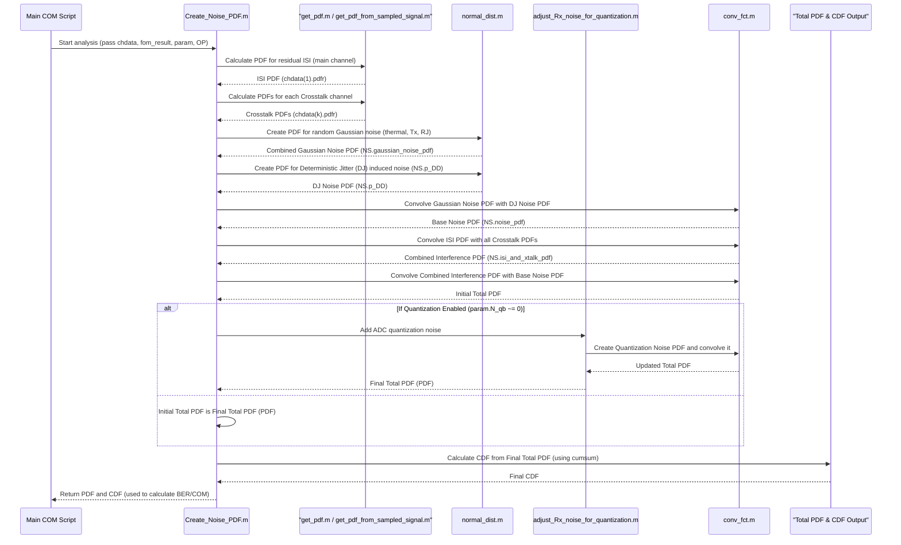

# Chapter 5: Statistical Noise and Interference Analysis (PDF/CDF)

Welcome back! In [Chapter 4: Signal Equalization Engine](04_signal_equalization_engine_.md), we saw how `com_code` uses equalizers like CTLE, FFE, and DFE to clean up the distorted signal, giving us an `eq_pulse_response`. This equalized signal is much sharper and clearer.

But even the best equalizers can't make the signal perfect. There's always some leftover distortion, and more importantly, there's **random noise** – tiny, unpredictable voltage fluctuations that get added to our signal. Think of it like this: in Chapter 4, we focused our blurry flashlight beam. Now, we have to worry about our hand shaking randomly (noise) or other faint, flickering lights in the background (crosstalk or residual interference). These can still make it hard for our friend to tell if a flash was a '1' or a '0'.

This chapter is all about understanding and quantifying this "fuzziness" or "uncertainty" in the received signal. We'll learn how `com_code` models these impairments statistically to ultimately predict how often the receiver might make a mistake in deciphering the bits.

## What's the Goal? Predicting Mistakes

Our main goal here is to figure out the **probability of a bit error (BER)**. If we send a '1', what's the chance the receiver sees it as a '0' because noise and interference pushed the signal voltage too low? If we send a '0', what's the chance it's mistaken for a '1' because noise pushed it too high?

To do this, we need to:
1.  Identify all the things that make our signal "fuzzy."
2.  Describe how "fuzzy" each of these things makes the signal using probabilities.
3.  Combine all these "fuzziness" descriptions to get a picture of the *total* fuzziness.
4.  Use this total fuzziness picture to calculate the chance of an error.

## Key Concepts: The Building Blocks of Uncertainty

Let's break down the important ideas.

### 1. Sources of Fuzziness: Noise and Interference

*   **Noise Sources (Random):** These are generally unpredictable, like static on an old radio.
    *   **Thermal Noise:** Caused by the random jiggling of electrons in wires and components. It's always there if things are above absolute zero temperature.
    *   **Transmitter Noise:** The transmitter itself isn't perfect; it might add small random variations to the signal it sends. `com_code` models this using `SNR_TX` (Signal-to-Noise Ratio of the Transmitter).
    *   **Quantization Noise:** If the receiver uses an Analog-to-Digital Converter (ADC) to measure the voltage, the ADC has finite precision. It's like measuring with a ruler that only has markings every millimeter – you have to round to the nearest mark, introducing a small error. This is `N_qb` in `com_code`.

*   **Interference Sources (Can Be More Structured, but Treated as Noise):**
    *   **Crosstalk:** Signals from neighboring wires leaking into our signal wire. This is like hearing someone else's conversation faintly on your phone call. `com_code` models Far-End Crosstalk (FEXT) and Near-End Crosstalk (NEXT).
    *   **Residual Inter-Symbol Interference (ISI):** Even after the FFE from [Chapter 4: Signal Equalization Engine](04_signal_equalization_engine_.md), some "smearing" of pulses might remain. The DFE will cancel a good chunk of the *post-cursor* ISI from already-decided bits, but any ISI it *doesn't* cancel, plus any *pre-cursor* ISI, contributes to the fuzziness.

All these sources add unwanted voltage variations to our signal at the decision-making moment.

### 2. Describing Fuzziness: The Probability Density Function (PDF)

How do we describe something random or uncertain like noise? We use a **Probability Density Function (PDF)**.

*   **What it is:** A PDF is a graph (or a list of numbers) that tells you how likely different error voltage levels are.
    *   The x-axis is the error voltage (e.g., -0.1V, 0V, +0.1V).
    *   The y-axis tells you the "density" or relative likelihood of that error voltage occurring. Higher y-values mean more likely.
*   **Analogy:** Imagine throwing thousands of darts at a target.
    *   If you're a good player, most darts will cluster near the bullseye (small error voltage, high probability).
    *   Fewer darts will land far from the bullseye (large error voltage, low probability).
    *   A PDF is like a smooth curve drawn over the pattern of dart holes, showing where they are most dense.


*   **In `com_code`:**
    *   A PDF is often stored in a structure with fields like `.x` (a vector of voltage values) and `.y` (a vector of corresponding probabilities or densities). The `BinSize` field tells us the voltage step between `x` values.
    *   **Gaussian (Normal) Noise:** Random noise sources like thermal noise are often modeled by a bell-shaped Gaussian PDF using `normal_dist.m`.
    *   **ISI/Crosstalk PDFs:** The fuzziness from leftover ISI or crosstalk is determined by looking at all the possible ways past/neighboring bits could combine to create error voltages. `get_pdf_from_sampled_signal.m` (or `get_pdf.m` which calls it) is used to create these PDFs from the pulse response samples. It considers all `L` possible levels of the interfering symbols.

### 3. Combining All the Fuzziness: Convolution

We have many different sources of noise and interference, each with its own PDF. To find out the *total* fuzziness, we need to combine their effects. The mathematical operation for this is **convolution**.

*   **What it is:** When you convolve two PDFs, you're essentially saying, "If I have uncertainty from source A, and then I add uncertainty from source B to it, what's the resulting total uncertainty?"
*   **Analogy:**
    1.  Imagine you have a slightly blurry photo (this is like the PDF of ISI).
    2.  Now, you take a photo *of that blurry photo*, but your hand shakes a bit while doing so (the hand-shake is like the PDF of random thermal noise).
    3.  The final photo you get will be even blurrier than the first one. This new, combined blurriness is like the convolved PDF.
*   **In `com_code`:**
    *   The function `conv_fct.m` (or `conv_fct_MeanNotZero.m`) is used to convolve two PDF structures.
    *   `com_code` serially convolves the PDFs of:
        1.  Residual ISI from the main channel (after FFE and ideal DFE action).
        2.  All FEXT crosstalk sources.
        3.  All NEXT crosstalk sources.
        4.  Random Gaussian noise (thermal, transmitter noise, jitter-induced noise).
        5.  Quantization noise (if an ADC is modeled via `param.N_qb`).
    *   The result of all these convolutions is the **Total Noise and Interference PDF**. This single PDF describes the combined likelihood of all possible error voltages from all sources.

### 4. From Total Fuzziness to Error Chance: The Cumulative Distribution Function (CDF)

Now we have the Total Noise and Interference PDF. How do we use it to find the probability of a bit error? We first convert the PDF into a **Cumulative Distribution Function (CDF)**.

*   **What it is:** For any given error voltage `V` on the x-axis, the CDF tells you the total probability that the actual error voltage will be *less than or equal to `V`*.
*   **Analogy:**
    *   Remember our dartboard PDF? It showed the density of darts at each spot.
    *   The CDF is like asking, "If I draw a vertical line at a certain distance from the bullseye, what fraction of *all* the darts landed to the left of this line?"
*   **Calculation:** The CDF is calculated by taking the cumulative sum of the PDF's `y` values. In MATLAB, this is often just `CDF_values = cumsum(PDF_values.y)`.
*   **How it helps find Bit Errors:**
    *   Let's say our ideal signal voltage for a '0' is -0.5V and for a '1' is +0.5V. The receiver decides '0' if the voltage is < 0V and '1' if > 0V (0V is the decision threshold).
    *   Suppose we transmit a '1' (ideal +0.5V). An error occurs if the noise + interference is so negative that it pulls the received voltage below 0V. This means noise + interference < -0.5V.
    *   The CDF of our Total Noise and Interference PDF can directly tell us: `P(Total_Noise_Interference <= -0.5V)`. This is our BER for a transmitted '1'!
    *   Similarly, if we transmit a '0' (ideal -0.5V), an error occurs if noise + interference > +0.5V. The CDF can also help find this: `1 - P(Total_Noise_Interference <= +0.5V)`.
*   **In `com_code`:** Functions like `CDF_ev.m` (find probability given a voltage) and `CDF_inv_ev.m` (find voltage given a probability) are used with the CDF to determine these error probabilities or the voltage margins.

## Under the Hood: `com_code`'s Statistical Journey

The main script orchestrating this statistical analysis is `Create_Noise_PDF.m`. It brings together all the noise and interference components.

Let's visualize the process:



### A Closer Look at `Create_Noise_PDF.m` (Simplified Flow)

1.  **Calculate Variances (Sigma Squared) for Random Noises:**
    *   It determines standard deviations (`sigma`) for various random noise sources:
        *   `NS.sigma_N`: Receiver thermal noise (based on `param.eta_0` and filter shapes).
        *   `NS.sigma_TX`: Transmitter noise (based on `param.SNR_TX` and signal amplitude `A_s`).
        *   `NS.sigma_rjit`: Noise due to random jitter (`param.sigma_RJ`) interacting with the signal slope.
    *   These are combined into `NS.sigma_G`, the total Gaussian noise standard deviation.
    *   If Rx calibration is active (`OP.RX_CALIBRATION`), bounded noise `sigma_ne` from the calibration channel is also included.

2.  **Create PDFs for Basic Noise Components:**
    *   **Gaussian Noise:** `NS.gaussian_noise_pdf = normal_dist(NS.sigma_G, NS.ber_q, param.delta_y);`
        *   `NS.ber_q` is a "crest factor" – how many sigmas to extend the PDF to, based on `param.specBER`.
        *   `param.delta_y` is the voltage bin size for the PDF.
    *   **Deterministic Jitter (DJ) Noise:** `NS.p_DD = get_pdf_from_sampled_signal(param.A_DD * fom_result.h_J, param.levels, param.delta_y);`
        *   `param.A_DD` is the amplitude of deterministic jitter.
        *   `fom_result.h_J` is the "jitter transfer function" – how much voltage noise a timing error creates. This comes from the slope of the equalized pulse.
    *   **Combined Base Noise:** `NS.noise_pdf = conv_fct(NS.gaussian_noise_pdf, NS.p_DD);` This `NS.noise_pdf` represents the `N(t)` term often seen in COM specifications.

3.  **Get Interference PDFs (ISI and Crosstalk):**
    *   The script iterates through each channel defined in `chdata` (the main "THRU" channel and all crosstalk aggressor channels).
    *   For each, it calls `get_pdf(chdata(i), param.delta_y, t_s, param, OP)` (where `t_s` is the sampling time).
    *   `get_pdf.m` (which internally uses `get_pdf_from_sampled_signal.m`) takes the `eq_pulse_response` from [Chapter 4: Signal Equalization Engine](04_signal_equalization_engine_.md), effectively subtracts the main cursor and the ISI that would be cancelled by an ideal DFE (using DFE tap limits `param.bmax`, `param.bmin`), and then builds a PDF from the *remaining* pulse samples (the residual ISI).
    *   This results in:
        *   `NS.sci_pdf = chdata(1).pdfr` (Self-Channel Interference for the main signal path).
        *   Individual crosstalk PDFs, which are then convolved together to get `NS.cci_pdf` (Combined Channel Interference from crosstalk).
    *   Finally, ISI and crosstalk are convolved: `NS.isi_and_xtalk_pdf = conv_fct(NS.sci_pdf, NS.cci_pdf);`

4.  **Create the Total PDF (Before Quantization):**
    *   `combined_interference_and_noise_pdf = conv_fct(NS.isi_and_xtalk_pdf, NS.noise_pdf);`
    *   This PDF now represents the combined effect of all ISI, crosstalk, and continuous random noises.

5.  **Add ADC Quantization Noise (If Applicable):**
    *   If `param.N_qb` (number of ADC quantization bits) is not zero, `adjust_Rx_noise_for_quantization.m` is called.
    *   This function:
        *   Estimates the ADC's input voltage range and the size of its Least Significant Bit (LSB) based on the signal statistics and `param.P_qc` (clipping probability).
        *   Models quantization noise as a uniform PDF with a width of one LSB (`NS.sigma_Q = adc_lsb/sqrt(12)`).
        *   If there's an RxFFE (Receiver FFE), it considers how the RxFFE taps might "color" or spread this quantization noise, convolving the RxFFE's tap-weighted quantization noise PDFs.
        *   The resulting quantization noise PDF is then convolved with the `combined_interference_and_noise_pdf`.

6.  **Calculate the Final CDF:**
    *   `CDF = cumsum(PDF.y);` where `PDF` is the final total noise and interference PDF.
    *   This `PDF` and `CDF` are the key outputs that will be used to calculate COM or other figures of merit.

### Example Snippets: The PDF Toolkit

Let's look at simplified versions of some key helper functions.

**Creating a Gaussian PDF with `normal_dist.m`:**
This function creates a bell-curve PDF for random noise.

```matlab
% Simplified from normal_dist.m
function pdf_struct = normal_dist(sigma, n_sigma_tails, bin_size)
    % sigma: standard deviation of the noise
    % n_sigma_tails: how many sigmas to extend the PDF (e.g., 6 for low BER)
    % bin_size: voltage resolution for the PDF x-axis

    pdf_struct.BinSize = bin_size;
    
    % Determine the range of x-axis: +/- n_sigma_tails from the mean (0)
    % pdf_struct.Min is the bin number of the minimum voltage value
    pdf_struct.Min = -round(n_sigma_tails * sigma / bin_size); 
    
    % Create the voltage values for each bin
    max_bin = -pdf_struct.Min; % Symmetric range
    pdf_struct.x = (pdf_struct.Min : max_bin) * bin_size;     
    
    % Calculate Gaussian probability density for each x value
    % (eps is a very small number to avoid division by zero if sigma is tiny)
    pdf_struct.y = exp(-pdf_struct.x.^2 / (2 * sigma^2 + eps));
    
    % Normalize so that the sum of probabilities in pdf_struct.y is 1
    pdf_struct.y = pdf_struct.y / sum(pdf_struct.y);
end
```
This gives us a PDF structure (`pdf_struct`) representing a Gaussian distribution.

**Creating a PDF from Signal Samples with `get_pdf_from_sampled_signal.m`:**
This is used for ISI or crosstalk. It considers that each interfering sample's voltage is itself a random variable because it depends on a transmitted symbol that could have been any of the `L` levels (e.g., for PAM4, L=4).

```matlab
% Simplified concept from get_pdf_from_sampled_signal.m
function pdf_total = get_pdf_from_sampled_signal(interference_samples, L_levels, bin_size)
    % interference_samples: vector of ISI or crosstalk voltage samples
    % L_levels: number of signal levels (e.g., 2 for NRZ, 4 for PAM4)
    % bin_size: voltage resolution for the PDF

    % Define the possible symbol levels (e.g., for PAM4: -1, -1/3, 1/3, 1)
    symbol_values = (2*(0:L_levels-1)/(L_levels-1) - 1);
    % Assume each symbol level is equally likely
    symbol_probabilities = ones(1, L_levels) / L_levels; 

    % Initialize the total PDF to a perfect "delta function" at 0 voltage, probability 1
    % d_cpdf is a helper to create simple discrete PDFs.
    pdf_total = d_cpdf(bin_size, 0, 1); 

    % For each interference sample, convolve its effect
    for k = 1:length(interference_samples)
        current_sample_voltage = interference_samples(k);
        
        % If this sample is too small compared to bin_size, it might be ignored
        if abs(current_sample_voltage) < bin_size/2 % Simplified condition
            continue;
        end
        
        % Create a small PDF representing this *one* sample's effect.
        % The voltage it contributes is current_sample_voltage * (a random symbol_value)
        voltages_from_this_sample = current_sample_voltage * symbol_values;
        pdf_one_sample = d_cpdf(bin_size, voltages_from_this_sample, symbol_probabilities);
        
        % Convolve this one sample's PDF with the running total PDF
        pdf_total = conv_fct(pdf_total, pdf_one_sample);
    end
end
```
This function builds up the PDF by considering one interfering sample at a time and convolving its probabilistic contribution.

**Convolving two PDFs with `conv_fct.m`:**
This function takes two PDF structures and returns their convolution.

```matlab
% Simplified from conv_fct.m
function p_convolved = conv_fct(pdf1_struct, pdf2_struct)
    % pdf1_struct, pdf2_struct: input PDF structures

    if pdf1_struct.BinSize ~= pdf2_struct.BinSize
        error('Bin sizes must be equal for PDF convolution!');
    end

    p_convolved = pdf1_struct; % Use one as a template for the output structure
    
    % The core of convolution: convolve the probability vectors (y-values)
    p_convolved.y = conv(pdf1_struct.y, pdf2_struct.y); % MATLAB's built-in conv for vectors

    % The x-axis (voltage values) of the convolved PDF also needs to be updated.
    % The minimum bin number of the new PDF is the sum of the input PDFs' min bin numbers.
    p_convolved.Min = round(pdf1_struct.Min + pdf2_struct.Min); 
    
    % Calculate the full x-axis voltage vector for the convolved PDF
    max_bin_convolved = p_convolved.Min + length(p_convolved.y) - 1;
    p_convolved.x = (p_convolved.Min : max_bin_convolved) * p_convolved.BinSize;
    
    % IMPORTANT: conv_fct itself does NOT re-normalize p_convolved.y to sum to 1.
    % The calling function is responsible for normalization if needed,
    % though for intermediate convolutions, it's often left unnormalized until the end.
end
```

**Using the CDF with `CDF_inv_ev.m`:**
Once you have the final Total Noise and Interference CDF, this function can tell you what error voltage corresponds to a given probability (like your target BER).

```matlab
% Simplified from CDF_inv_ev.m
function voltage_at_probability = CDF_inv_ev(target_probability, pdf_structure, cdf_values)
    % target_probability: The cumulative probability you're interested in (e.g., 1e-6)
    % pdf_structure: The PDF structure (needed for its .x voltage axis)
    % cdf_values: A vector of cumulative probability values (from 0 to 1)

    % Find the first index in the CDF vector where the value is >= target_probability
    found_index = find(cdf_values >= target_probability, 1, 'first');

    if isempty(found_index)
        % If target_probability is too high (e.g., >1 or beyond the CDF's range)
        voltage_at_probability = pdf_structure.x(end); % Return the max voltage in the PDF
    else
        % Return the voltage corresponding to this index
        voltage_at_probability = pdf_structure.x(found_index);
    end
end
```
For instance, `voltage_at_probability = CDF_inv_ev(param.specBER, Total_PDF, Total_CDF)` would give you the noise/interference voltage level that is exceeded with probability `param.specBER`. This voltage is directly related to the eye opening.

## Conclusion

You've now journeyed through the statistical heart of `com_code`! We've seen how various sources of noise and interference, which make our received signal "fuzzy," are modeled:
*   Each source's fuzziness is described by a **Probability Density Function (PDF)**.
*   These individual PDFs are mathematically combined using **convolution** to create a **Total Noise and Interference PDF**.
*   This total PDF is then converted into a **Cumulative Distribution Function (CDF)**.
*   The CDF allows us to calculate the crucial **Bit Error Probability (BER)** – the chance that noise and interference will cause the receiver to misinterpret a bit.

This ability to predict BER is incredibly powerful. It tells us how robust our communication link is. But what if the BER is too high? How do we make it better? We'd want to adjust our equalizer settings (from [Chapter 4: Signal Equalization Engine](04_signal_equalization_engine_.md)) to find the combination that gives the *lowest possible* BER, or the *largest possible* "eye opening" at the target BER.

That's exactly what we'll explore in the next chapter: [Chapter 6: COM/FOM Optimization Loop](06_com_fom_optimization_loop_.md). We'll see how `com_code` intelligently searches for the best equalizer settings to maximize performance.

---

Generated by [AI Codebase Knowledge Builder](https://github.com/The-Pocket/Tutorial-Codebase-Knowledge)