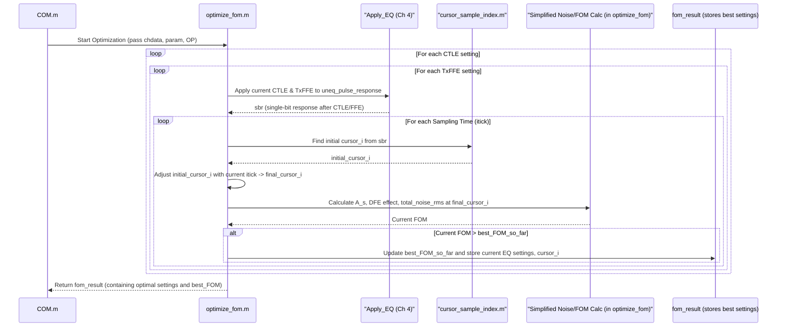

# Chapter 6: COM/FOM Optimization Loop

Welcome back! In [Chapter 5: Statistical Noise and Interference Analysis (PDF/CDF)](05_statistical_noise_and_interference_analysis__pdf_cdf__.md), we learned how `com_code` meticulously calculates the total "fuzziness" (noise and interference) in our signal and uses it to predict the Bit Error Rate (BER). We now have a way to *score* how good our signal is for a given set of channel conditions and equalizer settings.

But here's the big question: what *are* the best equalizer settings? We saw in [Chapter 4: Signal Equalization Engine](04_signal_equalization_engine_.md) that we have several "knobs" we can turn: CTLE parameters, FFE tap weights, DFE tap weights, and even the exact moment the receiver samples the signal. Turning these knobs changes our signal quality. How do we find the "magic combination" that gives us the clearest signal and the lowest BER?

This chapter is all about the **COM/FOM Optimization Loop** – the "master conductor" or "tuning expert" of the `com_code` simulation. Its job is to intelligently search for these optimal settings.

## What's the Big Deal? Finding the Sweet Spot

Imagine you're tuning an old analog radio. You turn one knob for the station (frequency), and another for fine-tuning to get the clearest sound. You listen, adjust, listen, adjust, until the music is as clear as possible.

The COM/FOM Optimization Loop does something very similar for our high-speed digital signals.
*   The "knobs" are the parameters for the CTLE, FFE, DFE, and the receiver's sampling time.
*   The "clearness of the music" is a score called the **Figure of Merit (FOM)** or the **Channel Operating Margin (COM)** itself. This score tells us how good the signal quality is. A higher FOM/COM means a better signal.

The goal of this loop is to try out many different combinations of these "knob settings," calculate the FOM/COM for each, and find the one combination that gives the highest possible score. This effectively maximizes the channel's performance. Without this optimization, we might be using equalizer settings that are far from ideal, leading to poor signal quality and lots of errors.

## Key Concepts: The Optimizer's Strategy

Let's break down the core ideas:

1.  **The "Knobs" (Parameters to Optimize):**
    *   **CTLE Settings:** As we saw in [Chapter 4: Signal Equalization Engine](04_signal_equalization_engine_.md), CTLEs are defined by parameters like DC gain, pole frequencies (`f_p1`, `f_p2`), and zero frequency (`f_z`). In [Chapter 1: COM Configuration and Parameter Management](01_com_configuration_and_parameter_management_.md), you can specify a range or a list of possible settings for these (e.g., a list of different DC gains for the CTLE).
    *   **Transmitter FFE (TxFFE) Taps:** These are coefficients for the TxFFE filter. You can specify a range of values for each pre-cursor and post-cursor tap.
    *   **Receiver Sampling Time (Phase):** Even after the main equalizers, picking the *exact* moment to sample the incoming analog signal matters a lot. The optimizer searches for the best sampling phase within a Unit Interval (UI).
    *   **DFE Taps:** While DFE taps are not usually "swept" in the same way as CTLE or FFE settings in the outermost loops, their values are determined *optimally* based on the pulse response resulting from the chosen CTLE, FFE, and sampling time. The number of DFE taps (`param.ndfe`) and their maximum strength (`param.bmax`) are configured.
    *   **Receiver FFE (RxFFE) Taps (Optional):** If an RxFFE is used, its taps can also be part of the optimization.

2.  **The "Score" (FOM/COM Calculation):**
    For *each combination* of the knob settings it tries, the loop performs a calculation similar to what we saw in [Chapter 5: Statistical Noise and Interference Analysis (PDF/CDF)](05_statistical_noise_and_interference_analysis__pdf_cdf__.md):
    *   It applies the chosen CTLE and FFE settings to the channel's pulse response.
    *   It determines the effect of an ideal DFE.
    *   It calculates the resulting signal amplitude (`A_s`) at the chosen sampling time.
    *   It calculates the total root-mean-square (RMS) value of all noise and residual interference (`total_noise_rms`).
    *   A common FOM is then calculated as: `FOM = 20 * log10(A_s / total_noise_rms)`. This is essentially a signal-to-noise ratio in decibels (dB).
    *   The COM value itself is this FOM.

3.  **The "Search" (Iterative Loop):**
    The optimizer systematically goes through different combinations of the parameter settings. This is often a "brute-force" search, meaning it tries all (or many) possibilities within the ranges you defined in the configuration.
    *   It might have nested loops: an outer loop for CTLE settings, an inner loop for TxFFE settings, and an innermost loop for sampling time adjustments.
    *   It keeps track of the `best_FOM` found so far and the settings that produced it.

4.  **The "Winner" (Optimal Settings):**
    Once the loop has tried all specified combinations, the set of parameters that resulted in the `best_FOM` are declared the "optimal settings." These are then used for the final, detailed COM calculation and for reporting the channel's performance.

## How `com_code` Finds the Best Settings

The primary workhorse for this optimization is the `optimize_fom.m` script. It takes the channel data (`chdata`), various parameters (`param`), and operational flags (`OP`) as input. It then explores the defined parameter space.



### Inside `optimize_fom.m`: A Simplified View

The `optimize_fom.m` script is complex, but its core logic involves nested loops and FOM calculation. Let's look at a highly simplified conceptual structure:

```matlab
% Simplified concept from optimize_fom.m
function result = optimize_fom(OP, param, chdata, ...)
    best_FOM = -inf; % Initialize with a very bad FOM
    % Initialize best_settings_struct to store the winning parameters

    % Loop through all configured CTLE settings (e.g., gdc_values from param)
    for ctle_idx = 1:length(param.ctle_gdc_values)
        current_ctle_gdc = param.ctle_gdc_values(ctle_idx);
        % ... (get other CTLE params like fz, fp1, fp2 for this ctle_idx) ...

        % Apply this CTLE to the unequalized impulse response from chdata
        % This is conceptually what Apply_EQ.m would do for CTLE
        % For each channel in chdata:
        %   chdata_ctle(k).impulse = TD_CTLE(chdata(k).uneq_imp_response, ..., current_ctle_params);
        %   chdata_ctle(k).pulse = filter(ones(1,param.samples_per_ui),1,chdata_ctle(k).impulse);
        % Let's assume chdata_ctle(1).pulse is the CTLE'd pulse response of the main channel

        % Loop through all configured TxFFE tap combinations (e.g., from TXFFE_grid)
        for txffe_tap_combo_idx = 1:num_txffe_combinations
            current_txffe_taps = TXFFE_grid(txffe_tap_combo_idx, :); % Get one set of TxFFE taps
            
            % Apply TxFFE to the CTLE'd pulse response
            % This is conceptually what Apply_EQ.m would do for FFE
            sbr = FFE(current_txffe_taps, ... chdata_ctle(1).pulse); % sbr = single-bit response

            % Find an initial optimal sampling instant for this sbr
            % peak_search_range is a window around the expected peak to speed up search
            [initial_cursor_i, no_zc, sbr_peak_i, ~] = cursor_sample_index(sbr, param, OP, peak_search_range);
            if no_zc, continue; end % Skip if no valid initial cursor

            % Loop through fine adjustments to the sampling time (itick)
            for itick_offset = param.ts_sample_adj_range(1):param.ts_sample_adj_range(2)
                final_cursor_i = initial_cursor_i + itick_offset;

                % Ensure cursor is within valid range of sbr
                if final_cursor_i < 1 || final_cursor_i > length(sbr)
                    continue;
                end

                % --- Calculate FOM for these settings (CTLE, TxFFE, sampling time) ---
                A_s = param.R_LM * sbr(final_cursor_i) / (param.levels - 1); % Signal amplitude
                
                % Determine DFE taps and residual ISI
                % (Simplified: get DFE taps based on sbr post-cursors, param.bmax)
                % (Simplified: calculate sigma_ISI from sbr pre-cursors and residual post-cursors)
                dfetaps = calculate_dfe_taps(sbr, final_cursor_i, param);
                sigma_ISI = calculate_residual_isi_rms(sbr, final_cursor_i, dfetaps, param);
                
                % Calculate other noise terms (simplified)
                sigma_J = calculate_jitter_noise_rms(sbr, final_cursor_i, param); % Jitter noise
                sigma_N_thermal = calculate_thermal_noise_rms(current_ctle_params, param); % Thermal noise
                sigma_TX_noise = calculate_tx_noise_rms(A_s, param); % Transmitter noise
                sigma_XT = calculate_crosstalk_noise_rms(chdata_ctle, current_txffe_taps, param); % Crosstalk

                total_noise_rms = norm([sigma_ISI, sigma_J, sigma_N_thermal, sigma_TX_noise, sigma_XT]);

                current_FOM = 20 * log10(A_s / total_noise_rms);
                % --- End of FOM Calculation ---

                % Compare with best FOM found so far
                if current_FOM > best_FOM
                    best_FOM = current_FOM;
                    % Store all current settings:
                    % result.txffe = current_txffe_taps;
                    % result.ctle = ctle_idx;
                    % result.t_s = final_cursor_i; (sampling instant)
                    % result.itick = itick_offset;
                    % result.DFE_taps = dfetaps;
                    % result.A_s = A_s;
                    % ... and other important values like best_sbr, h_J ...
                end
            end % End itick loop
        end % End TxFFE loop
    end % End CTLE loop
    
    % result structure now contains the optimal settings and the best FOM
end
```

A few important helper concepts within `optimize_fom.m`:

*   **`cursor_sample_index.m`:** This helper function is called to find a good *initial* sampling point (`cursor_i`) for a given equalized pulse response (`sbr`). It often looks for characteristics like zero-crossings or uses criteria like the Muller-Mueller timing recovery algorithm. This gives a starting point before the `itick` loop fine-tunes the sampling phase.

    ```matlab
    % Simplified from cursor_sample_index.m
    function [cursor_i, no_zero_crossing, sbr_peak_i, zxi] = cursor_sample_index(sbr, param, OP, peak_search_range)
        % sbr: single-bit response (pulse after CTLE/FFE)
        % peak_search_range: a smaller part of sbr to search for the peak, for speed.
        
        [~, peak_idx_local] = max(sbr(peak_search_range));
        sbr_peak_i = peak_idx_local + peak_search_range(1) - 1; % Index in full sbr
    
        % Find zero-crossing (zxi) before the peak (simplified)
        % search_start = max(1, sbr_peak_i - 4*param.samples_per_ui);
        % zxi_candidates = find(diff(sign(sbr(search_start:sbr_peak_i))) >= 1) + search_start - 1;
        % if isempty(zxi_candidates), no_zero_crossing = 1; cursor_i=[]; return; end
        % zxi = zxi_candidates(end); % Take the last one before peak
        zxi = sbr_peak_i - round(0.5*param.samples_per_ui); % Oversimplified: guess ZXI
        no_zero_crossing = 0;
    
        % Apply Muller-Mueller or other criteria to refine cursor_i based on zxi
        % mm_range = zxi + (0:2*param.samples_per_ui);
        % metric = abs(sbr(mm_range - param.samples_per_ui) - ... ); % Simplified MM metric
        % [~, mm_offset] = min(metric);
        % cursor_i = zxi + mm_offset -1;
        cursor_i = sbr_peak_i; % Oversimplified: just use the peak after rough ZXI
    end
    ```
    This function helps anchor the search for the best sampling time. The `itick` loop in `optimize_fom` then explores small deviations around this `cursor_i`.

*   **DFE Tap Calculation (Conceptual):** Inside the optimization loop, for a given `sbr` and `final_cursor_i`, the DFE tap values are typically calculated as:
    `DFE_tap_k = sbr(final_cursor_i + k * param.samples_per_ui) / sbr(final_cursor_i)`
    These are then clipped by `param.bmax(k)` (and `param.bmin(k)`). The `param.ndfe` determines how many such taps are calculated. The DFE's job is to cancel these post-cursor ISI terms.

The `fom_result` structure that `optimize_fom.m` outputs will contain all these best settings: the chosen CTLE index, the TxFFE tap values, the final best sampling instant `t_s` (which includes the `itick` offset), the calculated DFE taps for these settings, the best FOM value, the corresponding signal amplitude `A_s`, and the equalized pulse response (`sbr`) for these optimal settings.

### What about different optimization strategies?

While a brute-force grid search (trying all combinations) is common, more advanced optimization algorithms could be used (e.g., gradient descent, genetic algorithms). `com_code` also has heuristics like `param.LOCAL_SEARCH` to speed up the brute-force search by pruning parts of the search space that are unlikely to yield a better FOM once a reasonably good solution has been found.

## Conclusion

You've now seen the "brains" of the `com_code` simulation – the **COM/FOM Optimization Loop**. This crucial step doesn't just analyze a fixed scenario; it actively searches for the *best way* to configure the equalizers and receiver timing to maximize signal quality.
*   It tries many combinations of CTLE, FFE, and sampling time settings.
*   For each combination, it calculates a FOM/COM score.
*   It remembers the settings that gave the highest score.

This optimization is what allows `com_code` to tell you not just *if* a channel works, but *how well* it can be made to work. The `fom_result` structure, filled with these optimal settings, is then passed along for final detailed analysis and visualization.

Now that we have found the best settings and the best possible signal quality score (COM), how do we visualize this performance? How do we look at the "eye" of the signal or understand the margins more intuitively? We'll explore this in the final chapter: [Chapter 7: Performance Metrics & Visualization (Eye, Bathtub, VEC/VEO)](07_performance_metrics___visualization__eye__bathtub__vec_veo__.md).

---

Generated by [AI Codebase Knowledge Builder](https://github.com/The-Pocket/Tutorial-Codebase-Knowledge)