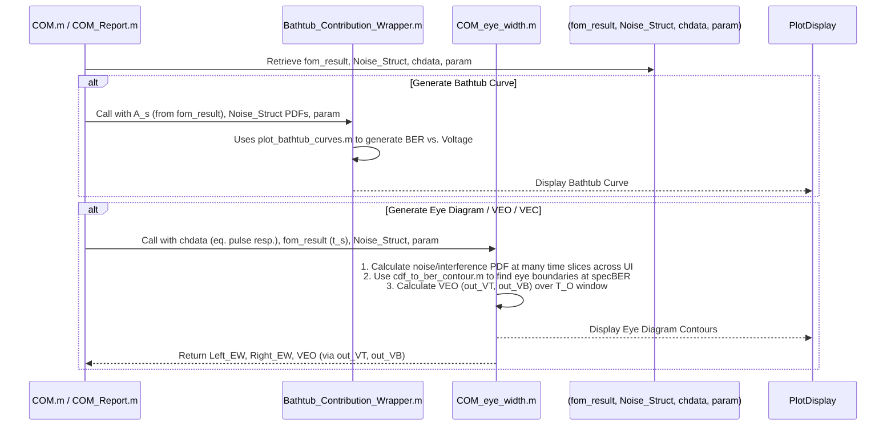

# Chapter 7: Performance Metrics & Visualization (Eye, Bathtub, VEC/VEO)

Welcome to the final chapter of our `com_code` journey! In [Chapter 6: COM/FOM Optimization Loop](06_com_fom_optimization_loop_.md), we saw how `com_code` cleverly searches for the best equalizer settings and receiver sampling time to maximize our signal quality, giving us a Figure of Merit (FOM) or COM score. This score is great, but engineers often want to *see* what's happening with the signal. How much "breathing room" does it have? How clear are the '1's and '0's?

This chapter is all about the "dashboard" of our communication link. We'll explore how `com_code` generates visual tools like **Eye Diagrams** and **Bathtub Curves**, and calculates key metrics like **Vertical Eye Opening (VEO)** and **Vertical Eye Closure (VEC)**. These tools help us understand, at a glance, how healthy our signal is and how much margin it has against errors.

Imagine you've just had a health check-up. The doctor gives you a report with numbers (like your FOM/COM score), but also shows you charts and images (like an X-ray or an ECG trace) that visually summarize your health. This chapter covers those "charts and images" for our signal.

## What's the Big Idea? Seeing Signal Quality

After all the complex calculations, we want to answer simple questions:
*   Can the receiver easily tell the difference between a '1' and a '0'?
*   How much noise can the system tolerate before it starts making mistakes?
*   How much is the signal "eye" open or closed at the critical decision moment?

These visualizations and metrics provide intuitive answers, making it easier to diagnose problems or confirm good performance. Our main goal is to transform the statistical data and optimal settings we've gathered into easy-to-understand visual representations and quantitative measures of signal integrity.

## Key Concepts: Our Performance Dashboard Tools

Let's explore the main tools `com_code` provides for visualizing and quantifying performance.

### 1. The Eye Diagram: A Window into the Signal

*   **What it is:** Imagine taking an oscilloscope, triggering it on every bit, and overlaying all the waveforms on top of each other for one bit-period (Unit Interval, UI). The picture you'd get is an "eye diagram."
    *   For a good signal, you'll see clear open spaces – the "eyes."
    *   The top of the eye represents the '1' level, and the bottom represents the '0' level (for a simple 2-level NRZ signal. For PAM4, you'd see three eyes).
*   **What it shows:**
    *   **Eye Opening:** The clear area in the middle. A larger opening means it's easier to distinguish signal levels.
    *   **Noise:** Makes the lines of the eye thicker and fuzzier.
    *   **Jitter:** Horizontal variations in the points where lines cross, making the eye "blurry" horizontally.
    *   **Signal Distortion (ISI):** How quickly and cleanly the signal transitions between levels.
*   **Analogy:** Think of looking through a keyhole. If the keyhole is wide open (big eye), you can clearly see what's on the other side. If it's small and blurry (closed eye), it's hard to tell.

```mermaid
graph LR
    subgraph EyeDiagram ["Typical Eye Diagram (NRZ)"]
        direction LR
        A[High Level ('1')]
        B[Low Level ('0')]
        C{"Eye Opening (Vertical & Horizontal)"}
        D[Signal Transitions]
        E[Noise Margin (Height)]
        F[Timing Margin (Width)]

        A --- C
        B --- C
        C --- D
        E --- C
        F --- C
    end
```

*   **In `com_code`:** The `COM_eye_width.m` script is key to generating the data for eye diagrams. It uses the total noise and interference CDFs (from [Chapter 5: Statistical Noise and Interference Analysis (PDF/CDF)](05_statistical_noise_and_interference_analysis__pdf_cdf__.md)) calculated at many time points across the UI to trace out the eye's boundaries at a specific Bit Error Rate (e.g., `param.specBER`).

### 2. The Bathtub Curve: Measuring Noise Margins

*   **What it is:** A bathtub curve plots the Bit Error Rate (BER) on a logarithmic scale (y-axis) against the receiver's decision threshold voltage (x-axis).
    *   The curve typically looks like a bathtub: high BER at the edges (when the threshold is too close to one of the signal levels) and low BER in the middle.
*   **What it shows:**
    *   **Voltage Margin:** How far you can move the decision threshold voltage from its ideal center position before the BER exceeds a specified target (e.g., `param.specBER`). The "width" of the bathtub at the target BER line indicates this margin. A wider tub is better.
    *   **Impact of Noise:** Steeper "walls" of the bathtub mean the system is more sensitive to noise as the threshold moves.
*   **Analogy:** Imagine walking a tightrope. The bathtub curve shows how much you can sway left or right (voltage threshold) before you fall off (high BER). The flat bottom of the tub is your safe zone.

```mermaid
graph LR
    subgraph BathtubCurvePlot ["Bathtub Curve"]
        YAxis[BER (log scale)] --> PlotArea
        XAxis[Decision Threshold Voltage] --> PlotArea
        PlotArea -- "Curve" --> TargetBERLine["--- Target BER ---"]
        PlotArea -- "Width at Target BER (Voltage Margin)" --- TargetBERLine
    end
```

*   **In `com_code`:** `plot_bathtub_curves.m` (often called by `Bathtub_Contribution_Wrapper.m`) generates these. It uses the total noise and interference PDF from [Chapter 5: Statistical Noise and Interference Analysis (PDF/CDF)](05_statistical_noise_and_interference_analysis__pdf_cdf__.md) and the signal amplitude `A_s` (from `fom_result` in [Chapter 6: COM/FOM Optimization Loop](06_com_fom_optimization_loop_.md)). By "sweeping" a hypothetical decision threshold across the convolved signal-plus-noise PDF, it calculates the probability of error.

### 3. Vertical Eye Opening (VEO) and Vertical Eye Closure (VEC)

These are specific metrics that quantify the *vertical* aspect of the eye diagram, crucial for assessing signal integrity, especially in Channel-to-Module (C2M) applications.

*   **Vertical Eye Opening (VEO):**
    *   This is the height of the eye opening at the target BER, considering a specific timing window (`param.T_O`). It's the vertical distance between the upper and lower contours of the eye, averaged or worst-case over this timing window.
    *   A larger VEO means more vertical margin against noise.
*   **Vertical Eye Closure (VEC):**
    *   This quantifies how much the eye has closed vertically due to all impairments. It can be thought of as the difference between the ideal signal amplitude and the actual VEO, or:
        `VEC = Ideal_Peak_to_Peak_Signal - VEO` (or related definitions)
    *   A smaller VEC is better.
*   **Why important for C2M?** C2M interfaces often have strict VEO requirements to ensure reliable communication between a chip and an optical/electrical module.
*   **In `com_code`:** `COM_eye_width.m` calculates `out_VT` (top voltage of the eye window) and `out_VB` (bottom voltage of theeye window) at the `param.specBER` considering the timing window `param.T_O`.
    *   `VEO = out_VT - out_VB` (approximately, for a given eye).
    *   The COM value itself is related to VEO: `COM = 20 * log10(VEO_effective / (2 * Q_target * sigma_RandomNoise))` where `Q_target` is related to `specBER`. Essentially, COM is a measure of the VEO relative to the random noise floor.

## How `com_code` Generates These Visuals and Metrics

Let's look at how these performance indicators are generated, using the results from previous chapters.



### Generating Bathtub Curves

The `Bathtub_Contribution_Wrapper.m` script often calls `plot_bathtub_curves.m`.

```matlab
% Simplified concept from plot_bathtub_curves.m
function plot_bathtub_curves(hax, max_signal, ...
                             combined_interference_and_noise_pdf, ... % From Noise_Struct
                             param_specBER) % Other PDFs for contribution plots also passed

    % 'max_signal' is A_s from fom_result (half-amplitude of ideal signal)
    % 'combined_interference_and_noise_pdf' contains .x (voltage) and .y (probability)

    % To plot bathtub, we need to see how BER changes as threshold moves.
    % Conceptually, for a transmitted '1' (level +max_signal), an error occurs if
    % (noise + interference) < (threshold - max_signal).
    % For a transmitted '0' (level -max_signal), an error occurs if
    % (noise + interference) > (threshold - (-max_signal)).

    % Create PDFs assuming transmitted levels are +max_signal and -max_signal
    % This is like shifting the noise PDF by the signal levels.
    % d_cpdf creates a simple PDF with spikes at +/- max_signal
    cursors = d_cpdf(combined_interference_and_noise_pdf.BinSize, max_signal*[-1 1], [0.5 0.5]);
    
    % Convolve with the total noise PDF to get distributions around signal levels
    signal_and_total_noise_pdf = conv_fct(cursors, combined_interference_and_noise_pdf);

    % The bathtub curve for the "right side" (errors when signal is low, threshold high)
    % is the CDF of the noise when signal is -max_signal.
    % Or, total CDF from the left up to the threshold.
    % The bathtub curve for the "left side" (errors when signal is high, threshold low)
    % is 1 - CDF of the noise when signal is +max_signal.
    % Or, total CDF from the right up to the threshold.

    % A common way to plot is to take total noise PDF, convolve with a -1 level,
    % and take its CDF for one side of the tub. And convolve with +1 level for other.
    % The code does something similar by separating left and right cursors.
    
    % For total noise (one unified tub):
    % Calculate cumulative sum (CDF) of the combined signal+noise PDF
    % For the left "wall" of the tub:
    vbt_l_values = cumsum(signal_and_total_noise_pdf.y);
    % For the right "wall" of the tub:
    vbt_r_values = fliplr(cumsum(fliplr(signal_and_total_noise_pdf.y))); % Cumulative sum from the right

    % Plotting these against the voltage axis of signal_and_total_noise_pdf.x
    % gives the bathtub shape.
    semilogy(hax, signal_and_total_noise_pdf.x, vbt_l_values, 'k'); % Plot left side
    hold(hax, 'on');
    semilogy(hax, signal_and_total_noise_pdf.x, vbt_r_values, 'k'); % Plot right side

    % Add line for target BER
    plot(hax, get(hax, 'xlim'), param_specBER*[1 1], 'r:');
    ylim(hax, [param_specBER/10 1]);
    % ... (add labels, title, legend for different noise contributions if plotted)
end
```
This function uses the final noise PDF from [Chapter 5: Statistical Noise and Interference Analysis (PDF/CDF)](05_statistical_noise_and_interference_analysis__pdf_cdf__.md) and the signal amplitude from `fom_result` (calculated in [Chapter 6: COM/FOM Optimization Loop](06_com_fom_optimization_loop_.md)) to create the bathtub plot. The `cumsum` operation effectively calculates the probability of the noisy signal crossing various threshold levels.

`Bathtub_Contribution_Wrapper.m` can also call `plot_pie_com.m` to show a pie chart of COM contributions if `OP.COM_CONTRIBUTION_CURVES` is true, breaking down COM impact by ISI, system noise, and crosstalk.

### Generating Eye Contours and VEO/VEC

The `COM_eye_width.m` script is responsible for calculating the eye diagram contours and related metrics like VEO. It's more complex because it does this across time within the UI.

**Core Idea in `COM_eye_width.m`:**

1.  **Get Full Pulse Response Information:**
    *   It calls `get_pdf_full` which computes the residual ISI PDF (`pdf_full_1`) and jitter sensitivity (`h_j_full`) not just at the single optimal sampling instant (`fom_result.t_s`), but for *every sample point* across a UI (or a specified range `pdf_range`). `A_s_vec` is the signal amplitude at each of these time points.

2.  **Iterate Through Time Samples:**
    *   It then loops through each time sample (`j`) in the `pdf_range`.
    *   For each time sample `j`, it calculates a complete noise and interference PDF, similar to [Chapter 5: Statistical Noise and Interference Analysis (PDF/CDF)](05_statistical_noise_and_interference_analysis__pdf_cdf__.md), but specific to that time instant:
        *   Random Gaussian noise `sigma_G_full(j)` (includes thermal, Tx, and jitter `param.sigma_RJ * h_j_full(:,j)`).
        *   Deterministic jitter noise `p_DD_full(j)` (from `param.A_DD * h_j_full(:,j)`).
        *   Combines these into `noise_pdf_full(j)`.
        *   Combines with residual ISI for that time slice (from `pdf_full{n}(j)`) and crosstalk (`Struct_Noise.cci_pdf`) to get `combined_interference_and_noise_pdf_full{n}(j)`. This is done for each signal level `n`.

3.  **Find Eye Boundary at Each Time Sample:**
    *   For each time sample `j` and each signal level `n`, it converts the `combined_interference_and_noise_pdf_full{n}(j)` to a CDF:
        `combined_interference_and_noise_cdf_full{n}(j) = pdf_to_cdf(...)`
    *   Then, it uses `cdf_to_ber_contour.m` to find the voltage levels (`A_ni_top{n}(j)` and `A_ni_bottom{n}(j)`) on this CDF that correspond to `param.specBER`.

    ```matlab
    % Simplified from cdf_to_ber_contour.m
    function [voltage_top, voltage_bottom] = cdf_to_ber_contour(cdf_struct, specBER)
        % cdf_struct has .x (voltage) and .y (cumulative probability)
        
        % For bottom contour: find first voltage where CDF > specBER
        idx_bottom = find(cdf_struct.y > specBER, 1, 'first');
        voltage_bottom = cdf_struct.x(idx_bottom);
        
        % For top contour: find first voltage from the high end where (1-CDF) > specBER
        % (or where CDF < 1-specBER, looking from high end)
        % The original code flips the CDF and finds specBER from that end.
        % Conceptually:
        idx_top = find(fliplr(cdf_struct.y(:)') > specBER, 1, 'first'); % Find from the right
        idx_top_true = length(cdf_struct.y) - idx_top + 1; % Convert to original index
        voltage_top = cdf_struct.x(idx_top_true);
    end
    ```
    The `A_ni_top{n}(j)` and `A_ni_bottom{n}(j)` values, when plotted for all `j` across the UI, form the contours of the statistical eye diagram for the `n`-th eye at the specified `param.specBER`. For PAM4, there are 3 eyes, so `n` goes from 1 to `param.levels-1`. `eye_contour{n}` stores the top and bottom boundaries for each eye.

4.  **Calculate Eye Width:**
    *   `find_eye_width.m` is called for each eye's contour to determine the horizontal eye opening (Left_EW, Right_EW) at the eye's vertical center.
    *   `get_center_of_UI.m` helps define the reference center time (`half_UI`) for these width calculations.

5.  **Calculate VEO/VEC (within `param.T_O` window):**
    *   If `param.T_O` (C2M timing window offset) is non-zero, `COM_eye_width.m` performs an additional step to calculate `out_VT` and `out_VB`.
    *   It defines a window around the center of the UI: `start_sample` to `end_sample` based on `T_O`.
    *   It takes all the `combined_interference_and_noise_pdf_full{n}(j)` for `j` within this window.
    *   These PDFs are *weighted* (e.g., by a Gaussian, triangle, or rectangle window `OP.Histogram_Window_Weight`) and then summed (convolved effectively by combining them on the same voltage axis) to create a single `out_pdf{n}` representing the total noise distribution *over that time window*.
    *   This `out_pdf{n}` is converted to `out_cdf{n}`.
    *   `cdf_to_ber_contour` is used on `out_cdf{n}` to find `A_ni_top_O(n)` and `A_ni_bottom_O(n)`.
    *   The `out_VT` and `out_VB` are then the top and bottom of the *worst-case eye* among all `param.levels-1` eyes over this `T_O` window.
    *   So, `VEO_effective = out_VT - out_VB`. This VEO is a key metric for C2M.

    ```matlab
    % Conceptual VEO calculation part in COM_eye_width.m
    if param.T_O ~= 0
        % ... (define weights for the T_O window) ...
        for n_level = 1:param.levels % For each signal level
            out_pdf_level_n = []; % Initialize PDF for this level over the window
            for j_time = start_sample:end_sample % Loop over time samples in T_O window
                current_pdf_at_time_j = combined_interference_and_noise_pdf_full{n_level}(j_time);
                current_pdf_at_time_j.y = current_pdf_at_time_j.y * weights(j_time - start_sample + 1);
                
                if isempty(out_pdf_level_n)
                    out_pdf_level_n = current_pdf_at_time_j;
                else
                    % combine_pdf_same_voltage_axis sums y-values for same x-bins
                    out_pdf_level_n = combine_pdf_same_voltage_axis(out_pdf_level_n, current_pdf_at_time_j);
                end
            end
            out_pdf_level_n.y = out_pdf_level_n.y / sum(out_pdf_level_n.y); % Normalize
            out_cdf_level_n = pdf_to_cdf(out_pdf_level_n);
            % Find top/bottom voltage for this level's PDF over the window
            [A_ni_top_Overall(n_level), A_ni_bottom_Overall(n_level)] = cdf_to_ber_contour(out_cdf_level_n, param.specBER);
        end
        
        % For each eye (between levels n and n+1)
        for n_eye = 1:param.levels-1
            EyeTops_Overall(n_eye) = A_ni_top_Overall(n_eye+1);   % Top of eye uses level n+1's top contour
            EyeBottoms_Overall(n_eye) = A_ni_bottom_Overall(n_eye); % Bottom of eye uses level n's bottom contour
        end
        
        EyeHeights_Overall = EyeTops_Overall - EyeBottoms_Overall;
        [min_EH, min_idx] = min(EyeHeights_Overall); % Find worst eye height
        
        out_VT = EyeTops_Overall(min_idx);   % VEO Top for the worst eye
        out_VB = EyeBottoms_Overall(min_idx); % VEO Bottom for the worst eye
        % VEO_effective = out_VT - out_VB;
    end
    ```
This process gives a robust measure of eye opening that accounts for variations across a defined time window, which is critical for module interfaces.

## Conclusion

And that's a wrap! You've now seen how `com_code` takes all the hard work from previous chapters and presents it in a way that engineers can easily interpret.
*   **Bathtub curves** visually show the BER versus decision threshold, quantifying voltage margins.
*   **Eye diagram contours** (derived statistically) provide a visual representation of signal quality across time, highlighting noise and jitter effects.
*   Metrics like **VEO (Vertical Eye Opening)** and **horizontal eye width** give precise numbers for these margins, with VEO being especially important for C2M applications.

These performance metrics and visualizations are the "dashboard" that allows engineers to:
*   Quickly assess if a communication link meets its performance targets.
*   Understand the dominant impairments (e.g., is ISI, crosstalk, or random noise the biggest problem? Bathtub contribution plots can help here).
*   Evaluate the effectiveness of the chosen equalization strategy.

By progressing through these seven chapters, you've journeyed from understanding the basic configuration of a `com_code` simulation, through acquiring and processing channel data, transforming it to the time domain, equalizing it, analyzing its statistical noise properties, optimizing the equalizers, and finally, visualizing its performance. You now have a foundational understanding of how Channel Operating Margin simulations work and how `com_code` implements them. Congratulations!

---

Generated by [AI Codebase Knowledge Builder](https://github.com/The-Pocket/Tutorial-Codebase-Knowledge)