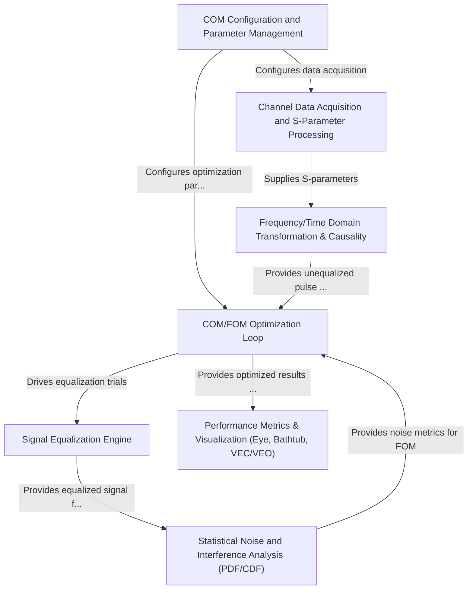

# Tutorial: com_code

The `com_code` project is a tool for **simulating high-speed communication channels** to determine their *Channel Operating Margin (COM)*, a key measure of signal quality.
It reads *channel characteristics* (e.g., S-parameters) and user-defined *configurations*. The system then models signal distortion through the channel, applies *digital equalization* techniques (like CTLE, FFE, DFE) to correct it, and analyzes *noise and interference* statistically.
An **optimization loop** searches for the best equalizer settings to maximize performance. Finally, it generates *performance metrics* and visualizations such as eye diagrams and bathtub curves.

**Source Repository:** [None](None)

## Chapters

1. [COM Configuration and Parameter Management
](01_com_configuration_and_parameter_management_.md)
2. [Channel Data Acquisition and S-Parameter Processing
](02_channel_data_acquisition_and_s_parameter_processing_.md)
3. [Frequency/Time Domain Transformation & Causality
](03_frequency_time_domain_transformation___causality_.md)
4. [Signal Equalization Engine
](04_signal_equalization_engine_.md)
5. [Statistical Noise and Interference Analysis (PDF/CDF)
](05_statistical_noise_and_interference_analysis__pdf_cdf__.md)
6. [COM/FOM Optimization Loop
](06_com_fom_optimization_loop_.md)
7. [Performance Metrics & Visualization (Eye, Bathtub, VEC/VEO)
](07_performance_metrics___visualization__eye__bathtub__vec_veo__.md)

---

Generated by [AI Codebase Knowledge Builder](https://github.com/The-Pocket/Tutorial-Codebase-Knowledge)