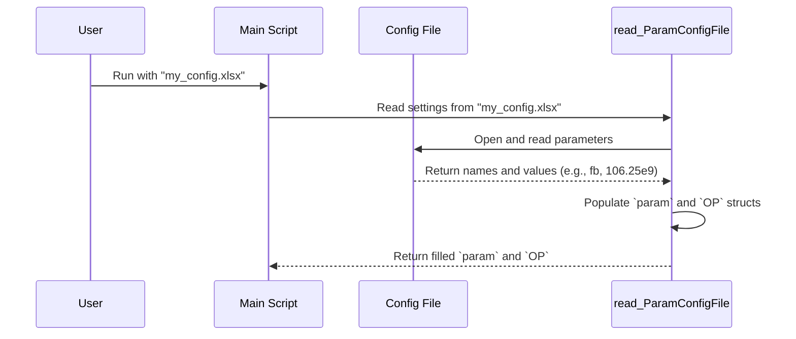

# Chapter 1: Configuration and Control Structures (`param`, `OP`)

Welcome to the world of COM! Before we can simulate how a signal travels through a high-speed channel, we need to tell our simulation tool exactly *what* to simulate and *how* to do it. This is where our "control panel" comes in.

Imagine you're baking a cake. You need two things: a recipe and oven settings. The recipe tells you the ingredients (flour, sugar, etc.) and their amounts. The oven settings tell you how to cook it (temperature, time, convection fan on/off). In our simulation, we have the exact same concepts:

*   **The Recipe:** The `param` structure.
*   **The Oven Settings:** The `OP` structure.

Together, these two structures define everything about our simulation, from the physical properties of the system to how we want to view the results.

### Our Goal for This Chapter

Let's say our goal is simple: we want to run a COM simulation for a 106.25 Gbaud signal and we want to see the diagnostic plots when it's done. To do this, we need to specify:
1.  The baud rate (106.25e9) -> This is an ingredient, so it goes in **`param`**.
2.  The desire to see plots -> This is a process setting, so it goes in **`OP`**.

Let's see how these structures make this possible.

---

## The `param` Structure: The Recipe

The **`param`** structure (short for "parameters") holds all the physical and algorithmic constants for the simulation. Think of it as the detailed list of ingredients for our cake. It answers the "what" questions.

Some common parameters you'll find in `param` are:
- `fb`: The baud rate, or signaling speed (e.g., `106.25e9` for 106.25 Gbaud).
- `specBER`: The target Bit-Error-Rate (e.g., `1e-5`). This is the metric for success.
- `ndfe`: The number of taps in the Decision Feedback Equalizer, a key part of the receiver.
- `levels`: The number of signal levels (e.g., `4` for PAM4 signaling).

Just like you can't bake a cake without knowing how much flour to use, the simulation can't run without these fundamental parameters.

## The `OP` Structure: The Oven Settings

The **`OP`** structure (short for "operational") manages how the simulation runs. It doesn't change the physics, but it controls the process, the outputs, and any special modes. It answers the "how" questions.

Some common settings you'll find in **`OP`** are:
- `DISPLAY_WINDOW`: A switch (`1` for on, `0` for off) to show diagnostic plots.
- `ERL_ONLY`: A switch to tell the tool to *only* calculate Effective Return Loss and then stop.
- `RESULT_DIR`: The folder path where output files (like CSV reports) should be saved.
- `DEBUG`: A switch to enable extra diagnostic printouts for troubleshooting.

## Putting It All Together: The Configuration File

So, how do we set all these values? We don't change them directly in the code. Instead, we define everything in a single configuration file, usually an Excel (`.xls` or `.xlsx`) file.

This file acts as our master recipe card. The COM code is designed to read this file at the very beginning of a run.

Inside the main script (`com_ieee8023_4p10p0_beta1.m`), you'll see a key line that loads these settings:

```matlab
% --- File: com_ieee8023_4p10p0_beta1.m ---

% ... code to get the name of the configuration file ...

% This line reads the Excel file and fills our two structures.
[param, OP] = read_ParamConfigFile(config_file, OP);

% ... the simulation continues, now using the loaded settings ...
```

This single line does all the heavy lifting. It opens your spreadsheet, reads each parameter name and its value, and neatly organizes them into the **`param`** and **`OP`** structures for the rest of the script to use.

## Under the Hood

Let's peek behind the curtain to see how this works without getting lost in the details. When you run the simulation, a simple sequence of events happens:

1.  You provide the name of your configuration file.
2.  The main script calls the `read_ParamConfigFile` function.
3.  This function opens your Excel file.
4.  It reads through the rows, looking for names in the first column (like `f_b` or `DISPLAY_WINDOW`) and grabbing the value next to it.
5.  It then creates the **`param`** and **`OP`** structures in MATLAB and fills them with the values it just read.
6.  Finally, it returns these fully-loaded structures back to the main script.

Here is a simple diagram of that process:



Once the **`param`** structure is loaded, its values are used all over the code. For example, right after reading the config file, the script calculates the Unit Interval (`ui`), a fundamental time measurement, directly from the baud rate (`fb`):

```matlab
% --- File: com_ieee8023_4p10p0_beta1.m ---

%% Parameters computationally defined by values from the settings files
param.ui = 1/param.fb; % The Unit Interval is the inverse of the baud rate.
param.sample_dt = param.ui / param.samples_per_ui; % Time between samples.
```

This shows the direct link: the value you set for `f_b` in your spreadsheet immediately influences the core calculations of the simulation. The same is true for every other parameter. The `OP` structure is used similarly to control program flow, like in `if` statements (`if OP.ERL_ONLY ...`).

While the config file defines the settings, the actual channel data (the physical properties of the wire) is loaded from separate files. We will cover how this is managed in the next chapter on [Channel Data Representation (`chdata`)](02_channel_data_representation___chdata___.md).

## Conclusion

In this chapter, we learned about the two most fundamental control structures in the COM simulation: **`param`** and **`OP`**. We used the analogy of a recipe and oven settings to understand their distinct roles.

-   **`param`** holds the *ingredients* of our simulation (physical and algorithmic constants).
-   **`OP`** controls the *process* of the simulation (operational settings).

Together, they form a powerful and flexible "control panel" that is loaded from a simple configuration file, allowing you to define the exact conditions for every simulation run without ever touching the main code.

Now that we understand how to configure the simulation's parameters, we need to understand how the simulation represents the physical channel itself. This is handled by another important structure.

Let's move on to the next chapter to learn about it.

[Chapter 2: Channel Data Representation (`chdata`)](02_channel_data_representation___chdata___.md)

---

Generated by [AI Codebase Knowledge Builder](https://github.com/The-Pocket/Tutorial-Codebase-Knowledge)