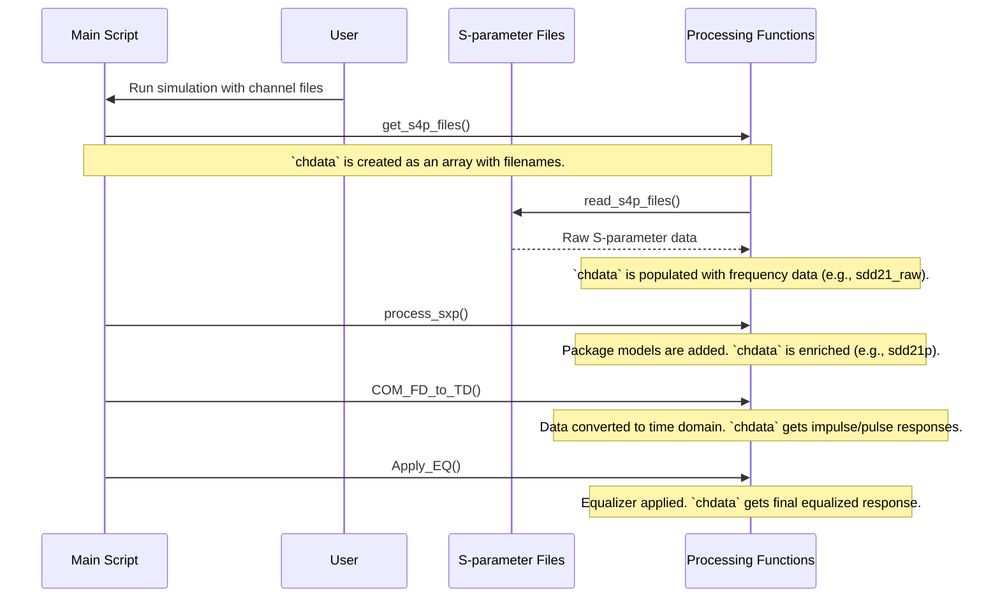

# Chapter 2: Channel Data Representation (`chdata`)

In the [previous chapter](01_configuration_and_control_structures___param____op___.md), we learned how to set up our simulation's "recipe" (`param`) and "oven settings" (`OP`). We told the simulation *what* we want to achieve (like the target BER) and *how* to run (like displaying plots).

But we're missing the most important ingredient: the race track itself! We need a way to describe the physical path the signal travels, from the transmitter chip, through the circuit board, connectors, and cables, to the receiver chip. This is where the `chdata` structure comes in.

### Our Goal for This Chapter

Our goal is to understand how the simulation models the physical communication channel. We will follow the journey of the `chdata` structure from its creation—when it's just a list of files—to its final form as a rich, detailed model of the channel's behavior over time.

---

## What is `chdata`? The Blueprint for the Racetrack

The **`chdata`** structure is the simulation's digital model of the physical channel. Think of it as a detailed blueprint of a racetrack. Initially, the blueprint might just show the basic layout and the type of asphalt used. As engineers work on it, they add more and more information, like how a car's suspension will react to bumps and the view from the driver's seat after tuning the car.

Similarly, `chdata` starts with basic information from files and becomes progressively more detailed as the simulation runs. It's not a static variable; it's a living structure that gets "enriched" with new data at each stage.

Importantly, `chdata` is an **array** of structures. Why? Because a high-speed system isn't just one signal path in isolation. You have:
1.  **The "Through" Channel:** The main path for our signal of interest. This is `chdata(1)`.
2.  **Crosstalk "Aggressors":** Nearby signal paths that create interference. Each of these gets its own element in the array, like `chdata(2)`, `chdata(3)`, and so on.

Let's follow the lifecycle of a single channel within the `chdata` structure.

### Stage 1: Birth - Loading the Raw Blueprint (S-parameters)

The journey begins in the main script when it needs to load the channel definitions you provided. The `chdata` structure is born from a list of special files called **S-parameter files** (usually with `.s4p` or `.s2p` extensions).

An S-parameter file is a standard way to describe how a component (like a cable or connector) affects electrical signals at various frequencies. It essentially answers questions like, "If I send a 10 GHz sine wave through this channel, how much of it gets through, and how much is reflected?"

The main script calls a function to handle this initial loading:

```matlab
% --- File: com_ieee8023_4p10p0_beta1.m ---

% ... code ...

% Get the s-parameter files and create the initial chdata structure array
[chdata, param] = get_s4p_files(param, OP, num_fext, num_next, varargin);

% ... code ...
```

After this step, `chdata` is an array. For example, if you specified one "through" channel and two crosstalk aggressors, `chdata` will have three elements. Each element contains basic information like the filename and the channel type (`'THRU'`, `'FEXT'`, or `'NEXT'`).

### Stage 2: Adding Context - The Package Model

A raw channel from an `.s4p` file doesn't typically include the silicon chips at either end. The simulation needs to account for the electrical "package" that connects the chip to the circuit board. This is like adding the starting grid and the pit lane to our racetrack blueprint.

A function called `process_sxp` is responsible for this. It takes the raw S-parameters from `chdata` and mathematically combines them with a model of the Tx and Rx packages.

```matlab
% --- File: com_ieee8023_4p10p0_beta1.m ---

% ... code to read the raw files ...

% Add package models and other frequency-domain processing
[chdata, param] = process_sxp(param, OP, chdata, SDDch);

% ... code ...
```

At this point, `chdata` is enriched. It now contains new fields, like `sdd21p`, which represents the total channel response *including* the packages, still in the frequency domain.

### Stage 3: Transformation - From Frequency to Time

S-parameters are great, but they describe the world in terms of sine waves (the **frequency domain**). Digital signals are pulses, which live in the **time domain**. To simulate our signal, we need to convert our channel model from frequency to time.

This is the most significant transformation that `chdata` undergoes. The simulation takes the frequency-domain S-parameters and uses a mathematical process (an Inverse Fast Fourier Transform, or IFFT) to calculate the channel's **impulse response**.

The impulse response is the channel's "echo" to a single, infinitely sharp "tap." From this, we can easily calculate the **pulse response**, which is how the channel smears out a real digital pulse.

```matlab
% --- File: com_ieee8023_4p10p0_beta1.m ---

% ... code ...

% Convert the frequency-domain data in chdata to time-domain responses
chdata = COM_FD_to_TD(chdata, param, OP);

% ... code ...
```

After this step, `chdata` is fundamentally changed. It now contains powerful new information:
-   `chdata.uneq_imp_response`: The unequalized impulse response (the "echo").
-   `chdata.uneq_pulse_response`: The unequalized pulse response (the smeared-out signal).
-   `chdata.t`: The time vector corresponding to these responses.

This process is so important that it has its own dedicated chapter. We'll dive deep into it in the [next chapter](03_frequency_to_time_domain_transformation_.md).

### Stage 4: Refinement - The Equalized View

The final step in `chdata`'s evolution happens after the receiver's equalizer has been optimized (covered in [Chapter 4](04_equalizer_optimization___optimize_fom_.md)). The equalizer is a circuit that tries to undo the damage done by the channel, sharpening the smeared-out pulse.

Once the best equalizer settings are found, they are applied to the unequalized pulse response, creating the final **equalized pulse response**. This is stored back into `chdata`.

This final version of the pulse response represents the signal as seen by the decision-making part of the receiver. In our analogy, this is the final, stabilized view from the driver's seat after the car's active suspension has been perfectly tuned for the track.

## Under the Hood: The Life of `chdata`

Let's visualize the process from start to finish.



The `chdata` structure is passed from function to function, with each one adding more detail and transforming the data until it's ready for the final COM calculation. It truly is the central "blueprint" of the simulation.

## Conclusion

In this chapter, we followed the journey of the `chdata` structure, the simulation's model for the physical channel. We saw how it evolves from a simple list of files into a sophisticated time-domain representation of the communication path.

-   **`chdata` is an array of structures**, representing the main signal path and any crosstalkers.
-   It is **born from S-parameter files**, which describe the channel in the frequency domain.
-   It is **enriched** with package models to create a complete die-to-die channel model.
-   It is **transformed** into the time domain to get the crucial impulse and pulse responses.
-   It is **refined** with equalization to model the signal seen by the receiver's slicer.

We now have our "recipe" (`param`), "oven settings" (`OP`), and the physical model of our "cake" (`chdata`). The next critical step is to understand exactly how the simulation performs the magic of converting frequency-domain S-parameters into a time-domain pulse response.

Let's dive into that process next.

[Chapter 3: Frequency to Time Domain Transformation](03_frequency_to_time_domain_transformation_.md)

---

Generated by [AI Codebase Knowledge Builder](https://github.com/The-Pocket/Tutorial-Codebase-Knowledge)