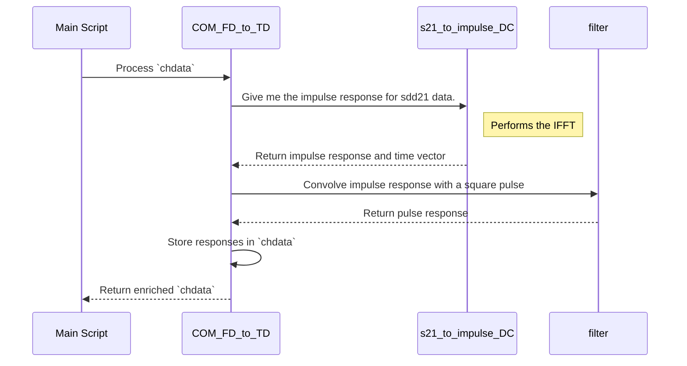

# Chapter 3: Frequency to Time Domain Transformation

In the [previous chapter](02_channel_data_representation___chdata___.md), we followed the journey of the `chdata` structure. We saw how it begins as a list of S-parameter files—a description of the channel in the **frequency domain**—and is enriched with package models.

But there's a problem. S-parameters tell us how the channel responds to perfect sine waves of different frequencies. Our digital signals aren't sine waves; they are sharp, square-like pulses that live in the **time domain**. To understand how our signal gets distorted, we need to translate the channel's description from the language of frequencies to the language of time.

This chapter dives into that crucial translation process.

### Our Goal for This Chapter

Our goal is to understand how the simulation converts the channel's frequency-domain S-parameters into a time-domain pulse response. This response shows us exactly how a single digital pulse gets smeared and distorted as it travels through the channel.

---

## Why Translate? The Music Score vs. The Sound

Imagine you have a piece of sheet music. The score is like the **frequency domain**. It tells you which notes (frequencies) to play and how loudly (amplitude), but it's a static, abstract representation.

Now, imagine a musician playing that score in a large concert hall. The sound wave that reaches your ear is like the **time domain**. It shows how the music unfolds over time, moment by moment. Crucially, it also includes the acoustics of the hall—the echoes and reverberations that distort the original sound. The concert hall is our "channel."

We need to do the same thing for our digital signal. The S-parameters are our musical score, and we need to "play" them through the channel to hear the final, distorted result over time. This resulting "sound wave" for a single pulse is called the **pulse response**.

## The Core Concepts: Impulse and Pulse Response

Two key terms define the channel in the time domain:

1.  **Impulse Response:** This is the most fundamental time-domain description. Think of it as the channel's "echo" to a single, infinitely sharp clap. If you clap once in a concert hall and record the resulting sound, you've captured its impulse response. It's a unique fingerprint of the channel's distortion.

2.  **Pulse Response:** This is what we're really after. A digital pulse isn't an infinitely short clap; it's a tiny, rectangular pulse of a specific duration (one Unit Interval). The pulse response shows how this realistic rectangular pulse gets smeared, stretched, and distorted by the channel. This "smearing" is what causes bits to bleed into their neighbors, a problem called **Inter-Symbol Interference (ISI)**.

Visually, the process looks like this:


The transformation from frequency to time allows us to see this smeared pulse shape, which is essential for the next steps, like designing an equalizer to clean it up.

## The How: The Magic of the IFFT

So how do we perform this translation? The simulation uses a powerful mathematical tool called the **Inverse Fast Fourier Transform (IFFT)**.

You don't need to know the complex math behind it. Just think of the IFFT as a highly efficient translator.

-   **Input:** A list of frequencies and how the channel affects their amplitude and phase (the S-parameters).
-   **Process:** The IFFT algorithm.
-   **Output:** A sequence of values representing the channel's impulse response over time.

## Under the Hood: The `COM_FD_to_TD` Function

This entire transformation is handled by a single, dedicated function. In the main script, you'll find this key line:

```matlab
% --- File: com_ieee8023_4p10p0_beta1.m ---

% ... code before transformation ...

if DO_ONCE
    if ~OP.TDMODE
        chdata=COM_FD_to_TD(chdata,param,OP);
        % ... other processing ...
    end
end

% ... code after transformation ...
```

This line tells the simulation to take the entire `chdata` array, which currently holds frequency-domain information, and pass it to the `COM_FD_to_TD` function. The function then returns the `chdata` array, now enriched with the new time-domain responses.

Let's look at a simplified diagram of what happens inside this function for a single channel.



The process is straightforward: first get the impulse response, then use it to calculate the pulse response. Here is a simplified look at the code inside `COM_FD_to_TD`:

```matlab
% --- Inside the function: COM_FD_to_TD ---

function chdata=COM_FD_to_TD(chdata,param,OP)

% Loop through every channel (Thru and all Crosstalkers)
for i=1:param.number_of_s4p_files

    % STEP 1: Get the Impulse Response from S-parameters
    % This function uses IFFT to translate from frequency to time.
    [chdata(i).uneq_imp_response, chdata(i).t, ... ] = s21_to_impulse_DC(chdata(i).sdd21, chdata(i).faxis, param.sample_dt, OP, param);
    
    % The raw impulse response is scaled by the channel's amplitude
    chdata(i).uneq_imp_response = chdata(i).uneq_imp_response * chdata(i).A;

    % STEP 2: Get the Pulse Response from the Impulse Response
    % Filtering the impulse response with a train of '1's is a fast
    % way to simulate sending a rectangular pulse through it.
    chdata(i).uneq_pulse_response = filter(ones(1, param.samples_per_ui), 1, chdata(i).uneq_imp_response);

end
```

Let's break down these two key steps:

1.  **Getting the Impulse Response:** The function `s21_to_impulse_DC` is the real workhorse. It takes the frequency-domain data (`chdata(i).sdd21`) and the frequency axis (`chdata(i).faxis`) and performs the IFFT to generate the time-domain impulse response (`uneq_imp_response`) and its corresponding time vector (`t`).

2.  **Getting the Pulse Response:** This step is brilliantly simple. To find out how a rectangular pulse is affected, we just need to "pass it through" the impulse response. The `filter` command does exactly this. `ones(1, param.samples_per_ui)` creates a perfect rectangular pulse that is one Unit Interval wide. Filtering the impulse response with this pulse gives us the final pulse response.

## The Result: An Enriched `chdata`

After the `COM_FD_to_TD` function completes, our `chdata` structure is fundamentally more powerful. For every channel, it now contains two crucial new fields:

-   `chdata.uneq_imp_response`: The channel's unique time-domain "fingerprint."
-   `chdata.uneq_pulse_response`: The distorted, smeared shape of a single digital pulse after passing through the channel.

This `uneq_pulse_response` is exactly what we need to analyze ISI and to begin the process of cleaning up the signal.

## Conclusion

In this chapter, we unpacked the critical process of translating a channel's description from the frequency domain to the time domain.

-   We learned that this translation is necessary because key problems like ISI are analyzed in the **time domain**.
-   We used the analogy of a **musical score (frequency) vs. a sound wave (time)** to understand the two different ways of describing a system.
-   The core outputs of this process are the **impulse response** (the channel's "echo") and the **pulse response** (the smeared digital pulse).
-   This transformation is accomplished mathematically using an **Inverse Fast Fourier Transform (IFFT)**, which is wrapped inside the `COM_FD_to_TD` function.

We now have the unequalized pulse response—a clear picture of the damage the channel has done to our signal. The next logical question is: how do we fix it? The receiver contains a powerful tool called an equalizer designed for exactly this purpose.

Let's move on to the next chapter to see how the simulation finds the best possible settings for this equalizer.

[Chapter 4: Equalizer Optimization (`optimize_fom`)](04_equalizer_optimization___optimize_fom___.md)

---

Generated by [AI Codebase Knowledge Builder](https://github.com/The-Pocket/Tutorial-Codebase-Knowledge)