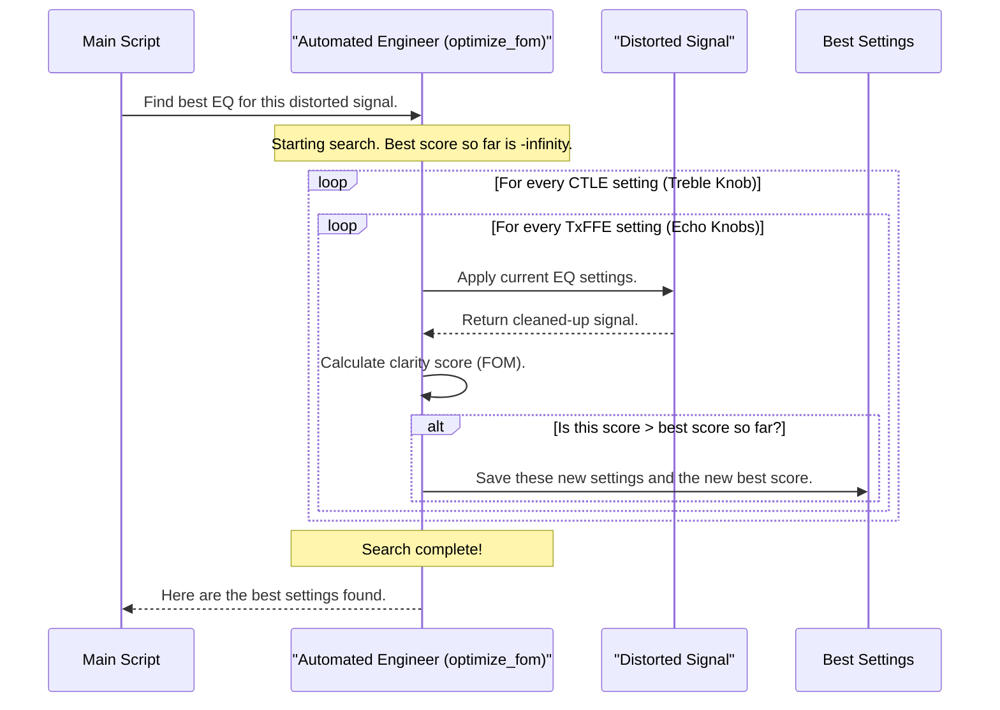

# Chapter 4: Equalizer Optimization (`optimize_fom`)

In the [previous chapter](03_frequency_to_time_domain_transformation_.md), we successfully translated our channel's description from the frequency domain into the time domain. The result was the `uneq_pulse_response`—a clear picture of how a single, perfect digital pulse gets smeared and distorted by the channel.

This smeared pulse is a problem. It's blurry, weak, and bleeds into the time slots of its neighbors, making it hard for the receiver to tell a '1' from a '0'. We now have a picture of the *damage*; this chapter is about how we *fix* it.

### Our Goal for This Chapter

Our goal is to understand the computational heart of the COM algorithm: the process of finding the absolute best equalizer settings to clean up our distorted signal. We'll learn how the simulation methodically tests thousands of combinations and uses a scoring system to find the one "golden" setting that produces the cleanest possible pulse.

---

## The Problem: A Blurry Signal

Imagine our pristine digital pulse is the letter "A" printed perfectly on a page. After traveling through the channel, the ink has smeared, and it looks more like a blurry blob. This is exactly what happens to our electrical pulse.

To fix this, both the transmitter (Tx) and receiver (Rx) have a powerful tool called an **equalizer**. An equalizer is a filter that tries to reverse the damage done by the channel, effectively sharpening the blurry pulse back into a clear letter "A".

But this tool has many knobs and dials. There can be millions of possible combinations of settings. How do we find the perfect one?

## The Solution: A Systematic Search for the Best "Score"

The simulation doesn't guess. It performs an exhaustive search, like an automated audio engineer trying every single knob combination on a mixing board. For each combination, it measures the clarity of the resulting signal and gives it a score. This score is called the **Figure of Merit (FOM)**.

**Figure of Merit (FOM):** A single number that quantifies the quality of the equalized signal. A higher FOM means a cleaner, more open eye diagram. It's essentially a signal-to-noise ratio, calculated like this:

`FOM (in dB) = 20 * log10( Signal Height / Total Noise and Interference )`

The goal of the optimization process is simple: find the one set of equalizer settings that **maximizes the FOM**.

### The Equalizer Knobs We Can Tune

The simulation adjusts two main types of equalizers:

1.  **Transmitter Feed-Forward Equalizer (TxFFE):** This equalizer at the transmitter *pre-distorts* the signal before sending it down the channel. It's like a professional archer aiming slightly to the side to compensate for wind. The TxFFE has several "taps" that create small, carefully timed echoes of the main pulse to counteract the smearing the channel will introduce.
2.  **Continuous Time Linear Equalizer (CTLE):** This is a filter at the receiver. Channels typically act like a low-pass filter, weakening high frequencies more than low frequencies. The CTLE reverses this by boosting the high frequencies, much like turning up the "treble" knob on a stereo to make the sound crisper.

## Under the Hood: The `optimize_fom` Function

This entire search-and-score process is handled by a single, powerful function called `optimize_fom`. In the main script, you'll see this crucial line:

```matlab
% --- File: com_ieee8023_4p10p0_beta1.m ---

% ... code before equalization ...

% This is the computational heart of the simulation.
fom_result = optimize_fom(OP, param, chdata, sigma_bn, do_C2M);

% ... code after equalization ...
```

This one line kicks off the entire optimization.
*   **Inputs:** It takes the configuration structures ([`param` and `OP`](01_configuration_and_control_structures___param____op___.md)) which define the ranges for the equalizer settings, and the [`chdata`](02_channel_data_representation___chdata___.md) structure which contains the unequalized pulse response we need to fix.
*   **Output:** It returns a structure called `fom_result` that contains everything about the winning combination: the best TxFFE settings, the best CTLE setting, the highest FOM achieved, and even the final, beautifully cleaned-up pulse response itself.

Let's visualize the process inside `optimize_fom` using our audio engineer analogy.



### A Peek at the Code

The actual code mirrors this logic with a set of nested loops. Here's a highly simplified view of what's inside `optimize_fom.m`:

```matlab
% --- Inside the function: optimize_fom ---

% Initialize a structure to hold the best results found so far.
BEST.FOM = -inf; 

% Loop 1: Iterate through all possible Receiver CTLE settings.
for ctle_index = 1:length(param.ctle_gdc_values)
    
    % Apply the current CTLE to the unequalized pulse.
    % ... code to apply CTLE ...

    % Loop 2: Iterate through all possible Transmitter TxFFE settings.
    for txffe_index = 1:num_txffe_runs
        
        % Get the current TxFFE tap values.
        txffe = txffe_matrix(txffe_index, :);
        
        % Apply the TxFFE to the CTLE-filtered pulse to get the final pulse, 'sbr'.
        sbr = FFE(txffe, ... , pulse_after_ctle);
        
        % Find the main cursor (signal) and all the noise/interference.
        A_s = sbr(cursor_location); % Signal height
        total_noise_rms = calculate_all_interference(sbr); % All other wiggles
        
        % Calculate the score for this combination.
        FOM = 20*log10(A_s / total_noise_rms);
        
        % If this is the best score we've seen, save everything.
        if (FOM > BEST.FOM)
            BEST.FOM = FOM;
            BEST.txffe = txffe;
            BEST.ctle = ctle_index;
            BEST.sbr = sbr; % Save the best pulse shape!
            % ... save other important results ...
        end
    end
end

% After all loops, the 'BEST' structure holds the final answer.
result = BEST;
```

## The Result: The Golden Settings and the Cleaned-Up Pulse

When the `optimize_fom` function finishes its exhaustive search, it returns the `fom_result` structure. This structure is a treasure trove of information, containing the answer to our chapter's main question.

Key fields in `fom_result` include:
-   `fom_result.FOM`: The highest score achieved.
-   `fom_result.txffe`: The winning TxFFE tap settings.
-   `fom_result.ctle`: The index of the winning CTLE setting.
-   `fom_result.sbr`: The final, best-equalized single bit response. This is our cleaned-up pulse!

This `sbr` waveform represents the cleanest possible version of our signal that the receiver can produce with its available tools.

## Conclusion

In this chapter, we've explored the computational core of COM, where the magic of signal restoration happens.

-   We learned that equalizers (TxFFE and CTLE) are used to reverse the distortion caused by the channel, sharpening a blurry pulse.
-   The simulation finds the best equalizer settings by performing a systematic search through all possible combinations, a process handled by the `optimize_fom` function.
-   Each combination is judged by a single score, the **Figure of Merit (FOM)**, which measures the signal-to-noise ratio.
-   The goal is to find the settings that **maximize the FOM**.
-   The final output is a structure containing these "golden" settings and the resulting best-equalized pulse response.

We now have the cleanest possible signal pulse. However, this pulse doesn't exist in a vacuum. It's surrounded by interference from other signals (crosstalk) and various types of electronic noise. To get our final COM value, we need to combine the interference from our beautifully equalized pulse with all these other noise sources.

Let's move on to the next chapter to see how the simulation builds a complete picture of all the noise and interference in the system.

[Chapter 5: Interference & Noise PDF Generation](05_interference___noise_pdf_generation_.md)

---

Generated by [AI Codebase Knowledge Builder](https://github.com/The-Pocket/Tutorial-Codebase-Knowledge)