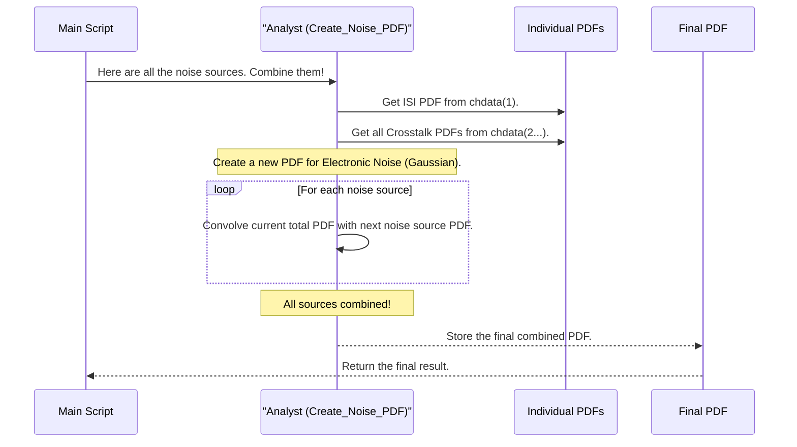

# Chapter 5: Interference & Noise PDF Generation

In the [previous chapter](04_equalizer_optimization___optimize_fom___.md), we found the "golden" equalizer settings that turned our blurry, distorted signal pulse into the sharpest, cleanest pulse possible. This cleaned-up pulse gives us our main signal level, `A_s`.

But our signal doesn't live in a quiet, pristine world. It's constantly being jostled by interference from many different sources. Even after our best equalization efforts, there are still leftover distortions. To know if our signal is strong enough to be understood, we need to build a complete statistical picture of all the "noise" it has to overcome.

This chapter dives into the statistical heart of the COM methodology.

### Our Goal for This Chapter

Our goal is to understand how the simulation creates a statistical model for every source of interference and combines them into a single, comprehensive model of the total noise. This final model is the key to calculating our performance metric in the next chapter.

---

## The Statistical Approach: What is a PDF?

Imagine you're analyzing car traffic at an intersection. You want to understand all the things that can delay a car. You could watch one car and measure its delay, but that only tells you one story. A much more powerful approach is to watch thousands of cars and create charts that show the *probability* of different delays.

This is exactly what a **Probability Density Function (PDF)** is. It's a chart that shows the likelihood of every possible outcome.

*   A tall peak in the chart means that value is very likely.
*   A low, flat area means those values are very unlikely.

In our simulation, we're not measuring traffic delays; we're measuring unwanted noise voltage. We will create a separate PDF for every source of interference.

## Our Sources of "Traffic Delays" (Interference)

The simulation considers three main categories of interference that can corrupt our signal:

1.  **Leftover Inter-Symbol Interference (ISI):** Our equalizer from [Chapter 4](04_equalizer_optimization___optimize_fom___.md) did a fantastic job cleaning up the pulse. But it's not perfect. The tiny, leftover wiggles from our own signal's pulse bleeding into neighboring time slots are a source of noise. We need to create a PDF for this leftover ISI.

2.  **Crosstalk (NEXT & FEXT):** The signal doesn't travel alone. It has neighbors on the circuit board, and their signals can "bleed over," like hearing muffled music from the apartment next door. This is crosstalk, and it's a major source of interference. We need to create a PDF for the combined effect of all crosstalk aggressors.

3.  **Electronic Noise & Jitter:** This is the random, unpredictable noise generated by the electronics themselves (thermal noise, transmitter imperfections) and timing uncertainties (jitter). This is often modeled as a classic "bell curve," or Gaussian distribution. We need to create a PDF for this too.

Our traffic analyst analogy holds up perfectly:
*   Leftover ISI is like small delays from the car in front of you not starting immediately when the light turns green.
*   Crosstalk is like delays from pedestrians crossing the street.
*   Electronic noise is like random, unpredictable delays from a flock of birds suddenly landing in the road.

To get the full picture, the analyst must combine all these delay charts. We must do the same with our noise PDFs.

## The How: Combining Probabilities with Convolution

How do we combine these different PDF charts? We can't just add them. The correct mathematical tool is called **convolution**.

You don't need to know the deep math, just the concept: **Convolution is the process of smearing one PDF by the shape of another.**

Imagine you have two sources of noise:
1.  A tiny, sharp spike of ISI at exactly +0.5 mV. Its PDF is a single sharp line.
2.  A random electronic noise that follows a wide bell curve (Gaussian) centered at 0 mV.

If you convolve them, the result is the same wide bell curve, but now it's centered at +0.5 mV. The sharp ISI spike's PDF has been "smeared" by the shape of the random noise PDF. The simulation does this for all noise sources, repeatedly convolving them until only one final PDF remains.

This final PDF represents the total statistical interference from every source combined.

## Under the Hood: The Two-Step Process

The simulation builds this final PDF in a two-step process handled in the main script.

### Step 1: Create a PDF for Each Channel (`get_pdf`)

First, the simulation loops through every channel in our `chdata` structure (the main "through" channel and all the crosstalk aggressors). For each one, it calls a function called `get_pdf`.

```matlab
% --- File: com_ieee8023_4p10p0_beta1.m ---

% ... code after equalizer optimization ...

% Loop through every channel (Thru and all Crosstalkers)
for i=1:param.number_of_s4p_files
    
    % This function analyzes the leftover wiggles in the equalized
    % pulse response and creates a statistical chart (PDF).
    pdf = get_pdf(chdata(i), param.delta_y, fom_result.t_s, param, OP,[]);
    
    % Store the resulting PDF back into the channel's data structure.
    chdata(i).pdfr = pdf;
    
end
```

The `get_pdf` function takes the final equalized pulse response for a given channel, looks at all the little residual wiggles at the sampling points (the ISI or crosstalk), and builds a PDF from them.

After this loop, every element in `chdata` now has a new field, `pdfr`, which holds the unique statistical fingerprint of its interference.

### Step 2: Convolve All PDFs Together (`Create_Noise_PDF`)

Next, the simulation takes all these individual PDFs, plus the parameters for the electronic noise, and passes them to a function called `Create_Noise_PDF`.

```matlab
% --- File: com_ieee8023_4p10p0_beta1.m ---

% ... code after the get_pdf loop ...

% This function takes all the individual interference sources and
% combines them into a single, total interference model.
[PDF,CDF,Noise_Struct]=Create_Noise_PDF(A_s,param,fom_result,chdata,OP,sigma_bn,PSD_results);

% These are our final statistical models for the total noise.
combined_interference_and_noise_pdf = PDF;
combined_interference_and_noise_cdf = CDF;
```

This function is the "traffic analyst" that combines all the charts. Let's look at a simplified diagram of its process:



`Create_Noise_PDF` systematically convolves the ISI PDF with the crosstalk PDFs, and then convolves that result with the electronic noise PDF. The output is a single `PDF` structure that represents the combined statistical likelihood of *all interference*.

## The Result: A Complete Picture of the Noise

The output of this stage is crucial:

*   `combined_interference_and_noise_pdf`: A PDF structure containing the probability of every possible total noise voltage.
*   `combined_interference_and_noise_cdf`: The **Cumulative Distribution Function**. This is simply the "running total" of the PDF. It answers the question, "What is the total probability that the noise will be less than or equal to a certain voltage?"

This CDF is exactly what we'll need to calculate our final result.

## Conclusion

In this chapter, we explored the statistical core of COM. We moved beyond a single, clean pulse and built a complete model of all the interference that threatens it.

-   We learned that a **Probability Density Function (PDF)** is a statistical chart showing the likelihood of different noise voltages.
-   The simulation creates separate PDFs for each source of interference: **leftover ISI**, **crosstalk**, and **electronic noise**.
-   These individual PDFs are mathematically combined using **convolution**, which is like smearing one chart by the shape of another.
-   This process, handled by the `get_pdf` and `Create_Noise_PDF` functions, results in a single, final PDF representing the total statistical noise in the system.

We have now done all the heavy lifting. We have the height of our clean signal (from Chapter 4) and we have a complete statistical model of the total noise it will face (from this chapter). We are finally ready to put these two pieces together to calculate the channel's performance.

Let's move on to the final chapter to calculate the COM value itself.

[Chapter 6: COM and Metric Calculation](06_com_and_metric_calculation_.md)

---

Generated by [AI Codebase Knowledge Builder](https://github.com/The-Pocket/Tutorial-Codebase-Knowledge)