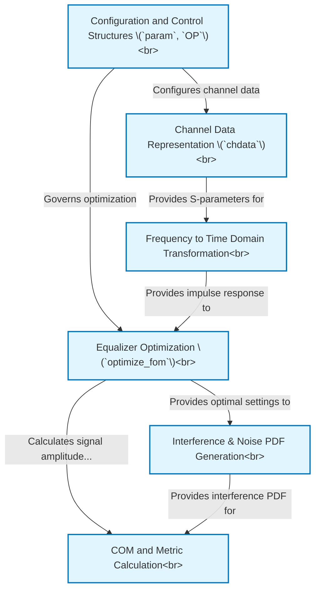

# Tutorial: com_ieee8023_4p10p0_beta1

This project is a reference implementation of the IEEE 802.3 **Channel Operating Margin (COM)** standard. It simulates a high-speed communication channel to determine its performance.
The program takes a channel's physical description (*S-parameters*) and configuration settings as input. It then simulates how the signal is distorted, optimizes an *equalizer* to clean up the signal as much as possible, statistically analyzes all remaining interference and noise, and finally calculates a single score in decibels—the **COM**—which represents the quality and robustness of the channel.

**Source Repository:** [None](None)

## Chapters

1. [Configuration and Control Structures (`param`, `OP`)
](01_configuration_and_control_structures___param____op___.md)
2. [Channel Data Representation (`chdata`)
](02_channel_data_representation___chdata___.md)
3. [Frequency to Time Domain Transformation
](03_frequency_to_time_domain_transformation_.md)
4. [Equalizer Optimization (`optimize_fom`)
](04_equalizer_optimization___optimize_fom___.md)
5. [Interference & Noise PDF Generation
](05_interference___noise_pdf_generation_.md)
6. [COM and Metric Calculation
](06_com_and_metric_calculation_.md)

---

Generated by [AI Codebase Knowledge Builder](https://github.com/The-Pocket/Tutorial-Codebase-Knowledge)