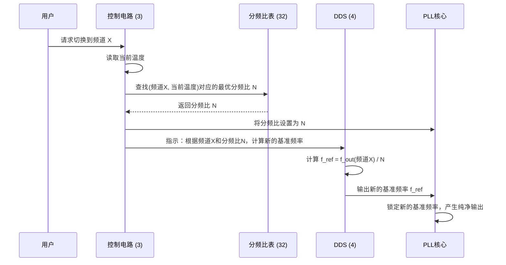

# Chapter 1: 锁相环 (PLL) 电路


欢迎来到我们关于智能频率生成技术的探索之旅！在本教程中，我们将一起揭开一项巧妙发明的神秘面纱，它能让电子设备中的频率信号变得前所未有的纯净和稳定。

我们将要学习的第一个，也是最核心的概念，就是 **锁相环（PLL）电路**。

## 什么是锁相环？为什么它如此重要？

想象一下，你是一位吉他手，在演出前需要给吉他调音。你会拿出一个调音器，然后弹响一根琴弦。调音器会显示当前琴弦的音高，然后你通过拧动弦钮，不断地将琴弦的音高调整到与标准音高完全一致。

在电子世界里，许多设备——比如你的手机、收音机、或者电脑——也需要一个极其精准的“音高”，这个“音高”就是**频率**。如果频率不准或者飘忽不定，手机通话可能会中断，收音机将充满噪音。

锁相环（Phase-Locked Loop, PLL）电路，就是这样一个不知疲倦、极其精密的“电子调音师”。它的核心任务是：产生一个非常稳定的输出频率。它通过不断地将一个可调频率的“音源”（我们称之为**压控振荡器 VCO**）与一个极其稳定的“标准音高”（我们称之为**基准频率**）进行比较，然后自动微调，直到两者完全“锁定”同步。

## 传统的 PLL 是如何工作的？

一个基本的 PLL 电路就像一个由几个专家组成的调音团队。让我们来认识一下他们：

```mermaid
graph TD
    subgraph 传统 PLL 电路
        A[基准频率<br>(标准音高)] --> B{鉴相器<br>(调音师的耳朵)};
        E[VCO<br>(可调音高的乐器)] --> D[分频器<br>(降速齿轮)];
        D --> B;
        B --> C[环路滤波器<br>(调音师的大脑)];
        C -->|控制电压| E;
        E --> F[输出频率<br>(调好的音符)];
    end
```

1.  **压控振荡器 (VCO - Voltage-Controlled Oscillator)**：这是我们的“乐器”。你给它一个特定的电压，它就会产生一个对应频率的“声音”。电压改变，频率也跟着改变。
2.  **基准频率 (Reference Frequency)**：这是我们的“音叉”或“标准音高”。它是一个非常稳定、精确的频率源。
3.  **鉴相器 (Phase Comparator)**：这是“调音师的耳朵”。它同时“听”基准频率和 VCO 产生的频率（经过处理后），并判断两者之间是否存在差异。
4.  **环路滤波器 (Loop Filter)**：这是“调音师的大脑”。它接收到“耳朵”传来的差异信息，并将其转化为一个平滑的、具体的调整指令——也就是一个直流电压。
5.  **分频器 (Frequency Divider)**：VCO 的频率通常非常高，而基准频率相对较低。分频器就像一个“降速齿轮”，它将 VCO 的高频按一个固定的比例（比如除以100）降低，以便“耳朵”能将它与基准频率进行比较。

整个团队的工作流程是：耳朵（鉴相器）比较音叉（基准频率）和乐器降速后的声音（VCO/分频器），大脑（滤波器）根据差异调整手（控制电压），最终让乐器（VCO）发出我们想要的、精准的音高（输出频率）。

## 传统方法的“小瑕疵”

这种传统的调音方法在大多数情况下都很好用。但是，它也有一些固有的问题。在某些特定的“频道”（也就是目标频率）上，输出的信号可能会变得不那么“纯净”，出现一些微小的杂音。我们称之为“寄生特性”恶化。

更糟糕的是，这个问题还受**温度**影响。就像吉他在热天和冷天音高会发生变化一样，电子元件的特性也会随温度变化。这可能导致在某个温度下工作得很好的 PLL 电路，在另一个温度下却出现了恼人的杂音。

这正是本专利要解决的核心问题：如何设计一个更智能的“调音师”，无论在哪个频道、什么温度下，都能调出最纯净、最稳定的声音？

## 更智能的 PLL：我们项目中的解决方案

本专利提出了一种更聪明的 PLL 电路，它引入了几个新“大脑”和一本“秘籍”，让整个调音过程变得更加智能和灵活。

```mermaid
graph TD
    subgraph 本发明的智能 PLL 电路
        direction LR
        
        subgraph 智能控制单元
            Temp[温度传感器 (31)] --> CC(智能控制电路 (3));
            Table[优选分频比表 (32)] --> CC;
        end
        
        CC -->|1. 设置最优分频比| PLLIC(PLL 核心芯片);
        CC -->|2. 发送频道和分频比| DDS(动态基准频率生成电路);
        
        subgraph PLL 主循环
            DDS -->|3. 生成定制基准频率| PLLIC;
            VCO[VCO] --> PLLIC;
            PLLIC -->|4. 精准控制电压| VCO;
            VCO --> F[纯净的输出频率];
        end
    end
```

这个新系统引入了几个关键角色：
- **[智能控制电路 (3)](03_智能控制电路__3__.md)**：这是新的总指挥。它不仅负责启动调音，还会根据环境变化做出智能决策。
- **[优选分频比表 (32)](04_优选分频比表__32__.md)**：这是一本“调音秘籍”。它记录了在**不同温度**下，针对**每一个频道**，哪个**分频比**能获得最纯净的声音。
- **[动态基准频率生成电路 (DDS) (4)](05_动态基准频率生成电路__dds___4__.md)**：它不再是一个固定的“音叉”，而是一个能按需生成**任何**基准频率的“万能音源”。

### 智能调音的步骤

让我们看看这个智能团队是如何工作的。假设我们想切换到一个新的电台频道：



1.  **接收指令**：`智能控制电路 (3)` 接收到切换到“频道 X”的指令。
2.  **感知环境**：它会立即检查内部的温度传感器，了解当前的工作温度。
3.  **查阅秘籍**：它拿着“频道 X”和“当前温度”这两个信息，去查阅 `优选分频比表 (32)`，找到那个能让声音最纯净的“最优分频比”（比如 N=135）。
4.  **动态调整**：
    *   它告诉 PLL 核心芯片：“嘿，把你的分频器齿轮换成 135 的！”
    *   同时，它告诉 `DDS (4)`：“为了在分频比为 135 时得到频道 X 的最终频率，你需要生成一个全新的、定制的基准频率。”
5.  **完美锁定**：DDS 生成了这个定制的基准频率，PLL 核心则使用新的分频比，两者完美配合，最终 VCO 输出的频率既精确又纯净，有效避开了所有可能产生杂音的“坑”。

通过这种方式，我们的 PLL 电路不再是僵化地使用一套固定的参数，而是像一位经验丰富的音乐大师，能够根据乐器（VCO）、环境（温度）和目标音高（频道）的细微变化，灵活地调整自己的工具（分频比和基准频率），以求达到最完美的演奏效果。

## 总结

在本章中，我们了解了：

- **锁相环 (PLL)** 是一个电子系统，用于生成稳定、精确的频率，就像一个乐器调音师。
- 传统 PLL 虽然有效，但在特定频率和温度下，其输出信号的纯净度可能会下降（产生寄生特性）。
- 我们的项目提出了一种**智能 PLL 电路**，它通过一个 `智能控制电路`、一本 `优选分频比表` 和一个 `动态基准频率生成电路 (DDS)`，来动态调整内部参数。
- 这种智能方法能够主动避开性能不佳的参数组合，从而在所有频道和工作温度下都能获得寄生特性良好（也就是更纯净）的输出信号。

我们刚刚接触了这项发明的核心思想。但你可能还很好奇，那些“寄生特性”到底是什么？温度补偿又是如何通过“分频比表”具体实现的？在下一章中，我们将深入探讨这些问题。

准备好了吗？让我们继续前进！

**下一章**: [第 2 章: 寄生特性与温度补偿](02_寄生特性与温度补偿_.md)

---

Generated by [AI Codebase Knowledge Builder](https://github.com/The-Pocket/Tutorial-Codebase-Knowledge)