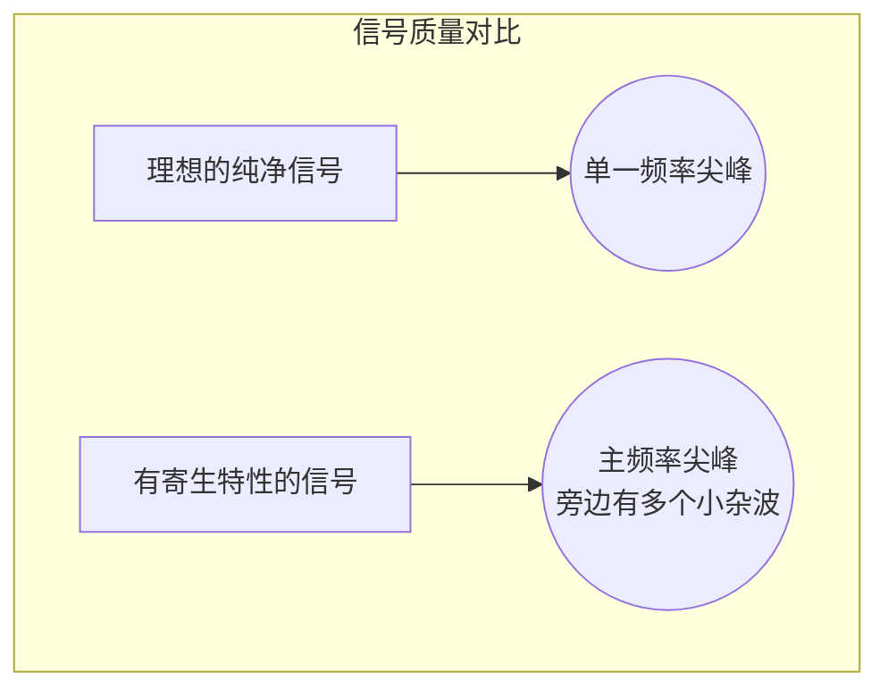
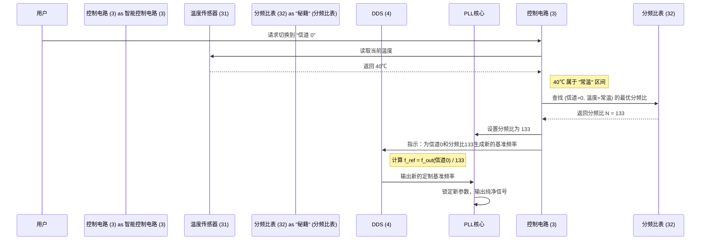

# Chapter 2: 寄生特性与温度补偿

好的，这是教程的第 2 章，完全使用中文编写。

---

# 第 2 章：寄生特性与温度补偿

在[上一章：锁相环 (PLL) 电路](01_锁相环__pll__电路_.md)中，我们把 PLL 比作一个精密的“电子调音师”，它的任务是产生稳定纯净的频率信号。我们还提到，传统的调音师有时会遇到“小瑕疵”，导致声音不够纯净，尤其是在环境温度变化时。

本章，我们将深入探讨这个核心问题：到底什么是“寄生特性”？为什么温度会让它恶化？以及我们的智能 PLL 是如何巧妙地解决这个难题的。

## 什么是“寄生特性”？一个恼人的噪音

想象一下，你正在用收音机收听一个古典音乐电台。理想情况下，你应该只听到悠扬的乐曲。但有时，你可能会听到一些“滋滋”的静电声，甚至隐约串入其他电台的谈话声。这些你不希望听到的、污染了原始信号的声音，就是一种“寄生”信号。

在电子世界里，我们期望 PLL 输出一个完美的、单一频率的波形。但现实中，由于电路内部各种复杂的相互作用，输出信号中常常会混入一些不希望出现的、微小的“杂波”或“尖峰”。这些杂波就是 **寄生特性 (Parasitic Characteristics)**，也常被称为**杂散 (Spurs)**。

它们就像频率信号里的“噪音”，会降低信号的质量，影响设备的性能。

如上图所示，一个有寄生特性的信号，除了我们想要的主频率外，还带有很多“小尾巴”。对于需要高精度信号的设备（如通信基站、精密仪器）来说，这些“小尾巴”是不可接受的。

## 为什么会产生寄生特性？

在传统的 PLL 电路中，为了得到最终的目标频率 (`f_out`)，我们需要设定一个**分频比 (N)**，并提供一个**基准频率 (f_ref)**，使得 `f_out = f_ref * N`。

问题在于，某些 `f_ref` 和 `N` 的组合就像是“八字不合”，它们在 PLL 内部进行数学运算和频率比较时，会不幸地产生谐波或交调产物，这些就成了我们看到的“寄生”杂波。

在专利文件 `downloaded_zh_39476.html` 的 **图9** 中，研究人员为我们展示了这个问题。他们测试了在不同分频比（如 133, 135, 137）下，各个信道（也就是目标频率）的寄生特性表现。

<i>（简化示意图，灵感来自专利图9）</i>

| 分频比 | 信道 100 表现 | 信道 300 表现 | 信道 500 表现 |
| :--- | :--- | :--- | :--- |
| **133** | 良好 ✅ | **糟糕** ❌ | 良好 ✅ |
| **135** | **糟糕** ❌ | 良好 ✅ | **糟糕** ❌ |
| **137** | 良好 ✅ | **糟糕** ❌ | 良好 ✅ |

这个表格告诉我们一个关键事实：**没有一个单一的分频比能对所有信道都表现完美。** 为某个信道选择的最佳分频比，可能对另一个信道来说却是最差的选择。

## 温度：让情况雪上加霜

如果问题仅仅如此，我们或许还能为每个信道硬编码一个“最优”的分频比。但现实是，电子元件的物理特性会随着**温度**变化。

这就像一把木吉他，在炎热潮湿的夏天和寒冷干燥的冬天，它的音准会发生变化。同样地，PLL 电路中的核心部件，如压控振荡器 (VCO)，其性能也会“热胀冷缩”。

这意味着：
*   在 **25℃ (常温)** 下为一个信道找到的最优分频比。
*   当设备在 **0℃ (低温)** 的室外工作，或者在 **50℃ (高温)** 的机箱内运行时，可能就不再是“最优”了，甚至可能变得很差。

这就给传统方法带来了巨大的挑战。一个固定的配置无法应对变化的温度环境，导致设备在不同环境下的性能飘忽不定。

## 解决方案：智能自适应降噪

面对这个棘手的问题，本发明提出了一种极其聪明的解决方案，就像一副高级的“智能降噪耳机”。它不仅能消除噪音，还能根据环境变化进行自适应调整。

这个方案的核心是**主动补偿，而非被动接受**。它主要分三步走：

1.  **感知环境**：电路内置了一个**温度传感器 (31)**，就像耳机的麦克风，实时监测当前的工作温度。
2.  **查阅秘籍**：它拥有一本“武功秘籍”—— **[优选分频比表 (32)](04_优选分频比表__32__.md)**。这本“秘籍”由工程师们预先通过大量实验测定，记录了在**不同温度区间**下，针对**每一个信道**，哪个分频比能获得最纯净的信号。
3.  **动态调整**：**[智能控制电路 (3)](03_智能控制电路__3__.md)** 扮演着总指挥的角色。当需要切换频道时，它会执行以下智能操作。

让我们通过一个具体的例子来看看它是如何工作的。

假设用户想将频率切换到 **信道 0**，而此时 `温度传感器` 检测到的设备内部温度是 **40℃**。

**工作流程解析**：

1.  **获取指令**：`智能控制电路 (3)` 接收到切换到“信道 0”的请求。
2.  **感知温度**：它立刻向 `温度传感器 (31)` 查询，得知当前温度是 40℃。
3.  **查阅秘籍**：控制电路根据 40℃ 判断当前属于“常温”范围。然后，它查阅 **[优选分频比表 (32)](04_优选分频比表__32__.md)**，找到“常温”和“信道 0”交叉点的值。假设这个值是 **133**。
4.  **下达指令**：
    *   它告诉 PLL 核心：“将你的分频比设置为 133。”
    *   同时，它也通知 **[动态基准频率生成电路 (DDS) (4)](05_动态基准频率生成电路__dds___4__.md)**：“现在分频比是 133，请你计算并生成一个与之匹配的、全新的基准频率，以确保最终输出仍然是‘信道 0’的正确频率。”
5.  **完美锁定**：PLL 核心和 DDS 电路使用这套“量身定制”的参数进行工作，从而在 40℃ 的环境下，为信道 0 输出了寄生特性最小、最纯净的信号。

如果过了一会儿，设备温度上升到 60℃（高温），而用户仍然在信道 0，控制电路会再次查表，发现“高温”对应的最优分频比可能是 **135**。于是，它会自动在后台完成新一轮的参数更新，用户甚至察觉不到任何变化，但信号质量始终保持在最佳状态。

## 总结

在本章中，我们深入了解了本发明要解决的核心问题：

-   **寄生特性**：是输出频率信号中不想要的“噪音”或“杂波”，它会降低信号质量。
-   **温度影响**：寄生特性问题会随着温度的变化而恶化，一个在常温下表现良好的设置，在高温或低温下可能变得很差。
-   **智能解决方案**：本发明通过内置的 `温度传感器` 实时感知温度，并结合一本预先计算好的 `优选分频比表`，由 `智能控制电路` 动态调整 PLL 的内部参数（分频比和基准频率）。

这种主动、智能的**温度补偿**机制，确保了我们的 PLL 电路无论在何种频道、何种工作温度下，都能“趋利避害”，始终选择最佳的工作点，输出最纯净、最稳定的频率信号。

现在，你可能对那个“总指挥”——智能控制电路非常好奇。它是如何读取传感器、查阅表格并向其他部分发号施令的呢？在下一章，我们将聚焦于这个系统的大脑。

**下一章**: [第 3 章: 智能控制电路 (3)](03_智能控制电路__3__.md)

---

Generated by [AI Codebase Knowledge Builder](https://github.com/The-Pocket/Tutorial-Codebase-Knowledge)