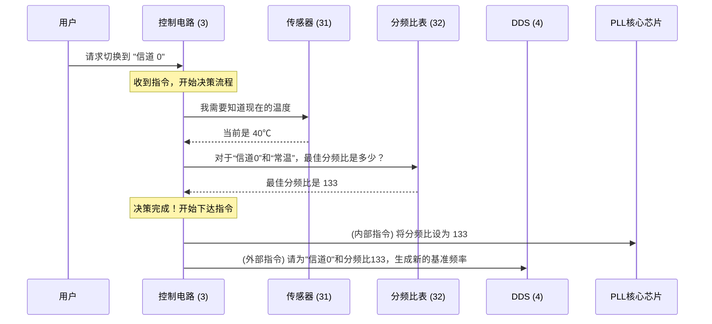

# Chapter 3: 智能控制电路 (3)


在上一章 [寄生特性与温度补偿](02_寄生特性与温度补偿_.md) 中，我们了解到传统的 PLL 电路会受到“寄生特性”（信号噪音）和温度变化的困扰。我们还剧透了解决方案的核心：一个能够感知环境、查阅“秘籍”并动态调整的智能系统。

现在，让我们隆重介绍这个系统的“大脑”和“总指挥”——**智能控制电路 (3)**。它正是让整个频率生成过程从“死记硬背”升级为“随机应变”的关键所在。

## 什么是智能控制电路？它为何如此重要？

想象一下，你正在驾驶一辆高科技的智能汽车。这辆车不仅能执行你“去公司”的指令，还能通过传感器感知路况（是否拥堵）、天气（是否下雨），然后自动调整行驶速度、开启雨刷，甚至重新规划一条更优的路线。你只需要下达最终目标，剩下的都由汽车的“大脑”——行车电脑来搞定。

**智能控制电路 (3)** 在我们的发明中就扮演着这个“行车电脑”的角色。它不是一个被动执行命令的组件，而是一个主动的决策者。它的核心任务是：**协调所有部分，确保在任何条件下都能产生最纯净的频率信号。**

它就像一位经验丰富的音响工程师，会根据房间的温度和观众点的歌曲，来精细调整每一台设备，以求达到最佳的音响效果。

## 智能控制电路的工作台

为了做出最明智的决策，这位“总指挥”需要几样关键的工具和信息来源。

```mermaid
graph TD
    subgraph 智能控制电路 (3) 的信息与指令
        A[外部指令<br>(例如：切换到频道 100)] --> C{智能控制电路 (3)<br><b>(大脑/总指挥)</b>};
        B[温度传感器 (31)<br>(实时环境信息)] --> C;
        D["优选分频比表 (32)"<br>(内置的决策“秘籍”)] --> C;
        
        C -->|指令 1: 设置最优分频比 'N'| E[PLL 核心芯片 (2)];
        C -->|指令 2: 指示频道和分频比| F[动态基准频率生成电路 (DDS) (4)];
    end
```

让我们来逐一认识一下它的“输入”和“输出”：

### 输入（它需要知道什么？）

1.  **外部指令 (信道编号)**：这是用户或系统下达的最直接的命令。例如，“请将频率切换到 88.7MHz”，这个“88.7MHz”在系统内部会被转换为一个特定的**信道编号**，比如“信道 150”。这是我们“想去的目标”。

2.  **环境信息 (来自温度传感器)**：如我们在 [第 2 章](02_寄生特性与温度补偿_.md) 所知，温度是影响信号质量的关键因素。`智能控制电路 (3)` 通过连接一个**温度传感器 (31)**，能实时获知电路当前的工作温度。这是它决策时必须考虑的“当前路况”。

3.  **决策依据 ([优选分频比表 (32)](04_优选分频比表__32__.md))**：这是本发明最核心的“秘籍”。它是一个存储在控制电路内部的表格，记录了在不同温度下，每个信道对应的“最佳分频比”。我们将在下一章详细讲解这张表。现在，你只需要知道，这是总指挥做出决策的最主要依据。

### 输出（它会下达什么指令？）

在收集了所有必要信息后，`智能控制电路 (3)` 会向两个关键下属发出指令：

1.  **给 PLL 核心芯片 (PLLIC) 的指令**：它会告诉 PLL 核心芯片：“根据我的计算，现在最优的分频比是 133，请你立刻将内部的分频器设置为这个值。”

2.  **给 [动态基准频率生成电路 (DDS) (4)](05_动态基准频率生成电路__dds___4__.md) 的指令**：它会告诉 DDS 电路：“我们需要在分频比为 133 的情况下，得到‘信道 150’的目标频率。请你马上计算并生成一个新的、定制化的基准频率来配合。”

## 决策流程：一步一步看懂“大脑”如何思考

让我们通过一个完整的流程，看看当用户请求切换频道时，`智能控制电路 (3)` 是如何工作的。

假设用户请求切换到“信道 0”，此时设备内部温度为 40℃（属于常温范围）。



这个过程就像查字典一样清晰：
1.  **接收目标**：`控制电路 (3)` 知道目标是“信道 0”。
2.  **明确条件**：它从 `传感器 (31)` 处得知当前条件是“常温”。
3.  **查阅方案**：它用“信道 0”和“常温”这两个索引，去 `分频比表 (32)` 中查找，得到了最佳方案——使用分频比 133。
4.  **执行方案**：它指挥手下的两个大将（PLL 核心和 DDS）按照这个新方案去执行任务。

## 智能控制电路的内部实现

你可能会好奇，这个“电路”到底是什么？在实际应用中，`智能控制电路 (3)` 通常由一个微控制器 (MCU) 或类似的数字逻辑电路实现。它本质上是一个小型计算机，能够执行预设的程序。

我们可以用一段简单的伪代码来模拟它的核心工作逻辑：

```c
// 这是一个模拟智能控制电路行为的伪代码函数
// 它在每次需要改变频道时被调用

void set_frequency_channel(int channel_number) {
    
    // 步骤 1: 从温度传感器读取当前温度
    // 专利文件中的 "温度传感器 (31)"
    float current_temperature = read_temperature_sensor();

    // 步骤 2: 根据温度和频道号，查阅内置的“优选分频比表 (32)”
    // 这张表预先存储在电路的内存里
    int optimal_division_ratio = find_optimal_ratio_in_table(channel_number, current_temperature);

    // 步骤 3: 向 PLL 核心芯片 (PLLIC) 发送指令，设置新的分频比
    // 这对应于专利图中从 (3) 到 (2) 的控制线
    PLL_chip.set_divider(optimal_division_ratio);

    // 步骤 4: 向 DDS 电路 (4) 发送指令，让它生成新的基准频率
    // 这对应于专利图中从 (3) 到 (4) 的控制线
    DDS_circuit.configure(channel_number, optimal_division_ratio);

    // 所有指令下达完毕，系统将自动锁定到新的、纯净的频率上
}
```
这段代码清晰地展示了 `智能控制电路 (3)` 的思考过程：获取输入（温度、频道），进行决策（查表），然后下达指令（设置分频比、配置 DDS）。正是这个简单的逻辑，赋予了整个系统前所未有的智能和适应性。

## 总结

在本章中，我们认识了整个智能 PLL 系统的“大脑”——`智能控制电路 (3)`。

-   它是一个**主动的决策者和协调者**，而非被动的执行单元。
-   它通过**三个关键输入**来做决策：外部的**信道指令**、实时的**温度数据**、以及内置的**[优选分频比表 (32)](04_优选分频比表__32__.md)**。
-   它会向 **PLL 核心芯片** 和 **[动态基准频率生成电路 (DDS) (4)](05_动态基准频率生成电路__dds___4__.md)** 下达指令，动态调整整个系统的工作参数。
-   这种智能协调机制，使得我们的 PLL 电路能够主动规避产生噪音的“雷区”，从而在各种温度和信道下都能保持最佳性能。

我们已经了解了“大脑”是如何工作的，但它做出决策所依赖的那本“秘籍”——优选分频比表，到底长什么样？它是如何被制定出来的？在下一章，我们将揭开这本“秘籍”的神秘面纱。

**下一章**: [第 4 章: 优选分频比表 (32)](04_优选分频比表__32__.md)

---

Generated by [AI Codebase Knowledge Builder](https://github.com/The-Pocket/Tutorial-Codebase-Knowledge)