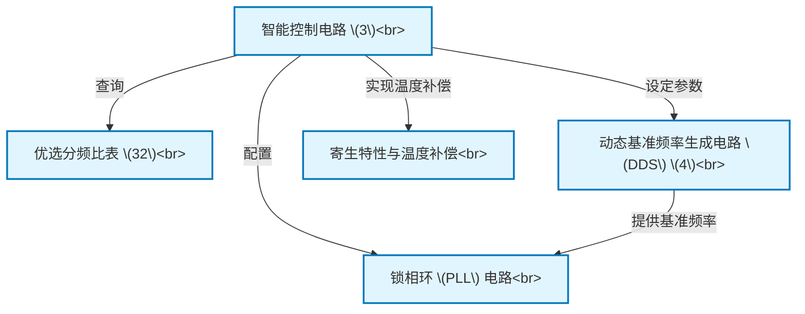

# Tutorial: downloaded_zh_39476

本发明介绍了一种*智能* **锁相环 (PLL) 电路**，旨在生成极其纯净和稳定的输出频率信号。
为了解决信号中会随*温度*变化的干扰（即“寄生特性”）问题，该电路配备了一个**智能控制电路**。
这个“大脑”会实时感知环境温度，并根据外部指定的频道，查询一个内置的**优选分频比表**以找到最佳配置。
最后，它会动态调整**动态基准频率生成电路 (DDS)** 等其他部分，从而在任何工作条件下都能主动抑制噪声，确保输出信号的高品质。

**Source Repository:** [None](None)

## Chapters

1. [锁相环 (PLL) 电路
](01_锁相环__pll__电路_.md)
2. [寄生特性与温度补偿
](02_寄生特性与温度补偿_.md)
3. [智能控制电路 (3)
](03_智能控制电路__3__.md)
4. [优选分频比表 (32)
](04_优选分频比表__32__.md)
5. [动态基准频率生成电路 (DDS) (4)
](05_动态基准频率生成电路__dds___4__.md)

---

Generated by [AI Codebase Knowledge Builder](https://github.com/The-Pocket/Tutorial-Codebase-Knowledge)