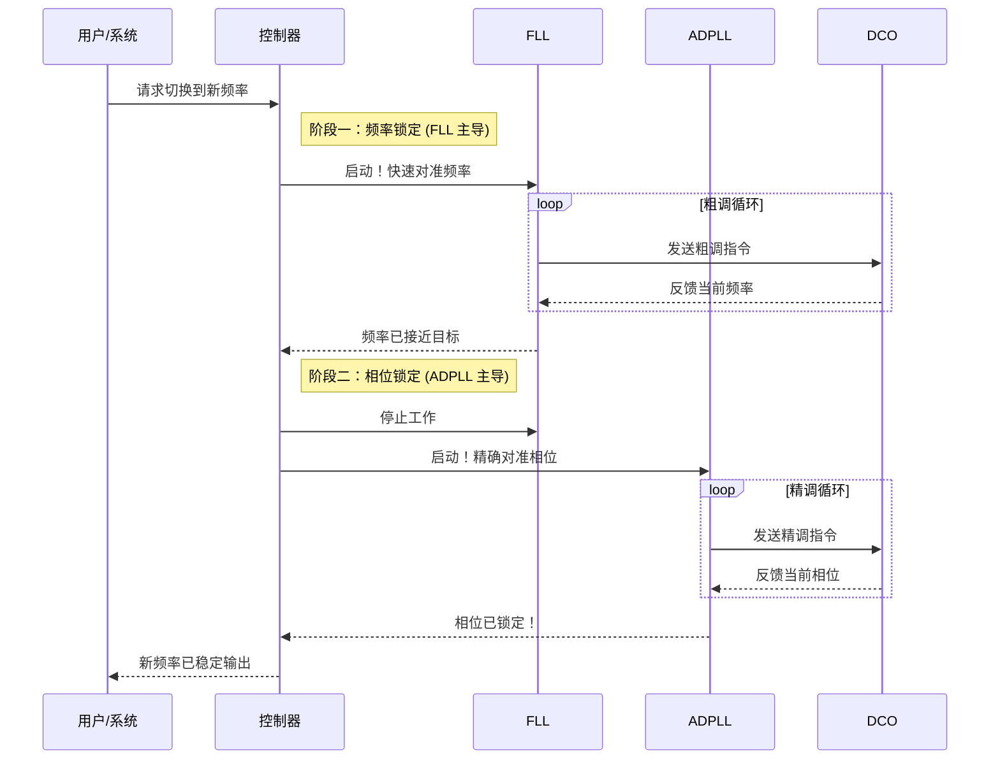

# Chapter 1: 混合环路架构 (FLL + PLL)

欢迎来到我们的教程！在本系列中，我们将一起探索一个高效精密的频率合成系统。作为第一站，我们先来了解整个系统的核心设计理念——混合环路架构。

想象一下，你是一位电台的广播工程师，你的任务是快速、准确地将电台频率调到一个新的频道，比如从 98.1MHz 切换到 101.7MHz。如果调得太慢，听众会听到刺耳的噪音；如果调得不准，信号就会充满杂音，甚至完全接收不到。你需要一个既快又准的调谐系统。

这正是“混合环路架构”所要解决的问题。它巧妙地结合了两种不同的技术，以实现“先快后准”的完美调谐。

## 绘画大师的合作：一个生动的比喻

为了更好地理解这个概念，让我们再次回到本章开头提到的绘画比喻。

> 这是一种将两个专门的控制环路——**锁频环 (FLL)** 和 **全数字锁相环 (ADPLL)** ——结合在一起的系统设计。这好比一个双人合作的绘画过程：一位画家（FLL）快速地勾勒出画作的整体轮廓和基本色块，确定了大致的构图；然后另一位画家（ADPLL）接手，进行精细的描绘和上色，最终完成一幅精准而细腻的作品。

这种分工合作的方式，使得系统能够兼顾速度与精度，快速而又准确地锁定到目标频率和相位。

## 认识两位“画家”

在这个架构中，有两位核心“专家”，它们各自有不同的专长。

### 1. 锁频环 (Frequency-Locked Loop, FLL)：速写艺术家

**FLL** 的任务是**快速锁定频率**。它就像那位速写艺术家，不追求毫厘不差的细节，而是以最快的速度抓住核心——让信号的频率大致对准目标。

-   **优点**：速度快，锁定范围广。即使目标频率与当前频率相差很远，它也能迅速拉近距离。
-   **缺点**：精度不高。它只能保证频率“差不多”对了，但可能会有一些微小的抖动或偏差。

我们将在 [第 4 章：锁频环 (FLL)](04_锁频环__fll_.md) 中深入学习它的工作原理。

### 2. 全数字锁相环 (All-Digital Phase-Locked Loop, ADPLL)：精修大师

**ADPLL** 的任务是**精确锁定相位**。当 FLL 完成了粗略的频率定位后，ADPLL 就上场了。它像那位精修大师，一丝不苟地将信号的“相位”与参考标准对齐。一旦相位完全对齐，频率自然也就达到了完美的精确。

-   **优点**：精度极高，输出信号稳定、纯净。
-   **缺点**：锁定速度较慢，尤其是在频率偏差很大时，它可能需要很长时间才能“追上”目标。

我们将在 [第 5 章：全数字锁相环 (ADPLL)](05_全数字锁相环__adpll_.md) 中详细探讨它的奥秘。

## 强强联合：混合架构的威力

如果单独使用 FLL，我们会得到一个响应迅速但信号质量不佳的系统。如果单独使用 ADPLL，我们会得到一个信号纯净但反应迟钝的系统。

将它们结合起来，就实现了优势互补：

1.  **启动/切换频率时**：FLL 率先启动，将输出频率迅速拉到目标频率附近。
2.  **接近目标后**：FLL 的任务完成，ADPLL 接管控制权，开始精细调整，最终实现相位和频率的完美锁定。

这种“先粗调，后精调”的策略，确保了整个系统既快又稳。

### 系统概览

我们可以用一个简单的框图来描绘这个合作过程。

```mermaid
graph TD
    A[参考信号/目标频率] --> C{控制器};
    C -- 粗调指令 --> FLL[锁频环 (FLL)];
    C -- 精调指令 --> ADPLL[全数字锁相环 (ADPLL)];
    FLL -- 快速调整 --> DCO[数字控制振荡器 (DCO) - 像画笔一样];
    ADPLL -- 精确调整 --> DCO;
    DCO --> O[最终输出信号];
    O -- 反馈 --> C;

    subgraph 混合环路
        FLL;
        ADPLL;
    end
```

在这个图中：
- **参考信号**：是我们想要达到的目标，比如 101.7MHz。
- **[控制器](03_控制器.md)**：是整个团队的“项目经理”，它决定何时启动 FLL，何时切换到 ADPLL。
- **FLL 和 ADPLL**：是我们两位分工明确的“画家”。
- **[数字控制振荡器 (DCO)](06_数字控制振荡器__dco_.md)**：是它们共同使用的“画笔”。它根据收到的指令，实际地产生和改变信号频率。
- **最终输出信号**：就是我们最终完成的“画作”，一个频率精准稳定的信号。
- **反馈**：系统会不断地检查输出信号，与目标进行比较，形成一个闭环控制，确保最终结果的准确性。

## 核心流程：两阶段锁定

这个混合架构的工作流程，本质上是一个清晰的、分两步走的过程。我们会在下一章详细讲解，但这里可以先通过一个时序图来感受一下这个流程。



这个过程清晰地展示了 FLL 和 ADPLL 是如何接力完成任务的。

## 理论与现实：来自专利的灵感

我们学习的这个概念并非凭空而来，它源于真实的工程设计。例如，在一份名为 `CN112134558A` 的专利文件中，就描述了类似的设计。

> **专利摘要**：
> 一种硬件装置包括：锁频环(FLL)，其包括频率环路滤波器；以及锁相环(PLL)...控制器...向所述 FLL 提供第一控制信号并且向所述 PLL 提供第二控制信号...所述控制器与所述第一滤波器、所述TDC和所述分频器形成第一环路，并且所述控制器与所述第二滤波器、所述TDC和所述分频器形成第二环路。

这段技术语言听起来可能有些复杂，但它的核心思想和我们的“画家”比喻是完全一致的：
-   它提到了 **锁频环 (FLL)** 和 **锁相环 (PLL)**。
-   有一个 **控制器 (Controller)** 分别给它们发送控制信号。
-   它们形成了两个独立的控制“**环路**”（一个用于频率，一个用于相位），共同协作。

这证明了我们正在学习的混合架构是解决现实世界工程问题的强大工具。

## 总结

在本章中，我们学习了混合环路架构 (FLL + PLL) 的核心思想。

-   **核心问题**：如何快速且精确地生成特定频率的信号。
-   **核心思想**：通过结合两种专长不同的环路——FLL 和 ADPLL，实现优势互补。
-   **分工合作**：FLL 负责“粗调”，快速将频率拉近目标；ADPLL 负责“精调”，实现完美的相位和频率锁定。
-   **关键优势**：兼具高速锁定和高精度输出的优点。

我们现在对整个系统的顶层设计有了初步的认识。接下来，我们将深入了解这个系统具体是如何一步步完成锁定过程的。

准备好了吗？让我们进入下一章，探索 [第 2 章：两阶段锁定方法](02_两阶段锁定方法.md)。

---

Generated by [AI Codebase Knowledge Builder](https://github.com/The-Pocket/Tutorial-Codebase-Knowledge)