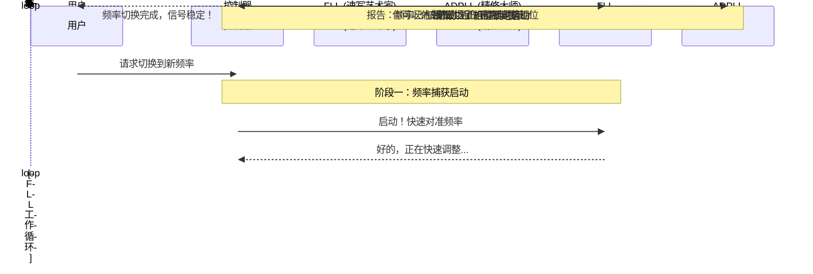

# Chapter 2: 两阶段锁定方法

在 [上一章：混合环路架构 (FLL + PLL)](01_混合环路架构__fll___pll_.md) 中，我们认识了系统中的两位核心专家：负责快速粗调的“速写艺术家”——**锁频环 (FLL)**，和负责精细描绘的“精修大师”——**全数字锁相环 (ADPLL)**。我们知道了系统将它们结合起来以实现“先快后准”的目标。

但是，这两位专家具体是如何分工合作的呢？系统如何知道何时该让 FLL 上场，又在哪个精确的时机切换给 ADPLL 呢？本章将揭晓这个核心的操作流程——两阶段锁定方法。

## 导航任务：从城市到门牌号

想象一下，你正在使用一个非常先进的导航系统，目标是去一个你从未去过的地址。当你输入目的地后，导航系统是如何工作的？

1.  **第一阶段：区域导航**。导航系统会首先规划一条主干道，让你以最快的速度从你所在的城市区域，快速到达目标地址所在的小区或街道。这个阶段不关心具体的门牌号，只求“快速接近”。
2.  **第二阶段：精确定位**。当你到达目标小区附近，导航系统会切换到详细模式，引导你“左转进入小区，前方 50 米右转，目的地在您的左手边，3栋101室”。这个阶段追求的是“精准到达”。

我们的频率合成系统采用的“两阶段锁定方法”，就和这个导航过程如出一辙。

-   **第一阶段：频率捕获 (Frequency Acquisition)**，就像区域导航。系统使用 [锁频环 (FLL)](04_锁频环__fll_.md) 将输出频率从当前值**快速**拉到目标频率的附近。
-   **第二阶段：相位锁定 (Phase Locking)**，就像精确定位。一旦频率足够接近，系统就切换到 [全数字锁相环 (ADPLL)](05_全数字锁相环__adpll_.md)，**精确**地调整信号的相位，直到与参考标准完全同步。

这个流程确保了系统在面对新的频率指令时，能够以最有效的方式完成锁定任务。

## 第一阶段：频率捕获 (FLL 主导)

当系统收到一个新的频率指令时（例如，从 98.1MHz 切换到 101.7MHz），两阶段锁定过程正式启动。

**目标**：尽快缩小当前频率与目标频率之间的巨大差距。
**主角**：[锁频环 (FLL)](04_锁频环__fll_.md)。

在这个阶段，FLL 会全力工作。它不断地测量当前输出频率与目标频率的差值，然后向“画笔”——[数字控制振荡器 (DCO)](06_数字控制振荡器__dco_.md)——发出一个“粗调”指令：“频率太低了，赶紧往上调！” 或者 “频率太高了，快降下来！”

由于 FLL 的特性是响应快、调整范围广，它能让频率迅速向目标值靠拢。我们可以用下图来形象地表示这个过程：

```mermaid
graph TD
    subgraph 第一阶段：频率捕获
        A[开始] --> B{测量频率差};
        B -- 差值很大 --> C[FLL 进行大幅调整];
        C --> D[输出频率];
        D --> B;
        B -- 差值小于阈值 --> E[进入下一阶段];
    end
```

这个过程会一直持续，直到频率差小到一个预先设定的“门槛”（我们称之为**频率阈值**）。这就像导航系统提示你“已到达目标区域”一样，意味着粗调阶段的任务已经圆满完成。

## 第二阶段：相位锁定 (ADPLL 主导)

当负责监控的[控制器](03_控制器.md)发现频率已经足够接近目标后，它会做出一个关键决定：让 FLL“下班”，同时唤醒 ADPLL“接手工作”。

**目标**：消除微小的频率和相位误差，实现完美同步。
**主角**：[全数字锁相环 (ADPLL)](05_全数字锁相环__adpll_.md)。

现在，我们已经非常接近目的地了，需要的是精细的调整。ADPLL 的工作方式比 FLL 更加细腻。它不再只关心频率的差值，而是开始精确比较输出信号与参考信号的**相位**。

相位是什么？你可以把它想象成时钟上秒针的位置。即使两个时钟的秒针转动速度（频率）几乎一样，它们指向的位置（相位）也可能不同。ADPLL 的任务就是确保输出信号的“秒针”和参考信号的“秒针”不仅转速一致，而且时刻指向同一个位置。

当相位完全对齐时，频率自然也就达到了极致的精准。

我们可以用一个简单的时序图来描绘整个两阶段的交接和锁定过程：



## 深入底层：来自专利的印证

这个清晰的两阶段流程并非纸上谈兵，它直接源于解决实际工程问题的设计。在我们之前提到的 `CN112134558A` 专利文件中，其权利要求部分就明确定义了这个方法。

> **专利原文节选 (`Claims` 部分)**：
> 10. 一种用于在硬件装置中提供锁频和锁相操作的方法，其特征在于，所述方法包括：
> - 在锁频环(FLL)中应用锁频操作，直到数字频率差在**频率阈值**内；以及
> - 在全数字锁相环(ADPLL)中应用第一锁相操作，直到数字相位差在**第一相位阈值**内。

这段技术性描述精确地概括了我们讨论的核心思想：
1.  **先用 FLL**：进行“锁频操作”。
2.  **判断条件**：操作的终点是“频率差在频率阈值内”。
3.  **再用 ADPLL**：进行“锁相操作”。
4.  **最终目标**：直到“相位差在相位阈值内”，即完美锁定。

我们可以用一个流程图来更清晰地展示这个判断和切换的逻辑：

```mermaid
graph TD
    A(开始：收到新频率指令) --> B{频率差 > 阈值?};
    B -- 是 --> C[阶段一: FLL 工作<br>(快速频率捕获)];
    C --> B;
    B -- 否 --> D[阶段二: ADPLL 工作<br>(精确相位锁定)];
    D --> E{相位已锁定?};
    E -- 否 --> D;
    E -- 是 --> F(锁定成功！);
```
这个流程图清晰地展示了[控制器](03_控制器.md)的核心决策逻辑：它像一个交通警察，时刻监控着“频率差”这个关键指标，一旦达标，就立刻指挥 FLL 和 ADPLL 进行换岗，确保整个锁定过程高效、有序。

## 总结

在本章中，我们详细学习了系统工作的核心流程——两阶段锁定方法。

-   **核心思想**：这是一个“先粗后精”、“先快后准”的操作流程，结合了 FLL 和 ADPLL 的各自优势。
-   **第一阶段：频率捕获**。由 FLL 主导，目标是快速将输出频率拉到目标附近，直到频率误差小于一个预设的**阈值**。
-   **第二阶段：相位锁定**。由 ADPLL 接管，目标是精确地对齐相位，最终实现完美、稳定的信号输出。
-   **关键角色**：整个过程的顺利进行，依赖于一个智能的“指挥官”——控制器，它负责在恰当的时机进行两个阶段的切换。

现在我们已经理解了 FLL 和 ADPLL 是如何**接力**完成任务的。但你可能还是会好奇，那个负责发号施令、决定切换时机的[控制器](03_控制器.md)到底是如何工作的？它凭什么做出如此精准的判断？

别急，这正是我们下一章要探索的内容。让我们一同走进 [第 3 章：控制器](03_控制器.md)，揭开这位“指挥官”的神秘面纱。

---

Generated by [AI Codebase Knowledge Builder](https://github.com/The-Pocket/Tutorial-Codebase-Knowledge)