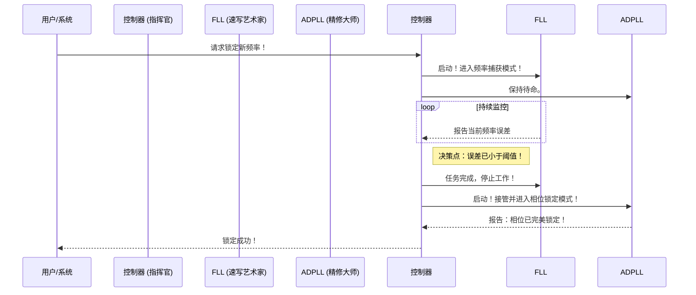

# Chapter 3: 控制器

在 [上一章：两阶段锁定方法](02_两阶段锁定方法.md) 中，我们学习了系统如何通过一个“先快后准”的两步流程来锁定频率。我们知道了这个过程分为 FLL 主导的“频率捕获”和 ADPLL 主导的“相位锁定”两个阶段。但这一切是如何被精确协调的呢？谁是那个站在幕后，确保 FLL 和 ADPLL 完美接力的“指挥官”？

本章，我们就来揭开这位指挥官的神秘面纱——**控制器 (Controller)**。

## 智能交通指挥中心

想象一下一个繁忙的十字路口。如果没有交通信号灯，车辆（信号）可能会发生拥堵甚至碰撞。而交通信号灯系统，就是这个路口的“控制器”。它根据实时车流量（频率/相位误差），智能地切换红绿灯，决定何时让主干道（FLL）的车辆快速通过，何时切换到辅路（ADPLL）进行精细疏导，最终确保整个交通系统高效、有序。

我们系统中的**控制器**扮演着完全相同的角色。它是整个系统的“大脑”和“调度中心”，其核心任务就是：

> 负责管理和协调锁频环（FLL）与锁相环（PLL）的工作模式。它决定何时启动 FLL 进行快速频率捕获，以及何时在频率足够接近后切换到 PLL 进行精细的相位锁定。

简单来说，控制器确保了我们的“速写艺术家”([FLL](04_锁频环__fll_.md))和“精修大师”([ADPLL](05_全数字锁相环__adpll_.md))能够在最恰当的时机上场和退场，从而高效地完成整个锁定任务。

## 控制器的两大职责

作为指挥官，控制器主要履行两大职责：**做出决策**和**下达指令**。

### 1. 做出决策：何时切换？

控制器的首要任务是监控战况，做出最关键的决策：**何时从第一阶段（FLL）切换到第二阶段（ADPLL）？**

这个决策的依据，正是我们在上一章提到的**频率阈值 (frequency threshold)**。

-   **控制器会持续监控**：当前输出频率与目标频率之间的差值（频率误差）。
-   **它会不断地问一个问题**：“现在的频率误差是否已经足够小，小到可以进入精细调整的阶段了？”
-   **决策点**：一旦频率误差小于预先设定的“频率阈值”，控制器就认为粗调阶段已经完成，是时候进行切换了。

这个决策逻辑非常清晰，可以用下面的流程图来表示：

```mermaid
graph TD
    A[开始：收到新频率指令] --> B{测量频率误差};
    B --> C{"误差 > 频率阈值？"};
    C -- 是 --> D[保持 FLL 工作<br>(继续快速粗调)];
    D --> B;
    C -- 否 --> E[切换！<br>FLL 停止, ADPLL 启动];
    E --> F[进入相位锁定阶段];
```

这个流程图生动地展示了控制器就像一个警觉的哨兵，时刻盯着“频率误差”这个关键指标，一旦条件满足，立刻吹响换岗的哨声。

### 2. 下达指令：如何指挥？

做出决策后，控制器需要将它的决定传达给 FLL 和 ADPLL。它通过发送**控制信号 (control signal)** 来实现这一点。

-   **在第一阶段**：控制器向 [FLL](04_锁频环__fll_.md) 发送一个“**启用 (Enable)**”信号，同时确保 [ADPLL](05_全数字锁相环__adpll_.md) 处于“**禁用 (Disable)**”状态。这就像给 FLL 这条“主干道”亮起绿灯。
-   **在切换时刻**：控制器会反转指令，向 FLL 发送“禁用”信号，同时向 ADPLL 发送“启用”信号。这相当于关闭主干道，为“辅路”上的精细调整亮起绿灯。

这种明确的指令确保了在任何时刻，都只有一个环路在主导对 [数字控制振荡器 (DCO)](06_数字控制振荡器__dco_.md)（我们共同的“画笔”）的控制，避免了混乱。

## 来自真实世界的证据：专利中的控制器

我们的“交通指挥官”模型并非空想，它在真实的工程设计中得到了印证。让我们再次回到 `CN112134558A` 这份专利文件，看看它是如何描述控制器的。

在专利的摘要部分，明确提到了控制器的核心作用：

> **专利摘要 (`Abstract`) 节选**
>
> ```text
> ...控制器，其被配置成向所述FLL提供第一控制信号并且向所述PLL提供第二控制信号。
> ```

这段话直接说明了控制器的“**下达指令**”职责。它通过两个独立的控制信号，分别指挥 FLL 和 PLL。

而在专利的权利要求部分，则清晰地定义了控制器“**做出决策**”的依据：

> **专利权利要求 (`Claims`) 节选**
>
> ```text
> 10. 一种用于在硬件装置中提供锁频和锁相操作的方法，其特征在于，所述方法包括：
> - 在锁频环(FLL)中应用锁频操作，直到数字频率差在频率阈值内；以及
> - 在全数字锁相环(ADPLL)中应用第一锁相操作...
> ```

这里再次强调了“**频率阈值**”是 FLL 操作的终点，也是控制器做出切换决策的关键条件。

### 控制器在系统中的位置

我们可以通过一个时序图来更清晰地看到控制器是如何在整个系统中发号施令的。



从这个图中我们可以看到，控制器是整个流程的绝对核心。它接收外部指令，启动和停止 FLL 和 ADPLL，并最终向上级报告任务完成。没有它，FLL 和 ADPLL 就是两个无法协作的独立专家。

## 总结

在本章中，我们认识了我们系统中的“指挥官”——控制器。

-   **核心角色**：控制器是整个混合环路架构的**调度中心**和**大脑**，负责协调 FLL 和 ADPLL 的工作。
-   **核心职责**：
    1.  **做出决策**：通过监控频率误差与**频率阈值**的比较，决定何时从 FLL 切换到 ADPLL。
    2.  **下达指令**：通过发送独立的**控制信号**，分别启用或禁用 FLL 和 ADPLL，实现工作模式的平滑切换。
-   **重要性**：控制器将“两阶段锁定方法”从一个理论概念，转变为一个可执行、自动化的操作流程。

现在，我们已经理解了顶层的架构、两阶段的工作流程，以及负责指挥这一切的控制器。接下来，是时候深入了解被指挥的“士兵”了。

准备好了吗？让我们进入下一章，首先学习那位行动迅速的“速写艺术家”——[第 4 章：锁频环 (FLL)](04_锁频环__fll_.md)。

---

Generated by [AI Codebase Knowledge Builder](https://github.com/The-Pocket/Tutorial-Codebase-Knowledge)