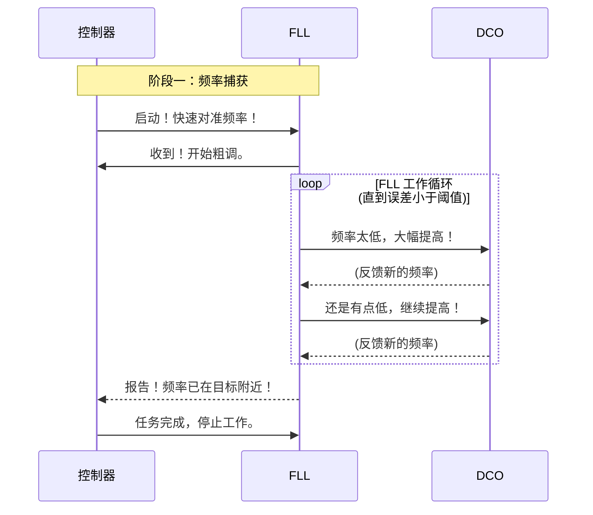

# Chapter 4: 锁频环 (FLL)

在[上一章：控制器](03_控制器.md)中，我们认识了整个系统的“指挥官”——控制器。我们知道它如何像一个智能交通指挥中心一样，根据“频率误差”这个关键指标，决定何时让 FLL 工作，何时切换到 ADPLL。

现在，是时候深入了解它指挥的第一位专家了——那位行动敏捷、负责快速粗调的“速写艺术家”：**锁频环 (Frequency-Locked Loop, FLL)**。

## 任务：用望远镜快速定位

想象一下，你站在山顶，想用一台高倍望远镜观察远处城市里的一座特定建筑。如果你直接开到最高倍率（最精细的模式）去寻找，视野会非常窄，你可能要花很长时间才能找到目标。

聪明的做法是什么？

1.  **第一步（广角扫描）**：你首先会用一个低倍率的广角视野来快速扫描，迅速找到那座建筑所在的大致区域。虽然图像不清晰，细节也看不清，但定位速度非常快。
2.  **第二步（精确观察）**：一旦找到了目标的大概位置，你才会切换到高倍率，进行精细的对焦和观察。

**锁频环 (FLL) 的角色，正是这个广角扫描镜。** 它的唯一目标就是**快**！它不追求毫厘不差的精度，而是以最快的速度，将我们信号的频率从当前值拉到目标频率的“大致区域”内。

> **锁频环 (FLL)** 是一个专门用于快速锁定输出信号频率的控制环路。它是整个锁定过程的第一步，负责粗略调节。

## FLL 是如何工作的？

FLL 的工作原理非常直观，就是一个不断“比较-修正”的闭环控制过程。我们可以把它分解为三个核心步骤：

1.  **测量频率差距**：FLL 首先需要知道“我们离目标有多远？”。它通过一种巧妙的方法，持续测量当前输出信号的频率与我们期望的目标频率之间的差值（即**频率误差**）。
2.  **生成调整指令**：得到频率误差后，FLL 会立即生成一个简单直接的调整指令。比如：“频率太低了，需要大幅提高！”或者“频率太高了，赶紧降下来！”。这个指令是“粗略”的，追求的是大步快跑，而不是小步微调。
3.  **指挥“画笔”调整**：FLL 将这个粗调指令发送给系统的“画笔”——[数字控制振荡器 (DCO)](06_数字控制振荡器__dco_.md)，让 DCO 实际地、大幅度地改变其输出频率。

这三个步骤会形成一个高速循环，周而复始，直到频率误差小到可以接受的范围。

我们可以用一个简单的流程图来描绘这个工作循环：

```mermaid
graph TD
    subgraph FLL 工作循环
        A[目标频率] --> C{频率比较器};
        B[当前输出频率] --> C;
        C -- 计算出频率误差 --> D[FLL 滤波器/逻辑];
        D -- 生成粗调指令 --> E[DCO (画笔)];
        E -- 产生新频率 --> B;
    end
```

这个环路就像一个自动驾驶系统，不断地修正方向盘，让车子（当前频率）快速驶向目的地（目标频率）。

### 深入探究：FLL 如何测量频率？

你可能会好奇，FLL 是如何“测量”频率差距的？在我们的系统中，它利用了一个非常聪明的方法，这个方法在 `CN112134558A` 专利文件中有所提及。

> **专利描述节选 (`p0086`)**
>
> ```text
> ...如果反馈相位被微分，则结果为 FBW/Tref。...一旦知道 FBW，DCO 110 的振荡器频率由此等于 (FBW)·(fREF)。...在第二加法器 141 处提供的频率差 Δf 为 (FCW-FBW)·fREF。因此，FCW-FBW 的值可以用于控制装置...中的频率控制环路。
> ```

这段技术描述的核心思想可以这样理解：

*   **频率就是相位变化的快慢**：就像速度是距离变化的快慢一样，频率可以看作是信号**相位**变化的快慢。
*   **FLL 计算“当前速度”**：FLL 通过观察反馈信号的相位在单位时间里变化了多少（这个值在专利里被称为 `FBW`），就能计算出当前的频率。
*   **计算误差**：然后，它将这个计算出的当前频率 (`FBW`) 与我们的目标频率（在专利里被称为 `FCW`）进行比较，两者之差 `Δf` 就是需要修正的频率误差。

正是通过这种方式，FLL 能够实时、准确地获取频率误差，为后续的快速调整提供依据。

## FLL 在系统中的角色

正如我们在 [第 2 章：两阶段锁定方法](02_两阶段锁定方法.md) 中学到的，FLL 是锁定过程的第一阶段（频率捕获）的主角。它的工作由 [控制器](03_控制器.md) 启动和停止。

让我们通过一个时序图，看看 FLL 是如何听从指挥官的命令来执行任务的：



这个过程清晰地展示了 FLL 的使命：在[控制器](03_控制器.md)的指令下，对 [DCO](06_数字控制振荡器__dco_.md) 进行快速、连续的调整，直到频率误差被拉入一个很小的范围内。一旦达到这个目标（即专利中提到的“**频率阈值**”），FLL 的任务就光荣完成了。

## FLL 的优势与局限

现在我们对 FLL 有了全面的了解，可以总结一下它的特点了。

-   **优势**：
    -   **速度快**：这是 FLL 最大的优点。它能以最快的速度响应，将频率从一个很远的地方拉回来。
    -   **锁定范围广（捕获范围大）**：就像广角镜头一样，无论目标多远，它都能“看”到并快速接近。

-   **局限**：
    -   **精度不高**：FLL 的工作方式注定了它只能进行粗调。当频率非常接近目标时，它可能会因为调整步伐太大而“过冲”，在目标值附近来回摆动，无法做到完美稳定。
    -   **存在残余误差**：即使 FLL 停止工作，输出频率和目标频率之间通常还会存在一个微小的、无法消除的静态误差。

正是因为这些局限性，我们才需要另一位专家——“精修大师”[全数字锁相环 (ADPLL)](05_全数字锁相环__adpll_.md) 来接手后续的精细调整工作。

## 总结

在本章中，我们深入了解了混合环路架构中的“速写艺术家”——锁频环 (FLL)。

-   **核心角色**：FLL 是一个**快速频率锁定**的控制环路，负责锁定过程的**第一阶段（频率捕获）**。
-   **工作原理**：通过一个“**测量误差 -> 生成指令 -> 调整输出**”的快速闭环反馈，将输出频率迅速拉近目标。
-   **目标**：它的目标是**速度**，而非精度。它在[控制器](03_控制器.md)的指令下工作，直到频率误差小于预设的“**频率阈值**”。
-   **特点**：优点是**速度快、范围广**；缺点是**精度不高、有残余误差**。

FLL 已经出色地完成了它的速写任务，为我们勾勒出了画作的大致轮廓。现在，舞台已经准备好，是时候请出我们的“精修大师”了。

在下一章，我们将一同探索 [第 5 章：全数字锁相环 (ADPLL)](05_全数字锁相环__adpll_.md)，看看它是如何在前人工作的基础上，完成最后精准而细腻的描绘。

---

Generated by [AI Codebase Knowledge Builder](https://github.com/The-Pocket/Tutorial-Codebase-Knowledge)