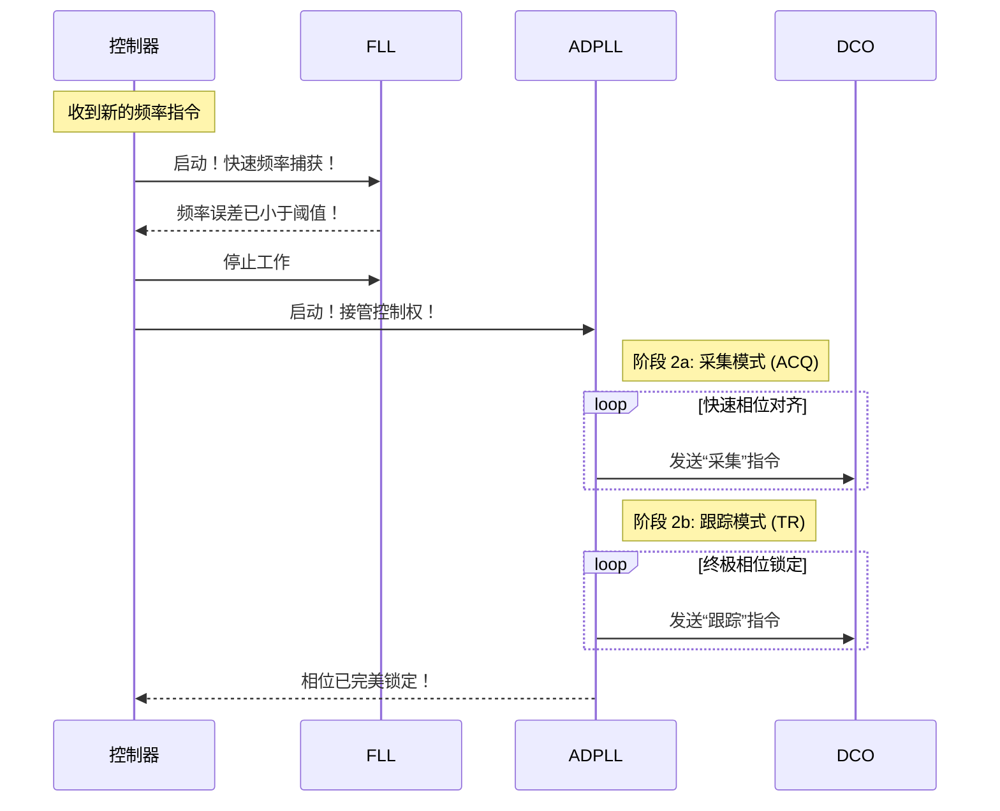

# Chapter 5: 全数字锁相环 (ADPLL)

在 [上一章：锁频环 (FLL)](04_锁频环__fll_.md) 中，我们认识了系统里那位行动迅捷的“速写艺术家”——FLL。它出色地完成了任务，像用望远镜的广角模式一样，快速将我们的信号频率拉到了目标的“大致区域”。此时，我们已经能听到收音机里传来了目标电台的声音，但还夹杂着一些“沙沙”的噪音。

现在，是时候请出我们团队里的另一位专家了。它将接替 FLL 的工作，进行最后的精细打磨，将画作的每一笔细节都描绘得淋漓尽致。这位专家就是我们的“精修大师”——**全数字锁相环 (All-Digital Phase-Locked Loop, ADPLL)**。

## 任务：用显微镜精确对焦

如果说 FLL 的任务是“快速定位”，那么 ADPLL 的任务就是“**精确锁定**”。

继续我们调收音机的比喻：FLL 帮你把旋钮快速转到了 101.7MHz 附近，你已经能听到电台的节目了。但要让声音变得最清晰、最稳定、毫无杂音，你需要非常非常轻微地、小心翼翼地微调那个旋钮，直到信号完全对准电台的中心。

这个“微调”的动作，正是 ADPLL 所做的工作。它的目标不再是频率的大致对齐，而是追求信号**相位**的完美同步。

> **全数字锁相环 (ADPLL)** 是一个用于精确锁定输出信号相位的数字控制环路。它在锁频环 (FLL) 完成初步的频率锁定后接管工作，进行精细调整。

### 什么是“相位”？

我们反复提到“相位”，它到底是什么？

想象一下，有两个完全相同的挂钟，它们的秒针都以每分钟一圈的速度（频率）在转动。但是，在任何一个瞬间，一个秒针可能指向“12”，而另一个可能指向“3”。这个“指向位置”的不同，就是**相位差**。

ADPLL 的任务，就是确保我们输出信号的“秒针”，不仅转速（频率）和参考信号完全一样，而且在每一刻都指向完全相同的位置（相位）。当相位完全对齐时，频率自然也就达到了极致的精准和稳定。

## ADPLL 是如何工作的？

当[控制器](03_控制器.md)发出指令，让 ADPLL 接管工作后，一个比 FLL 更加细腻的“比较-修正”循环开始了。

1.  **测量相位差距**：ADPLL 的核心是一个高精度的“相位侦测器”。它会不断地、精确地比较当前输出信号的“秒针位置”（相位）与参考信号的“秒针位置”之间的微小差距。
2.  **生成微调指令**：一旦侦测到相位差，哪怕只有一丝丝，ADPLL 就会生成一个极其精细的调整指令。这个指令不再是 FLL 那样“大步快跑”，而是像“再往前挪一微米”这样的微操。
3.  **指挥“画笔”微调**：ADPLL 将这个微调指令发送给[数字控制振荡器 (DCO)](06_数字控制振荡器__dco_.md)，让 DCO 对输出频率进行极其微小的调整，从而修正相位。

这个过程周而复始，不断地消除任何微小的相位误差，直到输出信号与参考信号“严丝合缝”地同步起来。

我们可以用一个流程图来描绘这个精密的控制环路：

```mermaid
graph TD
    subgraph ADPLL 工作循环 (精修阶段)
        A[参考信号的相位] --> C{相位比较器};
        B[当前输出信号的相位] --> C;
        C -- 计算出微小的相位误差 --> D[ADPLL 滤波器/逻辑];
        D -- 生成精调指令 --> E[DCO (画笔)];
        E -- 产生相位微调后的新信号 --> B;
    end
```
这个环路就像一位雕刻大师，手持刻刀，对着作品反复审视和打磨，直到每一个细节都完美无瑕。

## 深入底层：ADPLL 的双重锁定模式

有趣的是，这位“精修大师”ADPLL 自己也有一套“先粗后精”的工作方法。为了在精度和速度之间取得最佳平衡，它内部也分为两种工作模式：**采集 (Acquisition) 模式**和**跟踪 (Tracking) 模式**。

这一点在我们的参考专利 `CN112134558A` 中有明确的体现。

> **专利描述节选 (`p0062`)**
>
> ```text
> ...相位环路滤波器250包括两个滤波器：标记为ACQ的采集滤波器202和标记为TR的跟踪滤波器203。...采集滤波器202被调谐到更宽的频率范围，并且由此比更精细地调谐的跟踪滤波器203更快地稳定。
> ```

这意味着 ADPLL 的工作也分两步：
1.  **采集模式 (ACQ)**：当 ADPLL 刚接手时，频率虽然已经很近，但可能仍有微小的抖动。采集模式会使用一个带宽稍宽的滤波器，相对**快速**地消除这些剩余的、较大的相位误差，让信号迅速“进入状态”。
2.  **跟踪模式 (TR)**：一旦信号基本稳定，ADPLL 就会切换到跟踪模式。这个模式使用一个带宽极窄的滤波器，进行**终极**的精细调整，消除最微弱的噪声和抖动，并持续“跟踪”参考信号，确保长期的稳定。

我们可以用下面的时序图来展示 FLL 和 ADPLL (及其内部模式) 是如何完美接力的：



这个过程充分体现了工程设计的精妙之处：在每一个环节都追求效率与精度的最佳结合。

### 锁定成功的标志

那么，系统如何知道 ADPLL 已经成功完成了任务呢？答案是**相位阈值**。

在专利的权利要求部分，对这个最终目标有清晰的定义：

> **专利原文节选 (`Claims` 部分)**
>
> ```text
> 10. ...在全数字锁相环(ADPLL)中应用第一锁相操作，直到数字相位差在第一相位阈值内。
> ```

这意味着，[控制器](03_控制器.md)会持续监控由 ADPLL 测量的**相位差**。一旦这个差值小于一个预先设定的、极小的“相位阈值”，控制器就知道锁定已经成功，可以向上级系统报告“任务完成，信号稳定输出了！”。

## ADPLL 的优势与局限

现在，我们可以全面地总结我们这位“精修大师”的特点了。

-   **优势**：
    -   **精度极高**：这是 ADPLL 的核心价值。它能将相位误差消除到极低的水平，从而产生频率极其准确、噪声极低的“纯净”信号。
    -   **输出稳定**：一旦锁定，ADPLL 能很好地抑制噪声和扰动，保持信号的长期稳定。

-   **局限**：
    -   **锁定速度慢**：精细打磨总是耗时的。如果频率偏差很大，只靠 ADPLL 会非常慢。
    -   **捕获范围小**：它的“视野”很窄，无法处理大的频率误差，这也是为什么它必须在 FLL 完成粗调后才能上场的原因。

正是 FLL 和 ADPLL 这种鲜明的优缺点互补，才使得我们的混合环路架构如此强大。

## 总结

在本章中，我们深入了解了我们系统中的“精修大师”——全数字锁相环 (ADPLL)。

-   **核心角色**：ADPLL 是一个**精确相位锁定**的控制环路，负责锁定过程的**第二阶段（相位锁定）**。
-   **工作原理**：通过一个“**测量相位误差 -> 生成微调指令 -> 微调输出**”的精密闭环反馈，将输出信号的相位与参考信号完美对齐。
-   **目标**：它的目标是**精度**和**稳定**。它在 FLL 完成任务后接手，直到相位误差小于预设的“**相位阈值**”。
-   **特点**：优点是**精度极高、输出纯净**；缺点是**速度较慢、范围窄**。

至此，我们已经认识了系统中的两位“画家”——负责速写的 FLL 和负责精修的 ADPLL，以及指挥它们工作的“项目经理”——控制器。它们共同协作，向一个最终的执行者下达指令。

这位执行者，就是它们共用的“画笔”，它忠实地执行着来自 FLL 的粗调指令和来自 ADPLL 的精调指令，最终一笔一划地“画”出我们想要的信号。这位“画笔”究竟是什么？它是如何工作的？

让我们进入最后一章，揭开我们整个系统的最终执行单元——[第 6 章：数字控制振荡器 (DCO)](06_数字控制振荡器__dco_.md) 的奥秘。

---

Generated by [AI Codebase Knowledge Builder](https://github.com/The-Pocket/Tutorial-Codebase-Knowledge)