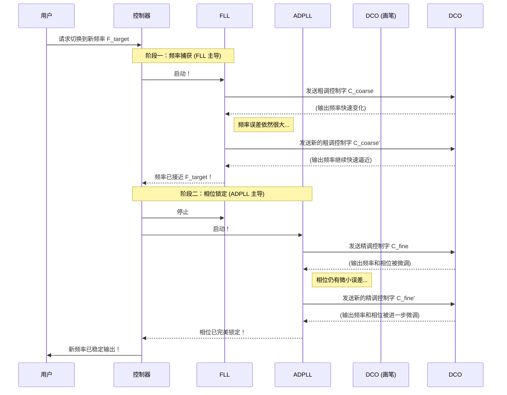

# Chapter 6: 数字控制振荡器 (DCO)

在前面的章节中，我们已经认识了我们频率合成系统中的所有核心角色：负责快速定位的“速写艺术家”[锁频环 (FLL)](04_锁频环__fll_.md)、负责精细打磨的“精修大师”[全数字锁相环 (ADPLL)](05_全数字锁相环__adpll_.md)，以及指挥它们工作的“项目经理”[控制器](03_控制器.md)。

现在，我们终于来到了旅程的最后一站，去认识那个最终将所有指令变为现实的执行者。FLL 和 ADPLL 就像两位画家，控制器是项目经理，而我们今天要学习的**数字控制振荡器 (Digitally Controlled Oscillator, DCO)**，就是它们共同使用的那支神奇的“**画笔**”。

## 任务：一支能听懂数字指令的画笔

想象一下，你有一支非常先进的画笔。你不需要手动蘸取颜料或控制笔触的粗细，你只需要通过电脑给它发送一串数字指令：
-   输入数字 `1010`，它就画出鲜艳的红色。
-   输入数字 `0101`，它就画出沉静的蓝色。
-   数字变化得越大，它切换颜色的动作就越快、越明显。
-   数字变化得越小，它就在原有颜色上进行极其细微的色调调整。

这支画笔本身不会思考，它只是绝对忠实地执行你输入的每一个数字指令，将抽象的数字代码转化为画布上真实可见的色彩。

**数字控制振荡器 (DCO)** 正是这样一支“画笔”。它是我们整个系统的核心发声单元，负责产生最终的输出信号。

> **数字控制振荡器 (DCO)** 是一种其输出频率可以通过一个数字控制字（一串二进制数字）来精确控制的振荡器。它就像一个可以通过电脑程序控制音高的电子乐器，是连接数字控制世界和模拟信号世界的桥梁。

## DCO 是如何工作的？

DCO 的工作原理非常直接：**接收数字，输出频率**。

1.  **接收数字控制字**：DCO 的输入是一个数字信号，我们称之为“控制字”（Control Word）。这个控制字通常是一串二进制数，比如 `01101100`。
2.  **翻译为特定频率**：DCO 内部有一个机制，可以将这个数字“翻译”成一个特定的振荡频率。数字越大，通常频率就越高；数字越小，频率就越低。
3.  **产生输出信号**：DCO 根据翻译出的频率，立即开始振荡，产生一个具有该频率的稳定信号，这个信号就是我们整个系统的最终输出。

这个过程是即时的。一旦 DCO 收到一个新的数字控制字，它的输出频率就会立刻改变，就像你按下电子琴的一个新琴键，声音会立刻变化一样。

### DCO 在系统中的核心位置

现在，我们可以清晰地看到 DCO 在整个系统中所扮演的无可替代的角色。它位于整个控制环路的末端，是所有指令的最终执行者。

```mermaid
graph TD
    A[参考信号/目标频率] --> C{控制器};
    C -- 粗调指令 --> FLL[锁频环 (FLL) - 速写艺术家];
    C -- 精调指令 --> ADPLL[全数字锁相环 (ADPLL) - 精修大师];
    
    FLL -- “大步快跑”的数字指令 --> DCO((数字控制振荡器<br>最终的画笔));
    ADPLL -- “精雕细琢”的数字指令 --> DCO;
    
    DCO --> O[最终输出信号];
    O -- 反馈 --> C;

    subgraph "控制部分"
        C
        FLL
        ADPLL
    end

    subgraph "执行部分"
        DCO
    end
```

从这个图中我们可以看到：
-   无论是 FLL 还是 ADPLL，它们工作的最终成果都是产生一个**数字控制字**。
-   FLL 在进行快速频率捕获时，会生成变化幅度很大的控制字，命令 DCO 进行“大刀阔斧”的频率调整。
-   ADPLL 在进行精确相位锁定时，会生成变化极其微小的控制字，命令 DCO 进行“一丝不苟”的频率微调。
-   DCO 忠实地执行着来自两位“画家”的每一个指令，最终“画”出了我们想要的、频率精准的信号。

## 深入探究：DCO 的内部构造

你可能会好奇，这支神奇的“画笔”内部到底是什么样的？它是如何将一串数字变成一个特定频率的呢？

一种常见的实现方式是使用一个“**电容阵列**”。

想象一下，你有一排开关，每个开关连接着一个大小不同的小电容。
-   DCO 的**数字控制字**就相当于这一排开关的状态。例如，一个 8 位的控制字 `01101100` 就对应着 8 个开关的“关、开、开、关、开、开、关、关”状态。
-   当一个开关闭合，其对应的电容就被连接到振荡电路中。
-   振荡电路的总电容量，就是所有被接通的电容的总和。
-   在振荡电路中，**电容越大，振荡频率就越低**。

因此，通过改变输入的数字控制字，我们就能控制哪些开关闭合，从而精确地控制总电容量，最终实现对输出频率的精确数字控制。

### 来自专利的印证

这个模型在真实的工程设计中得到了广泛应用。在我们的参考专利 `CN112134558A` 中，DCO 是整个架构的核心执行部件，被反复提及。

> **专利摘要 (`Abstract`) 节选**
>
> ```text
> ...所述装置还可以包括数字控制振荡器(DCO)...所述FLL和所述PLL分别包括第一滤波器和第二滤波器。所述滤波器耦合到所述DCO。...
> ```
>
> **专利权利要求 (`Claims`) 9**
>
> ```text
> 9.一种频率和相位调谐装置，其特征在于，包括：
> 数字控制振荡器(DCO)；
> 第一滤波器，其被配置成调谐所述DCO的输出信号的输出频率...作为第一输入耦合到所述DCO；
> 第二滤波器，其被配置成调谐所述DCO的输出相位...作为第二输入耦合到所述DCO；
> ...
> ```

这些描述清晰地指出了 DCO 的作用：它被多个“**滤波器**”（在我们的比喻中，就是 FLL 和 ADPLL 的核心逻辑）所**耦合**（连接和控制），并根据它们发出的指令来调谐输出信号的频率和相位。

## 完整流程回顾：DCO 的一天

现在，让我们把所有章节的知识串联起来，完整地看看从收到一个新频率指令到最终锁定，DCO 是如何参与其中的。



这个时序图完美地展示了 DCO 的角色：
-   它是一个被动的执行者，从不主动发起任何操作。
-   在**第一阶段**，它接收来自 FLL 的**大幅度**变化的控制字，实现频率的快速跳转。
-   在**第二阶段**，它接收来自 ADPLL 的**极其细微**变化的控制字，实现频率和相位的精细打磨。
-   它自始至终都在工作，忠实地响应着每一条数字指令，直到最终输出的信号完全符合我们的要求。

## 总结与展望

在本章中，我们揭开了系统中最后一位，也是最关键的执行单元——**数字控制振荡器 (DCO)** 的神秘面纱。

-   **核心角色**：DCO 是整个系统的“**画笔**”或“**发声单元**”，负责将数字控制指令转化为真实的、具有特定频率的输出信号。
-   **工作原理**：它接收一个**数字控制字**，并将其“翻译”成一个精确的输出频率。
-   **在系统中的位置**：它被 [FLL](04_锁频环__fll_.md) 和 [ADPLL](05_全数字锁相环__adpll_.md) 共同控制，忠实地执行它们发出的粗调和精调指令。
-   **重要性**：DCO 是连接数字控制逻辑和模拟信号输出的桥梁，是整个频率合成系统能够工作的物理基础。

---

### **教程总结：一次完美的团队合作**

恭喜你！至此，我们已经完成了对整个混合环路频率合成系统的探索之旅。

让我们再次回顾一下这个高效而精密的团队是如何协同工作的：

1.  **[混合环路架构 (FLL + PLL)](01_混合环路架构__fll___pll_.md)**：我们首先了解了整个系统的顶层设计，即结合 FLL 和 ADPLL 的优势，实现“先快后准”的策略，如同两位画家合作完成一幅画。
2.  **[两阶段锁定方法](02_两阶段锁定方法.md)**：我们学习了系统工作的具体流程，即先由 FLL 进行“频率捕获”，再由 ADPLL 进行“相位锁定”的清晰两步法。
3.  **[控制器](03_控制器.md)**：我们认识了团队的“项目经理”，它根据频率误差是否小于“频率阈值”来做出决策，指挥 FLL 和 ADPLL 的工作交接。
4.  **[锁频环 (FLL)](04_锁频环__fll_.md)**：我们深入了解了“速写艺术家” FLL，它通过快速比较频率误差，对 DCO 进行大幅调整，以最快的速度将频率拉近目标。
5.  **[全数字锁相环 (ADPLL)](05_全数字锁相环__adpll_.md)**：我们见识了“精修大师” ADPLL 的高超技艺，它通过精确比较相位误差，对 DCO 进行微调，最终实现完美锁定。
6.  **[数字控制振荡器 (DCO)](06_数字控制振荡器__dco_.md)**：最后，我们认识了那支忠实的“画笔” DCO，它接收所有数字指令，并将它们转化为最终我们想要的、频率精准稳定的信号。

通过这六个章节的学习，我们不仅理解了每一个独立组件的功能，更重要的是，我们看到了它们如何像一个训练有素的团队一样，各司其职、无缝衔接，共同完成一个看似复杂却又逻辑清晰的任务。

希望这次的旅程能帮助你对现代数字通信系统中的频率合成技术有一个直观而深刻的理解。感谢你的学习！

---

Generated by [AI Codebase Knowledge Builder](https://github.com/The-Pocket/Tutorial-Codebase-Knowledge)